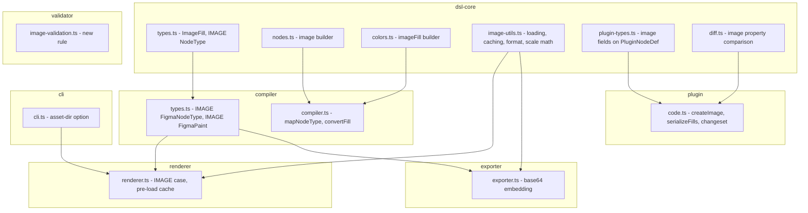
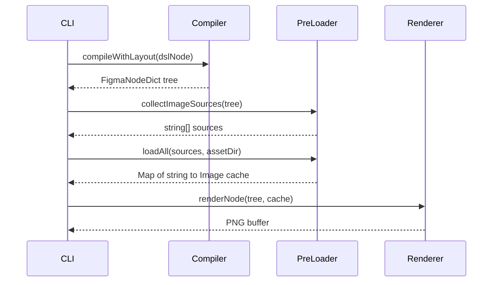
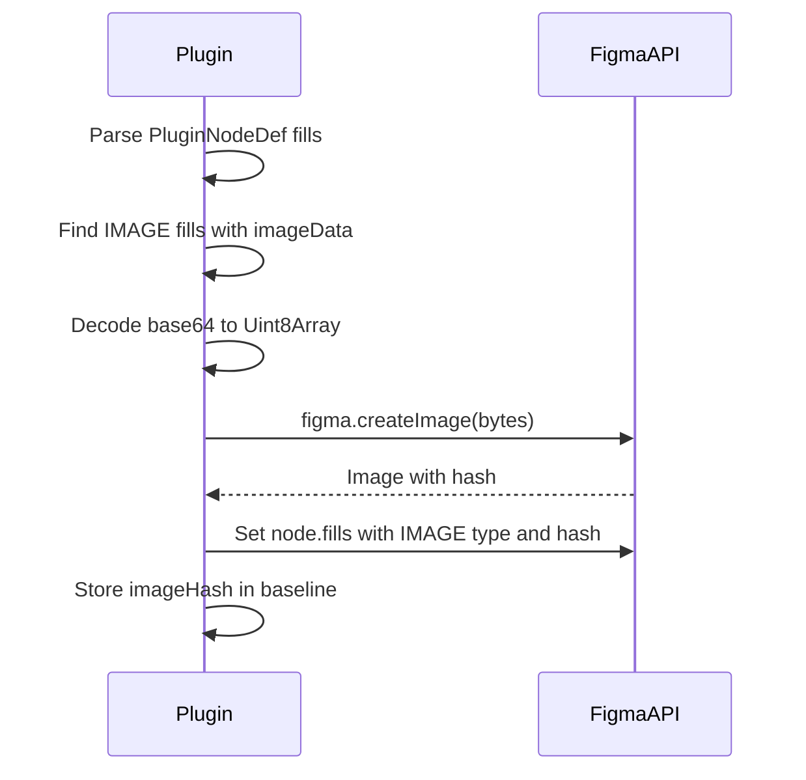
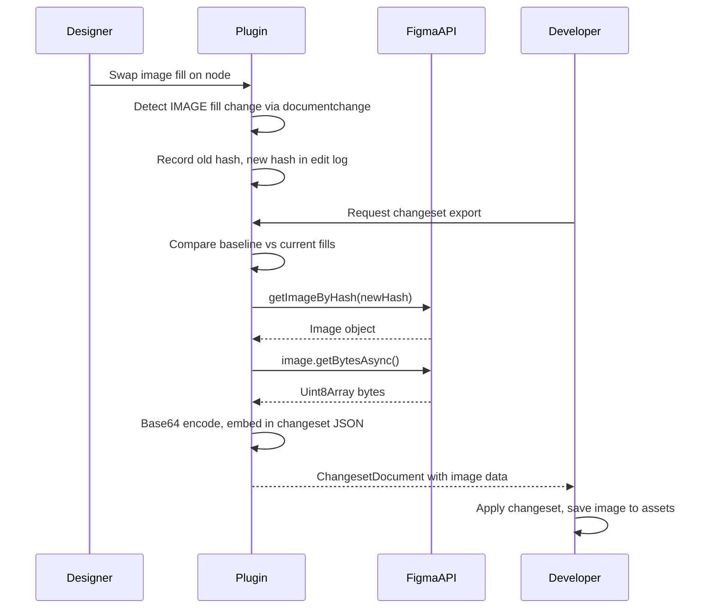
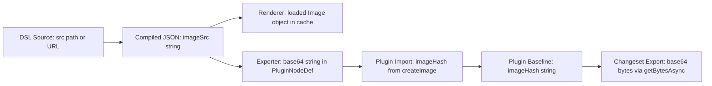

# Design Document: DSL Image Support Enhancement

## Overview

**Purpose**: This feature adds image and bitmap support to the DSL pipeline, enabling DSL authors to include real photographs, icons, and illustrations in component definitions. Images flow through the full pipeline: DSL definition → compile → render PNG → export Figma JSON → Figma plugin import, and back via bidirectional changeset sync.

**Users**: DSL authors use `image()` and `imageFill()` to define visual content. Developers preview via CLI-rendered PNGs. Designers see images in Figma after plugin import and can swap/modify them with changes flowing back to code via changesets.

**Impact**: Extends the existing type system (`NodeType`, `Fill`, `FigmaPaint`, `PluginNodeDef`) and pipeline stages (compiler, renderer, exporter, plugin) with image awareness. No breaking changes to existing APIs.

### Goals
- Add `image()` node builder and `imageFill()` fill builder to `@figma-dsl/core`
- Render images in PNG output via `@napi-rs/canvas loadImage()`
- Export/import images to/from Figma via base64 encoding and `figma.createImage()`
- Track image changes bidirectionally through changeset system
- Validate image references in the validator pipeline

### Non-Goals
- SVG vector image support (raster only: PNG, JPEG, WebP)
- Image editing/cropping within the DSL (only scale mode selection)
- Image optimization or compression (users provide pre-optimized assets)
- Animated image support (GIF frames, APNG)
- Image CDN or remote asset management

## Architecture

### Existing Architecture Analysis

The pipeline transforms data through four stages, each with strongly-typed interfaces:

```
DslNode → [compiler] → FigmaNodeDict → [renderer] → PNG
                                      → [exporter] → PluginNodeDef → [plugin] → Figma nodes
```

Key constraints:
- **Fill discriminated union**: `Fill = SolidFill | GradientFill | RadialGradientFill` — must add `ImageFill`
- **Synchronous renderer**: `renderNode()` is synchronous — `loadImage()` is async
- **Plugin data 100KB limit**: Baselines stored as JSON in plugin data — image bytes cannot be embedded
- **Figma has no IMAGE node**: Images are fills (`type: 'IMAGE'`) on rectangles/frames

### Architecture Pattern & Boundary Map



**Architecture Integration**:
- **Selected pattern**: Extend existing pipeline stages (hybrid approach from gap analysis Option C)
- **Domain boundaries**: Each package retains single responsibility; shared image utilities live in `dsl-core/src/image-utils.ts`
- **Existing patterns preserved**: Builder pattern for nodes/fills, discriminated unions for types, switch-based dispatch in compiler/renderer/exporter
- **New components**: Only `image-utils.ts` (shared module) and `image-validation.ts` (validator rule) are new files
- **Steering compliance**: TypeScript strict mode, no `any`, vitest for tests, @napi-rs/canvas for rendering

### Technology Stack

| Layer | Choice / Version | Role in Feature | Notes |
|-------|------------------|-----------------|-------|
| Image loading | @napi-rs/canvas `loadImage()` | Load PNG/JPEG/WebP from files and URLs | Already a project dependency; async API |
| Image caching | `Map<string, Image>` in-memory | Session-level cache for batch rendering | No external dependency |
| Base64 encoding | Node.js `Buffer.toString('base64')` | Embed images in .figma.json | Built-in, no dependency |
| URL fetching | @napi-rs/canvas `loadImage(url)` | Fetch remote images | Handles HTTP internally via Skia |
| Figma import | `figma.createImage(Uint8Array)` | Create Figma image handle from bytes | Plugin API, max 4096px |
| Figma export | `figma.getImageByHash()` + `getBytesAsync()` | Read image bytes for changeset | Plugin API |
| Validation | Node.js `fs.statSync`, `URL` constructor | File existence, size, URL syntax | Built-in, no dependency |

## System Flows

### Image Rendering Flow (Pre-load Strategy)



### Figma Plugin Import Flow



### Bidirectional Image Sync Flow



## Requirements Traceability

| Requirement | Summary | Components | Interfaces | Flows |
|-------------|---------|------------|------------|-------|
| 1.1–1.7 | IMAGE node builder | `image()` in nodes.ts, `ImageProps` | DslNode with imageSrc, imageScaleMode | — |
| 2.1–2.4 | Image fill builder | `imageFill()` in colors.ts, `ImageFill` type | Fill union extension | — |
| 3.1–3.4 | Compiler handling | mapNodeType, convertFill in compiler.ts | FigmaNodeType, FigmaPaint extension | — |
| 4.1–4.8 | Renderer drawing | renderNode IMAGE case, pre-load cache | ImageCache, RenderOptions.assetDir | Render flow |
| 5.1–5.4 | Exporter encoding | convertToPluginNode in exporter.ts | PluginNodeDef image fields | — |
| 6.1–6.4 | Plugin import | toFigmaPaints, createImage in code.ts | PluginNodeDef, Figma Paint | Import flow |
| 7.1–7.4 | CLI asset resolution | cli.ts --asset-dir, batch path resolution | CLI options | — |
| 8.1–8.4 | Validation | image-validation rule | ValidationRule | — |
| 9.1–9.10 | Bidirectional sync | serializeFills, computeChangeset, diff.ts | ChangesetDocument image fields | Sync flow |

## Components and Interfaces

| Component | Domain/Layer | Intent | Req Coverage | Key Dependencies | Contracts |
|-----------|-------------|--------|-------------|-----------------|-----------|
| ImageFill type | dsl-core/types | IMAGE fill in Fill union | 2.1–2.4 | — | State |
| image() builder | dsl-core/nodes | Create IMAGE DslNode | 1.1–1.7 | types.ts (P0) | Service |
| imageFill() builder | dsl-core/colors | Create ImageFill object | 2.1–2.3 | types.ts (P0) | Service |
| image-utils | dsl-core/shared | Loading, caching, format checks, scale math | 4.1–4.8, 5.1 | @napi-rs/canvas (P0) | Service |
| Compiler IMAGE support | compiler | Compile IMAGE nodes and fills | 3.1–3.4 | dsl-core types (P0) | Service |
| Renderer IMAGE support | renderer | Draw images on canvas | 4.1–4.8 | image-utils (P0), @napi-rs/canvas (P0) | Service |
| Exporter IMAGE support | exporter | Base64-embed images | 5.1–5.4 | image-utils (P1) | Service |
| Plugin IMAGE import | plugin | createImage + IMAGE fill | 6.1–6.4 | Figma API (P0) | Service |
| Plugin IMAGE serialize | plugin | Serialize/deserialize IMAGE fills | 9.1–9.10 | Figma API (P0) | Service |
| image-validation rule | validator | Validate image references | 8.1–8.4 | fs, URL (P2) | Service |
| CLI --asset-dir | cli | Asset directory resolution | 7.1–7.4 | renderer (P0) | Service |

### DSL Core Layer

#### ImageFill Type Extension

| Field | Detail |
|-------|--------|
| Intent | Add IMAGE fill type to the Fill discriminated union |
| Requirements | 2.1, 2.2, 2.3, 2.4 |

**Contracts**: State [x]

##### State Management

```typescript
interface ImageFill {
  readonly type: 'IMAGE';
  readonly src: string;           // File path or HTTPS URL
  readonly scaleMode: 'FILL' | 'FIT' | 'CROP' | 'TILE';
  readonly opacity: number;
  readonly visible: boolean;
}

// Extended union
type Fill = SolidFill | GradientFill | RadialGradientFill | ImageFill;
```

- Invariant: `src` must be non-empty string
- Invariant: `scaleMode` defaults to `'FILL'`

#### image() Builder

| Field | Detail |
|-------|--------|
| Intent | Create IMAGE DslNode from name and options |
| Requirements | 1.1, 1.2, 1.3, 1.4, 1.5, 1.6, 1.7 |

**Contracts**: Service [x]

##### Service Interface

```typescript
interface ImageProps {
  readonly src: string;
  readonly size: { x: number; y: number };
  readonly fit?: 'FILL' | 'FIT' | 'CROP' | 'TILE';
  readonly cornerRadius?: number;
  readonly opacity?: number;
  readonly visible?: boolean;
  readonly layoutSizingHorizontal?: 'FIXED' | 'HUG' | 'FILL';
  readonly layoutSizingVertical?: 'FIXED' | 'HUG' | 'FILL';
}

function image(name: string, props: ImageProps): DslNode;
```

- Preconditions: `name` is non-empty string; `props.src` is non-empty string; `props.size.x > 0` and `props.size.y > 0`
- Postconditions: Returns DslNode with `type: 'IMAGE'`, `imageSrc: props.src`, `imageScaleMode: props.fit ?? 'FILL'`
- Error: Throws if `src` is missing or empty

**DslNode extensions** (added to existing interface):

```typescript
// Added to DslNode interface in types.ts
imageSrc?: string;
imageScaleMode?: 'FILL' | 'FIT' | 'CROP' | 'TILE';
```

#### imageFill() Builder

| Field | Detail |
|-------|--------|
| Intent | Create ImageFill for use in any node's fills array |
| Requirements | 2.1, 2.3 |

**Contracts**: Service [x]

##### Service Interface

```typescript
function imageFill(
  src: string,
  options?: { scaleMode?: 'FILL' | 'FIT' | 'CROP' | 'TILE'; opacity?: number }
): ImageFill;
```

- Preconditions: `src` is non-empty string
- Postconditions: Returns `ImageFill` with `type: 'IMAGE'`, defaults: `scaleMode: 'FILL'`, `opacity: 1`, `visible: true`

#### image-utils Module

| Field | Detail |
|-------|--------|
| Intent | Shared image loading, caching, format detection, and scale mode math |
| Requirements | 4.1–4.8, 5.1, 8.1 |

**Contracts**: Service [x]

##### Service Interface

```typescript
import type { Image } from '@napi-rs/canvas';

type ImageCache = Map<string, Image>;

interface ScaleResult {
  readonly sx: number;   // Source x
  readonly sy: number;   // Source y
  readonly sw: number;   // Source width
  readonly sh: number;   // Source height
  readonly dx: number;   // Destination x
  readonly dy: number;   // Destination y
  readonly dw: number;   // Destination width
  readonly dh: number;   // Destination height
}

// Collect all image source references from a compiled tree
function collectImageSources(node: FigmaNodeDict): string[];

// Pre-load all images into cache (async entry point before sync render)
function preloadImages(
  sources: string[],
  assetDir?: string
): Promise<ImageCache>;

// Resolve an image source to absolute path
function resolveImageSource(src: string, assetDir?: string): string;

// Compute draw coordinates for a scale mode
function computeScaleMode(
  mode: 'FILL' | 'FIT' | 'CROP' | 'TILE',
  imageWidth: number,
  imageHeight: number,
  frameWidth: number,
  frameHeight: number,
): ScaleResult;

// Check if a file is a supported image format
function isSupportedImageFormat(filePath: string): boolean;

// Read image file and return base64-encoded string
function imageToBase64(filePath: string): Promise<string>;
```

- Preconditions for `preloadImages`: All sources are valid paths or URLs
- Postconditions: Cache contains loaded Image for each resolvable source; missing images logged as warnings, not in cache
- Invariant: Cache is immutable after creation (read-only for render pass)

### Compiler Layer

#### Compiler IMAGE Support

| Field | Detail |
|-------|--------|
| Intent | Map IMAGE nodes and IMAGE fills through compilation |
| Requirements | 3.1, 3.2, 3.3, 3.4 |

**Contracts**: Service [x]

##### Service Interface

Extensions to existing types in `compiler/src/types.ts`:

```typescript
// FigmaNodeType extension
type FigmaNodeType = /* existing */ | 'IMAGE';

// FigmaPaint extension
interface FigmaPaint {
  // existing fields...
  imageSrc?: string;
  imageScaleMode?: 'FILL' | 'FIT' | 'CROP' | 'TILE';
}
```

Extensions to `compiler.ts`:
- `mapNodeType()`: Return `'IMAGE'` for DslNode `type: 'IMAGE'`
- `convertFill()`: Handle `ImageFill` → `FigmaPaint` with `type: 'IMAGE'`, `imageSrc`, `imageScaleMode`
- `compileNode()`: Pass through `imageSrc` and `imageScaleMode` for IMAGE nodes; use declared `size` for layout (no text measurement needed)

**Implementation Notes**
- Validation: Warn if local file path does not exist at compile time (non-blocking)
- Layout: IMAGE nodes participate in auto-layout using their declared `size`, identical to RECTANGLE/ELLIPSE behavior

### Renderer Layer

#### Renderer IMAGE Support

| Field | Detail |
|-------|--------|
| Intent | Draw images onto canvas during PNG rendering |
| Requirements | 4.1, 4.2, 4.3, 4.4, 4.5, 4.6, 4.7, 4.8 |

**Dependencies**
- Inbound: CLI — provides RenderOptions with assetDir (P0)
- External: @napi-rs/canvas `loadImage()`, `Image`, `ctx.drawImage()` (P0)
- Inbound: image-utils — pre-load cache, scale math (P0)

**Contracts**: Service [x]

##### Service Interface

Extension to existing `RenderOptions`:

```typescript
interface RenderOptions {
  // existing fields...
  assetDir?: string;
  imageCache?: ImageCache;  // Pre-loaded images from image-utils
}
```

Extension to `renderNode()`:
- New case `'IMAGE'` in node type switch: look up image from `imageCache` by `imageSrc`, compute scale mode, draw with `ctx.drawImage()`, apply cornerRadius clipping
- New handling in `applyFills()` for `type: 'IMAGE'` paints: same image lookup and drawing logic, applied as a fill layer

**Implementation Notes**
- Integration: CLI pre-loads images via `preloadImages()` before calling `renderNode()`; cache is passed through RenderOptions
- Validation: If image not in cache (load failed), draw crosshatch placeholder (diagonal lines at 45°, gray on transparent)
- cornerRadius clipping: Reuse existing `ctx.roundRect()` clip path from ROUNDED_RECTANGLE rendering

### Exporter Layer

#### Exporter IMAGE Support

| Field | Detail |
|-------|--------|
| Intent | Embed image data as base64 in .figma.json for plugin import |
| Requirements | 5.1, 5.2, 5.3, 5.4 |

**Contracts**: Service [x]

##### Service Interface

Extension to `PluginNodeDef` in `plugin-types.ts`:

```typescript
interface PluginNodeDef {
  // existing fields...
  readonly fills?: ReadonlyArray<{
    // existing fill fields...
    imageData?: string;              // Base64-encoded image bytes
    imageScaleMode?: string;         // 'FILL' | 'FIT' | 'CROP' | 'TILE'
    imageDimensions?: { width: number; height: number };
    imageFormat?: string;            // 'PNG' | 'JPEG' | 'WEBP'
    imageError?: string;             // Error marker if load failed
  }>;
}
```

Extension to `convertToPluginNode()`:
- For IMAGE fills: resolve image source → read file → base64 encode → embed in fill object
- Size check: warn if base64 payload exceeds 4 MB
- Error handling: if image cannot be loaded, set `imageError` field, omit `imageData`

**Implementation Notes**
- The exporter becomes async (needs to read image files and encode)
- `generatePluginInput()` signature changes to `async generatePluginInput(...)`

### Plugin Layer

#### Plugin IMAGE Import

| Field | Detail |
|-------|--------|
| Intent | Create Figma images from embedded base64 data during plugin import |
| Requirements | 6.1, 6.2, 6.3, 6.4 |

**Contracts**: Service [x]

##### Service Interface

Extension to `toFigmaPaints()`:
- New case for `type === 'IMAGE'` fills:
  1. Decode `imageData` from base64 to `Uint8Array`
  2. Call `figma.createImage(bytes)` to get Image handle
  3. Return `ImagePaint` with `type: 'IMAGE'`, `imageHash: image.hash`, `scaleMode` from PluginNodeDef

```typescript
// Figma ImagePaint (from Figma Plugin API)
interface ImagePaint {
  readonly type: 'IMAGE';
  readonly imageHash: string;
  readonly scaleMode: 'FILL' | 'FIT' | 'CROP' | 'TILE';
  readonly visible: boolean;
  readonly opacity: number;
}
```

- Error handling: If `imageData` is missing or invalid, create a solid gray placeholder fill and log error

#### Plugin IMAGE Serialization (Bidirectional Sync)

| Field | Detail |
|-------|--------|
| Intent | Serialize/deserialize IMAGE fills for baseline tracking and changeset export |
| Requirements | 9.1, 9.2, 9.3, 9.4, 9.5, 9.6, 9.7, 9.8, 9.9, 9.10 |

**Contracts**: Service [x]

##### Service Interface

Extension to `serializeFills()`:
- New case for Figma `ImagePaint` (`paint.type === 'IMAGE'`):
  - Serialize: `{ type: 'IMAGE', imageHash: paint.imageHash, scaleMode: paint.scaleMode, opacity: paint.opacity }`
  - Baseline stores only hash and scaleMode (not bytes) — stays under 100KB limit

Extension to `PluginNodeDef` fill type for serialized IMAGE fills:

```typescript
// Added to PluginNodeDef fill object
imageHash?: string;
imageScaleMode?: string;
```

Extension to `computeChangeset()`:
- When IMAGE fill differs between baseline and current (different `imageHash` or `scaleMode`):
  1. Call `figma.getImageByHash(currentHash)` to get Image handle
  2. Call `image.getBytesAsync()` to get raw bytes
  3. Base64 encode bytes
  4. Embed in changeset as `newValue` alongside property change metadata

Extension to `ChangesetDocument` (in `changeset.ts`):

```typescript
interface PropertyChange {
  // existing fields...
  readonly imageData?: string;   // Base64 image bytes for IMAGE fill changes
}
```

Extension to `diff.ts`:
- Add `'imageHash'`, `'imageScaleMode'` to image-aware fill comparison
- Use string equality for imageHash (no epsilon)

**Implementation Notes**
- Integration: `computeChangeset()` becomes async (needs `getBytesAsync()`)
- Validation: If `getImageByHash()` returns null, set `imageError` in changeset, continue
- Risk: `getBytesAsync()` may be slow for large images — acceptable for infrequent changeset export

### Validator Layer

#### image-validation Rule

| Field | Detail |
|-------|--------|
| Intent | Validate image file references in DSL source |
| Requirements | 8.1, 8.2, 8.3, 8.4 |

**Contracts**: Service [x]

##### Service Interface

```typescript
const imageValidationRule: ValidationRule = {
  id: 'image-references',
  severity: 'warning',
  validate(context: ValidationContext): Promise<ValidationError[]>;
};
```

- Checks: File existence for local paths, format support (PNG/JPEG/WebP), URL syntax for HTTPS URLs, file size warning at >10 MB
- Does NOT perform network requests for URLs

### CLI Layer

#### CLI --asset-dir Option

| Field | Detail |
|-------|--------|
| Intent | Allow users to specify image asset directory for rendering |
| Requirements | 7.1, 7.2, 7.3, 7.4 |

**Implementation Notes**
- Add `'asset-dir': { type: 'string' }` to `parseArgs` options
- `compile` command: resolve relative image paths from DSL source file directory
- `render` command: pass `--asset-dir` (or default to input file's parent directory) to `RenderOptions.assetDir`
- `batch` command: resolve each file's image paths independently using that file's parent directory as assetDir

## Data Models

### Domain Model

The image data flows through the pipeline as a reference that materializes at different stages:



**Key invariant**: Image data is materialized (loaded/encoded) only when needed — DSL definitions and compiled JSON carry only source references.

### Logical Data Model

**New fields on DslNode**:
- `imageSrc: string` — image source path or URL (IMAGE nodes only)
- `imageScaleMode: 'FILL' | 'FIT' | 'CROP' | 'TILE'` — scale mode (IMAGE nodes only)

**New fill type**: `ImageFill` added to `Fill` union (discriminant: `type: 'IMAGE'`)

**New paint type**: `'IMAGE'` added to `FigmaPaint.type` with `imageSrc` and `imageScaleMode` fields

**PluginNodeDef fill extension**: `imageData`, `imageScaleMode`, `imageDimensions`, `imageFormat`, `imageHash`, `imageError` fields

**ChangesetDocument extension**: `imageData` field on `PropertyChange` for image byte embedding

## Error Handling

### Error Strategy

All image errors follow graceful degradation — pipeline continues with visual placeholders or error markers, never fails entirely.

### Error Categories and Responses

**Image Loading Errors** (renderer, exporter):
- File not found → crosshatch placeholder in render, `imageError` marker in export, warning logged
- Network timeout/error for URLs → same as file not found
- Corrupt/unreadable image data → same as file not found
- Unsupported format → validation error, same placeholder behavior at render time

**Plugin Import Errors**:
- Invalid base64 data → solid gray placeholder fill, error logged to Figma console
- Image exceeds 4096px Figma limit → warn, attempt import (Figma may downscale)

**Plugin Export Errors** (bidirectional sync):
- `getImageByHash()` returns null → `imageError` in changeset, image bytes omitted, warning logged
- `getBytesAsync()` fails → same as above

**Validation Errors**:
- Missing file → error with file path
- Unsupported format → error listing supported formats
- File >10 MB → warning recommending optimization
- Invalid URL syntax → error

## Testing Strategy

### Unit Tests
- `image()` builder: validates required `src`, defaults, DslNode shape (dsl-core)
- `imageFill()` builder: validates src, scaleMode defaults, ImageFill shape (dsl-core)
- `computeScaleMode()`: FILL/FIT/CROP/TILE calculations for various image/frame aspect ratios (image-utils)
- `collectImageSources()`: traverses nested tree, collects all image references (image-utils)
- `resolveImageSource()`: relative paths, absolute paths, URLs (image-utils)

### Integration Tests
- Compile pipeline: DSL with image nodes → compiled JSON with imageSrc fields (compiler)
- Render pipeline: compiled JSON with images → PNG output with actual image content (renderer)
- Export pipeline: compiled JSON with images → .figma.json with base64 imageData (exporter)
- Diff pipeline: baseline with imageHash A → current with imageHash B → changeset with image changes (diff)
- Validation: DSL file with valid/invalid image references → appropriate errors/warnings (validator)

### E2E Tests
- Full pipeline: `.dsl.ts` with `image()` → compile → render PNG → verify image appears in output
- Batch: Multiple DSL files with shared images → batch render → verify image caching (same image loaded once)
- Error recovery: DSL with missing image → compile → render → verify placeholder drawn, no crash
