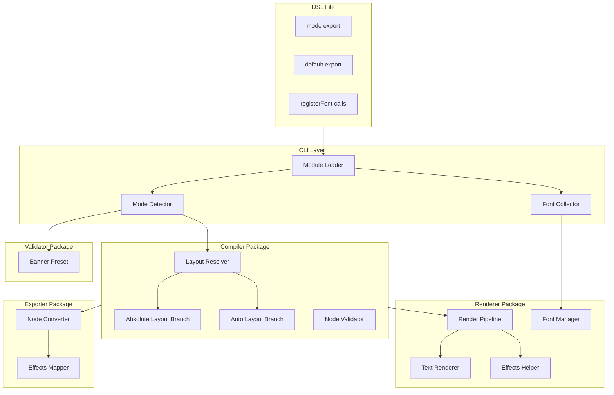
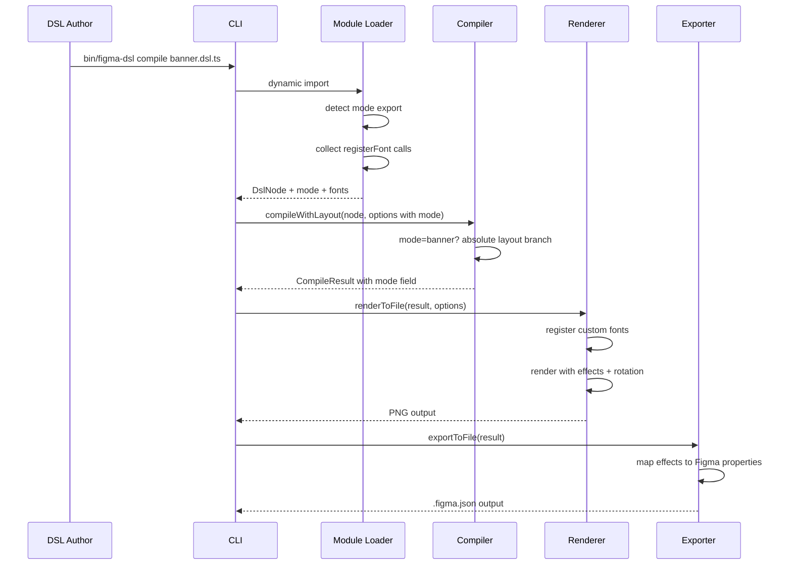
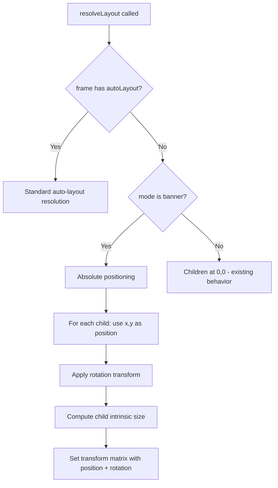

# Design Document — Banner Mode

## Overview

**Purpose**: Banner Mode introduces a new rendering mode to the Figma Component DSL that prioritizes visual richness over React code compatibility. It enables creation of expressive banner designs (hero images, promotional graphics, event posters, social media assets) with absolute positioning, visual effects, extended typography, and custom font support.

**Users**: DSL authors creating rich visual designs for Figma export and PNG rendering. Banner Mode is explicitly not for React component workflows.

**Impact**: Extends all pipeline packages (dsl-core, compiler, renderer, exporter, validator, cli) with mode-aware behavior. No changes to existing standard-mode functionality.

### Goals
- Enable absolute positioning and rotation for free-form layouts
- Add shadow, blur, and blend mode effects to the renderer
- Support Japanese fonts with full weight range and custom local font loading
- Maintain full Figma export compatibility for Banner Mode designs
- Cleanly separate Banner Mode from React-oriented workflows

### Non-Goals
- Animation or interactive effects
- SVG export format
- Per-glyph mixed-script font fallback (deferred to phase 2)
- Runtime font discovery (fonts must be explicitly registered)
- Backwards compatibility with React screenshot capture workflows

## Architecture

### Existing Architecture Analysis

The DSL pipeline follows a linear flow: `.dsl.ts` → compile (layout resolution) → render (PNG) / export (Figma JSON). All packages communicate via typed interfaces (`DslNode` → `FigmaNodeDict` → `PluginNodeDef`). Key constraints:
- No mode system exists; all files processed identically
- Layout resolver handles only auto-layout; `x`/`y` positions on non-auto-layout children are ignored
- Renderer has no effects support (shadows, blur, blend modes)
- Validator rules are React-centric (three-file, CSS Modules, barrel-export)

### Architecture Pattern & Boundary Map



**Architecture Integration**:
- Selected pattern: Extend existing pipeline with mode-aware branching at key decision points
- Domain boundaries: Effects rendering logic isolated in `effects.ts` within renderer; font management isolated in `font-manager.ts` within renderer
- Existing patterns preserved: Linear pipeline flow, typed node interfaces, package boundaries
- New components: `effects.ts` (renderer-local), `font-manager.ts` (renderer-local), banner preset (validator)
- Steering compliance: Monorepo conventions maintained; no new packages; single responsibility per module

### Technology Stack

| Layer | Choice / Version | Role in Feature | Notes |
|-------|------------------|-----------------|-------|
| DSL Core | @figma-dsl/core (existing) | Extended DslNode types, registerFont API | New properties: effects, textTransform, textStroke, textShadow |
| Compiler | @figma-dsl/compiler (existing) | Mode-aware layout resolution | Absolute positioning branch for banner mode |
| Renderer | @napi-rs/canvas 0.1.96 | Shadow, blur, blendMode, gradient text | Uses native canvas API: shadowBlur, filter, globalCompositeOperation |
| Font Decompression | @woff2/woff2-rs (new optional dep) | WOFF2 → TTF conversion | Peer dependency; graceful error if absent |
| Exporter | @figma-dsl/exporter (existing) | Effects → Figma property mapping | Maps shadow/blur/blendMode to Figma effects array |

## System Flows

### Banner Mode Pipeline Flow



Key decisions: Mode is detected once at load time and threaded through the entire pipeline via `CompilerOptions.mode`. Font registration happens before rendering. Effects are applied per-node during the render tree traversal.

### Absolute Positioning Layout Flow



## Requirements Traceability

| Requirement | Summary | Components | Interfaces | Flows |
|-------------|---------|------------|------------|-------|
| 1.1–1.6 | Mode flag and pipeline integration | ModuleLoader, CompilerOptions, CompileResult | DslModuleExports, CompilerOptions | Pipeline Flow |
| 2.1–2.5 | Absolute positioning | LayoutResolver | AbsoluteLayoutContext | Absolute Positioning Flow |
| 3.1–3.5 | Extended typography | TextRenderer, DslNode TextStyle | BannerTextStyle | Pipeline Flow |
| 4.1–4.4 | Japanese font support | FontManager, DslNode | FontRegistration | Pipeline Flow |
| 5.1–5.5 | Local font loading | FontManager, registerFont API | FontRegistration | Pipeline Flow |
| 6.1–6.5 | Enhanced visual effects | EffectsHelper, DslNode | EffectDefinition, BlendMode | Pipeline Flow |
| 7.1–7.5 | Figma export compatibility | EffectsMapper, NodeConverter | PluginNodeDef | Pipeline Flow |
| 8.1–8.4 | React compatibility exclusion | BannerPreset, CLI commands | ValidatorPreset | Pipeline Flow |

## Components and Interfaces

| Component | Domain/Layer | Intent | Req Coverage | Key Dependencies | Contracts |
|-----------|--------------|--------|--------------|------------------|-----------|
| DslNode Extensions | dsl-core | Add Banner Mode properties to node types | 1, 2, 3, 5, 6 | None | Service |
| registerFont API | dsl-core | Expose font registration to DSL authors | 5 | @woff2/woff2-rs (P2) | Service |
| CompilerOptions Extension | compiler | Thread mode through compilation | 1 | DslNode (P0) | Service |
| Layout Resolver Extension | compiler | Absolute positioning for banner frames | 2 | CompilerOptions (P0) | Service |
| Effects Helper | renderer | Shadow, blur, blend mode rendering | 6 | @napi-rs/canvas (P0) | Service |
| Text Renderer Extension | renderer | Text stroke, shadow, transform, gradient | 3 | @napi-rs/canvas (P0) | Service |
| Font Manager | renderer | Custom font registration and resolution | 4, 5 | @napi-rs/canvas (P0), @woff2/woff2-rs (P2) | Service |
| Effects Mapper | exporter | Map effects to Figma plugin properties | 7 | PluginNodeDef (P0) | Service |
| Banner Preset | validator | Skip React rules for Banner Mode files | 8 | Validator presets (P0) | State |
| CLI Mode Detection | cli | Detect and thread mode from DSL module | 1, 8 | Module Loader (P0) | Service |

### DSL Core Layer

#### DslNode Extensions

| Field | Detail |
|-------|--------|
| Intent | Extend the DslNode interface with Banner Mode properties |
| Requirements | 1.1, 2.3, 3.1–3.4, 6.1–6.4 |

**Responsibilities & Constraints**
- Add new optional properties to `DslNode` and `TextStyle` interfaces
- All new properties are optional; standard-mode files remain unaffected
- No runtime behavior changes — types only

**Contracts**: Service [x]

##### Service Interface

```typescript
// Additions to DslNode in types.ts
interface DslNode {
  // ... existing properties ...

  // Banner Mode: Visual Effects (6.1–6.4)
  effects?: EffectDefinition[];
  blendMode?: BlendMode;

  // Banner Mode: Rotation (2.3)
  rotation?: number;  // already exists in types, ensure consistent usage
}

// New types
type EffectDefinition =
  | DropShadowEffect
  | LayerBlurEffect
  | BackgroundBlurEffect;

interface DropShadowEffect {
  type: 'DROP_SHADOW';
  color: RGBAColor;
  offsetX: number;
  offsetY: number;
  blur: number;
  spread?: number;
}

interface LayerBlurEffect {
  type: 'LAYER_BLUR';
  radius: number;
}

interface BackgroundBlurEffect {
  type: 'BACKGROUND_BLUR';
  radius: number;
}

type BlendMode =
  | 'NORMAL' | 'MULTIPLY' | 'SCREEN' | 'OVERLAY'
  | 'DARKEN' | 'LIGHTEN' | 'COLOR_DODGE' | 'COLOR_BURN'
  | 'HARD_LIGHT' | 'SOFT_LIGHT' | 'DIFFERENCE' | 'EXCLUSION';

// Additions to TextStyle
interface TextStyle {
  // ... existing properties ...

  // Banner Mode: Extended Typography (3.1–3.4)
  textTransform?: 'UPPERCASE' | 'LOWERCASE' | 'CAPITALIZE';
  textStroke?: { color: string; width: number };
  textShadow?: { color: string; offsetX: number; offsetY: number; blur: number };
}
```

- Preconditions: None (type definitions only)
- Postconditions: All new properties are optional; existing DslNode usage unchanged
- Invariants: `effects` array items must have valid `type` discriminant

**Implementation Notes**
- Integration: Add types to `packages/dsl-core/src/types.ts`; update factory functions in `nodes.ts` to accept and pass through new properties
- Validation: Compiler validates effect values (e.g., blur radius >= 0, shadow color valid RGBA)

#### registerFont API

| Field | Detail |
|-------|--------|
| Intent | Allow DSL authors to register custom local fonts for rendering |
| Requirements | 5.1–5.5 |

**Responsibilities & Constraints**
- Collect font registrations at module load time
- Store registrations in a module-level registry for later use by compiler and renderer
- Validate file extension (`.ttf`, `.otf`, `.woff2`)
- Do NOT perform file I/O at registration time (deferred to compilation)

**Contracts**: Service [x]

##### Service Interface

```typescript
// Exported from @figma-dsl/core
interface FontRegistrationOptions {
  family: string;
  weight?: number;    // 100–900, default 400
  style?: 'normal' | 'italic';
}

function registerFont(path: string, options: FontRegistrationOptions): void;

// Internal: collected registrations
interface FontRegistration {
  path: string;
  family: string;
  weight: number;
  style: 'normal' | 'italic';
}

function getRegisteredFonts(): FontRegistration[];
function clearRegisteredFonts(): void;
```

- Preconditions: `path` ends with `.ttf`, `.otf`, or `.woff2`
- Postconditions: Registration stored in module-level array; retrievable via `getRegisteredFonts()`
- Invariants: Font file existence is NOT validated at registration time (validated at compilation)

**Implementation Notes**
- Integration: Export `registerFont` from `@figma-dsl/core` public API; CLI calls `getRegisteredFonts()` after dynamic import
- Validation: Extension check at registration time; file existence check deferred to compiler
- Risks: Side-effect at module load time; order-dependent if multiple DSL files share fonts in batch mode — mitigate by calling `clearRegisteredFonts()` between files

### Compiler Layer

#### CompilerOptions Extension

| Field | Detail |
|-------|--------|
| Intent | Thread Banner Mode flag through compilation pipeline |
| Requirements | 1.1–1.6 |

**Contracts**: Service [x]

##### Service Interface

```typescript
// Extension to existing CompilerOptions in compiler/src/types.ts
interface CompilerOptions {
  validationLevel?: 'strict' | 'normal' | 'loose';
  mode?: 'standard' | 'banner';  // NEW — default 'standard'
}

// Extension to existing CompileResult
interface CompileResult {
  root: FigmaNodeDict;
  nodeCount: number;
  errors: CompileError[];
  mode?: 'standard' | 'banner';  // NEW — propagated from options
}
```

- Preconditions: Valid `mode` value or undefined
- Postconditions: `mode` propagated to `CompileResult` for downstream consumers
- Invariants: When `mode` is undefined, behaves identically to current implementation

#### Layout Resolver Extension

| Field | Detail |
|-------|--------|
| Intent | Support absolute positioning for Banner Mode frames without auto-layout |
| Requirements | 2.1–2.5 |

**Responsibilities & Constraints**
- When mode is `'banner'` and a frame has no `autoLayout`, position children using their `x`/`y` properties
- Apply `rotation` as a transform matrix rotation around the child's center
- Standard-mode behavior unchanged (children at 0,0 for non-auto-layout frames)

**Contracts**: Service [x]

##### Service Interface

```typescript
// Within layout-resolver.ts — new branch in resolveLayout()
interface AbsoluteLayoutContext {
  mode: 'banner';
  parentSize: { x: number; y: number };
}

// Transform matrix with rotation (extends existing 3x3 matrix)
// rotation in degrees, applied as:
//   translate(cx, cy) → rotate(angle) → translate(-cx, -cy)
// where cx, cy = center of child node
```

- Preconditions: Parent frame has no `autoLayout` property; mode is `'banner'`
- Postconditions: Each child's transform matrix includes position (x, y) and rotation
- Invariants: Children without explicit `x`/`y` default to (0, 0)

**Implementation Notes**
- Integration: Add branch in `resolveLayout()` after auto-layout check
- Validation: Emit warning (not error) if `x`/`y` used outside absolute context (2.5)

### Renderer Layer

#### Effects Helper

| Field | Detail |
|-------|--------|
| Intent | Render drop shadows, blur effects, and blend modes on canvas |
| Requirements | 6.1–6.5 |

**Responsibilities & Constraints**
- Drop shadow: Set `shadowColor`, `shadowBlur`, `shadowOffsetX`, `shadowOffsetY` before drawing node
- Layer blur: Use `ctx.filter = 'blur(Xpx)'` on off-screen canvas, composite result
- Background blur: Render background region to off-screen canvas, apply blur, composite back
- Blend mode: Set `globalCompositeOperation` before drawing node
- Apply shadow before coordinate transforms to avoid known @napi-rs/canvas translate bug

**Contracts**: Service [x]

##### Service Interface

```typescript
// packages/renderer/src/effects.ts
interface EffectsContext {
  ctx: CanvasRenderingContext2D;
  node: FigmaNodeDict;
  bounds: { x: number; y: number; width: number; height: number };
}

function applyDropShadow(ctx: CanvasRenderingContext2D, effect: DropShadowEffect): void;
function clearShadow(ctx: CanvasRenderingContext2D): void;
function applyLayerBlur(
  ctx: CanvasRenderingContext2D,
  effect: LayerBlurEffect,
  renderFn: () => void,
  bounds: { x: number; y: number; width: number; height: number }
): void;
function applyBackgroundBlur(
  ctx: CanvasRenderingContext2D,
  effect: BackgroundBlurEffect,
  bounds: { x: number; y: number; width: number; height: number }
): void;
function applyBlendMode(ctx: CanvasRenderingContext2D, blendMode: BlendMode): void;
function resetBlendMode(ctx: CanvasRenderingContext2D): void;
```

- Preconditions: Canvas context is valid; bounds are computed
- Postconditions: Visual effects applied to canvas; context state restored after each operation
- Invariants: `ctx.save()` / `ctx.restore()` bracket all effect applications

**Implementation Notes**
- Integration: Called from `renderNode()` in renderer.ts before/after node content rendering
- Risks: Background blur performance on large areas; mitigate with size limits or quality settings

#### Text Renderer Extension

| Field | Detail |
|-------|--------|
| Intent | Add text transform, stroke, shadow, and gradient fill to text rendering |
| Requirements | 3.1–3.5 |

**Contracts**: Service [x]

##### Service Interface

```typescript
// Extensions within renderer text rendering logic

// Text transform (3.1): applied to text content before rendering
function applyTextTransform(text: string, transform: 'UPPERCASE' | 'LOWERCASE' | 'CAPITALIZE'): string;

// Text stroke (3.2): after fillText, call strokeText with stroke properties
// Text shadow (3.3): set shadow* properties before fillText
// Gradient text (3.4): create CanvasGradient matching text bounds, set as fillStyle
```

- Preconditions: Text node has Banner Mode text properties set
- Postconditions: Text rendered with requested visual enhancements
- Invariants: Standard text rendering unchanged when Banner properties absent

#### Font Manager

| Field | Detail |
|-------|--------|
| Intent | Register bundled and custom fonts with @napi-rs/canvas |
| Requirements | 4.1–4.4, 5.1–5.5 |

**Responsibilities & Constraints**
- Register bundled fonts (Inter, Noto Sans JP) at initialization
- Register user fonts from `FontRegistration` list
- Decompress `.woff2` to TTF using `@woff2/woff2-rs` before registration
- Resolve relative font paths against `--asset-dir`
- Maintain buffer references for GC-safe registration

**Contracts**: Service [x]

##### Service Interface

```typescript
// packages/renderer/src/font-manager.ts
interface FontManagerOptions {
  fontDir: string;                      // bundled fonts directory
  assetDir?: string;                    // base for relative font paths
  customFonts?: FontRegistration[];     // from registerFont() calls
}

function initializeFontManager(options: FontManagerOptions): Promise<void>;
function resolveFontFamily(text: string, requestedFamily?: string): string;
```

- Preconditions: `fontDir` exists and contains bundled fonts
- Postconditions: All bundled and custom fonts registered with GlobalFonts
- Invariants: Buffer references retained for lifetime of process; `resolveFontFamily` returns 'Inter' for Latin-only, 'Noto Sans JP' for CJK, or custom family if registered

**Implementation Notes**
- Integration: `initializeFontManager` called from CLI after module load, replacing current `initializeRenderer(fontDir)`
- Validation: Emit `CompileError` if font file not found (5.4); emit warning if `@woff2/woff2-rs` not installed and `.woff2` requested
- Risks: Buffer GC — store buffers in module-level `Map<string, Buffer>`

### Exporter Layer

#### Effects Mapper

| Field | Detail |
|-------|--------|
| Intent | Map Banner Mode effects to Figma plugin-compatible JSON properties |
| Requirements | 7.1–7.5 |

**Responsibilities & Constraints**
- Map `EffectDefinition[]` to Figma's `effects` array format
- Map `BlendMode` to Figma's `blendMode` property
- Map absolute `x`/`y` positioning to Figma node coordinates
- Include `rotation` in exported node data (already partially supported)

**Contracts**: Service [x]

##### Service Interface

```typescript
// Within exporter — mapping functions
interface FigmaEffect {
  type: 'DROP_SHADOW' | 'LAYER_BLUR' | 'BACKGROUND_BLUR';
  visible: boolean;
  radius?: number;
  color?: { r: number; g: number; b: number; a: number };
  offset?: { x: number; y: number };
  spread?: number;
}

function mapEffectsToFigma(effects: EffectDefinition[]): FigmaEffect[];
function mapBlendModeToFigma(blendMode: BlendMode): string;
```

- Preconditions: Effects array contains valid EffectDefinition items
- Postconditions: Figma-compatible effects array in exported JSON
- Invariants: Figma effect types match plugin API expectations

### Validator Layer

#### Banner Preset

| Field | Detail |
|-------|--------|
| Intent | Disable React-specific validation rules for Banner Mode files |
| Requirements | 8.1–8.4 |

**Contracts**: State [x]

##### State Management

```typescript
// Addition to packages/validator/src/presets.ts
const bannerPreset: PresetConfig = {
  'three-file': 'off',
  'barrel-export': 'off',
  'css-modules': 'off',
  'no-inline-style': 'off',
  'design-tokens': 'off',
  'token-exists': 'off',
  'classname-prop': 'off',
  'variant-union': 'off',
  'html-attrs': 'off',
  'dsl-compatible-layout': 'off',
  'image-refs': 'warning',  // keep image validation
};
```

- Persistence: Static preset configuration; no runtime state
- Consistency: Applied when mode is detected as `'banner'`

### CLI Layer

#### CLI Mode Detection

| Field | Detail |
|-------|--------|
| Intent | Detect Banner Mode from DSL module exports and thread through pipeline |
| Requirements | 1.1–1.2, 8.2 |

**Responsibilities & Constraints**
- After dynamic import, check for `mod.mode` named export
- Collect `getRegisteredFonts()` results
- Pass mode to `compileWithLayout()` and rendering functions
- Skip `capture` command for Banner Mode files with informational message

**Implementation Notes**
- Integration: Modify `loadDslModule()` in `cli.ts` to return `{ node: DslNode, mode: string, fonts: FontRegistration[] }`
- Validation: If `mod.mode` exists but is not `'banner'`, emit warning and use standard mode

## Data Models

### Domain Model

The primary data model extension is to `DslNode` (see DslNode Extensions above). The node tree flows through:

1. **DslNode** (dsl-core) — author-facing types with new Banner properties
2. **FigmaNodeDict** (compiler) — compiled intermediate with computed layout, effects, and mode
3. **PluginNodeDef** (exporter) — Figma plugin format with mapped effects

All three levels require extension with effects, blend mode, and text enhancement properties. The mapping is straightforward and preserves the existing single-direction data flow.

## Error Handling

### Error Categories

**Compilation Errors** (Banner-specific):
- Missing font file referenced by `registerFont()` → `CompileError` with path and suggestion
- Invalid effect values (negative blur, out-of-range color) → `CompileError` with node path
- `x`/`y` used in standard mode on non-auto-layout children → warning (not error)

**Runtime Errors**:
- `@woff2/woff2-rs` not installed when `.woff2` font used → error with install instruction
- Font registration failure (corrupt file) → `CompileError` with font path

**CLI Behavior**:
- `capture` command on Banner Mode file → informational message, exit 0 (not an error)
- Banner Mode-only properties in standard mode → warnings logged, properties ignored

## Testing Strategy

### Unit Tests
- **DslNode type extensions**: Factory functions accept and pass through Banner properties
- **Effects helper**: Each effect function produces correct canvas API calls (shadow, blur, blend)
- **Text transform**: `applyTextTransform()` handles UPPERCASE, LOWERCASE, CAPITALIZE correctly
- **Font manager**: Registration, resolution, WOFF2 decompression (with mock), missing file error
- **Layout resolver**: Absolute positioning computes correct transforms with rotation
- **Effects mapper**: DSL effects → Figma effects array mapping

### Integration Tests
- **Full pipeline**: Banner Mode DSL file → compile → render → verify PNG output has effects
- **Figma export**: Banner Mode file → export → verify `.figma.json` contains effects array
- **Font loading**: DSL file with `registerFont()` → compile/render with custom font
- **Mode detection**: CLI correctly detects mode from module export and threads through pipeline

### Visual Regression Tests
- **Calibration suite**: Add Banner Mode test components to `examples/` for visual comparison
- **Effect rendering**: Shadow, blur, gradient text rendered correctly at various parameters
- **Absolute positioning**: Overlapping elements rendered in correct z-order with rotation

## Performance & Scalability

- **Background blur**: Most expensive operation. Off-screen canvas allocation + blur filter + composite. Limit to reasonable area sizes; emit warning for blur on frames > 2000x2000px
- **Font loading**: WOFF2 decompression adds ~10–50ms per font file. Cache decompressed buffers for batch operations
- **Canvas pool**: Existing canvas pool mechanism applies to Banner Mode; no changes needed
- **Batch processing**: `clearRegisteredFonts()` between files prevents font accumulation
