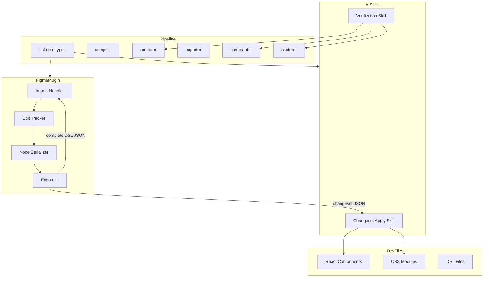
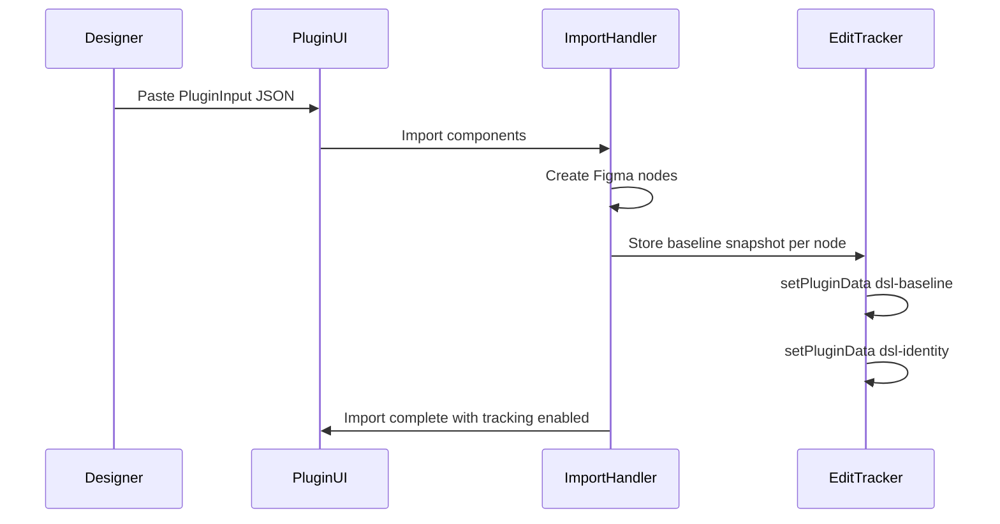
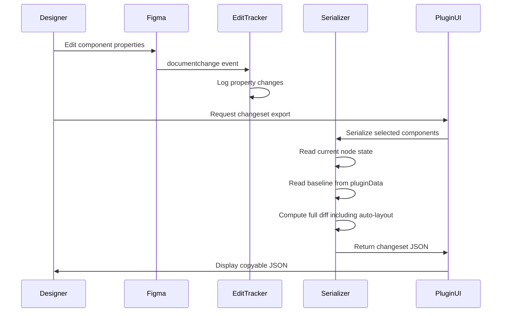
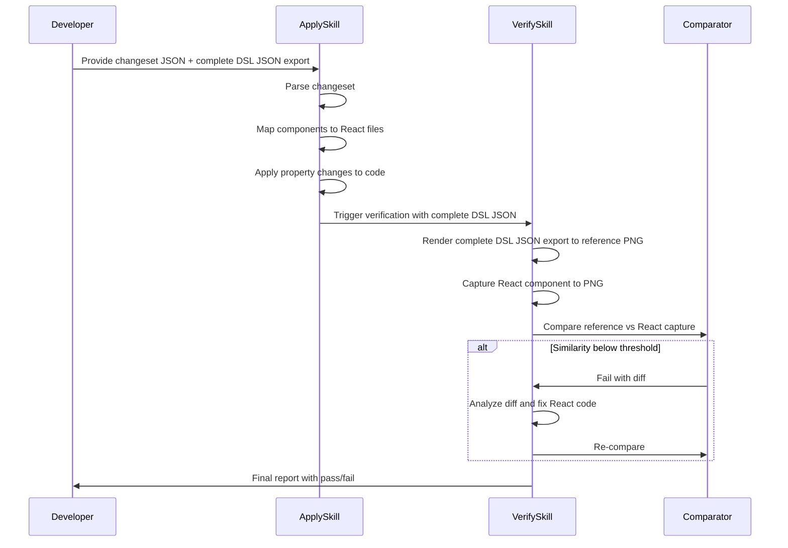
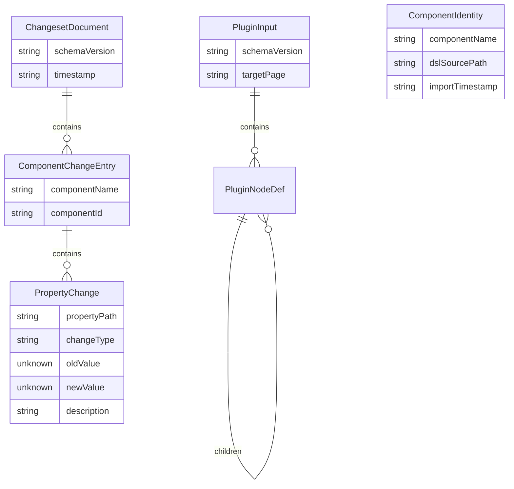

# Design Document — Bidirectional Sync

## Overview

**Purpose**: This feature delivers a round-trip design-code synchronization workflow to designers and developers using the Figma Component DSL pipeline.

**Users**: Designers use the Figma plugin to edit imported components and export changesets. Developers consume changesets via an AI skill to update React source code. Claude AI verifies visual fidelity automatically.

**Impact**: Extends the current import-only plugin into a bidirectional bridge. Adds changeset tracking, export, and application capabilities. Introduces an AI-driven verification loop.

### Goals
- Enable designers to capture structured diffs of their Figma edits as changeset JSON
- Enable complete DSL JSON export of edited component state for re-import
- Provide AI-assisted changeset application to React/CSS source code
- Automate visual verification via DSL-vs-React image comparison with iterative correction
- Maintain reliable component identity mapping across the Figma-code boundary

### Non-Goals
- Real-time collaborative sync (changes are batch-exported, not streamed)
- Automated structural code changes (node additions/removals produce descriptions for manual review)
- Figma REST API integration for change detection (plugin-only, no server-side polling)
- Multi-file Figma support (scoped to single Figma file per session)
- Undo/revert changeset application (developers use git for rollback)

## Architecture

> See `research.md` for detailed discovery findings on Figma Plugin API capabilities, `NodeChangeProperty` coverage gaps, and `setPluginData` constraints.

### Existing Architecture Analysis

The current pipeline is unidirectional:

```
.dsl.ts → compile → FigmaNodeDict → export → PluginInput JSON → Plugin → Figma nodes
                                   → render → PNG
```

Key constraints:
- Plugin (`packages/plugin/`) is import-only with inline HTML UI
- `PluginNodeDef` type is currently duplicated between `packages/plugin/` and `packages/exporter/` — this feature consolidates the canonical definition in `@figma-dsl/core` (or exporter) and has the plugin import it via esbuild bundling at build time
- Component identification relies on filename convention (`{Name}.dsl.ts` ↔ `{Name}.tsx`)
- Comparator package already supports image diffing with similarity scoring
- No existing export-from-Figma or change tracking functionality

### Architecture Pattern & Boundary Map



**Architecture Integration**:
- Selected pattern: Extended pipeline — adds reverse data flow (Figma → code) alongside existing forward flow (code → Figma)
- Domain boundaries: Plugin owns tracking/export; AI skills own application/verification; shared types in `dsl-core`
- Existing patterns preserved: monorepo package structure, CLI command orchestration, `PluginNodeDef` schema
- New components rationale: Edit Tracker (Figma-side change detection), Node Serializer (Figma node → `PluginNodeDef` reverse mapping), Export UI (designer-facing changeset export), AI Skills (code-side changeset application and verification)
- Steering compliance: TypeScript strict mode, no `any`, vitest testing, esbuild plugin bundling, CSS Modules styling

### Technology Stack

| Layer | Choice / Version | Role in Feature | Notes |
|-------|------------------|-----------------|-------|
| Plugin Runtime | Figma Plugin API | Edit tracking via `documentchange`, metadata via `setPluginData` | No new dependencies |
| Plugin Build | esbuild (IIFE) | Bundle extended plugin code; resolve @figma-dsl/core workspace imports at build time | Existing toolchain, extended config |
| Shared Types | @figma-dsl/core | Changeset schema types, `PluginNodeDef` canonical definition | Extended, not new |
| Image Comparison | @figma-dsl/comparator | Visual verification in AI skill | Existing package |
| Screenshot | @figma-dsl/capturer (Playwright) | React component capture for verification | Existing package |
| Rendering | @figma-dsl/renderer (@napi-rs/canvas) | DSL render for verification | Existing package |
| AI Skills | Claude Desktop / Claude Code | Changeset application, verification loop | New skill files |

## System Flows

### Flow 1: Import with Baseline Capture



After import, the Edit Tracker registers a `documentchange` listener for ongoing change detection.

### Flow 2: Edit Tracking and Changeset Export



Key decision: The real-time edit log provides immediate feedback, but the final changeset is computed via snapshot diff at export time to ensure completeness (see `research.md` — hybrid approach).

### Flow 3: Changeset Application and Verification



## Requirements Traceability

| Requirement | Summary | Components | Interfaces | Flows |
|-------------|---------|------------|------------|-------|
| 1.1 | Baseline snapshot on import | EditTracker | SnapshotData | Flow 1 |
| 1.2 | Detect property changes | EditTracker | documentchange API | Flow 2 |
| 1.3 | Track property categories | EditTracker, Serializer | NodeChangeProperty | Flow 2 |
| 1.4 | Ordered edit log | EditTracker | EditLogEntry | Flow 2 |
| 1.5 | Structural change tracking | EditTracker | documentchange CREATE/DELETE | Flow 2 |
| 1.6 | Component identity association | EditTracker | ComponentIdentity | Flow 1, 2 |
| 2.1 | Changeset export as diff | Serializer | ChangesetDocument | Flow 2 |
| 2.2 | Change entry structure | Serializer | PropertyChange | Flow 2 |
| 2.3 | Consolidate multiple edits | Serializer | Snapshot diff | Flow 2 |
| 2.4 | Schema version in changeset | Serializer | ChangesetDocument.schemaVersion | Flow 2 |
| 2.5 | Selection-based export | ExportUI, Serializer | Figma selection API | Flow 2 |
| 2.6 | Copyable JSON in UI | ExportUI | Plugin UI | Flow 2 |
| 3.1 | Complete DSL JSON export | Serializer | PluginInput | Flow 2 |
| 3.2 | Round-trip import fidelity | Serializer, ImportHandler | PluginInput | Flow 1, 2 |
| 3.3 | Export reflects edited state | Serializer | Node read API | Flow 2 |
| 3.4 | Individual and page-wide export | ExportUI | Figma selection/page API | Flow 2 |
| 4.1 | Parse changeset and find files | ApplySkill | ComponentMapping | Flow 3 |
| 4.2 | Map DSL props to React/CSS | ApplySkill | Property mapping rules | Flow 3 |
| 4.3 | Text content updates | ApplySkill | JSX editing | Flow 3 |
| 4.4 | Unresolved component handling | ApplySkill | Error reporting | Flow 3 |
| 4.5 | Structural change descriptions | ApplySkill | Manual review output | Flow 3 |
| 4.6 | Summary report | ApplySkill | ApplicationReport | Flow 3 |
| 5.1 | Dual render (DSL + React) | VerifySkill | renderer, capturer | Flow 3 |
| 5.2 | Image comparison scoring | VerifySkill | comparator | Flow 3 |
| 5.3 | Below-threshold suggestions | VerifySkill | Diff analysis | Flow 3 |
| 5.4 | Iterative correction loop | VerifySkill | Loop control | Flow 3 |
| 5.5 | Claude Desktop preview | VerifySkill | Preview feature | Flow 3 |
| 5.6 | Final verification report | VerifySkill | VerificationReport | Flow 3 |
| 6.1 | Embedded identity metadata | EditTracker | setPluginData | Flow 1 |
| 6.2 | Persist node-id-map.json | ImportHandler | componentIdMap | Flow 1 |
| 6.3 | Rename tracking | EditTracker | documentchange name | Flow 2 |
| 6.4 | Configurable component-file mapping | ApplySkill | ComponentMapping | Flow 3 |
| 7.1 | TypeScript type in shared package | dsl-core types | ChangesetDocument | All |
| 7.2 | Document-level metadata | Serializer | ChangesetDocument | Flow 2 |
| 7.3 | Component change entries | Serializer | ComponentChangeEntry | Flow 2 |
| 7.4 | Property change structure | Serializer | PropertyChange | Flow 2 |
| 7.5 | Human-readable descriptions | Serializer | PropertyChange.description | Flow 2 |

## Components and Interfaces

| Component | Domain | Intent | Req Coverage | Key Dependencies | Contracts |
|-----------|--------|--------|--------------|-----------------|-----------|
| EditTracker | Plugin | Detect and log property changes on imported nodes | 1.1–1.6, 6.1, 6.3 | Figma Plugin API (P0) | State |
| NodeSerializer | Plugin | Serialize Figma nodes to PluginNodeDef and compute diffs | 2.1–2.4, 3.1–3.3, 7.2–7.5 | EditTracker (P0), dsl-core types (P0) | Service |
| ExportUI | Plugin | Plugin UI for changeset and complete JSON export | 2.5–2.6, 3.4 | NodeSerializer (P0) | — |
| Changeset Types | dsl-core | Shared TypeScript type definitions for changeset schema | 7.1–7.5 | — | Service |
| ApplySkill | AI Skill | Interpret changesets and apply to React/CSS source | 4.1–4.6 | Changeset Types (P0), file system (P0) | — |
| VerifySkill | AI Skill | Render, compare, and iterate until visual fidelity met | 5.1–5.6 | comparator (P0), renderer (P0), capturer (P0) | — |

### Plugin Domain

#### EditTracker

| Field | Detail |
|-------|--------|
| Intent | Capture baseline snapshots on import and track all subsequent property changes via Figma events |
| Requirements | 1.1, 1.2, 1.3, 1.4, 1.5, 1.6, 6.1, 6.3 |

**Responsibilities & Constraints**
- Register `documentchange` listener after component import completes
- Store baseline snapshots on each imported top-level node via `setPluginData("dsl-baseline", ...)`. The baseline includes the full recursive child tree (matching the `PluginNodeDef.children` structure).
- Store component identity metadata via `setPluginData("dsl-identity", ...)`
- Maintain in-memory ordered edit log per component for real-time feedback
- **Child node attribution**: When a `documentchange` event fires for any node, walk the `node.parent` chain upward until a node with `dsl-identity` pluginData is found. Attribute the change to that top-level component. Discard changes on nodes that have no tracked ancestor.
- Filter changes to only tracked nodes and their descendants (those reachable via parent-chain traversal to a node with `dsl-identity` pluginData)

**Dependencies**
- External: Figma Plugin API (`figma.on("documentchange")`, `setPluginData`, `getPluginData`) — P0

**Contracts**: State [x]

##### State Management

```typescript
interface ComponentIdentity {
  readonly componentName: string;
  readonly dslSourcePath: string;
  readonly importTimestamp: string;
  readonly originalNodeId: string;
}

interface EditLogEntry {
  readonly nodeId: string;
  readonly componentName: string;
  readonly timestamp: string;
  readonly changeType: 'PROPERTY_CHANGE' | 'CREATE' | 'DELETE';
  readonly properties: ReadonlyArray<string>;
  readonly origin: 'LOCAL' | 'REMOTE';
}

interface TrackerState {
  readonly trackedNodeIds: ReadonlySet<string>;
  readonly editLog: ReadonlyArray<EditLogEntry>;
  readonly isTracking: boolean;
}
```

- Persistence: Baseline snapshots persisted via `setPluginData` (survives plugin restart). Edit log held in memory (reset on plugin restart; final changeset computed from snapshot diff, not log).
- Concurrency: Single-threaded Figma plugin sandbox; no concurrency concerns.

**Implementation Notes**
- Integration: Hook into existing `createNode()` function to call `storeBaseline()` after each top-level component is created
- Validation: Verify `setPluginData` success; warn if approaching 100KB limit
- Risks: `documentchange` does not track auto-layout properties — mitigated by snapshot diff at export time

#### NodeSerializer

| Field | Detail |
|-------|--------|
| Intent | Read current Figma node state, serialize to PluginNodeDef, and compute diffs against baseline |
| Requirements | 2.1, 2.2, 2.3, 2.4, 3.1, 3.2, 3.3, 7.2, 7.3, 7.4, 7.5 |

**Responsibilities & Constraints**
- Traverse Figma node tree and produce `PluginNodeDef` (reverse of `createNode()`)
- Read baseline snapshot from `setPluginData` and compute property-level diff
- Consolidate multiple changes into net diff (baseline → current)
- Generate human-readable descriptions for each property change
- Produce both changeset (diff) and complete (full state) export formats

**Dependencies**
- Inbound: ExportUI — triggers serialization (P0)
- Inbound: EditTracker — reads baseline snapshots (P0)
- External: Figma Plugin API (node property reads) — P0

**Contracts**: Service [x]

##### Service Interface

```typescript
interface NodeSerializerService {
  serializeNode(node: SceneNode): PluginNodeDef;
  serializePage(page: PageNode): PluginInput;
  computeChangeset(
    nodeIds: ReadonlyArray<string>
  ): ChangesetDocument;
  computeCompleteExport(
    nodeIds: ReadonlyArray<string>,
    pageName: string
  ): PluginInput;
}
```

- Preconditions: Nodes must have `dsl-baseline` pluginData (imported via this plugin)
- Postconditions: Changeset contains only properties that differ from baseline; complete export is valid `PluginInput`
- Invariants: `serializeNode` output is structurally compatible with `createNode` input (round-trip fidelity)

**Implementation Notes**
- Integration: `serializeNode` reads all properties from Figma node API and maps to `PluginNodeDef` fields. This is the inverse of the existing `createNode()` function.
- Validation: Skip nodes without `dsl-identity` metadata; report as warnings
- Risks: Figma node properties may have types not in `PluginNodeDef` (e.g., effects, constraints). Only serialize properties defined in the schema; ignore others.

#### ExportUI

| Field | Detail |
|-------|--------|
| Intent | Provide plugin UI controls for changeset and complete JSON export |
| Requirements | 2.5, 2.6, 3.4 |

**Responsibilities & Constraints**
- Add "Export" tab to existing plugin UI alongside existing "Import" tab
- Provide selection-based vs page-wide export toggle
- Display exported JSON in scrollable, copyable text area
- Support both changeset (diff) and complete (full state) export modes

**Dependencies**
- Outbound: NodeSerializer — triggers serialization (P0)

**Contracts**: None (UI-only, communicates via `postMessage`)

**Implementation Notes**
- Integration: Extend existing inline HTML UI string in `code.ts` with tab navigation
- The Export UI sends messages to the plugin code via `parent.postMessage({ pluginMessage: { type: 'export-changeset' | 'export-complete', ... } })`

### Shared Types Domain

#### Changeset Types (in @figma-dsl/core)

| Field | Detail |
|-------|--------|
| Intent | Define the canonical TypeScript types for changeset documents shared across plugin, skills, and tools |
| Requirements | 7.1, 7.2, 7.3, 7.4, 7.5 |

**Contracts**: Service [x]

##### Service Interface

```typescript
type ChangeType = 'modified' | 'added' | 'removed';

interface PropertyChange {
  readonly propertyPath: string;
  readonly changeType: ChangeType;
  readonly oldValue?: unknown;
  readonly newValue?: unknown;
  readonly description: string;
}

interface ComponentChangeEntry {
  readonly componentName: string;
  readonly componentId: string;
  readonly changes: ReadonlyArray<PropertyChange>;
}

interface ChangesetSource {
  readonly pluginVersion: string;
  readonly figmaFileName: string;
}

interface ChangesetDocument {
  readonly schemaVersion: string;
  readonly timestamp: string;
  readonly source: ChangesetSource;
  readonly components: ReadonlyArray<ComponentChangeEntry>;
}
```

- The `oldValue` and `newValue` fields use `unknown` rather than `any` to enforce type checking at consumption sites
- `propertyPath` uses dot-notation matching `PluginNodeDef` field paths (e.g., `"fills.0.color.r"`, `"fontSize"`, `"children.2.characters"`)

**Implementation Notes**
- These types are exported from `@figma-dsl/core` and imported by the plugin at build time. The plugin's esbuild configuration resolves `@figma-dsl/core` as a workspace dependency and bundles the type-stripped JavaScript into the IIFE output. This eliminates type duplication — the plugin imports changeset types (and `PluginNodeDef`) directly from the canonical source, and esbuild inlines them at build time.
- The existing `PluginNodeDef` duplication between `packages/plugin/` and `packages/exporter/` should also be consolidated: the canonical definition lives in `@figma-dsl/core` (or `@figma-dsl/exporter`), and the plugin imports it via esbuild bundling.

### AI Skills Domain

#### ApplySkill (Changeset Application)

| Field | Detail |
|-------|--------|
| Intent | Parse changeset JSON and apply property changes to React component source code and CSS Modules |
| Requirements | 4.1, 4.2, 4.3, 4.4, 4.5, 4.6 |

**Responsibilities & Constraints**
- Parse `ChangesetDocument` JSON provided by the developer
- Resolve component names to React file paths using configurable mapping (default: `preview/src/components/{Name}/{Name}.tsx` and `.module.css`)
- Map DSL property changes to React/CSS code edits:
  - Fill colors → CSS `background-color`, `color` properties
  - Typography → CSS `font-size`, `font-family`, `font-weight`, `line-height`, `letter-spacing`
  - Spacing → CSS `padding`, `margin`, `gap`
  - Size → CSS `width`, `height`
  - Text content → JSX string literals
- Generate natural-language descriptions for structural changes (node add/remove) rather than attempting automatic structural modification
- Produce summary report

**Dependencies**
- Inbound: Developer provides changeset JSON file — P0
- External: Claude Code file editing tools (Read, Edit, Write) — P0
- External: Component file system layout — P1

**Implementation Notes**
- The skill is implemented as a Claude Code SKILL.md file in `.claude/skills/apply-changeset/`
- Property mapping rules are documented in the skill instructions
- The skill reads the changeset, iterates over `ComponentChangeEntry` items, locates files, and applies edits
- For unresolved components, logs a warning and continues
- Structural changes produce a markdown description block for the developer

#### VerifySkill (Visual Verification)

| Field | Detail |
|-------|--------|
| Intent | Render DSL and React outputs, compare images, and iterate corrections until visual fidelity threshold is met |
| Requirements | 5.1, 5.2, 5.3, 5.4, 5.5, 5.6 |

**Responsibilities & Constraints**
- Render the **complete DSL JSON export** (from Requirement 3 — the Figma-side current state) to PNG as the reference image. This reflects the designer's intended changes, not the original `.dsl.ts` file which has not been updated.
- Capture the React component via Playwright screenshot (existing capturer)
- Compare the reference (complete export render) against the React capture using the existing comparator package
- If similarity < threshold (default 95%), analyze the diff image and suggest/apply code fixes to the React component
- Iterate up to max rounds (default 3)
- Present results using Claude Desktop preview feature (side-by-side images)

**Dependencies**
- Inbound: ApplySkill provides the complete DSL JSON export file alongside the changeset — P0
- External: @figma-dsl/renderer — P0
- External: @figma-dsl/capturer — P0
- External: @figma-dsl/comparator — P0
- External: @figma-dsl/compiler — P0
- External: Claude Desktop preview feature — P1

**Implementation Notes**
- The skill is implemented as a Claude Code SKILL.md file in `.claude/skills/verify-changeset/`
- The reference image is rendered from the complete DSL JSON export (not `.dsl.ts`). The skill uses `figma-dsl render` on the exported JSON file to produce the reference PNG, then `figma-dsl capture` for the React screenshot, then `figma-dsl compare` for the diff.
- Claude Desktop preview displays images inline for visual inspection
- The skill maintains iteration state and produces a final report
- The developer must provide both the changeset JSON and the complete DSL JSON export from the plugin (both are available from the Export UI)

## Data Models

### Domain Model



**Aggregates**:
- `ChangesetDocument` is the aggregate root for changeset data — produced by plugin, consumed by skills
- `PluginInput` is the aggregate root for complete DSL JSON export — produced by plugin, consumed by plugin import

**Invariants**:
- Every `ComponentChangeEntry.componentName` must correspond to a node with `dsl-identity` metadata
- `PropertyChange.propertyPath` values must be valid paths within `PluginNodeDef` structure
- `ChangesetDocument.schemaVersion` must be `"1.0"` for this initial implementation

### Data Contracts & Integration

**Plugin → Skill Data Transfer**:
- Changeset JSON is copied from plugin UI to local file system (manual step by designer/developer)
- Complete DSL JSON follows existing `PluginInput` schema (already defined)
- No network protocol — file-based exchange

**Serialization**: JSON with UTF-8 encoding, matching existing pipeline conventions

## Error Handling

### Error Strategy
- Plugin errors: Display in plugin UI output area (existing pattern)
- Skill errors: Report via Claude Code text output
- Graceful degradation: Skip individual component failures, continue with remaining components

### Error Categories and Responses

**Plugin Errors**:
- Node without baseline → skip with warning ("Component X was not imported via DSL plugin")
- pluginData size exceeded → warn and truncate to tracked properties subset
- Serialization failure → report node name and error, skip node

**Skill Errors**:
- Component file not found → report in summary, skip component (4.4)
- Ambiguous property mapping → report property path and suggest manual edit
- Comparison timeout → report last known similarity score
- Render/capture failure → report error, skip verification for that component

## Testing Strategy

### Unit Tests
- `NodeSerializer.serializeNode()`: Verify round-trip fidelity (create node → serialize → compare with original `PluginNodeDef`)
- `NodeSerializer.computeChangeset()`: Verify diff computation with known baseline and modified state
- Changeset type validation: Ensure exported JSON matches `ChangesetDocument` schema
- Property path generation: Verify dot-notation paths for nested properties
- Human-readable description generation: Verify descriptions for common property changes

### Integration Tests
- Import → edit → export round-trip: Import PluginInput, simulate property changes, export changeset, verify change entries
- Complete export → re-import: Export full state, re-import, verify node tree matches
- Changeset application: Apply known changeset to test React component, verify file modifications
- Verification loop: Run comparison on intentionally mismatched components, verify iteration and convergence

### E2E Tests
- Full workflow: Import → edit → export changeset → apply → verify (requires Figma plugin test environment)
- Skill invocation: Trigger apply-changeset and verify-changeset skills with sample data

## Optional Sections

### Security Considerations
- Plugin data stored via `setPluginData` is plugin-private but not encrypted — acceptable since it contains only component visual properties, no sensitive data
- Changeset JSON files may contain design system values (colors, typography) — treat as non-sensitive development artifacts
- No authentication or authorization required (local file exchange, no network services)

### Performance & Scalability
- **Baseline snapshot storage**: ~2-10KB per component (well within 100KB `setPluginData` limit)
- **Serialization**: O(n) where n is total node count in component tree; expected <100 nodes per component
- **Snapshot diff**: O(n × p) where p is property count per node; expected <50 properties per node
- **Verification loop**: Each iteration requires compile + render + capture + compare; expected ~5-10 seconds per iteration
- **Target**: Changeset export completes in <2 seconds for typical page (10-20 components)
