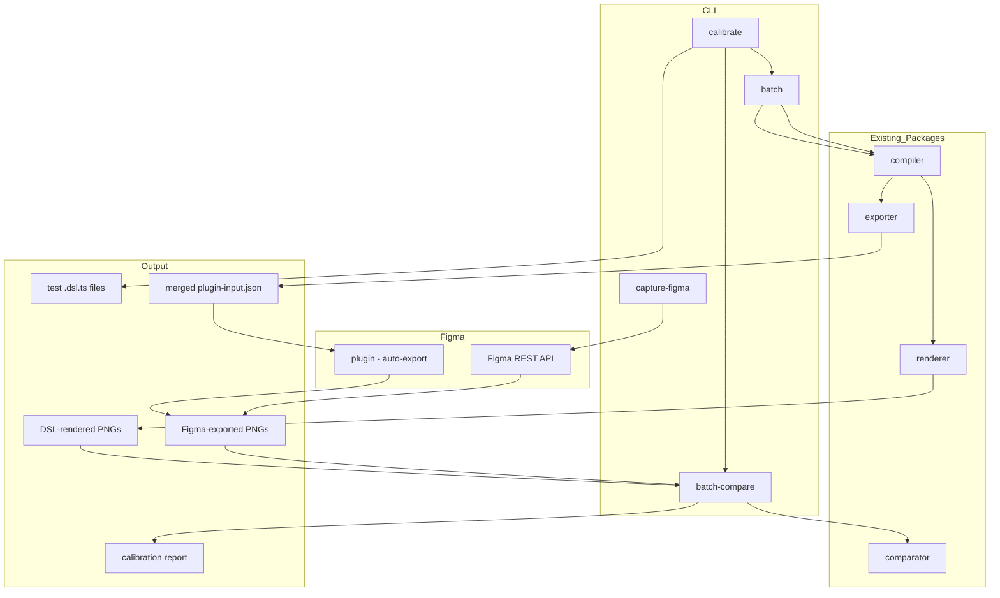
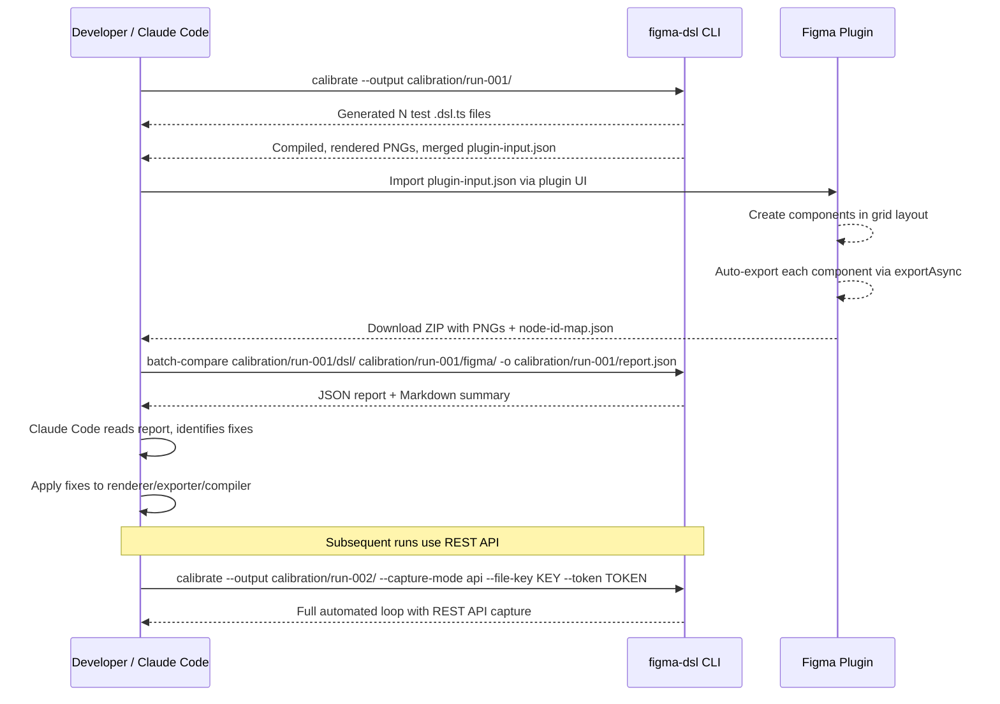
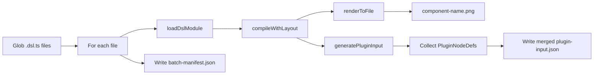

# Design Document — Calibration Workflow

## Overview

**Purpose**: This feature delivers a systematic calibration workflow for developers to identify and fix rendering discrepancies between the DSL renderer and Figma. It enables bulk test component generation, batch processing through the full pipeline (compile → render → export → plugin auto-export → compare), and structured reporting that Claude Code can parse and act upon.

**Users**: Developers using Claude Code during calibration sessions use this to iterate on rendering fidelity — generate test components, batch-process them, import to Figma (with automatic screenshot capture), compare results, and fix discrepancies in a tight feedback loop.

**Impact**: Extends the existing CLI with new commands (`calibrate`, `batch`, `batch-compare`, `capture-figma`) and enhances the Figma plugin with grid layout, progress reporting, and automatic PNG export via `exportAsync`.

### Goals

- Enable systematic detection of rendering differences across all DSL property categories
- Process dozens of test components in a single CLI invocation
- Eliminate manual Figma export by having the plugin auto-export screenshots after import
- Produce machine-readable reports that Claude Code can parse to identify and fix rendering bugs
- Track improvement across calibration iterations via timestamped output directories

### Non-Goals

- Real-time watch mode or incremental compilation
- Visual regression testing for React components (existing `pipeline` command covers this)
- Figma REST API OAuth flow management (user provides token manually)
- Automated plugin invocation (user triggers plugin import manually; the plugin handles export automatically)

## Architecture

### Existing Architecture Analysis

The existing CLI has a single-file command pattern: each command loads one `.dsl.ts` file, compiles it, and produces output. The Figma plugin already supports multiple components in a single `PluginInput.components` array with horizontal layout and emits a `componentIdMap` after import. The comparator operates on image pairs. The calibration workflow extends all of these without changing core APIs.

Key existing patterns preserved:
- Command dispatcher in `cli.ts` with `cmdXxx(args)` handlers
- `loadDslModule()` for dynamic ESM import of DSL files
- `initServices()` for one-time font/renderer initialization
- `PluginInput` / `PluginNodeDef` as the plugin interchange format
- `CompareResult` for image comparison output

### Architecture Pattern & Boundary Map



**Architecture Integration**:
- Selected pattern: Extension of existing CLI command dispatcher — each new command is a standalone async function
- Domain boundaries: Test generation, batch orchestration, and reporting are new concerns in the CLI package; no changes to compiler/renderer/comparator core APIs
- New components rationale: `TestSuiteGenerator` encapsulates property-category knowledge; `BatchProcessor` orchestrates multi-file pipeline; `CalibrationReporter` formats machine-readable output
- Steering compliance: TypeScript strict mode, no `any`, single-responsibility per command

### Technology Stack

| Layer | Choice / Version | Role in Feature | Notes |
|-------|------------------|-----------------|-------|
| CLI | Node.js `parseArgs`, `glob` (node:fs) | Command parsing, file discovery | Existing pattern |
| Rendering | @napi-rs/canvas (existing) | Per-component PNG rendering | No changes |
| Comparison | pixelmatch (existing) | Per-component image diff | No changes |
| Figma Capture | Figma REST API v1 | Automated PNG export from Figma | Optional; requires personal access token |
| Plugin | Figma Plugin API (existing) | Batch import + `exportAsync` for auto-export | Grid layout + auto-export additions |
| Report | JSON + Markdown | Machine-readable + human-readable output | New |

## System Flows

### Calibration Loop Flow



### Batch Processing Flow



## Requirements Traceability

| Requirement | Summary | Components | Interfaces | Flows |
|-------------|---------|------------|------------|-------|
| 1.1–1.5 | Test suite generation | TestSuiteGenerator | `generateTestSuite()` | — |
| 2.1–2.6 | Batch compile/render/export | BatchProcessor | `processBatch()` | Batch Processing |
| 3.1–3.4 | Plugin multi-component import | Plugin (grid layout + auto-export) | `PluginInput` (existing) | Calibration Loop |
| 4.1–4.4 | Figma screenshot capture | FigmaCapturer, Plugin auto-export | `captureFigmaImages()` | Calibration Loop |
| 5.1–5.6 | Batch comparison + report | CalibrationReporter | `generateReport()` | Calibration Loop |
| 6.1–6.5 | Calibration feedback loop | CalibrateOrchestrator | `runCalibration()` | Calibration Loop |
| 7.1–7.3 | Custom test extensibility | BatchProcessor | `--include` flag | Batch Processing |

## Components and Interfaces

| Component | Domain/Layer | Intent | Req Coverage | Key Dependencies | Contracts |
|-----------|-------------|--------|--------------|------------------|-----------|
| TestSuiteGenerator | CLI / Generation | Generate parameterized test .dsl.ts files | 1.1–1.5 | @figma-dsl/core (P0) | Service |
| BatchProcessor | CLI / Orchestration | Multi-file compile, render, export | 2.1–2.6, 7.1–7.3 | compiler, renderer, exporter (P0) | Service, Batch |
| FigmaCapturer | CLI / Integration | Fetch Figma-rendered PNGs via REST API | 4.1–4.4 | Figma REST API (P1) | Service |
| CalibrationReporter | CLI / Reporting | Generate comparison reports | 5.1–5.6, 6.1, 6.4 | comparator (P0) | Service |
| CalibrateOrchestrator | CLI / Orchestration | Run full calibration loop | 6.2–6.5 | BatchProcessor, FigmaCapturer, CalibrationReporter (P0) | Service |
| Plugin Grid Layout + Auto-Export | Plugin / UI | Arrange components in grid; export PNGs automatically | 3.1–3.4, 4.1 | Figma Plugin API (P0) | — |

### CLI / Generation

#### TestSuiteGenerator

| Field | Detail |
|-------|--------|
| Intent | Generate DSL test component files covering all rendering property categories |
| Requirements | 1.1, 1.2, 1.3, 1.4, 1.5 |

**Responsibilities & Constraints**
- Generate valid `.dsl.ts` source files using DSL factory function calls
- Organize output by property category subdirectories
- Each file exports a single `DslNode` via `export default`

**Dependencies**
- Outbound: @figma-dsl/core types — for generating valid DSL factory calls (P0)
- External: Node.js `fs` — file writing (P0)

**Contracts**: Service [x]

##### Service Interface

```typescript
type PropertyCategory =
  | 'corner-radius'
  | 'fills-solid'
  | 'fills-gradient'
  | 'strokes'
  | 'auto-layout-horizontal'
  | 'auto-layout-vertical'
  | 'auto-layout-nested'
  | 'typography'
  | 'opacity'
  | 'clip-content'
  | 'combined';

interface GenerateTestSuiteOptions {
  outputDir: string;
  properties?: PropertyCategory[];
}

interface GenerateTestSuiteResult {
  filesGenerated: number;
  categories: PropertyCategory[];
  filePaths: string[];
}

function generateTestSuite(options: GenerateTestSuiteOptions): GenerateTestSuiteResult;
```

- Preconditions: `outputDir` is a writable directory path
- Postconditions: All generated `.dsl.ts` files are syntactically valid and compile without errors
- Invariants: File names follow pattern `{category}-{variant}.dsl.ts`

### CLI / Orchestration

#### BatchProcessor

| Field | Detail |
|-------|--------|
| Intent | Process multiple DSL files through compile → render → export pipeline |
| Requirements | 2.1, 2.2, 2.3, 2.4, 2.5, 2.6, 7.1, 7.2, 7.3 |

**Responsibilities & Constraints**
- Discover `.dsl.ts` files via glob patterns or directory traversal
- Compile, render, and export each file independently
- Merge all exported `PluginNodeDef` arrays into a single `PluginInput`
- Continue processing on individual file failures
- Generate batch manifest including component name → node ID mapping placeholder

**Dependencies**
- Inbound: CLI command handler — invocation (P0)
- Outbound: compiler `compileWithLayout` — compilation (P0)
- Outbound: renderer `renderToFile` — PNG rendering (P0)
- Outbound: exporter `generatePluginInput` — Figma export (P0)

**Contracts**: Service [x] / Batch [x]

##### Service Interface

```typescript
interface BatchOptions {
  input: string;              // glob pattern or directory
  outputDir: string;
  include?: string[];         // additional glob patterns (7.3)
  pageName?: string;
  scale?: number;
}

interface BatchComponentResult {
  name: string;
  dslPath: string;
  pngPath: string | null;
  status: 'success' | 'error';
  error?: string;
  dimensions?: { width: number; height: number };
}

interface BatchResult {
  components: BatchComponentResult[];
  mergedPluginInputPath: string;
  manifestPath: string;
  successCount: number;
  errorCount: number;
}

function processBatch(options: BatchOptions): Promise<BatchResult>;
```

- Preconditions: At least one `.dsl.ts` file matches the input pattern
- Postconditions: `mergedPluginInputPath` contains valid `PluginInput` JSON with all successful components; `manifestPath` contains the full manifest
- Invariants: Failed components do not appear in the merged plugin input

##### Batch Manifest Schema

```typescript
interface BatchManifest {
  timestamp: string;          // ISO 8601
  inputPattern: string;
  outputDir: string;
  components: BatchComponentResult[];
  mergedPluginInput: string;  // relative path
  summary: {
    total: number;
    success: number;
    errors: number;
  };
}
```

### CLI / Integration

#### FigmaCapturer

| Field | Detail |
|-------|--------|
| Intent | Retrieve Figma-rendered PNGs via REST API using persisted node IDs |
| Requirements | 4.1, 4.2, 4.3, 4.4 |

**Responsibilities & Constraints**
- Use Figma REST API to export PNGs for specific node IDs
- Read node ID mapping from `node-id-map.json` (emitted by plugin) or accept via CLI flag
- Match Figma-exported images to DSL component names
- Save images with component-name-matching filenames

**Dependencies**
- External: Figma REST API `GET /v1/images/:file_key` — automated PNG export (P1)
- External: Node.js `fetch` — HTTP requests (P0)

**Contracts**: Service [x]

##### Service Interface

```typescript
interface FigmaCaptureOptions {
  outputDir: string;
  fileKey: string;
  token: string;
  nodeIdMap: Record<string, string>;  // componentName → nodeId
  scale?: number;
}

interface FigmaCaptureResult {
  capturedImages: Array<{
    componentName: string;
    imagePath: string;
    dimensions: { width: number; height: number };
  }>;
  missingComponents: string[];
}

function captureFigmaImages(options: FigmaCaptureOptions): Promise<FigmaCaptureResult>;
```

- Preconditions: `fileKey` and `token` are valid; `nodeIdMap` is non-empty
- Postconditions: Each captured image is saved as `{componentName}.png` in `outputDir`

### CLI / Reporting

#### CalibrationReporter

| Field | Detail |
|-------|--------|
| Intent | Compare DSL vs Figma PNGs in bulk and generate structured reports |
| Requirements | 5.1, 5.2, 5.3, 5.4, 5.5, 5.6, 6.1, 6.4 |

**Responsibilities & Constraints**
- Pair images by component name across two directories
- Run comparator on each pair
- Generate JSON report with per-component details
- Generate Markdown summary grouped by property category
- Report unpaired images

**Dependencies**
- Outbound: comparator `compareFiles` — per-pair comparison (P0)

**Contracts**: Service [x]

##### Service Interface

```typescript
interface BatchCompareOptions {
  dslDir: string;
  figmaDir: string;
  outputPath: string;         // JSON report path
  diffDir?: string;           // directory for diff images
  threshold?: number;         // similarity threshold (default 95)
}

interface ComponentCompareResult {
  componentName: string;
  propertyCategory: string;   // extracted from filename convention
  dslImagePath: string;
  figmaImagePath: string;
  diffImagePath: string | null;
  similarity: number;
  pass: boolean;
  dimensionMatch: boolean;
  dslDimensions: { width: number; height: number };
  figmaDimensions: { width: number; height: number };
}

interface BatchCompareReport {
  timestamp: string;
  threshold: number;
  results: ComponentCompareResult[];
  unpaired: {
    dslOnly: string[];
    figmaOnly: string[];
  };
  summary: {
    total: number;
    passed: number;
    failed: number;
    passRate: number;
    worstDiscrepancies: ComponentCompareResult[];  // top 5, sorted by similarity ascending
  };
  categoryBreakdown: Record<string, {
    total: number;
    passed: number;
    failed: number;
    avgSimilarity: number;
  }>;
}

function batchCompare(options: BatchCompareOptions): BatchCompareReport;

function formatReportMarkdown(report: BatchCompareReport): string;
```

- Preconditions: Both `dslDir` and `figmaDir` exist
- Postconditions: JSON report written to `outputPath`; diff images written to `diffDir`

### CLI / Orchestration

#### CalibrateOrchestrator

| Field | Detail |
|-------|--------|
| Intent | Orchestrate the full calibration loop with timestamped history |
| Requirements | 6.2, 6.3, 6.5 |

**Responsibilities & Constraints**
- Create timestamped run directory (e.g., `calibration/2026-03-14T120000/`)
- Generate test suite into the run directory (unless `--skip-generate` flag)
- Invoke BatchProcessor for DSL rendering + export
- If `--capture-mode api`: invoke FigmaCapturer with REST API
- If no capture mode: print instructions for plugin import and stop (user runs `batch-compare` separately after plugin export)
- Invoke CalibrationReporter for comparison (when Figma PNGs are available)
- Print structured summary to stdout
- Preserve all run artifacts for cross-iteration tracking

**Dependencies**
- Inbound: CLI command handler — invocation (P0)
- Outbound: TestSuiteGenerator — test generation (P0)
- Outbound: BatchProcessor — rendering + export (P0)
- Outbound: FigmaCapturer — REST API capture (P1)
- Outbound: CalibrationReporter — comparison + report (P0)

**Contracts**: Service [x]

##### Service Interface

```typescript
interface CalibrateOptions {
  outputDir: string;          // base dir; timestamped subdirs created
  properties?: PropertyCategory[];
  include?: string[];
  skipGenerate?: boolean;     // skip test suite generation
  captureMode?: 'api';       // omit for plugin-based workflow
  fileKey?: string;
  token?: string;
  nodeIdMapPath?: string;     // path to node-id-map.json from plugin
  threshold?: number;
}

interface CalibrateResult {
  runDir: string;             // timestamped directory path
  batch: BatchResult;
  report?: BatchCompareReport;  // present only when comparison was performed
}

function runCalibration(options: CalibrateOptions): Promise<CalibrateResult>;
```

- Preconditions: `outputDir` is writable
- Postconditions: All artifacts (PNGs, plugin JSON, report if applicable) saved in timestamped run directory

### Plugin / UI

#### Plugin Grid Layout + Auto-Export

| Field | Detail |
|-------|--------|
| Intent | Arrange batch-imported components in a grid and automatically export PNGs |
| Requirements | 3.1, 3.2, 3.3, 3.4, 4.1 |

**Implementation Notes**
- Replace current horizontal-only layout (`xOffset += size.x + 50`) with a grid: fixed number of columns (e.g., 5), row height = max component height in row + spacing
- Add `figma.ui.postMessage({ type: 'progress', current, total, name })` during the import loop
- After all components are created, iterate over created nodes and call `node.exportAsync({ format: 'PNG', constraint: { type: 'SCALE', value: 1 } })` on each
- Collect exported PNGs as `{ name: string, data: Uint8Array }[]` and a `nodeIdMap: Record<string, string>`
- Send results to plugin UI via `postMessage`; UI bundles them into a downloadable ZIP (or individual files) containing:
  - `figma/{componentName}.png` — one PNG per component
  - `node-id-map.json` — `Record<string, string>` mapping component name to Figma node ID
- Wrap individual `createNode` and `exportAsync` calls in try/catch; log errors and continue

## Data Models

### Domain Model

The calibration workflow introduces no persistent storage. All data is file-based:

- **Test Component** — a `.dsl.ts` source file in a property-category subdirectory
- **Batch Manifest** — JSON file tracking all processed components and their outputs
- **Calibration Report** — JSON file with per-component comparison results
- **Run Directory** — timestamped directory containing all artifacts from a single calibration run
- **Node ID Map** — JSON file mapping component names to Figma node IDs (emitted by plugin)

### Data Contracts

**Batch Manifest** — `batch-manifest.json` (schema defined in BatchProcessor above)

**Calibration Report** — `report.json` (schema defined in CalibrationReporter above)

**Merged Plugin Input** — `plugin-input.json` (existing `PluginInput` schema, unchanged)

**Node ID Map** — `node-id-map.json`:
```typescript
// Record<componentName, figmaNodeId>
// Example: { "corner-radius-zero": "123:456", "fills-solid-red": "123:457" }
type NodeIdMap = Record<string, string>;
```

**Property Category Convention**: Test component filenames follow `{category}-{variant}.dsl.ts` pattern. The category is extracted from the filename for report grouping. Categories: `corner-radius`, `fills-solid`, `fills-gradient`, `strokes`, `auto-layout-horizontal`, `auto-layout-vertical`, `auto-layout-nested`, `typography`, `opacity`, `clip-content`, `combined`.

## Error Handling

### Error Strategy

Fail-soft with comprehensive reporting. Individual component failures do not halt batch processing. All errors are collected and surfaced in the manifest and report.

### Error Categories and Responses

**Compilation Errors**: DSL syntax or type errors → logged in manifest with `status: 'error'`, component skipped in merged output.

**Rendering Errors**: Canvas failures → logged in manifest, no PNG produced, component excluded from comparison.

**Figma API Errors**: Rate limiting (429) → exponential backoff with 3 retries; auth errors (403) → abort with clear message; network errors → retry up to 3 times.

**Plugin Export Errors**: Individual `exportAsync` failures → logged, component skipped in export ZIP, continue with remaining components.

**Comparison Errors**: Dimension mismatch → comparison still runs (resized); missing pair → reported as "unpaired".

## Testing Strategy

### Unit Tests

- `TestSuiteGenerator`: Verify generated `.dsl.ts` files compile without errors for each property category
- `CalibrationReporter`: Verify report JSON schema, category grouping, unpaired detection, and severity sorting
- `BatchProcessor`: Verify manifest schema, error continuation, and merged plugin input correctness

### Integration Tests

- End-to-end batch: `calibrate` → verify PNGs and merged JSON are produced
- Batch compare with known-good and known-bad image pairs → verify report accuracy
- CLI command parsing: verify all new commands accept documented flags and produce correct exit codes

### E2E Tests

- Full calibration loop with pre-captured Figma PNGs as fixtures (simulating plugin auto-export output)
