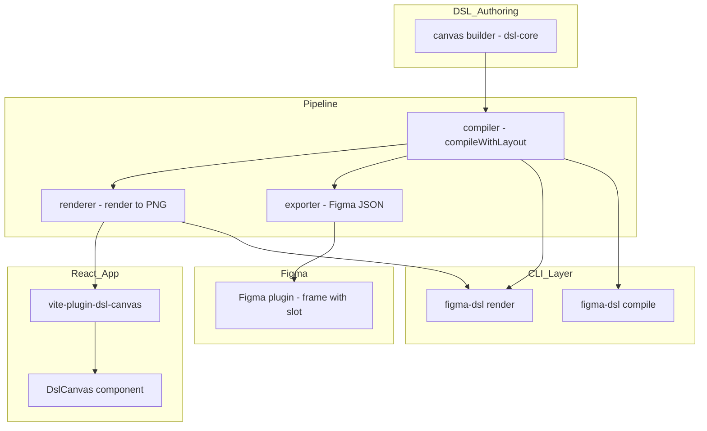
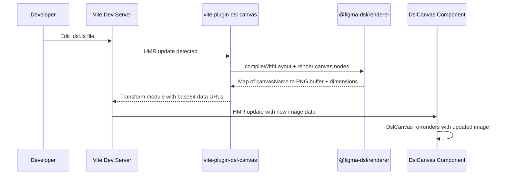
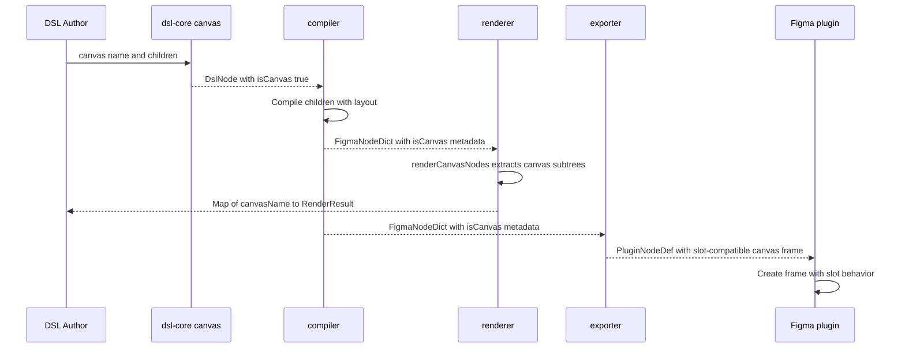
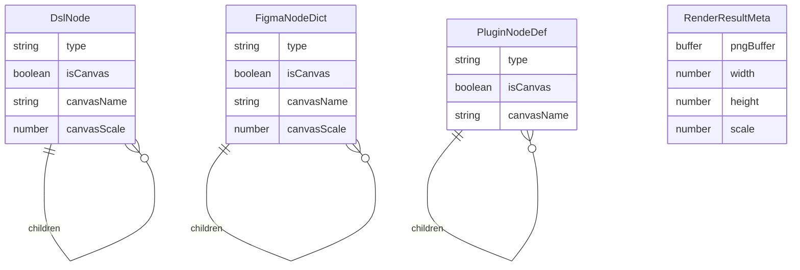

# Technical Design: canvas-component

## Overview

**Purpose**: The DslCanvas feature delivers pixel-perfect visual consistency between Figma and React by rendering DSL content as images rather than converting to HTML/CSS. Designers place arbitrary content in canvas slots in Figma; the DSL pipeline compiles and renders that content to identical PNGs in both environments.

**Users**: Developers use `<DslCanvas>` in React to embed image-rendered DSL regions. DSL authors use the `canvas()` builder to declare canvas regions. Designers interact with canvas frames as standard Figma slots.

**Impact**: Extends the existing slot system with a new rendering mode. Adds a Vite plugin for server-side rendering in the preview app. No breaking changes to existing slot behavior.

### Goals
- Enable DSL content to render as images in React, bypassing HTML/CSS divergence
- Maintain fixed aspect ratio for all canvas-rendered content
- Reuse existing renderer package without modification for rendering logic
- Seamless integration with Figma's slot workflow for designers

### Non-Goals
- Browser-side Canvas 2D re-implementation of the renderer
- Runtime DSL compilation in the browser (compilation remains Node-side)
- Replacing existing HTML/CSS components — DslCanvas complements them for specific regions
- Interactive content inside canvas regions (images are static)

## Architecture

### Existing Architecture Analysis

The current pipeline flows: DSL definition → compile (with layout) → render to PNG / export to Figma JSON → Figma plugin import. Slots are FRAME nodes annotated with `isSlot: true` metadata that passes through each stage unchanged. The renderer uses @napi-rs/canvas (Node-native) and cannot run in browser.

Key patterns preserved:
- Metadata annotation on FRAME nodes (slot pattern)
- Typed passthrough across compiler → exporter → plugin
- CLI orchestration of pipeline stages
- CSS Modules + design tokens in preview app

### Architecture Pattern & Boundary Map



**Architecture Integration**:
- Selected pattern: Metadata-annotated FRAME nodes (extends slot pattern)
- Domain boundaries: dsl-core owns types/builders, compiler owns validation/layout, renderer owns PNG output, Vite plugin owns browser-server bridge
- New components: `canvas()` builder (dsl-core), `renderCanvasNodes()` utility (renderer), `vite-plugin-dsl-canvas` (preview), `DslCanvas` React component (preview)
- Steering compliance: No framework bloat, CSS Modules, TypeScript strict mode, single-responsibility packages

### Technology Stack

| Layer | Choice / Version | Role in Feature | Notes |
|-------|------------------|-----------------|-------|
| DSL Core | @figma-dsl/dsl-core | CanvasProps type, canvas() builder | Extends existing types.ts and nodes.ts |
| Compiler | @figma-dsl/compiler | Canvas metadata passthrough, validation | No new dependencies |
| Renderer | @figma-dsl/renderer + @napi-rs/canvas | PNG rendering of canvas subtrees | Existing renderer, new utility function |
| Preview | Vite 8 + custom plugin | Dev server middleware for server-side rendering | New vite-plugin-dsl-canvas |
| React | React 19 | DslCanvas component | CSS Modules for styling |
| Figma | Figma Plugin API | Canvas frames as slot-compatible frames | Extends existing plugin code |

## System Flows

### DslCanvas Rendering Flow (Dev Server)



### Canvas Node Pipeline Flow



## Requirements Traceability

| Requirement | Summary | Components | Interfaces | Flows |
|-------------|---------|------------|------------|-------|
| 1.1 | DslCanvas accepts dsl prop, renders as img | DslCanvas | DslCanvasProps | Dev Server Flow |
| 1.2 | Fixed aspect ratio from rendered dimensions | DslCanvas | DslCanvasProps, RenderResultMeta | Dev Server Flow |
| 1.3 | Width prop auto-calculates height | DslCanvas | DslCanvasProps | — |
| 1.4 | Scale prop for high-DPI | DslCanvas, vite-plugin | DslCanvasProps, CanvasRenderRequest | Dev Server Flow |
| 1.5 | Re-render on dsl prop change | DslCanvas, vite-plugin | — | Dev Server Flow |
| 1.6 | Placeholder during rendering | DslCanvas | DslCanvasProps | — |
| 1.7 | Fallback on invalid DSL | DslCanvas | — | — |
| 1.8 | className and style props | DslCanvas | DslCanvasProps | — |
| 2.1 | canvas() builder creates FRAME with isCanvas | canvas() builder | CanvasProps, DslNode | Pipeline Flow |
| 2.2 | Same layout properties as slot() plus scale | canvas() builder | CanvasProps | — |
| 2.3 | Canvas accepts children array | canvas() builder | CanvasProps | Pipeline Flow |
| 2.4 | Canvas valid outside COMPONENT | compiler | — | Pipeline Flow |
| 2.5 | CanvasProps type exported | dsl-core | CanvasProps | — |
| 3.1 | Compile children with standard pipeline | compiler | FigmaNodeDict | Pipeline Flow |
| 3.2 | Preserve isCanvas/canvasName metadata | compiler | FigmaNodeDict | Pipeline Flow |
| 3.3 | Preserve scale property | compiler | FigmaNodeDict | — |
| 3.4 | Nested slots in canvas compiled normally | compiler | — | — |
| 4.1 | Render canvas subtree to standalone PNG | renderCanvasNodes | RenderResult | Pipeline Flow |
| 4.2 | Scale property applied to rendering | renderCanvasNodes | RenderResult | — |
| 4.3 | renderCanvasNodes utility exported | renderer | renderCanvasNodes | Pipeline Flow |
| 4.4 | Identical output standalone vs full-tree | renderer | — | — |
| 5.1 | Exporter encodes canvas as slot-compatible | exporter | PluginNodeDef | Pipeline Flow |
| 5.2 | Plugin creates canvas as frames with slots | plugin | PluginNodeDef | Pipeline Flow |
| 5.3 | Changeset captures canvas content changes | changeset pipeline | — | — |
| 6.1 | Slot overrides for canvas marked for canvas rendering | compiler | FigmaNodeDict | — |
| 6.2 | DslCanvas accepts slot override content | DslCanvas | DslCanvasProps | — |
| 6.3 | Mixed regular and canvas slots handled | pipeline | — | — |
| 7.1 | CLI render produces per-canvas PNGs | CLI render command | — | — |
| 7.2 | CLI compile includes canvas metadata | CLI compile command | — | — |
| 7.3 | CLI batch processes canvas nodes | CLI batch command | — | — |
| 8.1 | DslCanvas importable from preview app | DslCanvas | — | — |
| 8.2 | HMR re-renders on DSL file change | vite-plugin | — | Dev Server Flow |
| 8.3 | Works with CSS Modules and tokens | DslCanvas | — | — |

## Components and Interfaces

| Component | Domain/Layer | Intent | Req Coverage | Key Dependencies | Contracts |
|-----------|--------------|--------|--------------|------------------|-----------|
| canvas() builder | dsl-core | Create FRAME nodes with canvas metadata | 2.1-2.5 | DslNode types (P0) | Service |
| Compiler canvas passthrough | compiler | Validate and preserve canvas metadata | 3.1-3.4, 6.1 | dsl-core types (P0) | Service |
| renderCanvasNodes() | renderer | Extract and render canvas subtrees independently | 4.1-4.4 | @napi-rs/canvas (P0), compiler types (P0) | Service |
| Exporter canvas encoding | exporter | Encode canvas metadata in Figma plugin format | 5.1 | PluginNodeDef (P0) | Service |
| Plugin canvas creation | plugin | Create canvas frames with slot behavior in Figma | 5.2-5.3 | Figma Plugin API (P0) | Service |
| vite-plugin-dsl-canvas | preview/plugins | Dev server middleware + build-time rendering | 8.2, 1.4-1.5 | @figma-dsl/renderer (P0), @figma-dsl/compiler (P0) | Service |
| DslCanvas | preview/components | Display DSL-rendered images with fixed aspect ratio | 1.1-1.8, 6.2, 8.1, 8.3 | vite-plugin (P0) | State |

### DSL Core Layer

#### canvas() Builder

| Field | Detail |
|-------|--------|
| Intent | Create FRAME-type DslNode with canvas metadata for image rendering |
| Requirements | 2.1, 2.2, 2.3, 2.4, 2.5 |

**Responsibilities & Constraints**
- Create DslNode with `type: 'FRAME'`, `isCanvas: true`, `canvasName` set from name parameter
- Validate name is non-empty (throw Error like slot())
- Accept children as DslNode array representing canvas content
- A node cannot be both `isSlot: true` and `isCanvas: true`

**Dependencies**
- Inbound: DSL authors — call canvas() in .dsl.ts files (P0)
- Outbound: DslNode, CanvasProps — type definitions in types.ts (P0)

**Contracts**: Service [x]

##### Service Interface

```typescript
interface CanvasProps {
  /** Canvas content dimensions */
  size?: { x: number; y: number };
  /** Auto-layout configuration */
  autoLayout?: AutoLayout;
  /** Background fills */
  fills?: Fill[];
  /** Corner radius */
  cornerRadius?: number;
  /** Horizontal sizing behavior */
  layoutSizingHorizontal?: 'FIXED' | 'HUG' | 'FILL';
  /** Vertical sizing behavior */
  layoutSizingVertical?: 'FIXED' | 'HUG' | 'FILL';
  /** Render scale factor for high-DPI output */
  scale?: number;
  /** Child nodes to render as image content */
  children?: DslNode[];
}

function canvas(name: string, props?: CanvasProps): DslNode;
```

- Preconditions: `name` is non-empty string
- Postconditions: Returns DslNode with `isCanvas: true`, `canvasName: name`, children populated
- Invariants: `isSlot` and `isCanvas` are mutually exclusive on a single node

**Implementation Notes**
- Follow slot() builder pattern in nodes.ts (lines 187-207)
- Add CanvasProps to types.ts after SlotProps (line 300)
- Add `isCanvas?: boolean`, `canvasName?: string`, `canvasScale?: number` to DslNode interface
- Export canvas() and CanvasProps from dsl-core index.ts

---

### Compiler Layer

#### Compiler Canvas Passthrough

| Field | Detail |
|-------|--------|
| Intent | Preserve canvas metadata through compilation, validate canvas-slot exclusivity |
| Requirements | 3.1, 3.2, 3.3, 3.4, 6.1 |

**Responsibilities & Constraints**
- Pass `isCanvas`, `canvasName`, `canvasScale` through to FigmaNodeDict output
- Compile canvas children using standard layout resolution (same as any FRAME)
- Do NOT restrict canvas nodes to COMPONENT context (unlike slots)
- Emit compile error if node has both `isSlot` and `isCanvas`
- When slot override targets a canvas-typed slot, mark override children for canvas rendering

**Dependencies**
- Inbound: DslNode with `isCanvas: true` — from dsl-core (P0)
- Outbound: FigmaNodeDict with `isCanvas: true` — consumed by renderer, exporter (P0)

**Contracts**: Service [x]

##### Service Interface

```typescript
// Additions to FigmaNodeDict (compiler/src/types.ts)
interface FigmaNodeDict {
  // ... existing fields ...

  /** Canvas metadata */
  isCanvas?: boolean;
  canvasName?: string;
  canvasScale?: number;
}
```

- Preconditions: Input DslNode is valid (passes existing validation)
- Postconditions: Canvas metadata preserved on compiled output; children compiled with layout
- Invariants: No node in output has both `isSlot: true` and `isCanvas: true`

**Implementation Notes**
- Add canvas passthrough block after slot passthrough (compiler.ts line 274)
- Add mutual exclusivity validation: emit CompileError when `node.isSlot && node.isCanvas`
- Canvas children compile as standard FRAME children (no special handling needed)
- Add `isCanvas`, `canvasName`, `canvasScale` to FigmaNodeDict in compiler/src/types.ts

---

### Renderer Layer

#### renderCanvasNodes() Utility

| Field | Detail |
|-------|--------|
| Intent | Extract all canvas-annotated subtrees from compiled tree and render each to standalone PNG |
| Requirements | 4.1, 4.2, 4.3, 4.4 |

**Responsibilities & Constraints**
- Walk compiled FigmaNodeDict tree, find all nodes with `isCanvas: true`
- Render each canvas subtree independently using existing `render()` function
- Apply `canvasScale` to render options when present
- Return Map keyed by `canvasName` with RenderResult values (pngBuffer, width, height)
- Rendering output must be identical to rendering same subtree as top-level node

**Dependencies**
- Inbound: FigmaNodeDict tree — from compiler (P0)
- Outbound: render() — existing renderer function (P0)
- External: @napi-rs/canvas — PNG rendering (P0)

**Contracts**: Service [x]

##### Service Interface

```typescript
interface RenderResultMeta extends RenderResult {
  /** Intrinsic width of rendered image */
  width: number;
  /** Intrinsic height of rendered image */
  height: number;
  /** Scale factor used for rendering */
  scale: number;
}

/**
 * Extract all canvas nodes from a compiled tree and render each independently.
 * Returns Map keyed by canvasName.
 */
function renderCanvasNodes(
  root: FigmaNodeDict,
  options?: Partial<RenderOptions>
): Map<string, RenderResultMeta>;
```

- Preconditions: `root` is a valid compiled FigmaNodeDict
- Postconditions: Every node with `isCanvas: true` in the tree has a corresponding entry in the returned Map
- Invariants: Render output for a canvas subtree is identical whether called via `renderCanvasNodes()` or `render()` directly

**Implementation Notes**
- Implement in renderer/src/canvas-renderer.ts (new file, single responsibility)
- Export from renderer/src/index.ts
- Use recursive tree walker to collect canvas nodes
- Call existing `render()` for each extracted subtree with `{ scale: node.canvasScale ?? options?.scale ?? 1 }`

---

### Preview App Layer

#### vite-plugin-dsl-canvas

| Field | Detail |
|-------|--------|
| Intent | Bridge browser DslCanvas component with Node-side renderer via Vite dev server and build-time transform |
| Requirements | 8.2, 1.4, 1.5 |

**Responsibilities & Constraints**
- Dev mode: Register Vite dev server middleware endpoint (POST `/api/dsl-canvas/render`) that accepts FigmaNodeDict JSON and returns base64 PNG with dimensions
- Build mode: Transform `.dsl.ts` imports to pre-rendered image modules containing base64 data URLs
- Cache rendered results keyed by content hash; invalidate on file change
- Trigger HMR when source .dsl.ts files change

**Dependencies**
- Inbound: DslCanvas component — fetches rendered images (P0)
- Outbound: @figma-dsl/compiler — compileWithLayout (P0)
- Outbound: @figma-dsl/renderer — render, renderCanvasNodes (P0)
- External: Vite Plugin API — configureServer, transform hooks (P0)

**Contracts**: Service [x]

##### Service Interface

```typescript
interface CanvasRenderRequest {
  /** Compiled DSL JSON to render */
  dsl: FigmaNodeDict;
  /** Render scale factor */
  scale?: number;
}

interface CanvasRenderResponse {
  /** Base64-encoded PNG data URL */
  dataUrl: string;
  /** Intrinsic width in pixels */
  width: number;
  /** Intrinsic height in pixels */
  height: number;
}

/** Vite plugin factory */
function dslCanvasPlugin(): VitePlugin;
```

- Preconditions: @figma-dsl/renderer is initialized with fonts
- Postconditions: DslCanvas components receive rendered PNG data with correct dimensions
- Invariants: Rendered output is identical to CLI `figma-dsl render` output for same input

**Implementation Notes**
- Create as preview/plugins/vite-plugin-dsl-canvas.ts (colocated with preview app)
- Use `configureServer()` to add POST endpoint in dev mode
- Use content hash (JSON.stringify → SHA-256) for render cache
- Return `{ dataUrl, width, height }` so DslCanvas can set aspect ratio

---

#### DslCanvas React Component

| Field | Detail |
|-------|--------|
| Intent | Display DSL-rendered images with fixed aspect ratio and responsive sizing |
| Requirements | 1.1, 1.2, 1.3, 1.4, 1.5, 1.6, 1.7, 1.8, 6.2, 8.1, 8.3 |

**Responsibilities & Constraints**
- Accept `dsl` prop (FigmaNodeDict) and render as `` element
- Maintain fixed aspect ratio from rendered image dimensions using CSS `aspect-ratio`
- Accept optional `width` prop; auto-calculate height from aspect ratio
- Accept optional `scale` prop (default: 1) passed to rendering request
- Show previous image or placeholder while re-rendering
- Show fallback on invalid/empty DSL
- Accept `className` and `style` props for layout integration

**Dependencies**
- Inbound: Parent components — provide dsl prop (P0)
- Outbound: vite-plugin-dsl-canvas — POST endpoint for rendering (P0)

**Contracts**: State [x]

##### State Management

```typescript
interface DslCanvasProps {
  /** Compiled DSL JSON to render */
  dsl: FigmaNodeDict;
  /** Display width in pixels; height auto-calculated from aspect ratio */
  width?: number;
  /** Render scale factor for high-DPI (default: 1) */
  scale?: number;
  /** CSS class name for layout integration */
  className?: string;
  /** Inline styles for layout integration */
  style?: React.CSSProperties;
  /** Alt text for accessibility */
  alt?: string;
}

interface DslCanvasState {
  /** Current rendered image data URL */
  dataUrl: string | null;
  /** Intrinsic dimensions from render result */
  intrinsicWidth: number;
  intrinsicHeight: number;
  /** Loading state */
  isRendering: boolean;
  /** Error state */
  error: string | null;
}
```

- State model: `useState` for dataUrl, dimensions, loading, error; `useEffect` triggers render on dsl/scale change
- Persistence: None (derived from props on each render)
- Concurrency: Abort previous render request when dsl prop changes (AbortController)

**Implementation Notes**
- Create as preview/src/components/DslCanvas/DslCanvas.tsx with DslCanvas.module.css
- Use `fetch('/api/dsl-canvas/render', { method: 'POST', body: JSON.stringify({ dsl, scale }) })` in dev mode
- CSS: `aspect-ratio: var(--dsl-canvas-ratio)` set via inline style from render dimensions
- Fallback: gray placeholder with "DslCanvas" label when error or no data
- Memoize render request with `useMemo` on serialized dsl to avoid redundant fetches

---

### Exporter Layer

#### Exporter Canvas Encoding

| Field | Detail |
|-------|--------|
| Intent | Encode canvas metadata in Figma plugin JSON format as slot-compatible frames |
| Requirements | 5.1 |

**Responsibilities & Constraints**
- When `isCanvas: true`, set `isCanvas`, `canvasName` on PluginNodeDef output
- Encode canvas as slot-compatible frame so Figma plugin creates it with slot behavior
- Preserve children for Figma rendering

**Dependencies**
- Inbound: FigmaNodeDict with `isCanvas: true` — from compiler (P0)
- Outbound: PluginNodeDef — consumed by Figma plugin (P0)

**Contracts**: Service [x]

##### Service Interface

```typescript
// Additions to PluginNodeDef (dsl-core/src/plugin-types.ts)
interface PluginNodeDef {
  // ... existing fields ...

  /** Canvas metadata */
  readonly isCanvas?: boolean;
  readonly canvasName?: string;
}
```

**Implementation Notes**
- Add canvas metadata block after slot metadata block in exporter.ts convertToPluginNode() (line 197)
- Set `result.isSlot = true` alongside `result.isCanvas = true` so Figma plugin treats it as a slot frame
- Add canvas fields to PluginNodeDef in plugin-types.ts

---

### Plugin Layer

#### Plugin Canvas Frame Creation

| Field | Detail |
|-------|--------|
| Intent | Create canvas frames in Figma with slot behavior |
| Requirements | 5.2, 5.3 |

**Responsibilities & Constraints**
- Create canvas nodes as standard frames (slot behavior) in Figma
- Store canvas metadata in plugin data for round-trip identification
- Support changeset export when designer modifies canvas frame content

**Dependencies**
- Inbound: PluginNodeDef with `isCanvas: true` — from exporter (P0)
- External: Figma Plugin API — frame creation, plugin data storage (P0)

**Contracts**: Service [x]

**Implementation Notes**
- Canvas frames created as regular frames with slot plugin data — existing slot creation code handles this
- Add `PLUGIN_DATA_CANVAS = 'dsl-canvas'` constant for canvas-specific metadata
- Store `{ isCanvas: true, canvasName }` as plugin data on created frame
- Changeset detection uses existing slot content change tracking

---

### CLI Layer

#### CLI Canvas Support

| Field | Detail |
|-------|--------|
| Intent | Produce per-canvas PNGs and include canvas metadata in CLI output |
| Requirements | 7.1, 7.2, 7.3 |

**Implementation Notes**
- `cmdRender()`: After full-tree render, call `renderCanvasNodes()` and write each result as `{output-dir}/{canvasName}.png`
- `cmdCompile()`: No changes needed — canvas metadata flows through compiler output automatically
- `cmdBatch()`: Existing batch logic calls cmdRender per file — canvas PNG output inherits automatically
- Add `--no-canvas` flag to skip per-canvas PNG extraction (opt-out)

## Data Models

### Domain Model



Canvas metadata flows as annotations on existing node structures. No new aggregates or storage required.

### Data Contracts & Integration

**Vite Plugin API**:
- Request: `POST /api/dsl-canvas/render` with `CanvasRenderRequest` JSON body
- Response: `CanvasRenderResponse` JSON with base64 data URL and dimensions
- Errors: 400 (invalid DSL), 500 (render failure)

## Error Handling

### Error Categories and Responses

**DSL Authoring Errors (compile-time)**:
- Empty canvas name → throw Error in canvas() builder (matches slot() pattern)
- Both isSlot and isCanvas on same node → CompileError with descriptive message
- Invalid children → standard compiler validation

**Rendering Errors (runtime)**:
- Invalid FigmaNodeDict → renderCanvasNodes() skips invalid canvas nodes, logs warning
- @napi-rs/canvas failure → error propagated to caller

**DslCanvas Component Errors (browser)**:
- Render endpoint failure → DslCanvas shows fallback placeholder, sets error state
- Invalid dsl prop → DslCanvas shows empty state, does not crash
- Aborted request (prop changed during render) → silently discarded

## Testing Strategy

### Unit Tests
- `canvas()` builder: creates correct DslNode structure, validates name, supports all CanvasProps fields
- Compiler passthrough: isCanvas/canvasName/canvasScale preserved on output
- Compiler validation: mutual exclusivity of isSlot and isCanvas
- `renderCanvasNodes()`: extracts canvas nodes, renders each, returns correct Map

### Integration Tests
- Full pipeline: canvas() → compileWithLayout → renderCanvasNodes → PNG output matches expected
- Exporter: canvas metadata encoded correctly in PluginNodeDef format
- CLI render: produces per-canvas PNG files alongside full-tree render

### E2E Tests
- DslCanvas component: renders image from dsl prop, updates on prop change, shows placeholder during load
- Vite plugin: dev server endpoint returns correct PNG data, HMR triggers re-render
- Fixed aspect ratio: DslCanvas maintains correct proportions with width prop
