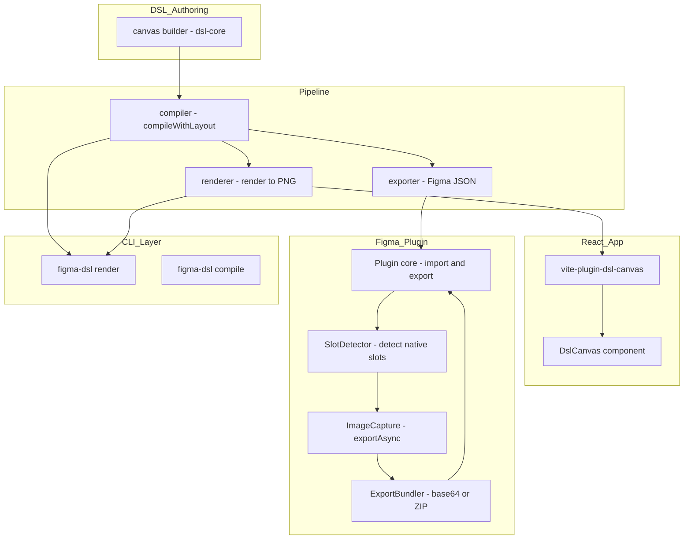
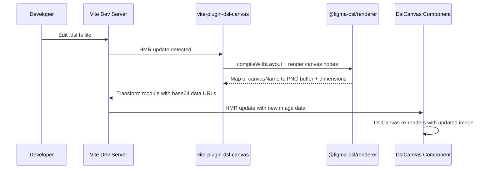
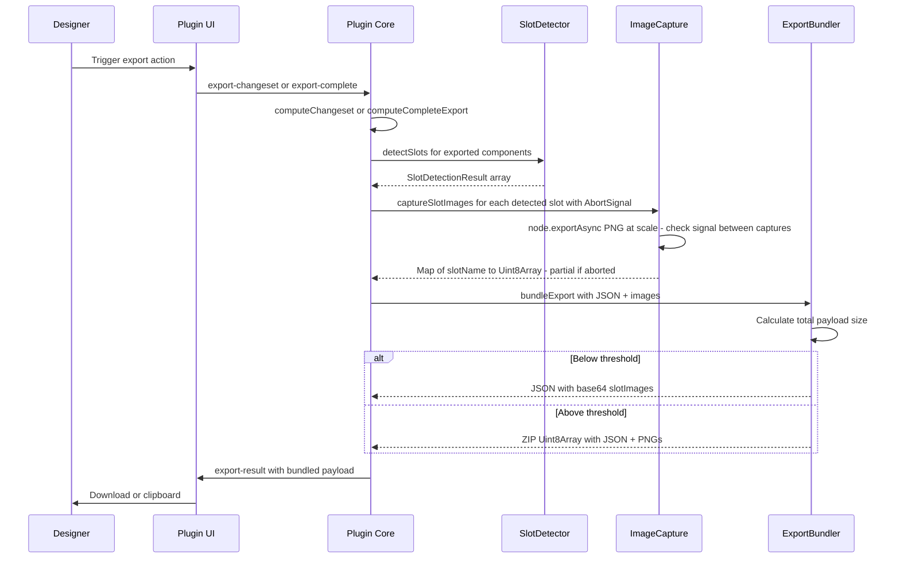
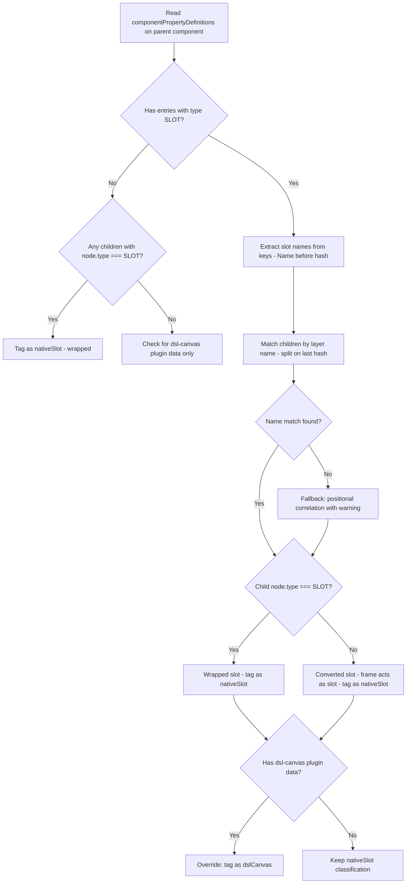
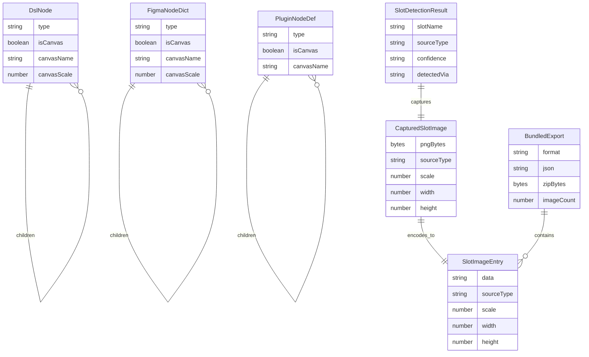

# Technical Design: canvas-component

## Overview

**Purpose**: This feature delivers pixel-perfect visual consistency between Figma and React through two complementary mechanisms: (1) DslCanvas — a custom component that renders DSL content as images via `@figma-dsl/renderer`, and (2) Figma Native Slot Detection — automatic image capture of designer-created slot content via the Figma Plugin API's `exportAsync`. Both mechanisms produce image-based output bundled into a unified export package.

**Users**: Developers use `<DslCanvas>` in React for DSL-authored image regions. Designers interact with both DslCanvas frames and native Figma Slots. Pipeline maintainers configure export settings and manage the dual rendering paths.

**Impact**: Extends the existing slot system with canvas rendering mode. Adds native slot detection to the Figma plugin. Introduces unified image bundling in the export flow. No breaking changes to existing behavior.

### Goals
- Render DSL content as images in React, bypassing HTML/CSS divergence
- Detect Figma native Slots and capture their content as pixel-perfect images via `exportAsync`
- Bundle all captured images (DslCanvas + native slots) into a single export package
- Maintain dual rendering paths: `@figma-dsl/renderer` for DslCanvas, `exportAsync` for native slots

### Non-Goals
- Programmatic creation of Figma Slots (no public API available)
- Browser-side Canvas 2D re-implementation of the renderer
- Runtime DSL compilation in the browser
- Replacing existing HTML/CSS components
- Interactive content inside canvas/slot image regions

### Known Limitations
- **Native Slot round-trip**: Components imported via the plugin that originally contained Figma native Slots (`type: "SLOT"`) will lose their slot semantics on re-import. There is no public Figma Plugin API to programmatically create or define Slots — `exportAsync` captures the visual content as images, but slot behavior cannot be restored. The plugin preserves slot content and stores slot metadata in `pluginData` for potential future use if the API becomes available. This limitation affects only the re-import path; initial export and image capture work correctly.
- **`componentPropertyDefinitions` key format**: The `"{LayerName}#{N}:{M}"` key format used for slot detection is an internal Figma convention, not a documented stable API contract. Layer names containing `#` may cause incorrect parsing. If a designer renames a slot layer after creation, the property key may not update, causing a match failure. The SlotDetector includes fallback logic (see below) to mitigate this.

## Architecture

### Existing Architecture Analysis

The current pipeline flows: DSL definition → compile (with layout) → render to PNG / export to Figma JSON → Figma plugin import. Slots are FRAME nodes annotated with `isSlot: true` metadata. The renderer uses @napi-rs/canvas (Node-native). The plugin exports via `computeChangeset()` and `computeCompleteExport()`, with base64 image embedding already proven for changeset image data.

Key constraints:
- Figma has **two** slot creation methods with different serialization behaviors (confirmed via real export data):
  - **"Wrap in new slot"**: Creates a `type: "SLOT"` node wrapping original content. SLOT nodes have frame-like properties but no auto-layout.
  - **"Convert to slot"**: Keeps `type: "FRAME"` unchanged — the frame retains all properties including auto-layout. Only `componentPropertyDefinitions` gets a new SLOT entry.
- `componentPropertyDefinitions` gets a `"{Name}#N:M": { "type": "SLOT" }` entry for **both** creation methods — this is the only universal detection signal
- The serializer captures `node.type` as-is, so `"SLOT"` nodes flow through naturally but converted frames remain `"FRAME"`
- Plugin sandbox has no Node.js APIs — ZIP generation requires pure JS library

### Architecture Pattern & Boundary Map



**Architecture Integration**:
- Selected pattern: Metadata-annotated FRAME nodes for DslCanvas (extends slot pattern); post-export image capture for native slots
- Domain boundaries: dsl-core owns types/builders, compiler owns validation/layout, renderer owns PNG output, plugin owns slot detection + image capture + bundling, Vite plugin owns browser-server bridge
- New components: `SlotDetector` (plugin), `ImageCapture` (plugin), `ExportBundler` (plugin) — plus existing DslCanvas components from prior design
- Steering compliance: No framework bloat, CSS Modules, TypeScript strict mode, single-responsibility modules

### Technology Stack

| Layer | Choice / Version | Role in Feature | Notes |
|-------|------------------|-----------------|-------|
| DSL Core | @figma-dsl/dsl-core | CanvasProps type, canvas() builder, SlotImageMap type | Extends types.ts and nodes.ts |
| Compiler | @figma-dsl/compiler | Canvas metadata passthrough, validation | No new dependencies |
| Renderer | @figma-dsl/renderer + @napi-rs/canvas | PNG rendering of canvas subtrees | New renderCanvasNodes utility |
| Preview | Vite 8 + custom plugin | Dev server middleware for server-side rendering | New vite-plugin-dsl-canvas |
| React | React 19 | DslCanvas component | CSS Modules for styling |
| Figma Plugin | Figma Plugin API + fflate | Slot detection, image capture, ZIP packaging | fflate ~8KB for ZIP support |
| CLI | @figma-dsl/cli | Per-canvas PNG extraction, batch processing | Extends existing commands |

## System Flows

### DslCanvas Rendering Flow (Dev Server)



### Unified Export with Image Bundling Flow



### Slot Detection Flow



Real Figma export data reveals two distinct slot creation methods:
- **"Wrap in new slot"**: Creates `type: "SLOT"` node wrapping the original content as a child
- **"Convert to slot"**: Frame keeps `type: "FRAME"` unchanged — only `componentPropertyDefinitions` gets a SLOT entry (e.g., `"Footer#1:3": { "type": "SLOT" }`)

`componentPropertyDefinitions` is the only universal detection method that catches both cases.

## Requirements Traceability

| Requirement | Summary | Components | Interfaces | Flows |
|-------------|---------|------------|------------|-------|
| 1.1-1.8 | DslCanvas React component | DslCanvas | DslCanvasProps | Dev Server Flow |
| 2.1-2.5 | canvas() builder in dsl-core | canvas() builder | CanvasProps | Pipeline Flow |
| 3.1-3.4 | Compiler canvas passthrough | Compiler | FigmaNodeDict | Pipeline Flow |
| 4.1-4.4 | Renderer canvas extraction | renderCanvasNodes | RenderResultMeta | Pipeline Flow |
| 5.1-5.4 | Plugin DslCanvas frame handling | Plugin core, Exporter | PluginNodeDef | Pipeline Flow |
| 6.1-6.3 | DslCanvas-Slot interop | Compiler, DslCanvas | FigmaNodeDict | — |
| 7.1-7.3 | CLI canvas support | CLI commands | — | — |
| 8.1-8.3 | Preview app integration | DslCanvas, vite-plugin | — | Dev Server Flow |
| 9.1-9.6 | Figma native slot detection | SlotDetector | SlotDetectionResult | Slot Detection Flow |
| 10.1-10.7 | Unified export with image bundling | ImageCapture, ExportBundler | SlotImageMap, BundledExport | Export Bundling Flow |
| 11.1-11.5 | Dual rendering path coexistence | DslCanvas, renderCanvasNodes | SlotImageMap | — |

## Components and Interfaces

| Component | Domain/Layer | Intent | Req Coverage | Key Dependencies | Contracts |
|-----------|--------------|--------|--------------|------------------|-----------|
| canvas() builder | dsl-core | Create FRAME nodes with canvas metadata | 2.1-2.5 | DslNode types (P0) | Service |
| Compiler canvas passthrough | compiler | Validate and preserve canvas metadata | 3.1-3.4, 6.1 | dsl-core types (P0) | Service |
| renderCanvasNodes() | renderer | Extract and render canvas subtrees | 4.1-4.4 | @napi-rs/canvas (P0) | Service |
| Exporter canvas encoding | exporter | Encode canvas metadata in plugin format | 5.1 | PluginNodeDef (P0) | Service |
| Plugin DslCanvas creation | plugin | Create DslCanvas frames in Figma | 5.2-5.4 | Figma Plugin API (P0) | Service |
| SlotDetector | plugin | Detect native slots and DslCanvas regions | 9.1-9.6 | Figma Plugin API (P0) | Service |
| ImageCapture | plugin | Capture slot/canvas images via exportAsync | 10.1-10.2, 10.5-10.7 | Figma Plugin API (P0) | Service |
| ExportBundler | plugin | Bundle JSON + images as base64 or ZIP | 10.3-10.4 | fflate (P1) | Service |
| vite-plugin-dsl-canvas | preview/plugins | Dev server middleware + build-time rendering | 8.2, 1.4-1.5 | @figma-dsl/renderer (P0) | Service |
| DslCanvas | preview/components | Display DSL-rendered or bundled images | 1.1-1.8, 6.2, 8.1, 8.3, 11.4-11.5 | vite-plugin (P0) | State |

### DSL Core Layer

#### canvas() Builder

| Field | Detail |
|-------|--------|
| Intent | Create FRAME-type DslNode with canvas metadata for image rendering |
| Requirements | 2.1, 2.2, 2.3, 2.4, 2.5 |

**Responsibilities & Constraints**
- Create DslNode with `type: 'FRAME'`, `isCanvas: true`, `canvasName` set from name parameter
- Validate name is non-empty (throw Error like slot())
- Accept children as DslNode array representing canvas content
- A node cannot be both `isSlot: true` and `isCanvas: true`

**Dependencies**
- Inbound: DSL authors — call canvas() in .dsl.ts files (P0)
- Outbound: DslNode, CanvasProps — type definitions in types.ts (P0)

**Contracts**: Service [x]

##### Service Interface

```typescript
interface CanvasProps {
  size?: { x: number; y: number };
  autoLayout?: AutoLayout;
  fills?: Fill[];
  cornerRadius?: number;
  layoutSizingHorizontal?: 'FIXED' | 'HUG' | 'FILL';
  layoutSizingVertical?: 'FIXED' | 'HUG' | 'FILL';
  scale?: number;
  children?: DslNode[];
}

function canvas(name: string, props?: CanvasProps): DslNode;
```

- Preconditions: `name` is non-empty string
- Postconditions: Returns DslNode with `isCanvas: true`, `canvasName: name`, children populated
- Invariants: `isSlot` and `isCanvas` are mutually exclusive on a single node

**Implementation Notes**
- Follow slot() builder pattern in nodes.ts
- Add CanvasProps to types.ts after SlotProps
- Add `isCanvas?: boolean`, `canvasName?: string`, `canvasScale?: number` to DslNode interface
- Export canvas() and CanvasProps from dsl-core index.ts

---

### Compiler Layer

#### Compiler Canvas Passthrough

| Field | Detail |
|-------|--------|
| Intent | Preserve canvas metadata through compilation, validate canvas-slot exclusivity |
| Requirements | 3.1, 3.2, 3.3, 3.4, 6.1 |

**Responsibilities & Constraints**
- Pass `isCanvas`, `canvasName`, `canvasScale` through to FigmaNodeDict output
- Compile canvas children using standard layout resolution
- Do NOT restrict canvas nodes to COMPONENT context (unlike slots)
- Emit compile error if node has both `isSlot` and `isCanvas`
- When slot override targets a canvas-typed slot, mark override children for canvas rendering

**Dependencies**
- Inbound: DslNode with `isCanvas: true` — from dsl-core (P0)
- Outbound: FigmaNodeDict with `isCanvas: true` — consumed by renderer, exporter (P0)

**Contracts**: Service [x]

##### Service Interface

```typescript
// Additions to FigmaNodeDict
interface FigmaNodeDict {
  // ... existing fields ...
  isCanvas?: boolean;
  canvasName?: string;
  canvasScale?: number;
}
```

- Preconditions: Input DslNode passes existing validation
- Postconditions: Canvas metadata preserved; children compiled with layout
- Invariants: No node has both `isSlot: true` and `isCanvas: true`

**Implementation Notes**
- Add canvas passthrough block after slot passthrough in compiler.ts
- Add mutual exclusivity validation

---

### Renderer Layer

#### renderCanvasNodes() Utility

| Field | Detail |
|-------|--------|
| Intent | Extract all canvas-annotated subtrees from compiled tree and render each to standalone PNG |
| Requirements | 4.1, 4.2, 4.3, 4.4 |

**Responsibilities & Constraints**
- Walk compiled FigmaNodeDict tree, find all nodes with `isCanvas: true`
- Render each canvas subtree independently using existing `render()` function
- Apply `canvasScale` to render options when present
- Return Map keyed by `canvasName` with RenderResultMeta values

**Dependencies**
- Inbound: FigmaNodeDict tree — from compiler (P0)
- Outbound: render() — existing renderer function (P0)
- External: @napi-rs/canvas — PNG rendering (P0)

**Contracts**: Service [x]

##### Service Interface

```typescript
interface RenderResultMeta extends RenderResult {
  width: number;
  height: number;
  scale: number;
}

function renderCanvasNodes(
  root: FigmaNodeDict,
  options?: Partial<RenderOptions>
): Map<string, RenderResultMeta>;
```

- Preconditions: `root` is a valid compiled FigmaNodeDict
- Postconditions: Every canvas node has a Map entry
- Invariants: Render output identical to standalone `render()` call

**Implementation Notes**
- Implement in renderer/src/canvas-renderer.ts
- Export from renderer/src/index.ts

---

### Plugin Layer — Slot Detection

#### SlotDetector

| Field | Detail |
|-------|--------|
| Intent | Detect native Figma Slots and DslCanvas regions within exported components |
| Requirements | 9.1, 9.2, 9.3, 9.4, 9.5, 9.6 |

**Responsibilities & Constraints**
- Detect slots within component node trees using a combined strategy:
  1. **`componentPropertyDefinitions`** (primary, universal): Read the parent ComponentNode's `componentPropertyDefinitions`. Entries with `"type": "SLOT"` indicate slots. The key format is `"{LayerName}#{N}:{M}"` — extract the name before `#` to match to children by their `name` property. This catches **both** slot creation methods:
     - "Wrap in new slot" → creates `type: "SLOT"` node (wraps original content)
     - "Convert to slot" → keeps `type: "FRAME"` but adds property definition
  2. **`node.type === "SLOT"`** (supplementary): Direct type check catches wrapped slots even without componentPropertyDefinitions access. SLOT nodes have frame-like properties (size, opacity, visible, children, clipContent) but no auto-layout.
  3. **DslCanvas plugin data**: Check `getPluginData('dsl-canvas')` for `isCanvas: true` — identifies DSL-authored canvas regions
- For detected slots that also have DslCanvas plugin data, tag as `"dslCanvas"` (DslCanvas took over a slot)
- For detected slots without DslCanvas data, tag as `"nativeSlot"`
- Non-slot nodes with DslCanvas plugin data are tagged as `"dslCanvas"`
- Support detection in any component, including designer-authored ones
- Track whether the detected slot is a wrapped slot (`type: "SLOT"`) or converted slot (`type: "FRAME"`) for downstream processing

**Dependencies**
- Inbound: Figma ComponentNode/ComponentSetNode — from component export (P0)
- Outbound: SlotDetectionResult array — consumed by ImageCapture (P0)
- External: Figma Plugin API — node traversal, getPluginData, componentPropertyDefinitions (P0)

**Contracts**: Service [x]

##### Service Interface

```typescript
type SlotSourceType = 'dslCanvas' | 'nativeSlot';
type SlotNodeKind = 'wrapped' | 'converted';

interface SlotDetectionResult {
  /** The detected slot/canvas node (SLOT node for wrapped, FRAME node for converted) */
  node: SceneNode;
  /** Name for the slot (from componentPropertyDefinitions key or canvasName) */
  slotName: string;
  /** Source classification */
  sourceType: SlotSourceType;
  /** Whether this is a wrapped slot (type: SLOT) or converted slot (type: FRAME) */
  slotNodeKind: SlotNodeKind;
  /** The componentPropertyDefinitions key (e.g., "Footer#1:3") if detected via property definitions */
  propertyKey?: string;
  /** Detection method used */
  detectedVia: 'componentPropertyDefinitions' | 'nodeType' | 'pluginData';
}

/**
 * Detect all slot and canvas regions within a component node tree.
 * Uses componentPropertyDefinitions as primary detection (universal),
 * supplemented by node.type === "SLOT" and DslCanvas plugin data.
 */
function detectSlots(componentNode: ComponentNode | ComponentSetNode): SlotDetectionResult[];
```

- Preconditions: `componentNode` is a valid Figma component or component set
- Postconditions: All detectable slots returned with classification and kind
- Invariants: DslCanvas plugin data takes priority for source classification; `componentPropertyDefinitions` catches both creation methods

**Implementation Notes**
- Create as plugin/src/slot-detector.ts (new file, single responsibility)
- **Primary detection**: Read `componentNode.componentPropertyDefinitions`, filter for entries with `type === "SLOT"`. Parse key format `"{LayerName}#{N}:{M}"` — extract name before the **last** `#` to handle layer names containing `#`. Match extracted name to children by `node.name`.
- **Name-match fallback**: If no child matches the extracted name (e.g., designer renamed the layer after slot creation), fall back to positional correlation: match the Nth SLOT-type property definition to the Nth unmatched child with `(node.type as string) === "SLOT"` or the Nth unmatched FRAME child. Log a warning when fallback is used.
- **Determine slotNodeKind**: If matched child has `(node.type as string) === "SLOT"` → `wrapped`; if `type === "FRAME"` → `converted`
- **Supplementary detection**: Also scan children for `(node.type as string) === "SLOT"` to catch wrapped slots that may not have componentPropertyDefinitions (edge case)
- **DslCanvas classification**: Check `node.getPluginData('dsl-canvas')` on each detected node
- TypeScript note: `"SLOT"` is not in `@figma/plugin-typings` NodeType union yet — use `(node.type as string) === "SLOT"` or extend typings locally
- Wrapped SLOT nodes have frame-like properties (children, size, opacity, visible, clipContent) but NO auto-layout
- Converted FRAME nodes retain ALL original properties including auto-layout
- Export from plugin modules

---

#### ImageCapture

| Field | Detail |
|-------|--------|
| Intent | Capture rendered images of detected slots and DslCanvas regions via Figma's exportAsync API |
| Requirements | 10.1, 10.2, 10.5, 10.6, 10.7 |

**Responsibilities & Constraints**
- For each SlotDetectionResult, call `node.exportAsync({ format: 'PNG', constraint: { type: 'SCALE', value: scale } })`
- Default scale: 2x; configurable via export settings (1x, 2x, 3x, 4x)
- Export only slot frame content (the node and its children)
- Report progress per-slot during capture
- Check `signal.aborted` before each capture; if aborted, return partial results collected so far
- On per-slot failure, log error, skip that slot, continue with remaining

**Dependencies**
- Inbound: SlotDetectionResult[] — from SlotDetector (P0)
- Outbound: Map<string, CapturedSlotImage> — consumed by ExportBundler (P0)
- External: Figma Plugin API `exportAsync` (P0)

**Contracts**: Service [x]

##### Service Interface

```typescript
interface CapturedSlotImage {
  /** Raw PNG bytes from exportAsync */
  pngBytes: Uint8Array;
  /** Slot source classification */
  sourceType: SlotSourceType;
  /** Scale factor used for capture */
  scale: number;
  /** Pixel dimensions of captured image */
  width: number;
  height: number;
}

interface CaptureOptions {
  /** Scale factor for PNG export (default: 2) */
  scale?: number;
  /** Progress callback */
  onProgress?: (current: number, total: number, slotName: string) => void;
  /** Abort signal for cancellation — checked between captures */
  signal?: AbortSignal;
}

/**
 * Capture images for all detected slots.
 * Returns Map keyed by slotName. Failed captures are omitted with error logged.
 */
async function captureSlotImages(
  detectedSlots: SlotDetectionResult[],
  options?: CaptureOptions
): Promise<Map<string, CapturedSlotImage>>;
```

- Preconditions: Detected slots reference valid Figma nodes
- Postconditions: Map contains entry for each successfully captured slot
- Invariants: Failed captures do not prevent remaining captures

**Implementation Notes**
- Create as plugin/src/image-capture.ts (new file)
- Use existing exportAsync pattern from code.ts lines 1420-1452
- Dimensions from `node.width` / `node.height` × scale

---

#### ExportBundler

| Field | Detail |
|-------|--------|
| Intent | Bundle export JSON and captured images into base64-inline JSON or ZIP archive based on payload size |
| Requirements | 10.3, 10.4 |

**Responsibilities & Constraints**
- Calculate total payload size (JSON + all image bytes)
- Below threshold (default 1 MB): embed images as base64 data URIs in `slotImages` map within JSON
- Above threshold: package JSON + PNG files into ZIP archive using fflate
- ZIP structure: `export.json` + `images/{slotName}.png`
- Return format indicator so UI knows how to handle result

**Dependencies**
- Inbound: Export JSON + Map<string, CapturedSlotImage> — from export flow (P0)
- Outbound: BundledExport — consumed by plugin core for UI messaging (P0)
- External: fflate — ZIP generation in sandbox (P1)

**Contracts**: Service [x]

##### Service Interface

```typescript
type ExportFormat = 'json' | 'zip';

interface SlotImageEntry {
  /** Base64 data URI (json mode) or relative file path (zip mode) */
  data: string;
  /** Source classification */
  sourceType: SlotSourceType;
  /** Scale factor */
  scale: number;
  /** Pixel dimensions */
  width: number;
  height: number;
}

/** Map of slot/canvas names to their image entries */
type SlotImageMap = Record<string, SlotImageEntry>;

interface BundledExport {
  /** Output format */
  format: ExportFormat;
  /** For json format: complete JSON string with embedded slotImages */
  json?: string;
  /** For zip format: ZIP archive bytes */
  zipBytes?: Uint8Array;
  /** Summary of bundled images */
  imageCount: number;
  totalImageBytes: number;
}

interface BundleOptions {
  /** Size threshold in bytes for switching to ZIP (default: 1_048_576 = 1 MB) */
  sizeThreshold?: number;
}

/**
 * Bundle export JSON with captured slot images.
 */
function bundleExport(
  exportJson: Record<string, unknown>,
  capturedImages: Map<string, CapturedSlotImage>,
  options?: BundleOptions
): BundledExport;
```

- Preconditions: `exportJson` is valid serializable object; `capturedImages` contains valid PNG data
- Postconditions: Result contains either JSON with embedded base64 or ZIP bytes; never both
- Invariants: All successfully captured images included in bundle

**Implementation Notes**
- Create as plugin/src/export-bundler.ts (new file)
- Base64 encoding: `figma.base64Encode(pngBytes)` → `data:image/png;base64,{encoded}`
- ZIP generation: use fflate's `zipSync()` for synchronous ZIP creation
- Add `slotImages` field to export JSON root before serialization
- Add fflate to plugin package.json devDependencies (bundled by esbuild)

---

### Plugin Core — Export Flow Integration

| Field | Detail |
|-------|--------|
| Intent | Integrate slot detection, image capture, and bundling into existing export actions |
| Requirements | 10.1, 10.6, 11.1 |

**Implementation Notes**
- In `computeChangeset()` and `computeCompleteExport()`: after producing export JSON, run SlotDetector → ImageCapture → ExportBundler pipeline
- Update `figma.ui.postMessage` to send `BundledExport` result type
- Update UI to handle both JSON and ZIP download formats
- Progress feedback via `figma.ui.postMessage({ type: 'export-progress', ... })`
- Cancel button in UI sends `{ type: 'export-cancel' }` message; plugin core calls `abortController.abort()` to signal ImageCapture
- WebSocket relay in `handleWsMessage()` sends bundled result to MCP server

---

### Preview App Layer

#### vite-plugin-dsl-canvas

| Field | Detail |
|-------|--------|
| Intent | Bridge browser DslCanvas component with Node-side renderer via Vite dev server and build-time transform |
| Requirements | 8.2, 1.4, 1.5 |

**Responsibilities & Constraints**
- Dev mode: Register POST `/api/dsl-canvas/render` endpoint accepting FigmaNodeDict JSON, returning base64 PNG with dimensions
- Build mode: Transform `.dsl.ts` imports to pre-rendered image modules
- Cache rendered results keyed by content hash; invalidate on file change
- Trigger HMR when source .dsl.ts files change

**Dependencies**
- Inbound: DslCanvas component — fetches rendered images (P0)
- Outbound: @figma-dsl/compiler, @figma-dsl/renderer (P0)
- External: Vite Plugin API (P0)

**Contracts**: Service [x]

##### Service Interface

```typescript
interface CanvasRenderRequest {
  dsl: FigmaNodeDict;
  scale?: number;
}

interface CanvasRenderResponse {
  dataUrl: string;
  width: number;
  height: number;
}

function dslCanvasPlugin(): VitePlugin;
```

**Implementation Notes**
- Create as preview/plugins/vite-plugin-dsl-canvas.ts
- Content hash via JSON.stringify → SHA-256 for render cache

---

#### DslCanvas React Component

| Field | Detail |
|-------|--------|
| Intent | Display DSL-rendered or bundled slot images with fixed aspect ratio and responsive sizing |
| Requirements | 1.1-1.8, 6.2, 8.1, 8.3, 11.4, 11.5 |

**Responsibilities & Constraints**
- Accept `dsl` prop (FigmaNodeDict) and render as `` element
- Accept optional `bundledImage` prop — when provided, use it directly instead of rendering via Vite plugin (11.4)
- Maintain fixed aspect ratio from rendered image dimensions
- Accept optional `width`, `scale`, `className`, `style` props
- Show previous image or placeholder while re-rendering
- Show fallback on invalid/empty DSL
- For native slots (source type `"nativeSlot"`), bundled image is the only rendering path (11.5)

**Dependencies**
- Inbound: Parent components — provide dsl and/or bundledImage props (P0)
- Outbound: vite-plugin-dsl-canvas — POST endpoint for rendering (P0, optional when bundledImage provided)

**Contracts**: State [x]

##### State Management

```typescript
interface DslCanvasProps {
  /** Compiled DSL JSON to render (used when no bundledImage) */
  dsl?: FigmaNodeDict;
  /** Pre-bundled image from export package (takes priority over dsl) */
  bundledImage?: {
    dataUrl: string;
    width: number;
    height: number;
    sourceType: SlotSourceType;
  };
  /** Display width in pixels; height auto-calculated from aspect ratio */
  width?: number;
  /** Render scale factor for high-DPI (default: 1) */
  scale?: number;
  className?: string;
  style?: React.CSSProperties;
  alt?: string;
}

interface DslCanvasState {
  dataUrl: string | null;
  intrinsicWidth: number;
  intrinsicHeight: number;
  isRendering: boolean;
  error: string | null;
}
```

- State model: If `bundledImage` provided, use directly (no rendering needed). Otherwise, `useEffect` triggers render on dsl/scale change.
- Concurrency: Abort previous render request when dsl prop changes (AbortController)

**Implementation Notes**
- Create as preview/src/components/DslCanvas/DslCanvas.tsx with DslCanvas.module.css
- Fallback: gray placeholder with "DslCanvas" label when error or no data
- CSS: `aspect-ratio: var(--dsl-canvas-ratio)` set via inline style

---

### Exporter Layer

#### Exporter Canvas Encoding

| Field | Detail |
|-------|--------|
| Intent | Encode DslCanvas metadata in Figma plugin JSON format |
| Requirements | 5.1 |

**Contracts**: Service [x]

```typescript
interface PluginNodeDef {
  // ... existing fields ...
  readonly isCanvas?: boolean;
  readonly canvasName?: string;
}
```

**Implementation Notes**
- Add canvas metadata block after slot metadata block in exporter.ts `convertToPluginNode()`
- Set `result.isSlot = true` alongside `result.isCanvas = true` for Figma slot frame behavior

---

### CLI Layer

#### CLI Canvas Support

| Field | Detail |
|-------|--------|
| Intent | Produce per-canvas PNGs and include canvas metadata in CLI output |
| Requirements | 7.1, 7.2, 7.3 |

**Implementation Notes**
- `cmdRender()`: After full-tree render, call `renderCanvasNodes()` and write each as `{output-dir}/{canvasName}.png`
- `cmdCompile()`: Canvas metadata flows through automatically
- `cmdBatch()`: Inherits from cmdRender per file
- `--no-canvas` flag to skip per-canvas PNG extraction

## Data Models

### Domain Model



Canvas metadata flows as annotations on existing node structures. Figma native Slots appear as `"type": "SLOT"` nodes in serialized JSON — frame-like with children, size, and clipContent but no auto-layout properties. The serializer captures them naturally since it reads `node.type` as-is. Slot detection and image capture introduce new types scoped to the plugin layer.

### Data Contracts & Integration

**Vite Plugin API**:
- Request: `POST /api/dsl-canvas/render` with `CanvasRenderRequest`
- Response: `CanvasRenderResponse` with base64 data URL and dimensions
- Errors: 400 (invalid DSL), 500 (render failure)

**Plugin Export Messages**:
- Extended: `{ type: 'export-result', format: 'json' | 'zip', json?: string, zipBytes?: Uint8Array, summary: string }`
- New: `{ type: 'export-progress', current: number, total: number, slotName: string }`

**SlotImageMap in Export JSON**:
```typescript
{
  // ... existing export fields ...
  slotImages: {
    "hero-background": {
      data: "data:image/png;base64,...",  // or "images/hero-background.png" in ZIP mode
      sourceType: "nativeSlot",
      scale: 2,
      width: 800,
      height: 600
    },
    "card-canvas": {
      data: "data:image/png;base64,...",
      sourceType: "dslCanvas",
      scale: 2,
      width: 400,
      height: 300
    }
  }
}
```

## Error Handling

### Error Categories and Responses

**DSL Authoring Errors (compile-time)**:
- Empty canvas name → throw Error in canvas() builder
- Both isSlot and isCanvas on same node → CompileError
- Invalid children → standard compiler validation

**Slot Detection Errors (plugin)**:
- Node tree inaccessible → skip component, log warning
- `node.type` not available or unexpected → skip node, continue traversal
- No slots detected → empty SlotDetectionResult array (not an error)

**Image Capture Errors (plugin)**:
- `exportAsync` failure on specific node → log error for that slot, omit from results, continue with remaining (10.7)
- All captures fail → empty captured images map, export JSON without slotImages

**Export Bundling Errors (plugin)**:
- fflate ZIP generation failure → fall back to base64-only (even if above threshold), log warning
- Base64 encoding failure → omit that image, continue

**DslCanvas Component Errors (browser)**:
- Render endpoint failure → show fallback placeholder
- Invalid dsl prop → empty state, no crash
- Aborted request → silently discarded

## Testing Strategy

### Unit Tests
- `canvas()` builder: correct DslNode structure, validates name, all CanvasProps fields
- Compiler passthrough: isCanvas/canvasName/canvasScale preserved
- Compiler validation: mutual exclusivity of isSlot and isCanvas
- `renderCanvasNodes()`: extracts canvas nodes, renders each, returns correct Map
- `SlotDetector.detectSlots()`: detects native slots via `type === "SLOT"`, DslCanvas via plugin data, source type classification, property name extraction from componentPropertyDefinitions
- `ExportBundler.bundleExport()`: base64 mode below threshold, ZIP mode above threshold, empty images map, mixed source types
- `ImageCapture.captureSlotImages()`: calls exportAsync with correct scale, handles per-slot failure, reports progress

### Integration Tests
- Full pipeline: canvas() → compileWithLayout → renderCanvasNodes → PNG output matches expected
- Exporter: canvas metadata encoded correctly in PluginNodeDef format
- CLI render: produces per-canvas PNG files alongside full-tree render
- Export bundling end-to-end: detect slots → capture images → bundle → verify JSON structure or ZIP contents

### E2E Tests
- DslCanvas component: renders image from dsl prop, renders from bundledImage prop, updates on prop change, shows placeholder during load
- Vite plugin: dev server endpoint returns correct PNG data, HMR triggers re-render
- Fixed aspect ratio: DslCanvas maintains correct proportions with width prop
- Plugin export: export action produces bundled output with slotImages field
