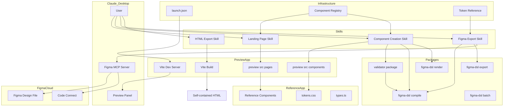
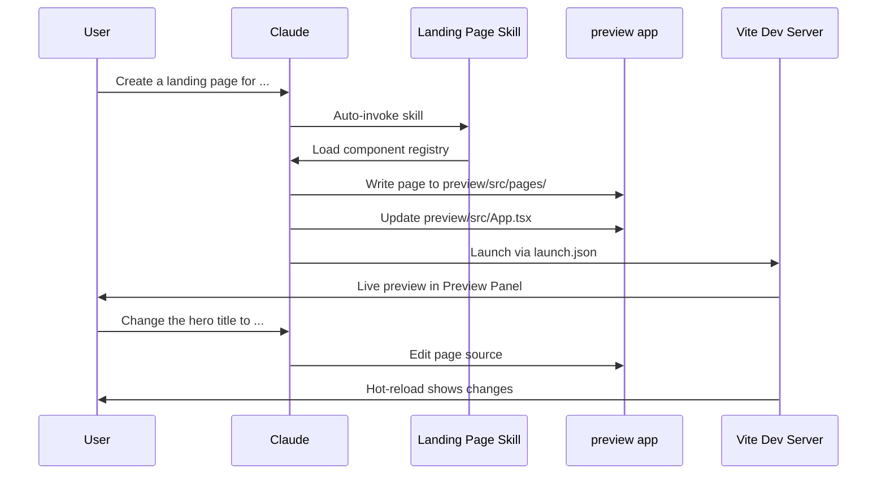
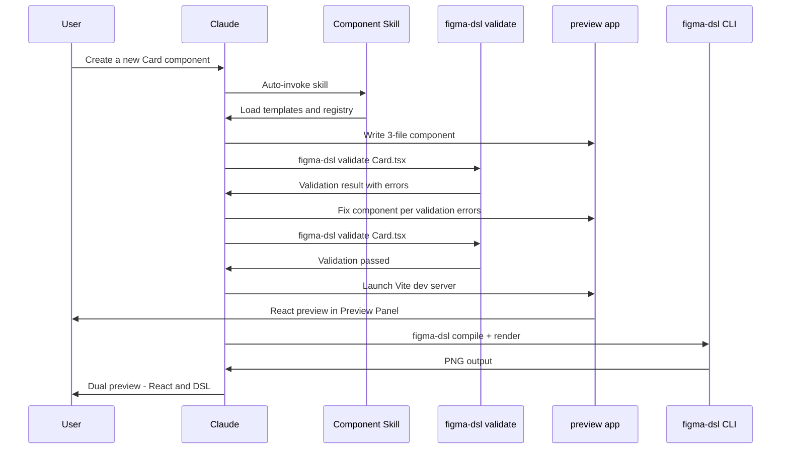
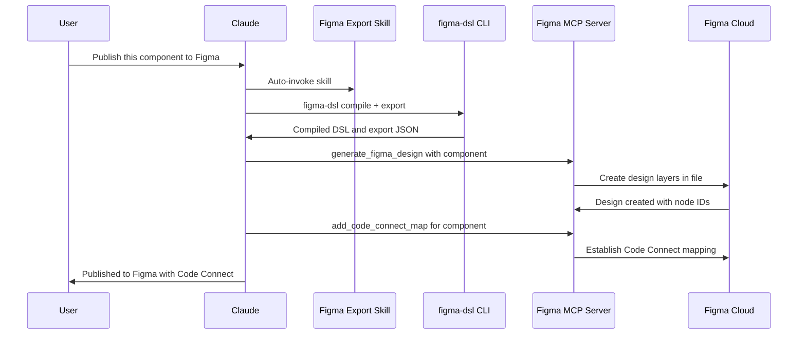
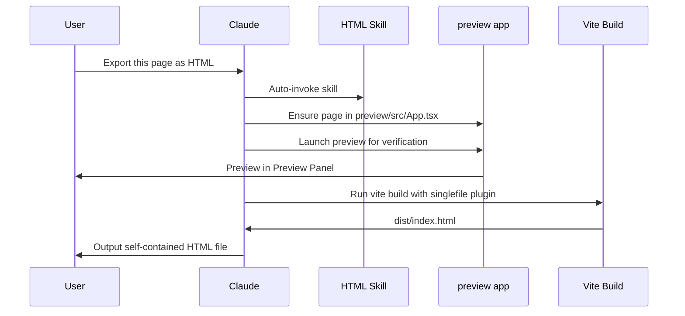

# Design Document: Claude Desktop Interactive Workflow

## Overview

**Purpose**: This feature delivers four Claude AI Skills, a DSL compatibility validator package, and Figma auto-publishing support that enable Claude Desktop users to interactively create landing pages, React components, Figma designs, and HTML pages — all with live visual previews and automated validation feedback loops.

**Users**: Claude Code (Claude Desktop) users working on the figma-component-dsl project will use these skills for rapid visual prototyping, component creation, Figma export with auto-publishing, and HTML generation.

**Impact**: Adds `.claude/launch.json`, a `preview/` Vite+React scaffold, `packages/validator` for DSL compatibility checks, four skill directories under `.claude/skills/` authored using Anthropic's skill-creator methodology, Figma MCP server integration for auto-publishing, eval infrastructure per skill, and shared reference documents.

### Goals
- Provide discoverable AI Skills that Claude auto-invokes based on user intent
- Enable live preview via `.claude/launch.json` for all visual workflows
- Auto-publish designs to Figma via MCP server's `generate_figma_design` tool
- Programmatic DSL compatibility validation enabling AI-driven create→validate→fix iteration loops
- Maintain design token consistency across React, DSL, Figma, and HTML outputs
- Author all skills following Anthropic's skill-creator methodology (progressive disclosure, pushy descriptions, eval infrastructure, bundled scripts)

### Non-Goals
- No server-side rendering infrastructure — all React rendering is client-side via Vite
- No Figma REST API write operations — REST API is read-only; MCP server handles writes
- No custom HTML rendering package — Vite build with `vite-plugin-singlefile` handles HTML export
- No real-time Figma sync — designs are published as one-shot operations

## Architecture

### Existing Architecture Analysis

The project has a mature monorepo with 8 packages providing the full DSL pipeline: `dsl-core` → `compiler` → `renderer` / `exporter` → `plugin`. The CLI (`packages/cli`) orchestrates all commands. The reference app (`references/figma_design_playground/`) provides 16 production React components with design tokens and Code Connect bindings.

Existing validation is minimal: name/text emptiness checks in `dsl-core`, hex color pattern validation, and `CompileError[]` accumulation in the compiler. No structural validation exists for checking whether a React component can be faithfully represented as DSL nodes.

The Figma plugin (`packages/plugin`) imports exporter JSON into Figma via Plugin API. The new MCP server integration provides an alternative direct-publish path from Claude Desktop.

### Architecture Pattern & Boundary Map



**Architecture Integration**:
- Selected pattern: Skills (authored via skill-creator methodology) + Vite scaffold + validator package + Figma MCP
- Domain boundaries: Each skill owns one workflow; `@figma-dsl/validator` owns DSL compatibility rules; Figma MCP handles external publishing; skill-creator provides authoring methodology and eval infrastructure
- Existing patterns preserved: CLI commands unchanged, reference app unchanged, monorepo structure extended
- New components: `preview/` app, `packages/validator`, 4 skill directories (each with `evals/`, `scripts/`, `references/`), shared references, `.claude/launch.json`, Figma MCP integration, skill-creator reference submodule
- Steering compliance: TypeScript strict, CSS Modules, design tokens as CSS custom properties, single-responsibility packages

### Technology Stack

| Layer | Choice / Version | Role in Feature | Notes |
|-------|------------------|-----------------|-------|
| Skills | SKILL.md (YAML + Markdown) | Workflow instructions for Claude | Authored via skill-creator methodology |
| Skill Authoring | skill-creator (reference submodule) | Eval infrastructure, description optimization | [anthropics/skills](https://github.com/anthropics/skills) |
| Preview | Vite 8 + React 19 | Live preview app | Same stack as reference app |
| HTML Export | vite-plugin-singlefile | Inline CSS+JS into single HTML | 86K weekly downloads, mature |
| Validation | `@figma-dsl/validator` (new) | React→DSL compatibility checks | New monorepo package |
| Figma Publish | Figma MCP Server | Auto-publish designs to Figma | `generate_figma_design` + `add_code_connect_map` |
| CLI | figma-dsl (existing + extended) | DSL compile, render, export, validate | New `validate` command |
| Preview Config | .claude/launch.json v0.0.1 | Dev server + static preview | Standard Claude Desktop format |

## System Flows

### Landing Page Creation Flow



### Component Creation with Validation Loop



### Figma Auto-Publishing Flow



### HTML Export Flow



## Requirements Traceability

| Requirement | Summary | Components | Interfaces | Flows |
|-------------|---------|------------|------------|-------|
| 1.1 | Skills under .claude/skills/ with SKILL.md | All 4 skill dirs | SKILL.md frontmatter | — |
| 1.2 | Trigger phrases in description | All 4 SKILL.md files | description field | — |
| 1.3 | launch.json with 2 preview configs | launch.json | Configuration schema | — |
| 1.4 | Preview on local port | Vite dev server | launch.json port | All preview flows |
| 1.5 | Supporting files in skill dirs | references/, assets/ subdirs | — | — |
| 2.1 | Expose 10 components | Component Registry | Registry reference | Landing flow |
| 2.2 | Generate page from components | Landing Page Skill | Page template | Landing flow |
| 2.3 | React dev server preview | launch.json + preview app | Vite config | Landing flow |
| 2.4 | Hot-reload on prop changes | Vite HMR | — | Landing flow |
| 2.5 | Validate prop interfaces | Landing Page Skill | Registry reference | Landing flow |
| 2.6 | Component reference doc | Component Registry | — | — |
| 2.7 | Follow reference patterns | Landing Page Skill | LandingPage.tsx reference | Landing flow |
| 3.1 | 3-file component pattern | Component Skill templates | Template files | Component flow |
| 3.2 | Reference app constraints | Component Skill + Validator | Validation rules | Component flow |
| 3.3 | Template files for scaffolding | Component Skill assets | .tsx/.css/.figma.tsx templates | Component flow |
| 3.4 | React preview via dev server | launch.json + preview app | Vite config | Component flow |
| 3.5 | DSL preview via CLI | Component Skill | CLI compile + render | Component flow |
| 3.6 | Dual preview update | Component Skill | — | Component flow |
| 3.7 | Auto-register in index.ts | Component Skill | — | Component flow |
| 4.1 | Compile via figma-dsl compile | Figma Export Skill | CLI interface | Figma flow |
| 4.2 | Export via figma-dsl export | Figma Export Skill | CLI interface | Figma flow |
| 4.3 | Code Connect bindings | Figma Export Skill + MCP | add_code_connect_map | Figma flow |
| 4.4 | Figma schema reference doc | Figma Export Skill references | — | — |
| 4.5 | Preserve design tokens | Token Reference | — | Figma flow |
| 4.6 | Warn on unmapped tokens | Figma Export Skill + Validator | — | Figma flow |
| 4.7 | Batch export | Figma Export Skill | CLI batch interface | Figma flow |
| 5.1 | Render to static HTML | HTML Skill + Vite build | vite-plugin-singlefile | HTML flow |
| 5.2 | Inline CSS (self-contained) | vite-plugin-singlefile | — | HTML flow |
| 5.3 | Preserve responsive behavior | Vite CSS build | — | HTML flow |
| 5.4 | Output to user-specified path | HTML Skill | — | HTML flow |
| 5.5 | Handle external assets | HTML Skill instructions | — | HTML flow |
| 5.6 | Preview before export | launch.json + preview app | — | HTML flow |
| 6.1 | Component registry catalog | Component Registry | Registry format | — |
| 6.2 | Skills reference registry | All skills | SKILL.md read instructions | — |
| 6.3 | Query for components | All skills + Registry | — | — |
| 6.4 | Figma mappings in registry | Component Registry | — | — |
| 6.5 | Update on component creation | Component Skill | — | — |
| 7.1 | tokens.css as source of truth | Token Reference | — | — |
| 7.2 | Resolve tokens for DSL | Token Reference + Validator | — | — |
| 7.3 | Map tokens for Figma export | Token Reference | — | Figma flow |
| 7.4 | Include tokens in HTML output | Vite build pipeline | — | HTML flow |
| 7.5 | Propagate custom tokens | Token Reference + all skills | — | — |

## Components and Interfaces

| Component | Domain | Intent | Req Coverage | Key Dependencies | Contracts |
|-----------|--------|--------|--------------|-----------------|-----------|
| `.claude/launch.json` | Infrastructure | Preview server config | 1.3, 1.4 | Vite (P0) | Config |
| `preview/` app | Infrastructure | Vite+React scaffold for rendering | 1.3, 2.3, 3.4, 5.1, 5.6 | Vite (P0), React (P0), reference app (P1) | — |
| skill-creator submodule | Infrastructure | Eval infrastructure and description optimization | 1.1, 1.2 | Python 3 (P1) | — |
| `@figma-dsl/validator` | Package | DSL compatibility validation | 3.2, 4.6, 7.2 | dsl-core (P0), compiler (P1) | Service |
| Landing Page Skill | Skill | Guide Claude to compose landing pages | 2.1–2.7 | Registry (P0), preview app (P0) | — |
| Component Creation Skill | Skill | Guide Claude to scaffold React components | 3.1–3.7 | Templates (P0), Validator (P0), Registry (P0) | — |
| Figma Export Skill | Skill | Guide Claude to compile, export, and publish to Figma | 4.1–4.7 | CLI (P0), Figma MCP (P0), Token Ref (P1) | — |
| HTML Export Skill | Skill | Guide Claude to build self-contained HTML | 5.1–5.6 | preview app (P0), vite-plugin-singlefile (P0) | — |
| Component Registry | Shared Reference | Catalog of components with prop interfaces | 6.1–6.5 | Reference app (P0) | — |
| Token Reference | Shared Reference | Design token mapping for cross-format use | 7.1–7.5 | tokens.css (P0) | — |

### Infrastructure

#### `.claude/launch.json`

| Field | Detail |
|-------|--------|
| Intent | Define preview server configurations for Claude Desktop |
| Requirements | 1.3, 1.4 |

**Responsibilities & Constraints**
- Define two configurations: Vite dev server and static file server
- Port allocation must not conflict with other services

**Configuration Schema**

```json
{
  "version": "0.0.1",
  "configurations": [
    {
      "name": "preview-app",
      "runtimeExecutable": "npm",
      "runtimeArgs": ["run", "dev"],
      "cwd": "preview",
      "port": 5173,
      "autoPort": true
    },
    {
      "name": "dsl-preview",
      "runtimeExecutable": "npx",
      "runtimeArgs": ["serve", "output"],
      "port": 8080,
      "autoPort": true
    }
  ]
}
```

**Implementation Notes**
- `autoPort: true` avoids conflicts if ports are already in use
- `autoVerify` defaults to `true` — Claude takes screenshots after edits

#### `preview/` App

| Field | Detail |
|-------|--------|
| Intent | Minimal Vite+React app where skills write pages and components |
| Requirements | 1.3, 2.3, 3.4, 5.1, 5.6 |

**Responsibilities & Constraints**
- Provide a Vite dev server with hot-reload for React components
- Alias `@/components` to reference app's `src/components/` via Vite config
- Import `tokens.css` and `types.ts` from reference app
- Support `vite-plugin-singlefile` for HTML export builds

**Dependencies**
- Outbound: `references/figma_design_playground/src/` — component source (P0)
- External: Vite 8 — dev server and build (P0)
- External: React 19, react-dom 19 — rendering (P0)
- External: `vite-plugin-singlefile` — HTML export (P1)

**Vite Config Interface**

```typescript
// preview/vite.config.ts
import { defineConfig } from 'vite';
import react from '@vitejs/plugin-react';
import { viteSingleFile } from 'vite-plugin-singlefile';

export default defineConfig({
  plugins: [react(), viteSingleFile()],
  resolve: {
    alias: {
      '@': './src',
      '@/components': '../references/figma_design_playground/src/components',
    },
  },
});
```

**File Structure**

```
preview/
├── index.html
├── package.json
├── vite.config.ts
├── tsconfig.json
└── src/
    ├── App.tsx              # Entry point — skills swap this to render target page
    ├── main.tsx             # React DOM root
    ├── pages/               # Landing pages written by skills
    └── components/          # New components written by Component Creation Skill
```

**Implementation Notes**
- `@/components` alias resolves to reference app, so `import { Button } from '@/components'` works
- New user-created components go into `preview/src/components/` (separate from reference)
- `preview/src/App.tsx` is the render target — skills update it to display the current page or component
- `package.json` depends on `react`, `react-dom`, `vite`, `@vitejs/plugin-react`, `vite-plugin-singlefile`

### Packages

#### `@figma-dsl/validator`

| Field | Detail |
|-------|--------|
| Intent | Validate React component source files for DSL compatibility |
| Requirements | 3.2, 4.6, 7.2 |

**Responsibilities & Constraints**
- Validate React component structure against DSL representation constraints
- Report errors using the same `CompileError`-style interface for consistency
- Provide both programmatic API and CLI command (`figma-dsl validate`)
- Enable AI-driven iteration: create → validate → fix → validate → pass

**Dependencies**
- Inbound: Component Creation Skill — validation calls (P0)
- Inbound: CLI — `figma-dsl validate` command (P0)
- Outbound: `@figma-dsl/dsl-core` — DSL node types and constraints (P0)
- External: TypeScript compiler API — AST analysis for prop interface extraction (P1)

**Contracts**: Service [x]

##### Service Interface

```typescript
interface ValidationError {
  rule: string;
  message: string;
  filePath: string;
  line?: number;
  severity: 'error' | 'warning';
}

interface ValidationResult {
  valid: boolean;
  errors: ValidationError[];
  warnings: ValidationError[];
  checkedRules: string[];
}

interface ValidatorOptions {
  /** Path to tokens.css for token reference validation */
  tokensPath?: string;
  /** Specific rules to run (default: all) */
  rules?: string[];
  /** Skip specific rules */
  skipRules?: string[];
}

interface DslValidator {
  /**
   * Validate a single React component file for DSL compatibility.
   * Analyzes the .tsx source, .module.css, and optional .figma.tsx.
   */
  validateComponent(
    componentDir: string,
    options?: ValidatorOptions
  ): Promise<ValidationResult>;

  /**
   * Validate all components in a directory.
   */
  validateAll(
    baseDir: string,
    options?: ValidatorOptions
  ): Promise<Map<string, ValidationResult>>;
}
```

- Preconditions: Component directory must contain at least `{Name}.tsx`
- Postconditions: Returns `ValidationResult` with all applicable rules checked
- Invariants: Validation is pure — no file modifications

**Validation Rules**

| Rule ID | Category | Check | Severity |
|---------|----------|-------|----------|
| `css-modules` | Styling | Component uses `.module.css` import, not inline styles or utility classes | error |
| `design-tokens` | Styling | CSS file references `var(--token-*)` from tokens.css, not hardcoded values | warning |
| `classname-prop` | Props | Component accepts `className` prop with filter+join composition pattern | error |
| `variant-union` | Props | Variant/size props use string literal union types, not `string` | error |
| `html-attrs` | Props | Props interface extends appropriate `HTMLAttributes<*>` | warning |
| `no-inline-style` | Styling | No `style={{}}` JSX attributes | error |
| `three-file` | Structure | Directory contains `.tsx`, `.module.css`, `.figma.tsx` | warning |
| `barrel-export` | Structure | Component is exported from parent `index.ts` | warning |
| `token-exists` | Tokens | All `var(--*)` references in CSS match entries in tokens.css | error |
| `dsl-compatible-layout` | Layout | Component uses flexbox/grid patterns that map to DSL auto-layout | warning |

**CLI Command Interface**

```
figma-dsl validate <path> [options]

Arguments:
  path              Component directory or file path

Options:
  --tokens <path>   Path to tokens.css (default: auto-detect)
  --rules <list>    Comma-separated rule IDs to run
  --skip <list>     Comma-separated rule IDs to skip
  --format <type>   Output format: text | json (default: text)
  --strict          Treat warnings as errors

Output (JSON format):
{
  "valid": false,
  "errors": [
    { "rule": "css-modules", "message": "...", "filePath": "...", "line": 12, "severity": "error" }
  ],
  "warnings": [...],
  "checkedRules": ["css-modules", "design-tokens", ...]
}
```

**Implementation Notes**
- Uses TypeScript compiler API (`ts.createSourceFile`) for AST-based analysis of `.tsx` files — no runtime execution
- CSS file analysis uses regex-based pattern matching (not a full CSS parser) for token reference validation
- Follows existing monorepo package pattern: `packages/validator/src/`, vitest tests, `@figma-dsl/validator` scope
- CLI integration: new `validate` command registered in `packages/cli/src/cli.ts` alongside existing commands

### Skills Layer

All skills follow the [skill-creator methodology](https://github.com/anthropics/skills/tree/main/skills/skill-creator) with these patterns:
- **Progressive disclosure**: SKILL.md body <500 lines; detailed docs in `references/`; deterministic helpers in `scripts/`
- **Pushy descriptions**: Descriptions include both what the skill does AND specific trigger contexts, compensating for Claude's tendency to "undertrigger"
- **Imperative instructions**: Explain "why" over rigid MUSTs; use imperative form
- **Bundled scripts**: Repetitive operations (validation wrappers, preview launchers) bundled in `scripts/` to avoid reinventing per invocation
- **Eval infrastructure**: Each skill includes `evals/evals.json` with 2-3 test cases and assertions for regression testing
- **Description optimization**: After functional completion, run `references/skill-creator/scripts/run_loop.py` with 20 trigger queries per skill

#### Landing Page Skill

| Field | Detail |
|-------|--------|
| Intent | Guide Claude to compose landing pages from registered components |
| Requirements | 2.1, 2.2, 2.3, 2.4, 2.5, 2.6, 2.7 |

**Responsibilities & Constraints**
- Instruct Claude to read the component registry before composing pages
- Guide page generation following the `LandingPage.tsx` reference pattern
- Instruct Claude to launch preview via `launch.json` and verify with the Preview panel
- Validate prop types against registered interfaces

**Dependencies**
- Inbound: User request matching trigger phrases (P0)
- Outbound: Component Registry — component discovery (P0)
- Outbound: Preview app — file writes (P0)
- Outbound: launch.json — preview launch (P1)

**SKILL.md Frontmatter**

```yaml
---
name: create-landing-page
description: >
  Create landing pages by composing React components with live preview. Use
  this skill whenever the user mentions landing pages, marketing pages, web
  page layouts, page sections, or wants to prototype any kind of multi-section
  web page — even if they don't explicitly say "landing page". Also trigger
  when the user asks to compose Hero, Navbar, Footer, Pricing, FAQ, or other
  page sections together, or wants to build a page from existing components.
  Covers: "create a landing page", "build a page", "compose sections",
  "marketing page", "prototype page", "put together a homepage".
allowed-tools: Bash, Read, Write, Edit, Glob, Grep
---
```

**Skill File Structure**

```
.claude/skills/create-landing-page/
├── SKILL.md
├── scripts/
│   └── launch-preview.sh         # Deterministic preview launcher
├── references/
│   └── landing-page-example.md   # Reference patterns from LandingPage.tsx
└── evals/
    └── evals.json                # Test cases for skill regression testing
```

#### Component Creation Skill

| Field | Detail |
|-------|--------|
| Intent | Guide Claude to scaffold React components with validation and dual preview |
| Requirements | 3.1, 3.2, 3.3, 3.4, 3.5, 3.6, 3.7 |

**Responsibilities & Constraints**
- Enforce 3-file pattern: `.tsx`, `.module.css`, `.figma.tsx`
- Enforce reference app constraints via validator integration
- Provide template files for scaffolding
- Run `figma-dsl validate` after creation and iterate until valid
- Instruct Claude to run DSL compile+render for comparison preview
- Auto-register new components in `index.ts` and `types.ts`

**Dependencies**
- Inbound: User request matching trigger phrases (P0)
- Outbound: `@figma-dsl/validator` — DSL compatibility validation (P0)
- Outbound: Component Registry — registration (P0)
- Outbound: Preview app — file writes (P0)
- Outbound: CLI `compile` + `render` — DSL preview (P1)
- Outbound: Template files — scaffolding (P0)

**SKILL.md Frontmatter**

```yaml
---
name: create-react-component
description: >
  Create new React components with live preview and automatic DSL validation.
  Use this skill whenever the user wants to create any kind of UI component,
  widget, element, or building block — buttons, cards, modals, forms, inputs,
  badges, alerts, or any custom component. Supports dual preview: React dev
  server rendering and DSL-rendered PNG for Figma comparison. Automatically
  validates DSL compatibility and iterates until the component passes all
  checks. Also trigger when the user asks to scaffold, design, or prototype
  a component, even if they just describe what it should look like without
  using the word "component". Covers: "create a component", "new component",
  "build a button", "design a card", "scaffold component", "make a widget",
  "I need a dropdown", "add a tooltip component".
allowed-tools: Bash, Read, Write, Edit, Glob, Grep
---
```

**Skill File Structure**

```
.claude/skills/create-react-component/
├── SKILL.md
├── scripts/
│   └── validate-and-preview.sh   # Runs validation + dual preview pipeline
├── assets/
│   ├── Component.tsx.template
│   ├── Component.module.css.template
│   └── Component.figma.tsx.template
├── references/
│   └── component-constraints.md  # Reference app constraints reference
└── evals/
    └── evals.json                # Test cases for skill regression testing
```

**Template Interface (Component.tsx.template)**

```typescript
// Template variables: {{ComponentName}}, {{propsInterface}}, {{variants}}
import type { HTMLAttributes, ReactNode } from 'react';
import styles from './{{ComponentName}}.module.css';

interface {{ComponentName}}Props extends HTMLAttributes<HTMLDivElement> {
  variant?: {{variants}};
  children: ReactNode;
  className?: string;
}

export function {{ComponentName}}({
  variant = 'default',
  children,
  className,
  ...rest
}: {{ComponentName}}Props) {
  return (
    <div
      className={[styles.root, styles[variant], className].filter(Boolean).join(' ')}
      {...rest}
    >
      {children}
    </div>
  );
}
```

**Validation Loop in SKILL.md Instructions**:
1. Generate component from template
2. Run `figma-dsl validate <component-dir> --format json`
3. If errors: fix each error per the validation message, re-run validation
4. Repeat until `valid: true`
5. Proceed to preview and DSL compile

#### Figma Export Skill

| Field | Detail |
|-------|--------|
| Intent | Guide Claude to compile, export, and auto-publish designs to Figma |
| Requirements | 4.1, 4.2, 4.3, 4.4, 4.5, 4.6, 4.7 |

**Responsibilities & Constraints**
- Instruct Claude to compile and export via existing CLI commands
- Auto-publish to Figma via MCP server's `generate_figma_design` tool (primary path)
- Fall back to plugin JSON import when MCP is unavailable
- Establish Code Connect mappings via `add_code_connect_map` after publishing
- Warn on unmapped design tokens (via validator token-exists rule)
- Support batch export via `figma-dsl batch`

**Dependencies**
- Inbound: User request matching trigger phrases (P0)
- Outbound: CLI `compile`, `export`, `batch` — DSL operations (P0)
- Outbound: Figma MCP server — `generate_figma_design`, `add_code_connect_map` (P0)
- Outbound: Token Reference — design token mapping (P1)
- Outbound: `@figma-dsl/validator` — token validation (P2)

**SKILL.md Frontmatter**

```yaml
---
name: export-to-figma
description: >
  Export React components to Figma with automatic publishing via MCP server.
  Use this skill whenever the user wants to get their components into Figma,
  create Figma design components from code, publish designs, generate Figma-
  compatible data, set up Code Connect bindings, or bridge the gap between
  their React code and Figma design files. Also trigger when the user mentions
  Figma in the context of their components, even casually — e.g., "can we
  see this in Figma?", "push this to our design file", "I need the Figma
  version". Covers: "export to Figma", "Figma publish", "Code Connect",
  "design export", "figma import", "push to Figma", "create Figma components",
  "sync with Figma".
allowed-tools: Bash, Read, Write, Edit, Glob, Grep
---
```

**Skill File Structure**

```
.claude/skills/export-to-figma/
├── SKILL.md
├── scripts/
│   └── compile-and-export.sh     # Deterministic compile→export pipeline
├── references/
│   ├── figma-export-schema.md    # Plugin JSON schema reference
│   ├── code-connect-pattern.md   # Code Connect binding patterns
│   └── mcp-setup-guide.md       # Figma MCP server setup instructions
└── evals/
    └── evals.json                # Test cases for skill regression testing
```

**Publishing Paths**

```
Path 1 — MCP Auto-Publish (preferred):
  1. figma-dsl compile <component.dsl.ts>
  2. figma-dsl export <component.dsl.ts>
  3. Use Figma MCP generate_figma_design to publish to Figma file
  4. Use Figma MCP add_code_connect_map for Code Connect bindings

Path 2 — Plugin JSON Import (fallback):
  1. figma-dsl compile <component.dsl.ts>
  2. figma-dsl export <component.dsl.ts> -o output.json
  3. Import output.json via Figma plugin manually
  4. Update .figma.tsx with node URLs from Figma
```

**MCP Integration Notes**
- `generate_figma_design` is remote-only — requires Figma MCP server configured in Claude Desktop's MCP settings
- New files are created in team/organization drafts; existing files require edit permissions
- Exempt from standard rate limits
- Skill SKILL.md includes MCP setup instructions referencing `references/mcp-setup-guide.md`

#### HTML Export Skill

| Field | Detail |
|-------|--------|
| Intent | Guide Claude to produce self-contained HTML from React components |
| Requirements | 5.1, 5.2, 5.3, 5.4, 5.5, 5.6 |

**Responsibilities & Constraints**
- Instruct Claude to ensure the target page is set as the preview app's root
- Guide Vite build with `vite-plugin-singlefile` for CSS+JS inlining
- Instruct Claude to copy `dist/index.html` to the user-specified output path
- Handle external assets (inline SVGs, copy large images)

**Dependencies**
- Inbound: User request matching trigger phrases (P0)
- Outbound: Preview app — Vite build (P0)
- Outbound: `vite-plugin-singlefile` — asset inlining (P0)
- Outbound: launch.json — preview before export (P1)

**SKILL.md Frontmatter**

```yaml
---
name: export-to-html
description: >
  Generate self-contained HTML pages from React components. Use this skill
  whenever the user wants to produce a deployable web page, export their work
  as HTML, create a static page they can share or host, or generate a
  standalone file that works without a dev server. Also trigger when the user
  wants to share their page with someone, deploy it, or create a portable
  version — even if they don't say "HTML" explicitly. Covers: "export HTML",
  "static page", "generate HTML", "deployable page", "standalone HTML",
  "share this page", "make it portable", "deploy this", "download as HTML".
allowed-tools: Bash, Read, Write, Edit, Glob, Grep
---
```

**Skill File Structure**

```
.claude/skills/export-to-html/
├── SKILL.md
├── scripts/
│   └── build-and-export.sh       # Deterministic Vite build + copy pipeline
├── references/
│   └── html-export-guide.md      # Asset handling and export patterns
└── evals/
    └── evals.json                # Test cases for skill regression testing
```

### Skill Authoring Infrastructure

#### skill-creator Reference Submodule

| Field | Detail |
|-------|--------|
| Intent | Provide eval infrastructure and description optimization tooling |
| Requirements | 1.1, 1.2 |

**Location**: `references/skill-creator/` (git submodule from `anthropics/skills/skills/skill-creator`)

**Key Assets Used**:
- `eval-viewer/generate_review.py` — HTML review UI for evaluating skill outputs
- `scripts/run_loop.py` — Description optimization loop (20 queries, 5 iterations, 60/40 train/test split)
- `scripts/aggregate_benchmark.py` — Benchmark aggregation for timing/tokens/pass_rate
- `agents/grader.md` — Assertion evaluation agent instructions
- `references/schemas.md` — JSON schemas for `evals.json`, `grading.json`, `benchmark.json`

**Eval Workflow Per Skill**:
1. Draft SKILL.md following progressive disclosure and pushy description patterns
2. Create `evals/evals.json` with 2-3 realistic test prompts
3. Run test prompts with/without skill via subagents
4. Grade outputs against assertions
5. Review via `generate_review.py` HTML viewer
6. Iterate skill based on feedback
7. After functional completion, optimize description via `run_loop.py`

**Implementation Notes**
- Python 3 required for eval scripts
- `run_loop.py` uses `claude -p` CLI — must match the model powering the session
- Eval queries should be substantive (not simple one-step tasks) — Claude only consults skills for complex tasks
- The submodule is read-only reference material, not modified by skills

### Shared References

#### Component Registry

| Field | Detail |
|-------|--------|
| Intent | Catalog of available components with prop interfaces and examples |
| Requirements | 6.1, 6.2, 6.3, 6.4, 6.5 |

**Responsibilities & Constraints**
- List all 16 reference components with prop types, variants, defaults, and usage examples
- Include Figma Code Connect property mappings where applicable
- Updated by the Component Creation Skill when new components are created

**Location**: `.claude/skills/shared/references/component-registry.md`

**Registry Entry Format**

```markdown
### Button

**Import**: `import { Button } from '@/components'`

**Props**:
| Prop | Type | Default | Description |
|------|------|---------|-------------|
| variant | 'primary' \| 'secondary' \| 'outline' \| 'ghost' | 'primary' | Visual style |
| size | 'sm' \| 'md' \| 'lg' | 'md' | Button size |
| href | string | — | Renders as anchor if provided |
| fullWidth | boolean | false | Full-width layout |
| children | ReactNode | — | Button content |

**Figma Code Connect**:
- Variant → `figma.enum('Variant', { Primary: 'primary', ... })`
- Size → `figma.enum('Size', { Small: 'sm', ... })`
- Label → `figma.string('Label')`
- Full Width → `figma.boolean('Full Width')`

**Example**:
```tsx
<Button variant="primary" size="lg">Get Started</Button>
```
```

**Implementation Notes**
- Each skill's SKILL.md includes: `Read the component registry at .claude/skills/shared/references/component-registry.md`
- The Component Creation Skill appends new entries after creating a component

#### Token Reference

| Field | Detail |
|-------|--------|
| Intent | Design token mapping for cross-format consistency |
| Requirements | 7.1, 7.2, 7.3, 7.4, 7.5 |

**Location**: `.claude/skills/shared/references/design-tokens.md`

**Token Entry Format**

```markdown
### Colors — Primary Palette

| Token | CSS Value | DSL Value (RGBA) | Figma Style |
|-------|-----------|------------------|-------------|
| --color-primary-500 | #8b5cf6 | { r: 0.545, g: 0.361, b: 0.965, a: 1 } | Primary/500 |
| --color-primary-600 | #7c3aed | { r: 0.486, g: 0.228, b: 0.929, a: 1 } | Primary/600 |
```

**Implementation Notes**
- Token values extracted from `references/figma_design_playground/src/components/tokens.css`
- DSL values use normalized RGBA (0-1 range) via `@figma-dsl/core` color parser
- Figma Style names follow `Category/Shade` convention
- Validator's `token-exists` rule cross-references this mapping

## Data Models

### Domain Model

No persistent data storage. All artifacts are files on disk:
- **Page source files** (`preview/src/pages/*.tsx`) — React page components
- **Component source files** (`preview/src/components/{Name}/*.tsx|.css|.figma.tsx`) — 3-file components
- **DSL output** (`output/*.json`, `output/*.png`) — compiled DSL and rendered images
- **Figma export** (`output/*.json`) — plugin-compatible JSON
- **HTML export** (`output/*.html`) — self-contained HTML pages
- **Validation reports** — transient CLI output (text or JSON)

### Data Contracts

**Skill → Validator**: Skills invoke `figma-dsl validate <path> --format json` and parse `ValidationResult` JSON from stdout.

**Skill → Preview App**: Skills write `.tsx`, `.module.css`, and `.figma.tsx` files conforming to TypeScript strict mode and CSS Modules conventions.

**Skill → CLI**: Skills invoke CLI commands via `Bash` with standard arguments:
- `figma-dsl compile <file.dsl.ts> -o <output.json>`
- `figma-dsl render <file.json> -o <output.png>`
- `figma-dsl export <file.dsl.ts> -o <output.json>`
- `figma-dsl batch <dir> -o <output-dir>`
- `figma-dsl validate <path> [--format json] [--strict]`

**Skill → Figma MCP**: Skills invoke MCP tools via Claude Desktop's MCP integration:
- `generate_figma_design` — sends component designs to Figma file
- `add_code_connect_map` — maps Figma node IDs to code component paths
- `get_code_connect_suggestions` — discovers existing mappings

**Vite Build → HTML**: `vite build` with `vite-plugin-singlefile` produces `dist/index.html` containing all inlined CSS and JS.

## Error Handling

### Error Strategy

Two error surfaces: (1) programmatic validation via `@figma-dsl/validator` returns structured `ValidationResult` for AI iteration, (2) skill instructions provide conditional guidance for build/preview/MCP errors.

### Error Categories and Responses

**Validation Errors** (structured): `figma-dsl validate` returns `ValidationResult` with per-rule errors. The Component Creation Skill iterates: fix errors → re-validate → repeat until `valid: true`.

**Build Errors**: If `vite build` or CLI commands fail, the skill instructs Claude to read error output, diagnose the issue, and fix source files before retrying.

**Preview Errors**: If the dev server fails to start, the skill instructs Claude to check port availability, run `npm install`, and restart.

**MCP Errors**: If `generate_figma_design` fails (MCP not configured, auth expired, no edit permission), the skill falls back to plugin JSON export path. Claude reports the MCP error and provides plugin import instructions.

**Token Errors**: Validator's `token-exists` rule catches CSS custom property references that don't exist in `tokens.css`. Figma Export Skill additionally warns on tokens that cannot map to Figma styles.

## Testing Strategy

### Validator Unit Tests
- Each validation rule has dedicated test cases with passing and failing component fixtures
- `validateComponent()` integration tests with multi-file component directories
- CLI `validate` command tests with text and JSON output formats
- Edge cases: empty files, missing CSS module, TypeScript syntax errors

### Skill Validation (skill-creator eval loop)
- Verify each SKILL.md has valid YAML frontmatter (`name`, `description`, `allowed-tools`)
- Verify SKILL.md body is under 500 lines (progressive disclosure compliance)
- Verify all referenced files exist (templates, references, registry, scripts)
- Verify trigger phrases are distinct across skills (no overlapping invocations)
- Run `evals/evals.json` test cases per skill via skill-creator eval loop (2-3 test prompts each)
- Grade outputs against defined assertions using `agents/grader.md`
- Run description optimization via `run_loop.py` (20 trigger queries, should/shouldn't trigger mix)

### Preview App Validation
- Verify `npm install` succeeds in `preview/`
- Verify `npm run dev` starts Vite dev server on configured port
- Verify `npm run build` produces `dist/index.html` with inlined assets
- Verify reference component imports resolve via Vite alias

### Integration Validation
- Create a landing page using the skill and verify preview renders
- Create a component using the skill, validate, and verify dual preview (React + DSL PNG)
- Export a component to Figma via MCP and verify design appears in Figma file
- Export a page to HTML and verify self-contained rendering in browser
- Run validation loop: create invalid component → validate → fix → re-validate → pass
