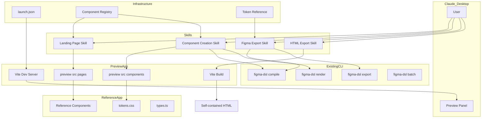
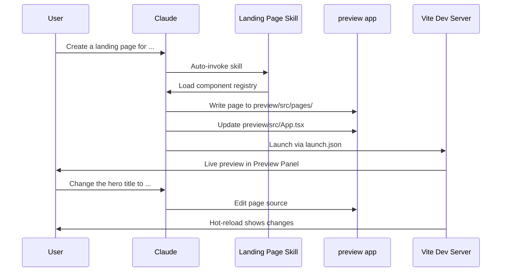
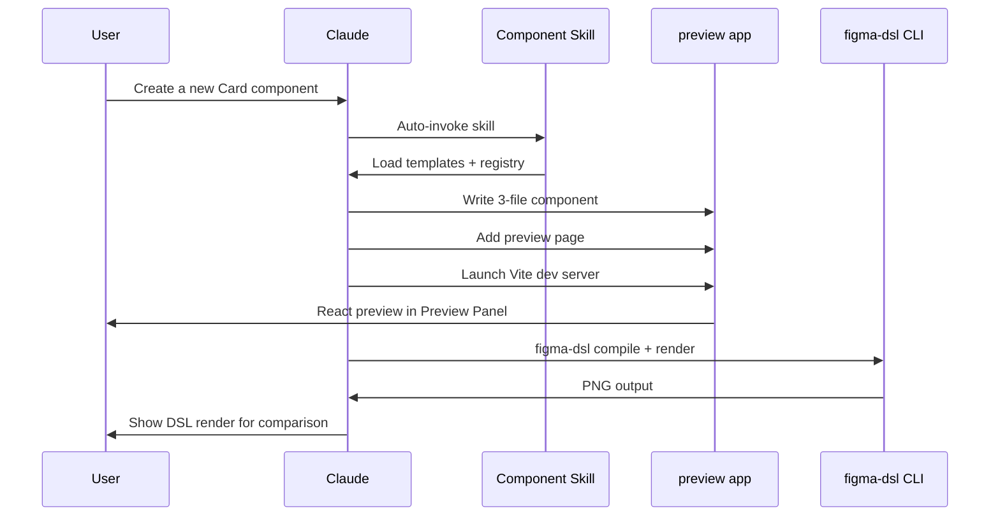
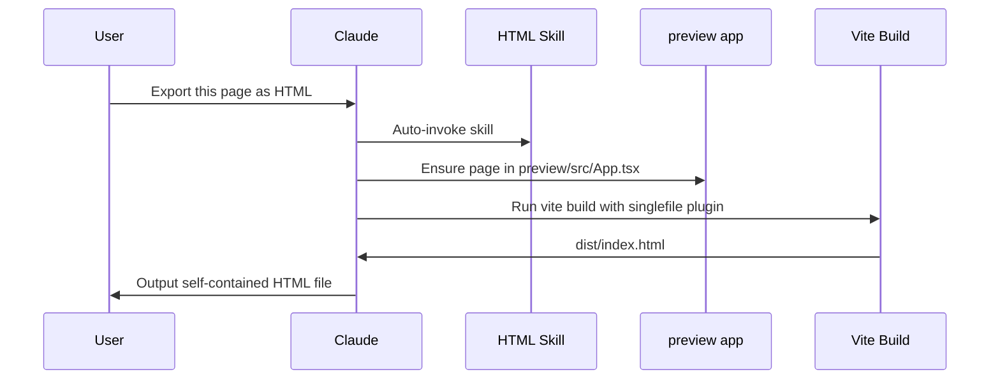

# Design Document: Claude Desktop Interactive Workflow

## Overview

**Purpose**: This feature delivers four Claude AI Skills and supporting infrastructure that enable Claude Desktop users to interactively create landing pages, React components, Figma design data, and HTML pages — all with live visual previews.

**Users**: Claude Code (Claude Desktop) users working on the figma-component-dsl project will use these skills for rapid visual prototyping, component creation, Figma export, and HTML generation.

**Impact**: Adds a `.claude/launch.json` preview configuration, a `preview/` Vite+React scaffold, four skill directories under `.claude/skills/`, and shared reference documents.

### Goals
- Provide discoverable AI Skills that Claude auto-invokes based on user intent
- Enable live preview via `.claude/launch.json` for all visual workflows
- Leverage existing CLI commands (`compile`, `render`, `export`, `batch`) without new TypeScript packages
- Maintain design token consistency across React, DSL, Figma, and HTML outputs

### Non-Goals
- No new TypeScript packages (no `packages/html-renderer`, no `packages/token-resolver`)
- No programmatic component registry API — the registry is a markdown reference document
- No auto-publishing to Figma — the skill generates JSON for manual import via the existing plugin
- No React component runtime library — skills write source files that the preview app renders

## Architecture

### Existing Architecture Analysis

The project has a mature monorepo with 8 packages providing the full DSL pipeline: `dsl-core` → `compiler` → `renderer` / `exporter` → `plugin`. The CLI (`packages/cli`) orchestrates all commands. The reference app (`references/figma_design_playground/`) provides 16 production React components with design tokens and Code Connect bindings.

Skills integrate by instructing Claude to: (1) write React source files into the `preview/` app, (2) invoke CLI commands via `Bash` for DSL operations, and (3) use Vite's build pipeline for HTML export. No package code changes are needed.

### Architecture Pattern & Boundary Map



**Architecture Integration**:
- Selected pattern: Skills as documentation (SKILL.md) + Vite scaffold for preview
- Domain boundaries: Each skill owns one workflow; shared references provide cross-skill consistency
- Existing patterns preserved: CLI commands unchanged, reference app unchanged, monorepo structure unchanged
- New components: `preview/` app, 4 skill directories, shared references, `.claude/launch.json`
- Steering compliance: No framework bloat, CSS Modules, design tokens as CSS custom properties, TypeScript strict

### Technology Stack

| Layer | Choice / Version | Role in Feature | Notes |
|-------|------------------|-----------------|-------|
| Skills | SKILL.md (YAML + Markdown) | Workflow instructions for Claude | Follows existing magi-docs-writer pattern |
| Preview | Vite 8 + React 19 | Live preview app | Same stack as reference app |
| HTML Export | vite-plugin-singlefile | Inline CSS+JS into single HTML | 86K weekly downloads, mature |
| CLI | figma-dsl (existing) | DSL compile, render, export | No changes needed |
| Preview Config | .claude/launch.json v0.0.1 | Dev server + static preview | Standard Claude Desktop format |

## System Flows

### Landing Page Creation Flow



### Dual Preview Flow (Component Creation)



### HTML Export Flow



## Requirements Traceability

| Requirement | Summary | Components | Interfaces | Flows |
|-------------|---------|------------|------------|-------|
| 1.1 | Skills under .claude/skills/ with SKILL.md | All 4 skill dirs | SKILL.md frontmatter | — |
| 1.2 | Trigger phrases in description | All 4 SKILL.md files | description field | — |
| 1.3 | launch.json with 2 preview configs | launch.json | Configuration schema | — |
| 1.4 | Preview on local port | Vite dev server | launch.json port | All preview flows |
| 1.5 | Supporting files in skill dirs | references/, assets/ subdirs | — | — |
| 2.1 | Expose 10 components | Component Registry | Registry reference | Landing flow |
| 2.2 | Generate page from components | Landing Page Skill | Page template | Landing flow |
| 2.3 | React dev server preview | launch.json + preview app | Vite config | Landing flow |
| 2.4 | Hot-reload on prop changes | Vite HMR | — | Landing flow |
| 2.5 | Validate prop interfaces | Landing Page Skill | Registry reference | Landing flow |
| 2.6 | Component reference doc | Component Registry | — | — |
| 2.7 | Follow reference patterns | Landing Page Skill | LandingPage.tsx reference | Landing flow |
| 3.1 | 3-file component pattern | Component Skill templates | Template files | Component flow |
| 3.2 | Reference app constraints | Component Skill instructions | — | Component flow |
| 3.3 | Template files for scaffolding | Component Skill assets | .tsx/.css/.figma.tsx templates | Component flow |
| 3.4 | React preview via dev server | launch.json + preview app | Vite config | Component flow |
| 3.5 | DSL preview via CLI | Component Skill | CLI compile + render | Component flow |
| 3.6 | Dual preview update | Component Skill | — | Component flow |
| 3.7 | Auto-register in index.ts | Component Skill | — | Component flow |
| 4.1 | Compile via figma-dsl compile | Figma Export Skill | CLI interface | — |
| 4.2 | Export via figma-dsl export | Figma Export Skill | CLI interface | — |
| 4.3 | Code Connect bindings | Figma Export Skill | .figma.tsx template | — |
| 4.4 | Figma schema reference doc | Figma Export Skill references | — | — |
| 4.5 | Preserve design tokens | Token Reference | — | — |
| 4.6 | Warn on unmapped tokens | Figma Export Skill | — | — |
| 4.7 | Batch export | Figma Export Skill | CLI batch interface | — |
| 5.1 | Render to static HTML via SSR | HTML Skill + Vite build | vite-plugin-singlefile | HTML flow |
| 5.2 | Inline CSS (self-contained) | vite-plugin-singlefile | — | HTML flow |
| 5.3 | Preserve responsive behavior | Vite CSS build | — | HTML flow |
| 5.4 | Output to user-specified path | HTML Skill | — | HTML flow |
| 5.5 | Handle external assets | HTML Skill instructions | — | HTML flow |
| 5.6 | Preview before export | launch.json + preview app | — | HTML flow |
| 6.1 | Component registry catalog | Component Registry | Registry format | — |
| 6.2 | Skills reference registry | All skills | SKILL.md read instructions | — |
| 6.3 | Query for components | All skills + Registry | — | — |
| 6.4 | Figma mappings in registry | Component Registry | — | — |
| 6.5 | Update on component creation | Component Skill | — | — |
| 7.1 | tokens.css as source of truth | Token Reference | — | — |
| 7.2 | Resolve tokens for DSL | Token Reference | — | — |
| 7.3 | Map tokens for Figma export | Token Reference | — | — |
| 7.4 | Include tokens in HTML output | Vite build pipeline | — | HTML flow |
| 7.5 | Propagate custom tokens | Token Reference + all skills | — | — |

## Components and Interfaces

| Component | Domain | Intent | Req Coverage | Key Dependencies | Contracts |
|-----------|--------|--------|--------------|-----------------|-----------|
| `.claude/launch.json` | Infrastructure | Preview server config | 1.3, 1.4 | Vite (P0) | Config |
| `preview/` app | Infrastructure | Vite+React scaffold for rendering | 1.3, 2.3, 3.4, 5.1, 5.6 | Vite (P0), React (P0), reference app (P1) | — |
| Landing Page Skill | Skill | Guide Claude to compose landing pages | 2.1-2.7 | Registry (P0), preview app (P0), launch.json (P1) | — |
| Component Creation Skill | Skill | Guide Claude to scaffold React components | 3.1-3.7 | Templates (P0), Registry (P0), CLI (P1), preview app (P0) | — |
| Figma Export Skill | Skill | Guide Claude to compile and export for Figma | 4.1-4.7 | CLI compile+export (P0), Token Ref (P1) | — |
| HTML Export Skill | Skill | Guide Claude to build self-contained HTML | 5.1-5.6 | preview app (P0), vite-plugin-singlefile (P0) | — |
| Component Registry | Shared Reference | Catalog of components with prop interfaces | 6.1-6.5, 2.1, 2.5 | Reference app (P0) | — |
| Token Reference | Shared Reference | Design token mapping for cross-format use | 7.1-7.5, 4.5, 4.6 | tokens.css (P0) | — |

### Infrastructure

#### `.claude/launch.json`

| Field | Detail |
|-------|--------|
| Intent | Define preview server configurations for Claude Desktop |
| Requirements | 1.3, 1.4 |

**Responsibilities & Constraints**
- Define two configurations: Vite dev server and static file server
- Port allocation must not conflict with other services
- Working directory must point to the preview app

**Configuration Schema**

```json
{
  "version": "0.0.1",
  "configurations": [
    {
      "name": "preview-app",
      "runtimeExecutable": "npm",
      "runtimeArgs": ["run", "dev"],
      "cwd": "preview",
      "port": 5173,
      "autoPort": true
    },
    {
      "name": "dsl-preview",
      "runtimeExecutable": "npx",
      "runtimeArgs": ["serve", "output"],
      "port": 8080,
      "autoPort": true
    }
  ]
}
```

**Implementation Notes**
- `autoPort: true` avoids conflicts if ports are already in use
- The `dsl-preview` config serves static PNG files from a configurable output directory
- `autoVerify` defaults to `true` — Claude takes screenshots after edits

#### `preview/` App

| Field | Detail |
|-------|--------|
| Intent | Minimal Vite+React app where skills write pages and components |
| Requirements | 1.3, 2.3, 3.4, 5.1, 5.6 |

**Responsibilities & Constraints**
- Provide a Vite dev server with hot-reload for React components
- Alias `@/components` to reference app's `src/components/` via Vite config
- Import `tokens.css` and `types.ts` from reference app
- Support `vite-plugin-singlefile` for HTML export builds

**Dependencies**
- Outbound: `references/figma_design_playground/src/` — component source (P0)
- External: Vite 8 — dev server and build (P0)
- External: `vite-plugin-singlefile` — HTML export (P1)

**Vite Config Interface**

```typescript
// preview/vite.config.ts
interface PreviewViteConfig {
  plugins: [react(), viteSingleFile()];
  resolve: {
    alias: {
      '@': './src';
      '@/components': '../references/figma_design_playground/src/components';
    };
  };
}
```

**File Structure**

```
preview/
├── index.html
├── package.json
├── vite.config.ts
├── tsconfig.json
└── src/
    ├── App.tsx              # Entry point — skills swap this to render target page
    ├── main.tsx             # React DOM root
    ├── pages/               # Landing pages written by skills
    └── components/          # New components written by Component Creation Skill
```

**Implementation Notes**
- The `@/components` alias resolves to reference app, so `import { Button } from '@/components'` works
- New user-created components go into `preview/src/components/` (separate from reference)
- `preview/src/App.tsx` is the render target — skills update it to display the current page or component
- `package.json` depends on `react`, `react-dom`, `vite`, `@vitejs/plugin-react`, `vite-plugin-singlefile`

### Skills Layer

#### Landing Page Skill

| Field | Detail |
|-------|--------|
| Intent | Guide Claude to compose landing pages from registered components |
| Requirements | 2.1, 2.2, 2.3, 2.4, 2.5, 2.6, 2.7 |

**Responsibilities & Constraints**
- Instruct Claude to read the component registry before composing pages
- Guide page generation following the `LandingPage.tsx` reference pattern
- Instruct Claude to launch preview via `launch.json` and verify with the Preview panel
- Validate prop types against registered interfaces

**Dependencies**
- Inbound: User request matching trigger phrases (P0)
- Outbound: Component Registry — component discovery (P0)
- Outbound: Preview app — file writes (P0)
- Outbound: launch.json — preview launch (P1)

**SKILL.md Frontmatter**

```yaml
---
name: create-landing-page
description: >
  Create landing pages by composing React components. Use this skill when the
  user asks to create a landing page, build a marketing page, compose page
  sections, or prototype a web page layout. Triggers on: "create a landing
  page", "build a page", "compose sections", "marketing page", "prototype page".
allowed-tools: Bash, Read, Write, Edit, Glob, Grep
---
```

**Skill File Structure**

```
.claude/skills/create-landing-page/
├── SKILL.md
└── references/
    └── landing-page-example.md
```

#### Component Creation Skill

| Field | Detail |
|-------|--------|
| Intent | Guide Claude to scaffold React components with dual preview |
| Requirements | 3.1, 3.2, 3.3, 3.4, 3.5, 3.6, 3.7 |

**Responsibilities & Constraints**
- Enforce 3-file pattern: `.tsx`, `.module.css`, `.figma.tsx`
- Enforce reference app constraints (CSS Modules, design tokens, className composition, variant unions)
- Provide template files for scaffolding
- Instruct Claude to run DSL compile+render for comparison preview
- Auto-register new components in `index.ts` and `types.ts`

**Dependencies**
- Inbound: User request matching trigger phrases (P0)
- Outbound: Component Registry — registration (P0)
- Outbound: Preview app — file writes (P0)
- Outbound: CLI `compile` + `render` — DSL preview (P1)
- Outbound: Template files — scaffolding (P0)

**SKILL.md Frontmatter**

```yaml
---
name: create-react-component
description: >
  Create new React components with live preview. Use this skill when the user
  asks to create a component, build a UI element, design a widget, or scaffold
  a new component. Supports dual preview: React dev server and DSL-rendered PNG.
  Triggers on: "create a component", "new component", "build a button",
  "design a card", "scaffold component".
allowed-tools: Bash, Read, Write, Edit, Glob, Grep
---
```

**Skill File Structure**

```
.claude/skills/create-react-component/
├── SKILL.md
├── assets/
│   ├── Component.tsx.template
│   ├── Component.module.css.template
│   └── Component.figma.tsx.template
└── references/
    └── component-constraints.md
```

**Template Interface (Component.tsx.template)**

```typescript
// Template variables: {{ComponentName}}, {{propsInterface}}, {{variants}}
import type { HTMLAttributes, ReactNode } from 'react';
import styles from './{{ComponentName}}.module.css';

interface {{ComponentName}}Props extends HTMLAttributes<HTMLDivElement> {
  variant?: {{variants}};
  children: ReactNode;
  className?: string;
}

export function {{ComponentName}}({
  variant = 'default',
  children,
  className,
  ...rest
}: {{ComponentName}}Props) {
  return (
    <div
      className={[styles.root, styles[variant], className].filter(Boolean).join(' ')}
      {...rest}
    >
      {children}
    </div>
  );
}
```

#### Figma Export Skill

| Field | Detail |
|-------|--------|
| Intent | Guide Claude to generate Figma-compatible JSON and Code Connect bindings |
| Requirements | 4.1, 4.2, 4.3, 4.4, 4.5, 4.6, 4.7 |

**Responsibilities & Constraints**
- Instruct Claude to write DSL definitions for components
- Guide compilation via `figma-dsl compile` and export via `figma-dsl export`
- Provide Code Connect binding pattern reference
- Instruct Claude to warn on unmapped design tokens
- Support batch export via `figma-dsl batch`

**Dependencies**
- Inbound: User request matching trigger phrases (P0)
- Outbound: CLI `compile`, `export`, `batch` — DSL operations (P0)
- Outbound: Token Reference — design token mapping (P1)

**SKILL.md Frontmatter**

```yaml
---
name: export-to-figma
description: >
  Export React components as Figma design data. Use this skill when the user
  asks to export to Figma, create Figma components, generate design data,
  or produce Figma-compatible JSON. Also triggers when the user mentions
  "Code Connect", "figma plugin", "design export", or "figma import".
allowed-tools: Bash, Read, Write, Edit, Glob, Grep
---
```

**Skill File Structure**

```
.claude/skills/export-to-figma/
├── SKILL.md
└── references/
    ├── figma-export-schema.md
    └── code-connect-pattern.md
```

#### HTML Export Skill

| Field | Detail |
|-------|--------|
| Intent | Guide Claude to produce self-contained HTML from React components |
| Requirements | 5.1, 5.2, 5.3, 5.4, 5.5, 5.6 |

**Responsibilities & Constraints**
- Instruct Claude to ensure the target page is set as the preview app's root
- Guide Vite build with `vite-plugin-singlefile` for CSS+JS inlining
- Instruct Claude to copy `dist/index.html` to the user-specified output path
- Handle external assets (inline SVGs, copy large images)

**Dependencies**
- Inbound: User request matching trigger phrases (P0)
- Outbound: Preview app — Vite build (P0)
- Outbound: `vite-plugin-singlefile` — asset inlining (P0)
- Outbound: launch.json — preview before export (P1)

**SKILL.md Frontmatter**

```yaml
---
name: export-to-html
description: >
  Generate self-contained HTML pages from React components. Use this skill
  when the user asks to export HTML, generate a static page, create a
  deployable web page, or produce standalone HTML. Triggers on: "export HTML",
  "static page", "generate HTML", "deployable page", "standalone HTML".
allowed-tools: Bash, Read, Write, Edit, Glob, Grep
---
```

**Skill File Structure**

```
.claude/skills/export-to-html/
├── SKILL.md
└── references/
    └── html-export-guide.md
```

### Shared References

#### Component Registry

| Field | Detail |
|-------|--------|
| Intent | Catalog of available components with prop interfaces and examples |
| Requirements | 6.1, 6.2, 6.3, 6.4, 6.5 |

**Responsibilities & Constraints**
- List all 16 reference components with prop types, variants, defaults, and usage examples
- Include Figma Code Connect property mappings where applicable
- Updated by the Component Creation Skill when new components are created

**Location**: `.claude/skills/shared/references/component-registry.md`

**Registry Entry Format**

```markdown
### Button

**Import**: `import { Button } from '@/components'`

**Props**:
| Prop | Type | Default | Description |
|------|------|---------|-------------|
| variant | 'primary' \| 'secondary' \| 'outline' \| 'ghost' | 'primary' | Visual style |
| size | 'sm' \| 'md' \| 'lg' | 'md' | Button size |
| href | string | — | Renders as anchor if provided |
| fullWidth | boolean | false | Full-width layout |
| children | ReactNode | — | Button content |

**Figma Code Connect**:
- Variant → `figma.enum('Variant', { Primary: 'primary', ... })`
- Size → `figma.enum('Size', { Small: 'sm', ... })`
- Label → `figma.string('Label')`
- Full Width → `figma.boolean('Full Width')`

**Example**:
```tsx
<Button variant="primary" size="lg">Get Started</Button>
```
```

**Implementation Notes**
- Each skill's SKILL.md includes: `Read the component registry at .claude/skills/shared/references/component-registry.md`
- The Component Creation Skill appends new entries after creating a component

#### Token Reference

| Field | Detail |
|-------|--------|
| Intent | Design token mapping for cross-format consistency |
| Requirements | 7.1, 7.2, 7.3, 7.4, 7.5 |

**Responsibilities & Constraints**
- Document all design tokens from `tokens.css` with resolved values
- Provide CSS → DSL → Figma mapping guidance
- Referenced by Figma Export Skill for token resolution

**Location**: `.claude/skills/shared/references/design-tokens.md`

**Token Entry Format**

```markdown
### Colors — Primary Palette

| Token | CSS Value | DSL Value (RGBA) | Figma Style |
|-------|-----------|------------------|-------------|
| --color-primary-500 | #8b5cf6 | { r: 0.545, g: 0.361, b: 0.965, a: 1 } | Primary/500 |
| --color-primary-600 | #7c3aed | { r: 0.486, g: 0.228, b: 0.929, a: 1 } | Primary/600 |
```

**Implementation Notes**
- Token values extracted from `references/figma_design_playground/src/components/tokens.css`
- DSL values are the CSS hex converted to normalized RGBA (0-1 range) via the existing `@figma-dsl/core` color parser
- Figma Style names follow `Category/Shade` convention

## Data Models

### Domain Model

No persistent data storage. All artifacts are files on disk:
- **Page source files** (`preview/src/pages/*.tsx`) — React page components
- **Component source files** (`preview/src/components/{Name}/*.tsx|.css|.figma.tsx`) — 3-file components
- **DSL output** (`output/*.json`, `output/*.png`) — compiled DSL and rendered images
- **Figma export** (`output/*.json`) — plugin-compatible JSON
- **HTML export** (`output/*.html`) — self-contained HTML pages

### Data Contracts

**Skill → Preview App**: Skills write `.tsx`, `.module.css`, and `.figma.tsx` files. File content must conform to TypeScript strict mode and CSS Modules conventions.

**Skill → CLI**: Skills invoke CLI commands via `Bash` with standard arguments:
- `figma-dsl compile <file.dsl.ts> -o <output.json>`
- `figma-dsl render <file.json> -o <output.png>`
- `figma-dsl export <file.dsl.ts> -o <output.json>`
- `figma-dsl batch <dir> -o <output-dir>`

**Vite Build → HTML**: `vite build` with `vite-plugin-singlefile` produces `dist/index.html` containing all inlined CSS and JS.

## Error Handling

### Error Strategy

Skills are instruction documents — error handling is embedded in the SKILL.md instructions as conditional guidance for Claude.

### Error Categories and Responses

**Build Errors**: If `vite build` or CLI commands fail, the skill instructs Claude to read the error output, diagnose the issue (missing import, type error, invalid prop), and fix the source file before retrying.

**Preview Errors**: If the dev server fails to start (port conflict, missing dependencies), the skill instructs Claude to check port availability, run `npm install` in the preview directory, and restart.

**Validation Errors**: If a component uses an invalid prop type or missing design token, the skill instructs Claude to consult the component registry and token reference to correct the issue.

**Asset Errors**: If HTML export fails to inline an asset, the skill instructs Claude to use base64 encoding for small assets or emit the asset as a separate file.

## Testing Strategy

### Skill Validation
- Verify each SKILL.md has valid YAML frontmatter (`name`, `description`, `allowed-tools`)
- Verify all referenced files exist (templates, references, registry)
- Verify trigger phrases are distinct across skills (no overlapping invocations)

### Preview App Validation
- Verify `npm install` succeeds in `preview/`
- Verify `npm run dev` starts Vite dev server on configured port
- Verify `npm run build` produces `dist/index.html` with inlined assets
- Verify reference component imports resolve via Vite alias

### Integration Validation
- Create a landing page using the skill and verify preview renders
- Create a component using the skill and verify dual preview (React + DSL PNG)
- Export a component to Figma JSON and verify plugin import
- Export a page to HTML and verify self-contained rendering in browser

### CLI Command Validation
- Verify `figma-dsl compile` produces valid JSON from DSL definitions
- Verify `figma-dsl render` produces PNG from compiled JSON
- Verify `figma-dsl export` produces plugin-compatible JSON
- Verify `figma-dsl batch` processes multiple DSL files
