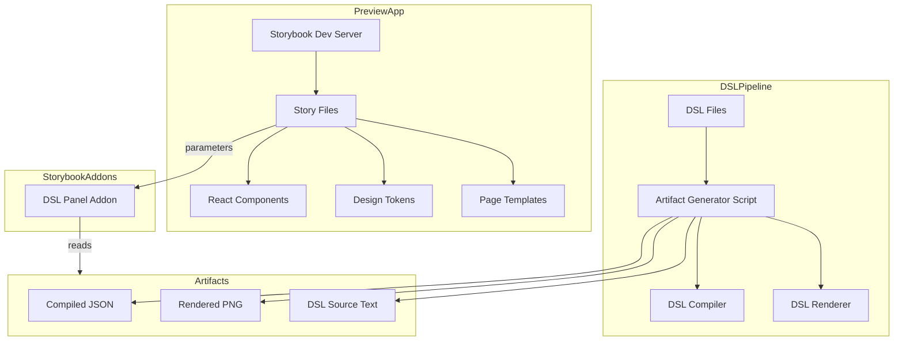
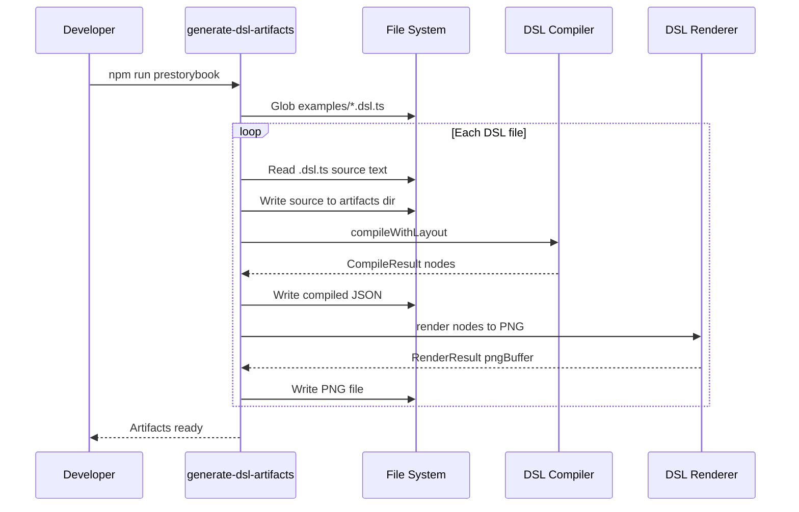
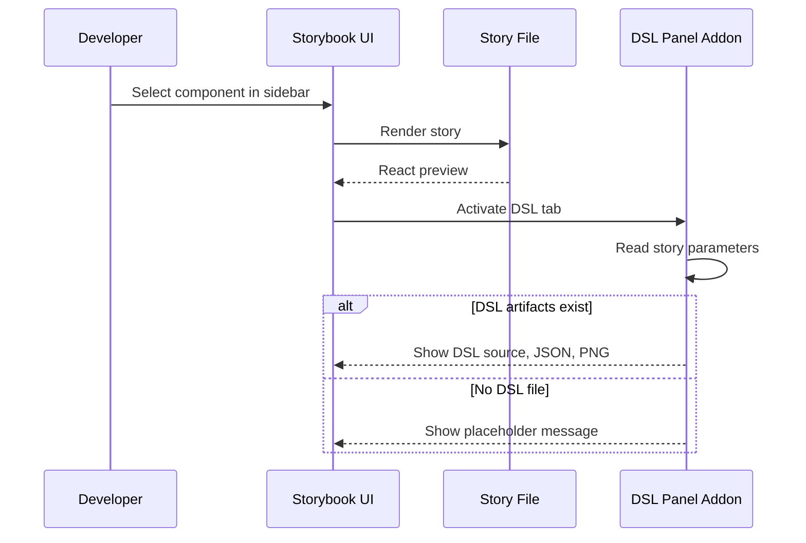

# Design Document — Component Catalog

## Overview

**Purpose**: This feature delivers a Storybook-based component catalog to component developers, designers, and AI Skills, enabling unified browsing, variant exploration, and DSL artifact inspection for all React components and page templates in the preview app.

**Users**: Component developers use the catalog to discover and interact with component variants, inspect DSL source and compiled JSON, and compare React vs. DSL-rendered outputs side-by-side. Designers review component visual states. AI Skills reference the catalog registry for component discovery.

**Impact**: Transforms the current manual navigation workflow (running dev server, switching tabs) into a structured, searchable, self-documenting component library with integrated DSL tooling.

### Goals
- Provide a single browsable catalog of all 25+ React components and 4 page templates
- Enable interactive variant exploration with auto-generated controls
- Display DSL source code, compiled JSON, and rendered PNG alongside React previews
- Automate component-to-DSL file association via naming convention
- Support static build for sharing and deployment

### Non-Goals
- Migrating the existing preview app away from Vite (Storybook runs alongside it)
- Auto-generating story files at runtime (stories are authored, not generated)
- Publishing the DSL addon to npm (local addon only)
- Design token browser addon (deferred to future specification)
- Visual regression testing integration (deferred)
- Standardizing Code Connect bindings across all components (separate concern)

## Architecture

> Background research and alternatives evaluation documented in `research.md`.

### Existing Architecture Analysis

The preview app (`preview/`) is a Vite 8 + React 19 + TypeScript 5.9 application with:
- 25 React components in `preview/src/components/{ComponentName}/` following a 3-file pattern (TSX, CSS Module, Code Connect)
- 4 page templates in `preview/src/pages/`
- Centralized design tokens in `tokens.css` (100+ CSS custom properties)
- Shared types in `types.ts`
- Path alias `@/` → `src/`

The DSL pipeline (`packages/`) provides:
- `@figma-dsl/compiler` — `compileWithLayout()` producing JSON node dictionaries
- `@figma-dsl/renderer` — `render()` producing PNG buffers via `@napi-rs/canvas`
- `@figma-dsl/cli` — `processBatch()` for batch compilation and rendering
- 5 DSL example files in `examples/*.dsl.ts`

**Constraint**: Compiler and renderer require Node-native `@napi-rs/canvas` — they cannot execute in browser context. DSL artifacts must be pre-generated.

### Architecture Pattern & Boundary Map



**Architecture Integration**:
- Selected pattern: **Storybook embedded in existing preview app** — Storybook reuses the preview app's Vite config, path aliases, and design tokens without duplication
- Domain boundaries: Story files (catalog concern) are separated from component source (component concern); DSL artifact generation is a build-time pipeline concern
- Existing patterns preserved: CSS Modules, design tokens, component 3-file pattern, monorepo workspace structure
- New components rationale: Story files document components; DSL Panel addon bridges DSL pipeline artifacts into Storybook UI; artifact generator script orchestrates pre-build compilation
- Steering compliance: No framework bloat (Storybook is the standard tool for this purpose); CSS Modules maintained; TypeScript strict mode; Node >= 22

### Technology Stack

| Layer | Choice / Version | Role in Feature | Notes |
|-------|------------------|-----------------|-------|
| Catalog Framework | Storybook 10.x | Component browsing, controls, docs | ESM-only; `@storybook/react-vite` framework |
| Framework Integration | `@storybook/react-vite` | Vite builder for Storybook | Auto-detects `vite.config.ts`, respects path aliases |
| Addon | `@storybook/addon-docs` | Autodocs, prop tables, controls | Included by default |
| Prop Extraction | `react-docgen` | Parse TypeScript props for controls | Default for Vite builder; faster than `react-docgen-typescript` |
| DSL Compilation | `@figma-dsl/compiler` | Generate JSON from DSL files | Existing package; Node-only |
| DSL Rendering | `@figma-dsl/renderer` | Generate PNG from compiled JSON | Existing package; Node-only (`@napi-rs/canvas`) |
| Build Orchestration | npm scripts | Pre-generate DSL artifacts | Runs before Storybook dev/build |

## System Flows

### DSL Artifact Generation Flow



### Story Rendering with DSL Panel



## Requirements Traceability

| Requirement | Summary | Components | Interfaces | Flows |
|-------------|---------|------------|------------|-------|
| 1.1 | Storybook as catalog framework | StorybookConfig | StorybookConfig interface | — |
| 1.2 | Auto-discover components | StorybookConfig, StoryFiles | stories glob pattern | — |
| 1.3 | Live interactive preview | StoryFiles | CSF meta + render | — |
| 1.4 | Hierarchical sidebar organization | StorybookConfig, StoryFiles | CSF title convention | — |
| 2.1 | Variant stories per component | StoryFiles | CSF args/argTypes | — |
| 2.2 | Interactive controls | StoryFiles | Storybook args system | — |
| 2.3 | All Variants grid story | StoryFiles, AllVariantsTemplate | AllVariantsGridProps | — |
| 3.1 | Pages section in sidebar | PageStoryFiles | CSF title "Pages/..." | — |
| 3.2 | Page templates as stories | PageStoryFiles | CSF render | — |
| 3.3 | Full-width page preview | PageStoryFiles, StorybookConfig | layout parameter | — |
| 3.4 | Viewport switching | StorybookConfig | addon-viewport config | — |
| 4.1 | DSL source display | DSLPanelAddon, ArtifactGenerator | DslArtifacts, PanelProps | Artifact Generation |
| 4.2 | Copy-to-clipboard for source | DSLPanelAddon | PanelProps | — |
| 4.3 | Placeholder when no DSL file | DSLPanelAddon | PanelProps | — |
| 5.1 | Compiled JSON display | DSLPanelAddon, ArtifactGenerator | DslArtifacts, PanelProps | Artifact Generation |
| 5.2 | JSON via compiler pipeline | ArtifactGenerator | CompileResult | Artifact Generation |
| 5.3 | JSON with indentation and highlighting | DSLPanelAddon | PanelProps | — |
| 5.4 | Copy-to-clipboard for JSON | DSLPanelAddon | PanelProps | — |
| 6.1 | DSL-rendered PNG display | DSLPanelAddon, ArtifactGenerator | DslArtifacts, PanelProps | Artifact Generation |
| 6.2 | PNG via renderer pipeline | ArtifactGenerator | RenderResult | Artifact Generation |
| 6.3 | Side-by-side React vs DSL | DSLPanelAddon | PanelProps, ViewMode | — |
| 6.4 | Toggle React/DSL/Side-by-side | DSLPanelAddon | ViewMode | — |
| 6.5 | Error display on render failure | DSLPanelAddon | DslArtifacts error field | — |
| 7.1 | Naming convention association | DslAssociationMap, ArtifactGenerator | DslAssociationConfig | — |
| 7.2 | Manual mapping override | DslAssociationMap | DslAssociationConfig | — |
| 7.3 | Auto-pickup of new DSL files | ArtifactGenerator | File glob pattern | Artifact Generation |

## Components and Interfaces

| Component | Domain/Layer | Intent | Req Coverage | Key Dependencies | Contracts |
|-----------|-------------|--------|--------------|------------------|-----------|
| StorybookConfig | Infrastructure | Configure Storybook framework, addons, and stories glob | 1.1, 1.2, 1.4, 3.4 | `@storybook/react-vite` (P0) | State |
| StoryFiles | UI/Catalog | Individual component story files with variants and controls | 1.2, 1.3, 2.1, 2.2, 2.3 | React components (P0), design tokens (P1) | — |
| PageStoryFiles | UI/Catalog | Page template story files with full-width layout | 3.1, 3.2, 3.3 | Page templates (P0) | — |
| ArtifactGenerator | Build/Pipeline | Pre-generate DSL source, compiled JSON, and PNG artifacts | 4.1, 5.1, 5.2, 6.1, 6.2, 7.1, 7.3 | `@figma-dsl/compiler` (P0), `@figma-dsl/renderer` (P0) | Service |
| DslAssociationMap | Build/Pipeline | Map React component names to DSL file paths | 7.1, 7.2 | File system (P1) | Service |
| DSLPanelAddon | UI/Addon | Custom Storybook panel displaying DSL source, JSON, and PNG | 4.1–4.3, 5.1–5.4, 6.1–6.5 | Storybook Manager API (P0) | State |
| AllVariantsTemplate | UI/Catalog | Shared utility rendering all variants of a component in a grid | 2.3 | React components (P0) | State |

### Build / Pipeline

#### ArtifactGenerator

| Field | Detail |
|-------|--------|
| Intent | Pre-generate DSL artifacts (source text, compiled JSON, rendered PNG) for consumption by Storybook stories |
| Requirements | 4.1, 5.1, 5.2, 6.1, 6.2, 7.1, 7.3 |

**Responsibilities & Constraints**
- Scan `examples/*.dsl.ts` for all DSL files
- For each file: read source text, compile to JSON via `compileWithLayout`, render to PNG via `render`
- Write artifacts to `preview/.storybook/dsl-artifacts/{component-name}/` (source.ts, compiled.json, rendered.png)
- Generate a manifest file (`dsl-manifest.json`) mapping component names to artifact paths
- Execute as a Node script before Storybook starts (via npm `prestorybook` hook)
- Handle compilation/rendering errors gracefully — record error message in manifest instead of failing the entire build

**Dependencies**
- Outbound: `@figma-dsl/compiler` — compile DSL nodes (P0)
- Outbound: `@figma-dsl/renderer` — render to PNG (P0)
- Outbound: `@figma-dsl/core` — DSL types and builder API (P0)
- External: File system — read DSL files, write artifacts (P1)

**Contracts**: Service [x]

##### Service Interface
```typescript
interface DslArtifact {
  componentName: string;
  dslFilePath: string;
  source: string;
  compiledJson: string | null;
  renderedPngPath: string | null;
  error: string | null;
}

interface DslManifest {
  generatedAt: string;
  artifacts: Record<string, DslArtifact>;
}

interface GenerateArtifactsOptions {
  dslDir: string;        // e.g., "examples/"
  outputDir: string;     // e.g., "preview/.storybook/dsl-artifacts/"
  overrides: Record<string, string>; // manual component→DSL mappings
}

function generateDslArtifacts(options: GenerateArtifactsOptions): Promise<DslManifest>;
```
- Preconditions: DSL files exist in `dslDir`; `@figma-dsl/compiler` and `@figma-dsl/renderer` packages are built
- Postconditions: Manifest and artifact files written to `outputDir`
- Invariants: One artifact entry per DSL file; errors recorded but do not halt generation

**Implementation Notes**
- Reuse `processBatch` from `@figma-dsl/cli` for compilation and rendering
- Association logic: convert PascalCase component name to kebab-case, match against `{name}.dsl.ts` or `{name}-*.dsl.ts` in examples directory
- Add to `.gitignore`: `preview/.storybook/dsl-artifacts/`
- **Build Coordination**: The `prestorybook` script must ensure monorepo packages are built before artifact generation. The script chain in `preview/package.json`:
  - `"prestorybook": "npm run build --workspace=packages && node scripts/generate-dsl-artifacts.mjs"`
  - This runs the root-level `tsc -b` build for all packages first, then generates artifacts
  - For `build-storybook` (static build), add a matching `prebuild-storybook` script with the same chain
  - Developers who have already built packages can skip the build step by running `node scripts/generate-dsl-artifacts.mjs` directly followed by `npx storybook dev`

#### DslAssociationMap

| Field | Detail |
|-------|--------|
| Intent | Resolve the mapping between React component names and DSL file paths using naming convention with manual override support |
| Requirements | 7.1, 7.2 |

**Responsibilities & Constraints**
- Convert PascalCase component names to kebab-case for matching (e.g., `PricingCard` → `pricing-card`)
- Glob `examples/` directory for `{kebab-name}.dsl.ts` or `{kebab-name}-*.dsl.ts` patterns
- Support manual overrides via a configuration object passed to the generator
- Return `null` when no association exists (component has no DSL file)

**Contracts**: Service [x]

##### Service Interface
```typescript
interface DslAssociationConfig {
  dslDir: string;
  overrides: Record<string, string>; // ComponentName → relative DSL file path
}

function resolveDslFile(componentName: string, config: DslAssociationConfig): string | null;
```

**Implementation Notes**
- Utility function consumed by ArtifactGenerator
- Pure function with no side effects beyond file system reads

### UI / Addon

#### DSLPanelAddon

| Field | Detail |
|-------|--------|
| Intent | Display DSL source code, compiled JSON, and rendered PNG in a dedicated Storybook panel tab |
| Requirements | 4.1–4.3, 5.1–5.4, 6.1–6.5 |

**Responsibilities & Constraints**
- Register as a Storybook panel addon in `.storybook/manager.ts`
- Read DSL artifact data from story `parameters.dsl` object
- Render three sub-panels: Source Code, Compiled JSON, Rendered PNG
- Provide copy-to-clipboard buttons for source and JSON
- Display side-by-side React vs. DSL view with toggle (React only / DSL only / Side-by-side)
- Show placeholder when no DSL file exists for a component
- Show error message when DSL compilation or rendering failed

**Dependencies**
- Inbound: Story parameters — DSL artifact data (P0)
- External: `storybook/manager-api` — addon registration, `useParameter` hook (P0)
- External: `storybook/internal/components` — `AddonPanel`, `SyntaxHighlighter` (P1)

**Contracts**: State [x]

##### State Management
```typescript
type ViewMode = 'react' | 'dsl' | 'side-by-side';

interface DslPanelParameters {
  source: string | null;
  compiledJson: string | null;
  renderedPngUrl: string | null;
  error: string | null;
}

// Story-level parameter interface
// Set via: parameters: { dsl: DslPanelParameters }

// Panel-local state
interface DslPanelState {
  activeTab: 'source' | 'json' | 'preview';
  viewMode: ViewMode;
  jsonExpanded: boolean;
}
```
- State model: Panel-local state for active tab and view mode; DSL data from story parameters
- Persistence: None (panel state resets on story change)
- Concurrency: Single-user UI, no concurrent state concerns

**Implementation Notes**
- Use `useParameter<DslPanelParameters>('dsl')` to read per-story DSL data
- Syntax highlighting: use Storybook's built-in `SyntaxHighlighter` component (supports TypeScript, JSON)
- Copy-to-clipboard: use `navigator.clipboard.writeText()` with visual feedback
- PNG display: `` tag with artifact URL served from Storybook's static directory
- Side-by-side view: flexbox layout with labeled columns
- Register with `paramKey: 'dsl'` so the panel can be disabled per-story via `parameters: { dsl: { disable: true } }`

### UI / Catalog

#### StoryFiles (Component Stories)

| Field | Detail |
|-------|--------|
| Intent | CSF story files for each React component providing variant exploration, interactive controls, and DSL parameter injection |
| Requirements | 1.2, 1.3, 2.1, 2.2, 2.3 |

**Summary-only**: Presentational story files following CSF 3 format. Each file:
- Exports a `meta` object with `title: 'Components/{ComponentName}'`, `component`, `tags: ['autodocs']`, and `parameters.dsl` (if DSL artifacts exist)
- Exports named stories for key variants (e.g., `Primary`, `Secondary`, `AllSizes`)
- Exports an `AllVariants` story using `AllVariantsTemplate` utility
- Uses `args` and `argTypes` for interactive controls derived from component props

**Artifact Import Strategy**: Story files consume DSL artifacts via a shared `createDslParameters()` helper that synchronously reads the pre-generated manifest at module scope. The manifest is a JSON file imported using Vite's JSON import support (`import manifest from '../.storybook/dsl-artifacts/manifest.json'`). The helper resolves DSL data for a given component name and returns a `DslStoryParameters` object (or `null` fields when no DSL file exists). This approach:
- Avoids dynamic imports or fetch calls
- Fails fast at Storybook startup if artifacts are missing (clear error message)
- Works identically in dev and static builds

```typescript
// preview/src/stories/dsl-helpers.ts
import type { DslManifestFile } from './types';
import manifest from '../.storybook/dsl-artifacts/manifest.json';

interface DslStoryParameters {
  source: string | null;
  compiledJson: string | null;
  renderedPngUrl: string | null;
  error: string | null;
}

function createDslParameters(componentName: string): DslStoryParameters {
  const typedManifest = manifest as DslManifestFile;
  const kebabName = componentName
    .replace(/([a-z])([A-Z])/g, '$1-$2')
    .toLowerCase();
  const artifact = typedManifest.artifacts[kebabName];
  if (!artifact) {
    return { source: null, compiledJson: null, renderedPngUrl: null, error: null };
  }
  return {
    source: artifact.sourcePath ? /* read inline during generation */ artifact.source ?? null : null,
    compiledJson: artifact.compiledJson ?? null,
    renderedPngUrl: artifact.pngPath ? `/dsl-artifacts/${kebabName}/rendered.png` : null,
    error: artifact.error ?? null,
  };
}
```

**Manifest Type Declaration**: Add a `dsl-artifacts.d.ts` file in `preview/src/` declaring the JSON module type so TypeScript resolves the import without errors:
```typescript
declare module '**/dsl-artifacts/manifest.json' {
  const manifest: import('./stories/types').DslManifestFile;
  export default manifest;
}
```

#### PageStoryFiles (Page Template Stories)

| Field | Detail |
|-------|--------|
| Intent | Story files for page templates displayed at full width with viewport switching |
| Requirements | 3.1, 3.2, 3.3, 3.4 |

**Summary-only**: CSF story files for each page template in `preview/src/pages/`. Each file:
- Uses `title: 'Pages/{PageName}'` for sidebar grouping
- Sets `parameters.layout: 'fullscreen'` for full-width rendering
- Renders the page component directly without wrapper
- Viewport switching provided by `@storybook/addon-viewport` (included in Storybook defaults)

#### AllVariantsTemplate

| Field | Detail |
|-------|--------|
| Intent | Shared utility that renders all meaningful variant combinations of a component in a grid layout |
| Requirements | 2.3 |

**Contracts**: State [x]

##### Interface Contract
```typescript
interface VariantAxis<V = string | number | boolean> {
  prop: string;       // Prop name (e.g., 'variant', 'size', 'disabled')
  values: V[];        // All values to render (e.g., ['primary', 'secondary', 'outline'])
  labels?: string[];  // Optional display labels (defaults to String(value))
}

interface AllVariantsGridProps<C extends React.ComponentType<Record<string, unknown>>> {
  component: C;
  axes: VariantAxis[];           // 1-2 axes: rows × columns (single axis = single row)
  baseProps?: Partial<React.ComponentProps<C>>; // Shared props applied to every cell
  cellStyle?: React.CSSProperties;             // Optional per-cell sizing override
}
```

**Behavior**:
- Single axis: renders a horizontal row of variants with labels above each cell
- Two axes: renders a grid where rows = first axis, columns = second axis, with row/column headers
- Each cell renders the component with `{...baseProps, [axis.prop]: value}` for each axis combination
- Labels default to `String(value)` (e.g., `true` → `"true"`, `'primary'` → `"primary"`)
- Used in each component's `AllVariants` story export

### Infrastructure

#### StorybookConfig

| Field | Detail |
|-------|--------|
| Intent | Configure Storybook framework, story discovery, addons, and static directories |
| Requirements | 1.1, 1.2, 1.4, 3.4 |

**Summary-only**: Configuration files in `preview/.storybook/`:

| File | Purpose |
|------|---------|
| `main.ts` | Framework (`@storybook/react-vite`), stories glob, addons list, `staticDirs` for DSL artifacts |
| `preview.ts` | Global decorators (tokens.css import), `tags: ['autodocs']`, viewport addon config |
| `manager.ts` | DSL Panel addon registration |

**Implementation Note**: Use `viteFinal` in `main.ts` to ensure path alias `@/` is preserved from `vite.config.ts`. Add `staticDirs: ['./dsl-artifacts']` so PNG files are served by Storybook's dev server.

## Data Models

### Domain Model

The feature introduces no persistent data storage. All data flows through file-system artifacts.

**Key Entities**:
- **DslArtifact**: Value object representing a compiled DSL file's outputs (source, JSON, PNG, error)
- **DslManifest**: Aggregate root mapping component names to their DslArtifact entries
- **StoryParameters**: Value object injected into CSF story meta for DSL panel consumption

**Invariants**:
- Each DSL file produces exactly one DslArtifact entry
- A component may have zero or one associated DslArtifact
- Manifest is regenerated entirely on each build (no incremental updates)

### Data Contracts & Integration

**Story Parameter Schema** (passed via CSF `parameters.dsl`):
```typescript
interface DslStoryParameters {
  source: string | null;       // Raw DSL source code text
  compiledJson: string | null;  // Pretty-printed compiled JSON
  renderedPngUrl: string | null; // Static URL path to rendered PNG
  error: string | null;         // Compilation/rendering error message
}
```

**Manifest Schema** (generated file at `preview/.storybook/dsl-artifacts/manifest.json`):
```typescript
interface DslManifestFile {
  generatedAt: string;          // ISO 8601 timestamp
  artifacts: Record<string, {   // Keyed by kebab-case component name
    componentName: string;
    dslFilePath: string;
    sourcePath: string;
    jsonPath: string | null;
    pngPath: string | null;
    error: string | null;
  }>;
}
```

## Error Handling

### Error Strategy
Errors are categorized by source and handled with graceful degradation — a failing DSL file never prevents the rest of the catalog from functioning.

### Error Categories and Responses

**DSL Compilation Errors**: Invalid DSL syntax or missing dependencies → ArtifactGenerator records error in manifest; DSLPanelAddon displays error message with the failure reason (4.3, 6.5)

**DSL Rendering Errors**: Canvas or font issues → ArtifactGenerator records error; panel shows error instead of PNG (6.5)

**Missing DSL Association**: Component has no matching DSL file → Panel shows placeholder "No DSL definition exists yet" (4.3)

**Storybook Configuration Errors**: Invalid config or missing dependencies → Standard Storybook error output in terminal

### Monitoring
- Artifact generation script outputs summary: total files processed, successes, failures
- Failed compilations/renders logged to stderr with file path and error message

## Testing Strategy

### Unit Tests
- `DslAssociationMap`: PascalCase-to-kebab conversion, glob matching, override behavior, null for unmatched
- `ArtifactGenerator`: Manifest generation with mock compiler/renderer, error recording, file output structure
- `AllVariantsTemplate`: Renders correct number of grid cells for given variant definitions

### Integration Tests
- Full artifact generation pipeline: real DSL files → compiler → renderer → artifacts on disk
- Manifest schema validation: generated manifest matches expected structure
- Story parameter injection: manifest data correctly populates `parameters.dsl`

### E2E/UI Tests
- Storybook starts successfully with all stories loaded
- Component story renders interactive controls
- DSL Panel displays source code for components with DSL files
- DSL Panel shows placeholder for components without DSL files
- Page template stories render at full width
- Copy-to-clipboard functions correctly

## Optional Sections

### Performance & Scalability

**Artifact Generation**: With 5 DSL files, generation completes in under 5 seconds. The batch approach scales linearly. For future growth beyond 50 DSL files, consider parallel compilation using worker threads.

**Storybook Startup**: Story discovery is file-glob based and unaffected by artifact count. DSL parameters are static imports, adding negligible overhead.

**Static Build**: `build-storybook` produces a static site. DSL artifacts are included as static assets, requiring no runtime compilation.
