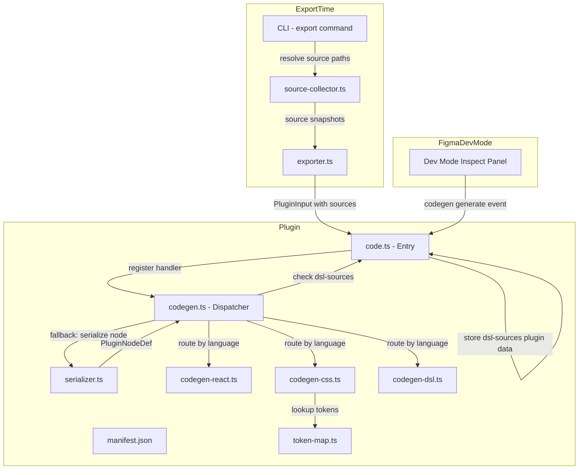
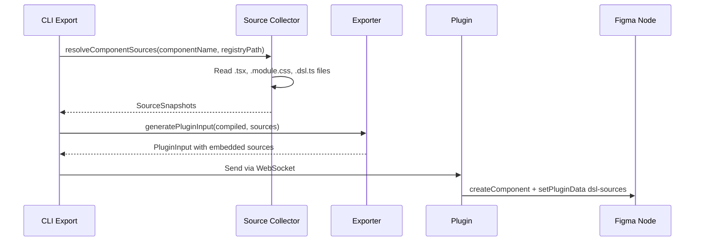
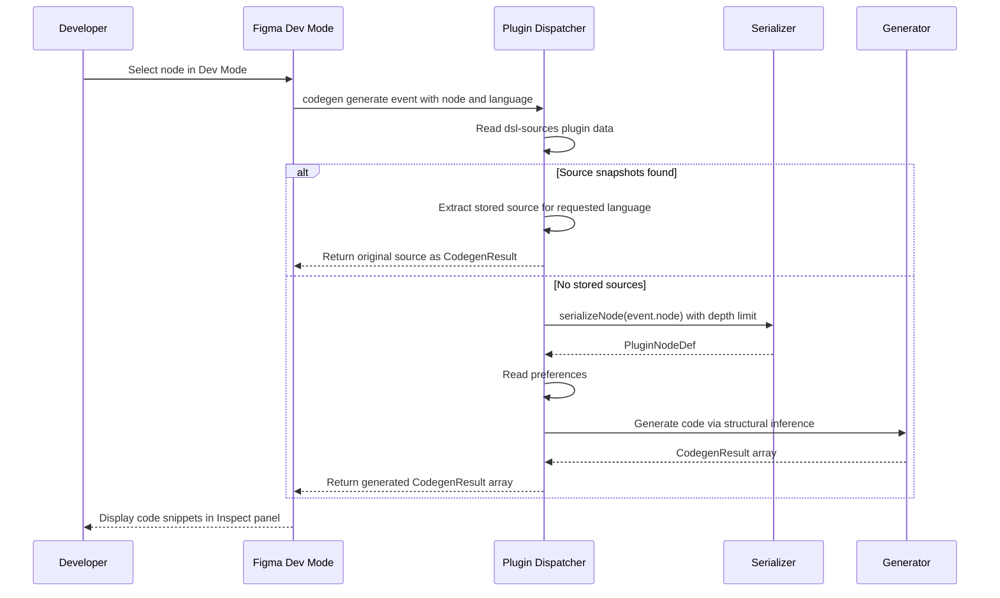

# Design Document: Dev Mode Codegen Plugin

## Overview

**Purpose**: This feature adds Figma Dev Mode codegen capabilities to the existing `@figma-dsl/plugin` package, enabling developers inspecting Figma components to see generated React TSX, CSS Module, and DSL definition code snippets directly in the Inspect panel.

**Users**: Developers using Figma's Dev Mode to inspect components will see code snippets corresponding to the selected node — whether the node was created via DSL export or designed manually.

**Impact**: Extends the existing plugin manifest and codebase without modifying current import/sync functionality.

### Goals
- Display original React TSX, CSS Module, and DSL source code for DSL-exported nodes via embedded source snapshots
- Generate structural code snippets as fallback for manually-created Figma nodes without stored sources
- Leverage existing `serializeNode()` and `PluginNodeDef` infrastructure for fallback generation
- Support configurable preferences (unit system, naming convention)
- Complete code generation within the 3-second Figma API timeout

### Non-Goals
- Fuzzy/approximate token matching (exact match only)
- Generating complete multi-file project scaffolds
- Supporting arbitrary custom languages beyond React, CSS, and DSL
- Automatic source refresh after local file edits (snapshots are point-in-time; re-export updates them)

## Architecture

### Existing Architecture Analysis

The plugin currently operates as a design-mode plugin (`editorType: ["figma"]`) with:
- **Import pipeline**: Receives `PluginInput` JSON via UI postMessage → creates Figma nodes
- **Edit tracking**: Stores `dsl-baseline` and `dsl-identity` plugin data on created nodes
- **Sync**: WebSocket connection to MCP server on localhost:9800
- **Serializer**: Extracted `serializer.ts` reads Figma nodes → `PluginNodeDef` (unit-testable via `SerializableNode` interface)

**Key architectural insight**: The existing `dsl-identity` plugin data only stores `componentName`, `dslSourcePath` (filename only), `importTimestamp`, and `originalNodeId`. No original source code is stored. The `PluginInput` type also carries zero source references.

The codegen feature introduces a **two-tier strategy**:
1. **Source-embedded tier** (primary): Extend `ComponentIdentity` and the export pipeline to embed original React TSX, CSS Module, and DSL source code as snapshots in plugin data during export. Codegen reads these snapshots directly — no reverse-engineering needed.
2. **Structural inference tier** (fallback): For nodes without stored sources (manually created in Figma), generate code by analyzing node properties via `serializeNode()`.

### Architecture Pattern & Boundary Map



**Architecture Integration**:
- Selected pattern: **Source-embedded codegen with structural fallback** — original source code is stored in Figma plugin data at export time; generators prefer stored sources, falling back to node-based inference
- Write path (export-time): CLI resolves source file paths from component registry → `source-collector.ts` reads file contents → exporter embeds in `PluginInput` → plugin stores as `dsl-sources` plugin data
- Read path (codegen-time): Dispatcher checks `dsl-sources` plugin data first → if found, returns original source directly → if absent, falls back to `serializeNode()` + structural code generation
- Existing patterns preserved: esbuild → IIFE bundle, `SerializableNode` interface for testing, plugin data for metadata storage
- New components rationale: `source-collector.ts` in CLI/exporter handles source resolution (runs on disk, not in Figma sandbox); dispatcher and generators handle the two-tier strategy
- Steering compliance: Single responsibility per module, typed interfaces, no framework bloat

### Technology Stack

| Layer | Choice / Version | Role in Feature | Notes |
|-------|------------------|-----------------|-------|
| Plugin Runtime | Figma Plugin API (Codegen) | `figma.codegen.on("generate")` event handling | Part of existing `@figma/plugin-typings ^1.0.0` |
| Bundler | esbuild | Bundle new modules into existing IIFE output | Existing build pipeline, no changes |
| Types | `@figma-dsl/core` | `PluginNodeDef` type shared with serializer | Existing dependency |
| Testing | vitest | Unit tests for each generator module | Existing test infrastructure |

## System Flows

### Flow 1: Source Embedding at Export Time



### Flow 2: Codegen in Dev Mode (Two-Tier)



Key decisions:
- **Source-first**: When `dsl-sources` plugin data exists, the dispatcher returns stored source code directly — no serialization or generation needed. This is instant and produces exact original code.
- **Fallback**: When no stored sources exist (manually created nodes), the dispatcher falls back to `serializeNode()` + structural code generation via the language-specific generators.
- Depth limiting (max 50 descendants) applies only to the fallback path.
- Preferences (rem/px, naming) apply only to the fallback CSS generation; stored CSS sources are returned as-is.

## Requirements Traceability

| Requirement | Summary | Components | Interfaces | Flows |
|-------------|---------|------------|------------|-------|
| 1.1–1.4 | Manifest codegen config | manifest.json | — | — |
| 2.1 | React from DSL identity | codegen.ts, source-collector.ts | `SourceSnapshots`, `CodegenContext` | Export flow, Codegen flow (source-first) |
| 2.2 | React from stored source code | codegen.ts | `SourceSnapshots` | Codegen flow (source-first) |
| 2.3 | React structural inference | codegen-react.ts | `generateReact()` | Codegen flow (fallback) |
| 2.4 | CodegenResult format | codegen.ts | `CodegenResult` | Codegen flow |
| 3.1–3.2 | CSS from stored source or node + token lookup | codegen.ts, codegen-css.ts, token-map.ts | `SourceSnapshots`, `generateCSS()` | Codegen flow (both tiers) |
| 3.3 | CSS flexbox from auto-layout | codegen-css.ts | `generateCSS()` | Codegen flow (fallback) |
| 3.4 | CSS CodegenResult format | codegen.ts | `CodegenResult` | Codegen flow |
| 4.1–4.3 | DSL from stored source or serialized node | codegen.ts, codegen-dsl.ts | `SourceSnapshots`, `generateDSL()` | Codegen flow (both tiers) |
| 4.4 | DSL CodegenResult format | codegen.ts | `CodegenResult` | Codegen flow |
| 5.1–5.4 | Codegen preferences | manifest.json, codegen.ts | `CodegenPreferences` | Codegen flow (fallback only) |
| 6.1–6.3 | Multi-section output | codegen-react.ts | `CodegenResult[]` | Codegen flow (fallback) |
| 7.1–7.4 | Performance and error handling | codegen.ts | — | Codegen flow |

## Components and Interfaces

| Component | Domain/Layer | Intent | Req Coverage | Key Dependencies | Contracts |
|-----------|-------------|--------|--------------|------------------|-----------|
| manifest.json | Config | Declare codegen capabilities and preferences | 1.1–1.4, 5.1–5.3 | — | — |
| source-collector.ts | CLI/Exporter | Resolve and read component source files at export time | 2.1, 2.2 | component-registry (P1), fs (P0) | Service |
| Extended PluginInput | dsl-core / Types | Carry source snapshots from exporter to plugin | 2.1, 2.2, 3.1, 4.1 | — | State |
| Extended ComponentIdentity | dsl-core / Types | Store source snapshots in plugin data | 2.1, 2.2, 3.1, 4.1 | — | State |
| codegen.ts | Plugin / Dispatcher | Two-tier dispatch: stored sources first, structural inference fallback | 2.1–2.4, 3.4, 4.4, 5.4, 7.1–7.4 | serializer.ts (P0), generators (P0) | Service |
| codegen-react.ts | Plugin / Generator | Structural React TSX generation (fallback tier) | 2.3, 6.1–6.3 | codegen.ts (P0) | Service |
| codegen-css.ts | Plugin / Generator | Structural CSS Module generation (fallback tier) | 3.1–3.4 | codegen.ts (P0), token-map.ts (P1) | Service |
| codegen-dsl.ts | Plugin / Generator | Structural DSL generation (fallback tier) | 4.1–4.4 | codegen.ts (P0) | Service |
| token-map.ts | Plugin / Data | Static map of design token values to CSS custom property names | 3.2 | — | State |

### Plugin / Config

#### manifest.json

| Field | Detail |
|-------|--------|
| Intent | Declare codegen capabilities, supported languages, and preferences for Dev Mode |
| Requirements | 1.1, 1.2, 1.3, 1.4, 5.1, 5.2, 5.3 |

**Responsibilities & Constraints**
- Declare `editorType: ["figma", "dev"]` to support both design and Dev Mode
- Define `capabilities: ["codegen"]` to enable codegen API
- Declare `codegenLanguages` with React, CSS, and DSL entries
- Define `codegenPreferences` for unit system and naming convention

**Implementation Notes**
- The `"vscode"` capability mentioned in Figma docs is optional; include only if VS Code extension integration is planned
- `editorType` array supports both values simultaneously — existing import/sync features are unaffected

##### Manifest Schema

```json
{
  "name": "Figma DSL Import",
  "id": "figma-dsl-import-plugin",
  "api": "1.0.0",
  "main": "dist/code.js",
  "editorType": ["figma", "dev"],
  "capabilities": ["codegen"],
  "permissions": ["currentuser"],
  "codegenLanguages": [
    { "label": "React", "value": "react" },
    { "label": "CSS Module", "value": "css" },
    { "label": "DSL", "value": "dsl" }
  ],
  "codegenPreferences": [
    {
      "itemType": "unit",
      "scaledUnit": "rem",
      "defaultScaleFactor": 16,
      "default": false,
      "includedLanguages": ["css"]
    },
    {
      "itemType": "select",
      "propertyName": "naming",
      "label": "CSS Class Naming",
      "options": [
        { "label": "camelCase", "value": "camelCase", "isDefault": true },
        { "label": "kebab-case", "value": "kebab-case" }
      ],
      "includedLanguages": ["css"]
    }
  ],
  "networkAccess": {
    "allowedDomains": ["http://localhost", "ws://localhost:9800"],
    "reasoning": "WebSocket connection to local MCP server for real-time sync"
  }
}
```

### CLI/Exporter / Source Collection

#### source-collector.ts

| Field | Detail |
|-------|--------|
| Intent | Resolve and read component source files (React TSX, CSS Module, DSL) at export time |
| Requirements | 2.1, 2.2 |

**Responsibilities & Constraints**
- Given a component name and base path, resolve the 3-file pattern: `{Name}.tsx`, `{Name}.module.css`, `{Name}.dsl.ts`
- Read file contents as strings
- Return a `SourceSnapshots` object with the source code for each file found
- Gracefully handle missing files (not all components have all 3 files)
- Runs in Node.js (CLI/exporter context), NOT in Figma sandbox

**Dependencies**
- Inbound: CLI export command or exporter — provides component name and search paths (P0)
- External: Node.js `fs` — file reading (P0)

**Contracts**: Service [x]

##### Service Interface

```typescript
interface SourceSnapshots {
  readonly react?: string;    // .tsx file content
  readonly css?: string;      // .module.css file content
  readonly dsl?: string;      // .dsl.ts file content
  readonly paths?: {
    readonly react?: string;  // resolved file path
    readonly css?: string;
    readonly dsl?: string;
  };
}

function collectComponentSources(
  componentName: string,
  searchPaths: readonly string[],
): SourceSnapshots;
```

- Preconditions: `componentName` is non-empty; `searchPaths` contains valid directory paths
- Postconditions: Returns `SourceSnapshots` with at least one source populated (or empty object if no files found)

**Implementation Notes**
- Search order: `preview/src/components/{Name}/` first, then `examples/` for `.dsl.ts` files
- File size guard: Skip files larger than 50KB to avoid bloating plugin data (log warning)
- This module lives in `packages/exporter/src/` or `packages/cli/src/`, NOT in `packages/plugin/`

### dsl-core / Extended Types

#### SourceSnapshots and Extended ComponentIdentity

| Field | Detail |
|-------|--------|
| Intent | Define types for source code storage in PluginInput and plugin data |
| Requirements | 2.1, 2.2, 3.1, 4.1 |

**Responsibilities & Constraints**
- Extend `ComponentIdentity` with optional `sources: SourceSnapshots` field
- Extend `PluginInput` with optional `componentSources` map (component name → `SourceSnapshots`)
- Backward-compatible: existing code that creates `ComponentIdentity` or `PluginInput` without sources continues to work
- Plugin stores sources in a separate plugin data key `dsl-sources` (not inside `dsl-identity`) to respect the 100KB per-key limit

**Contracts**: State [x]

##### State Management

```typescript
// Extended ComponentIdentity (backward-compatible)
interface ComponentIdentity {
  readonly componentName: string;
  readonly dslSourcePath: string;
  readonly importTimestamp: string;
  readonly originalNodeId: string;
  readonly sources?: SourceSnapshots;  // NEW: embedded source code
}

// Extended PluginInput (backward-compatible)
interface PluginInput {
  readonly schemaVersion: string;
  readonly targetPage: string;
  readonly components: ReadonlyArray<PluginNodeDef>;
  readonly resolveExisting?: boolean;
  readonly componentSources?: ReadonlyMap<string, SourceSnapshots>;  // NEW
}

// Plugin data key for source storage
const PLUGIN_DATA_SOURCES = 'dsl-sources';
```

- Persistence: Stored as JSON in Figma plugin data via `node.setPluginData('dsl-sources', ...)`
- Size constraint: 100KB limit per plugin data key; source-collector skips files > 50KB; if total serialized sources exceed 100KB, store only DSL source (smallest) and log warning

### Plugin / Dispatcher

#### codegen.ts

| Field | Detail |
|-------|--------|
| Intent | Two-tier codegen dispatcher: return stored source code when available, fall back to structural generation |
| Requirements | 2.1–2.4, 3.4, 4.4, 5.4, 7.1, 7.2, 7.3, 7.4 |

**Responsibilities & Constraints**
- Register `figma.codegen.on("generate")` handler in plugin initialization
- **Primary path**: Read `dsl-sources` plugin data from the selected node; if source for the requested language exists, return it directly as a `CodegenResult`
- **Fallback path**: If no stored sources, serialize the node using `serializeNode()` with depth limiting, then route to the appropriate structural generator
- Read `dsl-identity` and `dsl-baseline` plugin data for metadata-aware fallback generation
- Read preferences via `figma.codegen.preferences` (applied only in fallback path)
- Wrap all logic in try/catch to return error `CodegenResult` instead of throwing
- Never call `figma.showUI()` inside the generate callback

**Dependencies**
- Inbound: Figma codegen API — generate event source (P0)
- Outbound: `serializer.ts` — node serialization for fallback path (P0)
- Outbound: `codegen-react.ts`, `codegen-css.ts`, `codegen-dsl.ts` — structural generators for fallback path (P0)

**Contracts**: Service [x]

##### Service Interface

```typescript
interface CodegenContext {
  readonly node: PluginNodeDef;
  readonly identity: ComponentIdentity | null;
  readonly baseline: PluginNodeDef | null;
  readonly sources: SourceSnapshots | null;  // NEW: stored source code
  readonly preferences: CodegenPreferences;
  readonly truncated: boolean;
}

interface CodegenPreferences {
  readonly unit: 'px' | 'rem';
  readonly scaleFactor: number;
  readonly naming: 'camelCase' | 'kebab-case';
}

interface CodegenResultEntry {
  readonly title: string;
  readonly language: string;
  readonly code: string;
}

// Dispatcher function — registered as the generate callback
function handleCodegenEvent(event: CodegenEvent): CodegenResultEntry[];

// Depth-limited serialization wrapper (fallback path only)
function serializeWithDepthLimit(
  node: SceneNode,
  maxDescendants: number,
): { def: PluginNodeDef; truncated: boolean };

// Language-to-source mapping
function getStoredSource(
  sources: SourceSnapshots,
  language: string,
): string | undefined;
```

- Preconditions: `event.node` is a valid SceneNode; `event.language` matches a registered language value
- Postconditions: Returns non-empty `CodegenResult[]`; never throws
- Invariants: Total execution time < 3 seconds; `figma.showUI()` is never called; stored sources are returned without modification

### Plugin / Generators

#### codegen-react.ts

| Field | Detail |
|-------|--------|
| Intent | Structural React TSX generation from Figma node properties (fallback tier — used only when no stored source exists) |
| Requirements | 2.3, 6.1, 6.2, 6.3 |

**Responsibilities & Constraints**
- Generate structural React TSX from arbitrary nodes by mapping: FRAME → `<div>`, TEXT → `<span>/<p>`, RECTANGLE/ELLIPSE → `<div>` with styles, auto-layout → flexbox container
- When `identity` is present (DSL-exported but sources missing), use stored component name for import and JSX tag
- Return multi-section output: imports section, props interface section, component body section
- For component sets with variants, generate variant props type with union literals

**Dependencies**
- Inbound: `codegen.ts` — dispatches `CodegenContext` only when no stored source (P0)

**Contracts**: Service [x]

##### Service Interface

```typescript
function generateReact(context: CodegenContext): CodegenResultEntry[];
```

- Preconditions: `context.node` is a valid `PluginNodeDef`; `context.sources` is null (dispatcher handles source-first path)
- Postconditions: Returns 1–3 `CodegenResultEntry` items (imports, props, component body)

**Implementation Notes**
- Node type → JSX element mapping: `FRAME` → `<div>`, `TEXT` → `<span>`, `RECTANGLE` → `<div>`, `ELLIPSE` → `<div>`, `COMPONENT` → named component, `INSTANCE` → component reference
- When `identity` is present, use stored component name for import and JSX tag
- When `identity` is absent, derive component name from `node.name` (PascalCase)

#### codegen-css.ts

| Field | Detail |
|-------|--------|
| Intent | Structural CSS Module generation from Figma node properties (fallback tier) |
| Requirements | 3.1, 3.2, 3.3, 3.4 |

**Responsibilities & Constraints**
- Extract visual properties from `PluginNodeDef`: fills → `background-color`/`background`, strokes → `border`, cornerRadius → `border-radius`, opacity, size → `width`/`height`
- Map auto-layout to flexbox: `stackMode: "HORIZONTAL"` → `flex-direction: row`, `"VERTICAL"` → `column`, `itemSpacing` → `gap`, padding properties, alignment → `justify-content`/`align-items`
- Map text properties: `fontSize` → `font-size`, `fontFamily` → `font-family`, `fontWeight` → `font-weight`, `textAlignHorizontal` → `text-align`
- Apply preferences: use `rem` or `px` units; use camelCase or kebab-case class names
- Reference design tokens via `token-map.ts` when values match exactly

**Dependencies**
- Inbound: `codegen.ts` — dispatches `CodegenContext` (P0)
- Outbound: `token-map.ts` — token value lookup (P1)

**Contracts**: Service [x]

##### Service Interface

```typescript
function generateCSS(context: CodegenContext): CodegenResultEntry[];
```

- Preconditions: `context.node` is a valid `PluginNodeDef`; `context.preferences` has valid unit and naming values
- Postconditions: Returns 1 `CodegenResultEntry` with CSS Module content

**Implementation Notes**
- Figma alignment mapping: `primaryAxisAlignItems: "MIN"` → `justify-content: flex-start`, `"CENTER"` → `center`, `"MAX"` → `flex-end`, `"SPACE_BETWEEN"` → `space-between`; `counterAxisAlignItems: "MIN"` → `align-items: flex-start`, `"CENTER"` → `center`, `"MAX"` → `flex-end`
- Color conversion: Figma `{r, g, b}` (0–1 floats) → hex string for token lookup, then CSS `rgb()` or token reference
- When `unit === 'rem'`: divide pixel values by `scaleFactor` and append `rem`

#### codegen-dsl.ts

| Field | Detail |
|-------|--------|
| Intent | Structural DSL builder API generation from serialized Figma node (fallback tier) |
| Requirements | 4.1, 4.2, 4.3, 4.4 |

**Responsibilities & Constraints**
- Convert `PluginNodeDef` to DSL builder syntax: type-to-function mapping (`FRAME` → `frame()`, `TEXT` → `text()`, `RECTANGLE` → `rectangle()`, `ELLIPSE` → `ellipse()`, `COMPONENT` → `component()`, `COMPONENT_SET` → `componentSet()`)
- Format fills as DSL color calls: solid fills → `solid('#hex')`, gradients → `gradient([...stops])`
- Format auto-layout as layout helpers: `stackMode: "HORIZONTAL"` → `horizontal({...})`, `"VERTICAL"` → `vertical({...})`
- When `baseline` is available in context, use it as source instead of the serialized node
- Format output as indented, valid TypeScript

**Dependencies**
- Inbound: `codegen.ts` — dispatches `CodegenContext` (P0)

**Contracts**: Service [x]

##### Service Interface

```typescript
function generateDSL(context: CodegenContext): CodegenResultEntry[];
```

- Preconditions: `context.node` is a valid `PluginNodeDef`
- Postconditions: Returns 1 `CodegenResultEntry` with formatted DSL TypeScript code

**Implementation Notes**
- Recursive: each child node generates a nested DSL call
- Indentation: 2-space indent per nesting level
- Import statement: include `import { frame, text, ... } from '@figma-dsl/core';` based on used node types
- When `baseline` exists, prefer it over serialized node data (it represents the original DSL definition)

### Plugin / Data

#### token-map.ts

| Field | Detail |
|-------|--------|
| Intent | Provide a static lookup map from raw CSS values to design token custom property names |
| Requirements | 3.2 |

**Responsibilities & Constraints**
- Export a color map: hex string → CSS custom property name (e.g., `'#7c3aed' → 'var(--color-primary)'`)
- Export a spacing map: pixel value → CSS custom property name (e.g., `8 → 'var(--space-2)'`)
- Export a radius map: pixel value → CSS custom property name (e.g., `6 → 'var(--radius-sm)'`)
- Maps are static (no runtime computation); values sourced from `preview/src/components/tokens.css`

**Contracts**: State [x]

##### State Management

```typescript
// Color tokens: hex (lowercase, no alpha) → CSS custom property
const COLOR_TOKENS: ReadonlyMap<string, string>;

// Spacing tokens: pixel value → CSS custom property
const SPACING_TOKENS: ReadonlyMap<number, string>;

// Radius tokens: pixel value → CSS custom property
const RADIUS_TOKENS: ReadonlyMap<number, string>;

// Lookup functions
function lookupColorToken(hex: string): string | undefined;
function lookupSpacingToken(px: number): string | undefined;
function lookupRadiusToken(px: number): string | undefined;
```

- Persistence: Static data, no runtime mutation
- Consistency: Maps are read-only; values derived from `tokens.css` at authoring time

## Data Models

### Domain Model

The codegen feature introduces one new persistent data type and extends two existing types:

- **`SourceSnapshots`** (NEW, in `@figma-dsl/core`): Stores original React TSX, CSS Module, and DSL source code strings with optional file paths. Stored as `dsl-sources` plugin data on Figma nodes.
- **`ComponentIdentity`** (EXTENDED, in `@figma-dsl/core`): Adds optional `sources: SourceSnapshots` field. Backward-compatible.
- **`PluginInput`** (EXTENDED, in `@figma-dsl/core`): Adds optional `componentSources` map for carrying source snapshots from exporter to plugin. Backward-compatible.
- **`PluginNodeDef`** (UNCHANGED): Serialized Figma node used in fallback code generation
- **`CodegenResult`** (from Figma Plugin API): Output format `{ title, language, code }`

### Data Contracts & Integration

**Export-time Input** (from CLI/exporter):
- `PluginInput.componentSources`: Map of component name → `SourceSnapshots`
- Source snapshots are embedded in the PluginInput JSON sent to the plugin via WebSocket

**Plugin Data Storage** (in Figma):
- `dsl-sources` plugin data key: JSON-serialized `SourceSnapshots` per node
- Size budget: 100KB per key; source-collector enforces 50KB per-file limit

**Codegen Event Input** (from Figma API):
- `event.node`: `SceneNode` — the selected Figma node
- `event.language`: `string` — matches a `codegenLanguages[].value` from manifest

**Codegen Output** (to Figma API):
- `CodegenResult[]` — array of `{ title: string, language: string, code: string }`

## Error Handling

### Error Strategy
All errors within the generate callback are caught and returned as `CodegenResult` entries rather than thrown. This ensures the Figma Inspect panel always displays something useful.

### Error Categories and Responses
- **Serialization failure** (node inaccessible or corrupted): Return `CodegenResult` with title "Error" and the error message in the `code` field
- **Timeout risk** (deep tree): Truncate at depth limit, append `// ... truncated (exceeded depth limit)` to output
- **Unknown node type**: Generate a comment indicating the unsupported type; continue processing siblings
- **Invalid plugin data**: Log warning, proceed without metadata (fall back to structural inference)

## Testing Strategy

### Unit Tests

- **source-collector.test.ts**: Test source file resolution with all 3 files present, with missing files, with oversized files (>50KB), with non-existent search paths
- **codegen.test.ts**: Test two-tier dispatch — verify stored sources returned directly; verify fallback to generators when no sources; test error boundary wrapping; test depth-limited serialization
- **codegen-react.test.ts**: Test structural React output for nodes without stored sources — with identity, without identity, with variants, with component properties
- **codegen-css.test.ts**: Test structural CSS output — auto-layout frames, text nodes, fills/strokes, token matching, rem/px preference
- **codegen-dsl.test.ts**: Test structural DSL output — frame, text, rectangle nodes; verify import generation; verify baseline preference
- **token-map.test.ts**: Test color/spacing/radius token lookup with known values and unknown values

### Integration Tests
- **Source-first flow**: Mock `figma.codegen.on("generate")` event on a node with `dsl-sources` plugin data; verify original source returned verbatim for each language
- **Fallback flow**: Mock event on a node without `dsl-sources`; verify structural generators produce valid output for all 3 languages
- **Export round-trip**: Verify `source-collector` → `PluginInput` → plugin `storeSourceSnapshots` → codegen retrieval produces the original source code unchanged
- **Preference changes**: Verify CSS output changes when unit preference switches from px to rem (fallback path only)

## Performance & Scalability

- **Source-first path is instant**: Reading `dsl-sources` plugin data and returning it as a `CodegenResult` requires no serialization or generation — well under the 3-second timeout.
- **Fallback path**: The `serializeWithDepthLimit()` function caps traversal at 50 descendant nodes. For typical component trees (5–20 nodes), serialization completes in <100ms.
- **Plugin data size**: Source snapshots add data per node. The 50KB per-file limit and 100KB per-key limit keep storage bounded. A typical component's combined sources (TSX + CSS + DSL) are 3–10KB.
- **Bundle size**: Generator modules + token map add ~15KB minified. `source-collector.ts` runs in Node.js (CLI), not in the plugin bundle.
- **No external dependencies**: All codegen logic uses plain string concatenation and object mapping — no template engines or AST libraries needed in the plugin sandbox.
