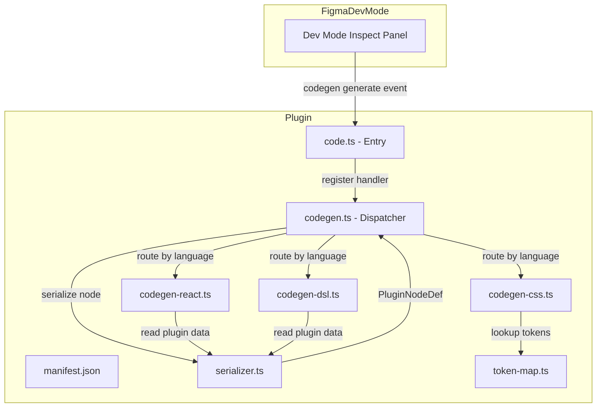
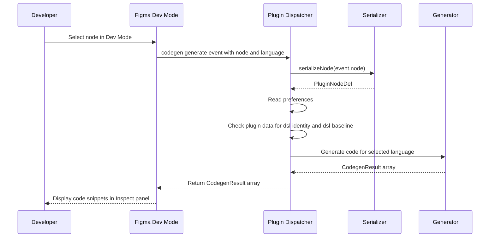

# Design Document: Dev Mode Codegen Plugin

## Overview

**Purpose**: This feature adds Figma Dev Mode codegen capabilities to the existing `@figma-dsl/plugin` package, enabling developers inspecting Figma components to see generated React TSX, CSS Module, and DSL definition code snippets directly in the Inspect panel.

**Users**: Developers using Figma's Dev Mode to inspect components will see code snippets corresponding to the selected node — whether the node was created via DSL export or designed manually.

**Impact**: Extends the existing plugin manifest and codebase without modifying current import/sync functionality.

### Goals
- Generate React, CSS Module, and DSL code snippets from selected Figma nodes in Dev Mode
- Leverage existing `serializeNode()` and `PluginNodeDef` infrastructure for node data extraction
- Support configurable preferences (unit system, naming convention)
- Complete code generation within the 3-second Figma API timeout

### Non-Goals
- Runtime Code Connect file reading (not accessible from plugin sandbox)
- Fuzzy/approximate token matching (exact match only)
- Generating complete multi-file project scaffolds
- Supporting arbitrary custom languages beyond React, CSS, and DSL

## Architecture

### Existing Architecture Analysis

The plugin currently operates as a design-mode plugin (`editorType: ["figma"]`) with:
- **Import pipeline**: Receives `PluginInput` JSON via UI postMessage → creates Figma nodes
- **Edit tracking**: Stores `dsl-baseline` and `dsl-identity` plugin data on created nodes
- **Sync**: WebSocket connection to MCP server on localhost:9800
- **Serializer**: Extracted `serializer.ts` reads Figma nodes → `PluginNodeDef` (unit-testable via `SerializableNode` interface)

The codegen feature adds a parallel path: Figma nodes → code snippets, using the same serializer infrastructure.

### Architecture Pattern & Boundary Map



**Architecture Integration**:
- Selected pattern: **Modular generators with shared dispatcher** — each language gets an independent, testable module following the serializer.ts extraction pattern
- Existing patterns preserved: esbuild → IIFE bundle, `SerializableNode` interface for testing, plugin data for metadata storage
- New components rationale: Dispatcher separates codegen concern from code.ts; per-language modules enable independent testing and maintenance
- Steering compliance: Single responsibility per module, typed interfaces, no framework bloat

### Technology Stack

| Layer | Choice / Version | Role in Feature | Notes |
|-------|------------------|-----------------|-------|
| Plugin Runtime | Figma Plugin API (Codegen) | `figma.codegen.on("generate")` event handling | Part of existing `@figma/plugin-typings ^1.0.0` |
| Bundler | esbuild | Bundle new modules into existing IIFE output | Existing build pipeline, no changes |
| Types | `@figma-dsl/core` | `PluginNodeDef` type shared with serializer | Existing dependency |
| Testing | vitest | Unit tests for each generator module | Existing test infrastructure |

## System Flows



Key decisions:
- Serialization happens once per generate event; the `PluginNodeDef` is passed to the selected generator
- Plugin data (`dsl-identity`, `dsl-baseline`) is checked before serialization to enable metadata-aware generation
- Depth limiting occurs in the serialization step (max 50 descendants) to stay within the 3-second timeout

## Requirements Traceability

| Requirement | Summary | Components | Interfaces | Flows |
|-------------|---------|------------|------------|-------|
| 1.1–1.4 | Manifest codegen config | manifest.json | — | — |
| 2.1 | React from DSL identity | codegen-react.ts | `generateReact()` | Generate flow |
| 2.2 | React from Code Connect metadata | codegen-react.ts | `generateReact()` | Generate flow |
| 2.3 | React structural inference | codegen-react.ts | `generateReact()` | Generate flow |
| 2.4 | CodegenResult format | codegen.ts | `CodegenResult` | Generate flow |
| 3.1–3.2 | CSS from node + token lookup | codegen-css.ts, token-map.ts | `generateCSS()` | Generate flow |
| 3.3 | CSS flexbox from auto-layout | codegen-css.ts | `generateCSS()` | Generate flow |
| 3.4 | CSS CodegenResult format | codegen.ts | `CodegenResult` | Generate flow |
| 4.1–4.3 | DSL from serialized node | codegen-dsl.ts | `generateDSL()` | Generate flow |
| 4.4 | DSL CodegenResult format | codegen.ts | `CodegenResult` | Generate flow |
| 5.1–5.4 | Codegen preferences | manifest.json, codegen.ts | `CodegenPreferences` | Generate flow |
| 6.1–6.3 | Multi-section output | codegen-react.ts | `CodegenResult[]` | Generate flow |
| 7.1–7.4 | Performance and error handling | codegen.ts | — | Generate flow |

## Components and Interfaces

| Component | Domain/Layer | Intent | Req Coverage | Key Dependencies | Contracts |
|-----------|-------------|--------|--------------|------------------|-----------|
| manifest.json | Config | Declare codegen capabilities and preferences | 1.1–1.4, 5.1–5.3 | — | — |
| codegen.ts | Plugin / Dispatcher | Route generate events to language-specific generators | 2.4, 3.4, 4.4, 5.4, 7.1–7.4 | serializer.ts (P0), generators (P0) | Service |
| codegen-react.ts | Plugin / Generator | Generate React TSX code from Figma nodes | 2.1–2.3, 6.1–6.3 | codegen.ts (P0), serializer.ts (P1) | Service |
| codegen-css.ts | Plugin / Generator | Generate CSS Module code from Figma nodes | 3.1–3.4 | codegen.ts (P0), token-map.ts (P1) | Service |
| codegen-dsl.ts | Plugin / Generator | Generate DSL builder syntax from Figma nodes | 4.1–4.4 | codegen.ts (P0), serializer.ts (P1) | Service |
| token-map.ts | Plugin / Data | Static map of design token values to CSS custom property names | 3.2 | — | State |

### Plugin / Config

#### manifest.json

| Field | Detail |
|-------|--------|
| Intent | Declare codegen capabilities, supported languages, and preferences for Dev Mode |
| Requirements | 1.1, 1.2, 1.3, 1.4, 5.1, 5.2, 5.3 |

**Responsibilities & Constraints**
- Declare `editorType: ["figma", "dev"]` to support both design and Dev Mode
- Define `capabilities: ["codegen"]` to enable codegen API
- Declare `codegenLanguages` with React, CSS, and DSL entries
- Define `codegenPreferences` for unit system and naming convention

**Implementation Notes**
- The `"vscode"` capability mentioned in Figma docs is optional; include only if VS Code extension integration is planned
- `editorType` array supports both values simultaneously — existing import/sync features are unaffected

##### Manifest Schema

```json
{
  "name": "Figma DSL Import",
  "id": "figma-dsl-import-plugin",
  "api": "1.0.0",
  "main": "dist/code.js",
  "editorType": ["figma", "dev"],
  "capabilities": ["codegen"],
  "permissions": ["currentuser"],
  "codegenLanguages": [
    { "label": "React", "value": "react" },
    { "label": "CSS Module", "value": "css" },
    { "label": "DSL", "value": "dsl" }
  ],
  "codegenPreferences": [
    {
      "itemType": "unit",
      "scaledUnit": "rem",
      "defaultScaleFactor": 16,
      "default": false,
      "includedLanguages": ["css"]
    },
    {
      "itemType": "select",
      "propertyName": "naming",
      "label": "CSS Class Naming",
      "options": [
        { "label": "camelCase", "value": "camelCase", "isDefault": true },
        { "label": "kebab-case", "value": "kebab-case" }
      ],
      "includedLanguages": ["css"]
    }
  ],
  "networkAccess": {
    "allowedDomains": ["http://localhost", "ws://localhost:9800"],
    "reasoning": "WebSocket connection to local MCP server for real-time sync"
  }
}
```

### Plugin / Dispatcher

#### codegen.ts

| Field | Detail |
|-------|--------|
| Intent | Register the codegen generate handler, dispatch to language-specific generators, enforce timeout and error boundaries |
| Requirements | 2.4, 3.4, 4.4, 5.4, 7.1, 7.2, 7.3, 7.4 |

**Responsibilities & Constraints**
- Register `figma.codegen.on("generate")` handler in plugin initialization
- Serialize the selected node using existing `serializeNode()` with depth limiting
- Read `dsl-identity` and `dsl-baseline` plugin data from the node
- Route to the appropriate generator based on `event.language`
- Read preferences via `figma.codegen.preferences`
- Wrap generator calls in try/catch to return error `CodegenResult` instead of throwing
- Never call `figma.showUI()` inside the generate callback

**Dependencies**
- Inbound: Figma codegen API — generate event source (P0)
- Outbound: `serializer.ts` — node serialization (P0)
- Outbound: `codegen-react.ts`, `codegen-css.ts`, `codegen-dsl.ts` — code generators (P0)

**Contracts**: Service [x]

##### Service Interface

```typescript
interface CodegenContext {
  readonly node: PluginNodeDef;
  readonly identity: ComponentIdentity | null;
  readonly baseline: PluginNodeDef | null;
  readonly preferences: CodegenPreferences;
}

interface CodegenPreferences {
  readonly unit: 'px' | 'rem';
  readonly scaleFactor: number;
  readonly naming: 'camelCase' | 'kebab-case';
}

interface CodegenResultEntry {
  readonly title: string;
  readonly language: string;
  readonly code: string;
}

// Dispatcher function — registered as the generate callback
function handleCodegenEvent(event: CodegenEvent): CodegenResultEntry[];

// Depth-limited serialization wrapper
function serializeWithDepthLimit(
  node: SceneNode,
  maxDescendants: number,
): { def: PluginNodeDef; truncated: boolean };
```

- Preconditions: `event.node` is a valid SceneNode; `event.language` matches a registered language value
- Postconditions: Returns non-empty `CodegenResult[]`; never throws
- Invariants: Total execution time < 3 seconds; `figma.showUI()` is never called

### Plugin / Generators

#### codegen-react.ts

| Field | Detail |
|-------|--------|
| Intent | Generate React TSX component code from a serialized Figma node |
| Requirements | 2.1, 2.2, 2.3, 6.1, 6.2, 6.3 |

**Responsibilities & Constraints**
- Generate React TSX from nodes with `dsl-identity` (component name → import + JSX usage)
- Generate React TSX from nodes with stored component metadata (construct props interface + component body)
- Generate structural React TSX from arbitrary nodes by mapping: FRAME → `<div>`, TEXT → `<span>/<p>`, RECTANGLE/ELLIPSE → `<div>` with styles, auto-layout → flexbox container
- Return multi-section output: imports section, props interface section, component body section
- For component sets with variants, generate variant props type with union literals

**Dependencies**
- Inbound: `codegen.ts` — dispatches `CodegenContext` (P0)

**Contracts**: Service [x]

##### Service Interface

```typescript
function generateReact(context: CodegenContext): CodegenResultEntry[];
```

- Preconditions: `context.node` is a valid `PluginNodeDef`
- Postconditions: Returns 1–3 `CodegenResultEntry` items (imports, props, component body)

**Implementation Notes**
- Node type → JSX element mapping: `FRAME` → `<div>`, `TEXT` → `<span>`, `RECTANGLE` → `<div>`, `ELLIPSE` → `<div>`, `COMPONENT` → named component, `INSTANCE` → component reference
- When `identity` is present, use stored component name for import and JSX tag
- When `identity` is absent, derive component name from `node.name` (PascalCase)
- Code Connect-style output: When identity includes property definitions, generate `figma.connect()` style mapping (leveraging patterns from `packages/exporter/src/code-connect.ts`)

#### codegen-css.ts

| Field | Detail |
|-------|--------|
| Intent | Generate CSS Module styles from a serialized Figma node's visual properties |
| Requirements | 3.1, 3.2, 3.3, 3.4 |

**Responsibilities & Constraints**
- Extract visual properties from `PluginNodeDef`: fills → `background-color`/`background`, strokes → `border`, cornerRadius → `border-radius`, opacity, size → `width`/`height`
- Map auto-layout to flexbox: `stackMode: "HORIZONTAL"` → `flex-direction: row`, `"VERTICAL"` → `column`, `itemSpacing` → `gap`, padding properties, alignment → `justify-content`/`align-items`
- Map text properties: `fontSize` → `font-size`, `fontFamily` → `font-family`, `fontWeight` → `font-weight`, `textAlignHorizontal` → `text-align`
- Apply preferences: use `rem` or `px` units; use camelCase or kebab-case class names
- Reference design tokens via `token-map.ts` when values match exactly

**Dependencies**
- Inbound: `codegen.ts` — dispatches `CodegenContext` (P0)
- Outbound: `token-map.ts` — token value lookup (P1)

**Contracts**: Service [x]

##### Service Interface

```typescript
function generateCSS(context: CodegenContext): CodegenResultEntry[];
```

- Preconditions: `context.node` is a valid `PluginNodeDef`; `context.preferences` has valid unit and naming values
- Postconditions: Returns 1 `CodegenResultEntry` with CSS Module content

**Implementation Notes**
- Figma alignment mapping: `primaryAxisAlignItems: "MIN"` → `justify-content: flex-start`, `"CENTER"` → `center`, `"MAX"` → `flex-end`, `"SPACE_BETWEEN"` → `space-between`; `counterAxisAlignItems: "MIN"` → `align-items: flex-start`, `"CENTER"` → `center`, `"MAX"` → `flex-end`
- Color conversion: Figma `{r, g, b}` (0–1 floats) → hex string for token lookup, then CSS `rgb()` or token reference
- When `unit === 'rem'`: divide pixel values by `scaleFactor` and append `rem`

#### codegen-dsl.ts

| Field | Detail |
|-------|--------|
| Intent | Generate DSL builder API syntax from a serialized Figma node |
| Requirements | 4.1, 4.2, 4.3, 4.4 |

**Responsibilities & Constraints**
- Convert `PluginNodeDef` to DSL builder syntax: type-to-function mapping (`FRAME` → `frame()`, `TEXT` → `text()`, `RECTANGLE` → `rectangle()`, `ELLIPSE` → `ellipse()`, `COMPONENT` → `component()`, `COMPONENT_SET` → `componentSet()`)
- Format fills as DSL color calls: solid fills → `solid('#hex')`, gradients → `gradient([...stops])`
- Format auto-layout as layout helpers: `stackMode: "HORIZONTAL"` → `horizontal({...})`, `"VERTICAL"` → `vertical({...})`
- When `baseline` is available in context, use it as source instead of the serialized node
- Format output as indented, valid TypeScript

**Dependencies**
- Inbound: `codegen.ts` — dispatches `CodegenContext` (P0)

**Contracts**: Service [x]

##### Service Interface

```typescript
function generateDSL(context: CodegenContext): CodegenResultEntry[];
```

- Preconditions: `context.node` is a valid `PluginNodeDef`
- Postconditions: Returns 1 `CodegenResultEntry` with formatted DSL TypeScript code

**Implementation Notes**
- Recursive: each child node generates a nested DSL call
- Indentation: 2-space indent per nesting level
- Import statement: include `import { frame, text, ... } from '@figma-dsl/core';` based on used node types
- When `baseline` exists, prefer it over serialized node data (it represents the original DSL definition)

### Plugin / Data

#### token-map.ts

| Field | Detail |
|-------|--------|
| Intent | Provide a static lookup map from raw CSS values to design token custom property names |
| Requirements | 3.2 |

**Responsibilities & Constraints**
- Export a color map: hex string → CSS custom property name (e.g., `'#7c3aed' → 'var(--color-primary)'`)
- Export a spacing map: pixel value → CSS custom property name (e.g., `8 → 'var(--space-2)'`)
- Export a radius map: pixel value → CSS custom property name (e.g., `6 → 'var(--radius-sm)'`)
- Maps are static (no runtime computation); values sourced from `preview/src/components/tokens.css`

**Contracts**: State [x]

##### State Management

```typescript
// Color tokens: hex (lowercase, no alpha) → CSS custom property
const COLOR_TOKENS: ReadonlyMap<string, string>;

// Spacing tokens: pixel value → CSS custom property
const SPACING_TOKENS: ReadonlyMap<number, string>;

// Radius tokens: pixel value → CSS custom property
const RADIUS_TOKENS: ReadonlyMap<number, string>;

// Lookup functions
function lookupColorToken(hex: string): string | undefined;
function lookupSpacingToken(px: number): string | undefined;
function lookupRadiusToken(px: number): string | undefined;
```

- Persistence: Static data, no runtime mutation
- Consistency: Maps are read-only; values derived from `tokens.css` at authoring time

## Data Models

### Domain Model

The codegen feature introduces no new persistent data. It reads existing data models:

- **`PluginNodeDef`** (from `@figma-dsl/core`): Serialized Figma node with type, name, size, fills, strokes, cornerRadius, opacity, auto-layout, text properties, component properties
- **`ComponentIdentity`** (from `@figma-dsl/core`): Stored component metadata including name, read from `dsl-identity` plugin data
- **`CodegenResult`** (from Figma Plugin API): Output format `{ title, language, code }`

### Data Contracts & Integration

**Codegen Event Input** (from Figma API):
- `event.node`: `SceneNode` — the selected Figma node
- `event.language`: `string` — matches a `codegenLanguages[].value` from manifest

**Codegen Output** (to Figma API):
- `CodegenResult[]` — array of `{ title: string, language: string, code: string }`

## Error Handling

### Error Strategy
All errors within the generate callback are caught and returned as `CodegenResult` entries rather than thrown. This ensures the Figma Inspect panel always displays something useful.

### Error Categories and Responses
- **Serialization failure** (node inaccessible or corrupted): Return `CodegenResult` with title "Error" and the error message in the `code` field
- **Timeout risk** (deep tree): Truncate at depth limit, append `// ... truncated (exceeded depth limit)` to output
- **Unknown node type**: Generate a comment indicating the unsupported type; continue processing siblings
- **Invalid plugin data**: Log warning, proceed without metadata (fall back to structural inference)

## Testing Strategy

### Unit Tests
Each generator module is independently testable using plain objects conforming to `PluginNodeDef`:

- **codegen-react.test.ts**: Test React output for nodes with identity, without identity, with variants, with component properties
- **codegen-css.test.ts**: Test CSS output for auto-layout frames, text nodes, nodes with fills/strokes, token matching, rem/px preference
- **codegen-dsl.test.ts**: Test DSL output for frame, text, rectangle nodes; verify import generation; verify baseline preference
- **codegen.test.ts**: Test dispatcher routing by language, error boundary wrapping, depth-limited serialization
- **token-map.test.ts**: Test color/spacing/radius token lookup with known values and unknown values

### Integration Tests
- **End-to-end generate flow**: Mock `figma.codegen.on("generate")` event with a realistic node tree, verify all 3 languages produce valid output
- **Preference changes**: Verify CSS output changes when unit preference switches from px to rem

## Performance & Scalability

- **3-second timeout**: The `serializeWithDepthLimit()` function caps traversal at 50 descendant nodes. For typical component trees (5–20 nodes), serialization completes in <100ms.
- **Bundle size**: Each generator module adds ~100–200 lines of TypeScript. The token map adds ~2KB of static data. Total bundle increase is estimated at <15KB minified.
- **No external dependencies**: All codegen logic uses plain string concatenation and object mapping — no template engines or AST libraries needed in the plugin sandbox.
