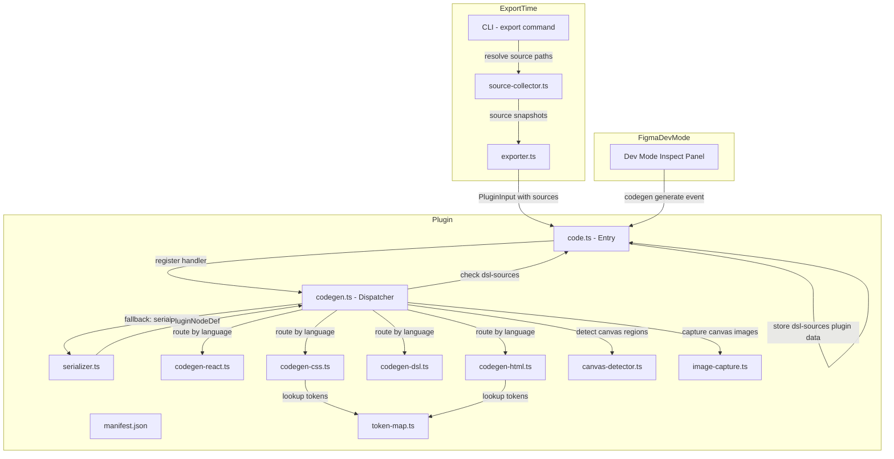
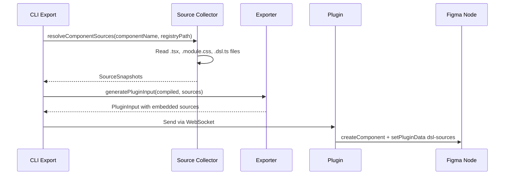
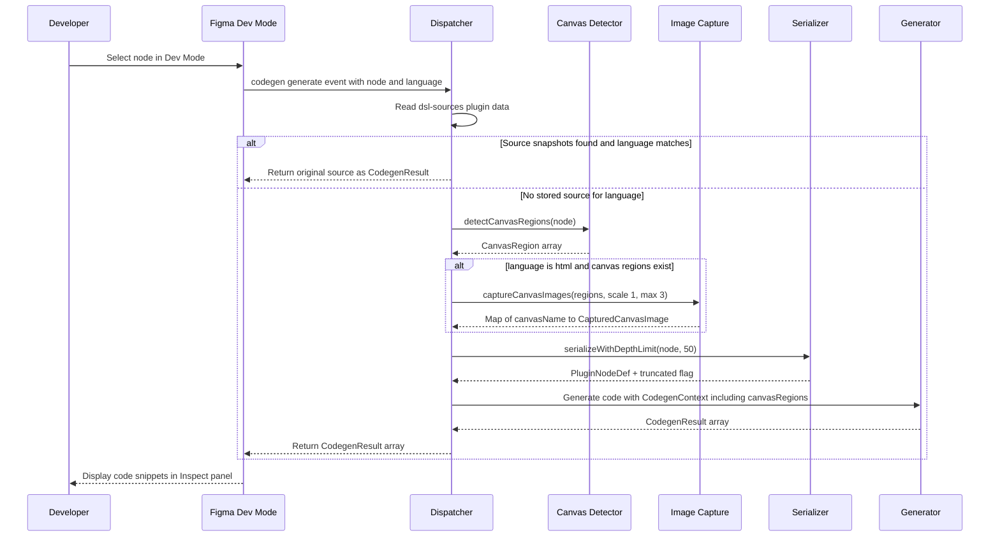

# Design Document: Dev Mode Codegen Plugin

## Overview

**Purpose**: This feature adds Figma Dev Mode codegen capabilities to the existing `@figma-dsl/plugin` package, enabling developers inspecting Figma components to see generated React TSX, CSS Module, DSL definition, and HTML/CSS preview code snippets directly in the Inspect panel. Phase 2 extends codegen to detect DslCanvas regions and render them as embedded PNG images in the HTML output.

**Users**: Developers using Figma's Dev Mode to inspect components will see code snippets corresponding to the selected node — whether the node was created via DSL export or designed manually. Components containing DslCanvas regions display HTML previews with canvas sections rendered as embedded images.

**Impact**: Extends the existing plugin manifest and codebase without modifying current import/sync functionality.

### Goals
- Display original React TSX, CSS Module, and DSL source code for DSL-exported nodes via embedded source snapshots
- Generate structural code snippets as fallback for manually-created Figma nodes without stored sources
- Detect DslCanvas regions and generate HTML/CSS previews with embedded PNG images
- Generate correct `<DslCanvas>` JSX elements in React codegen for canvas regions
- Support configurable preferences (unit system, naming convention)
- Complete code generation within the 3-second Figma API timeout

### Non-Goals
- Fuzzy/approximate token matching (exact match only)
- Generating complete multi-file project scaffolds
- Supporting arbitrary custom languages beyond React, CSS, DSL, and HTML
- Automatic source refresh after local file edits (snapshots are point-in-time; re-export updates them)
- Interactive DslCanvas rendering in Dev Mode (images are static snapshots via `exportAsync`)

## Architecture

### Existing Architecture Analysis

The plugin currently operates as a dual-mode plugin (`editorType: ["figma", "dev"]`) with:
- **Import pipeline**: Receives `PluginInput` JSON via UI postMessage → creates Figma nodes
- **Edit tracking**: Stores `dsl-baseline` and `dsl-identity` plugin data on created nodes
- **Sync**: WebSocket connection to MCP server on localhost:9800
- **Serializer**: Extracted `serializer.ts` reads Figma nodes → `PluginNodeDef` (unit-testable via `SerializableNode` interface)
- **Canvas detection**: `canvas-detector.ts` scans for `dsl-canvas` plugin data on child nodes
- **Image capture**: `image-capture.ts` uses `exportAsync` to capture DslCanvas regions as PNG
- **Codegen (Phase 1)**: Two-tier strategy with source-embedded primary path and structural inference fallback, dispatching to React/CSS/DSL generators

Phase 2 adds:
1. **HTML/CSS preview generator** (`codegen-html.ts`): Produces self-contained HTML with inline CSS for the component layout, embedding DslCanvas regions as base64 `` tags
2. **DslCanvas-aware React generator**: Extends `codegen-react.ts` to emit `<DslCanvas>` JSX elements for detected canvas regions
3. **Canvas-aware dispatcher**: Extends `codegen.ts` to detect DslCanvas regions and pass canvas metadata to generators

### Architecture Pattern & Boundary Map



**Architecture Integration**:
- Selected pattern: **Source-embedded codegen with structural fallback + canvas-aware HTML preview**
- Phase 2 extension reuses existing `canvas-detector.ts` and `image-capture.ts` modules (from canvas-component feature) within the codegen callback
- The `handleCodegenEvent` callback becomes async to support `exportAsync` calls for canvas image capture
- New `codegen-html.ts` generator follows the same modular pattern as existing generators
- Canvas detection and image capture are performed once per codegen event, then passed to all generators via extended `CodegenContext`

### Technology Stack

| Layer | Choice / Version | Role in Feature | Notes |
|-------|------------------|-----------------|-------|
| Plugin Runtime | Figma Plugin API (Codegen) | `figma.codegen.on("generate")` event handling | Async callback supported, returns `Promise<CodegenResult[]>` |
| Canvas Detection | `canvas-detector.ts` | Detect DslCanvas regions via `dsl-canvas` plugin data | Existing module, reused |
| Image Capture | `image-capture.ts` + Figma `exportAsync` | Capture canvas regions as PNG for HTML embedding | Scale factor 1 for codegen speed |
| Bundler | esbuild | Bundle new modules into existing IIFE output | Existing build pipeline, no changes |
| Types | `@figma-dsl/core` | `PluginNodeDef` type shared with serializer | Existing dependency |
| Testing | vitest | Unit tests for each generator module | Existing test infrastructure |

## System Flows

### Flow 1: Source Embedding at Export Time



### Flow 2: Codegen in Dev Mode (Extended with Canvas)



Key decisions:
- **Source-first unchanged**: Stored source snapshots are returned directly for react/css/dsl languages. The HTML language always uses the structural path since no HTML source is stored.
- **Canvas detection runs once**: The dispatcher detects canvas regions once and passes them to generators via `CodegenContext.canvasRegions`.
- **Image capture is async**: The dispatcher returns `Promise<CodegenResult[]>` when HTML language is selected and canvas images need capturing. The Figma API supports this.
- **Image capture is conditional**: Only performed when `language === 'html'` and canvas regions exist. React/CSS/DSL generators receive canvas metadata but do not capture images.
- **Cap at 3 regions**: To stay within the 3-second timeout, image capture is limited to the first 3 DslCanvas regions. Additional regions are noted in comments.

## Requirements Traceability

| Requirement | Summary | Components | Interfaces | Flows |
|-------------|---------|------------|------------|-------|
| 1.1–1.4 | Manifest codegen config | manifest.json | — | — |
| 2.1 | React from DSL identity | codegen.ts, source-collector.ts | `SourceSnapshots`, `CodegenContext` | Export flow, Codegen flow (source-first) |
| 2.2 | React from stored source code | codegen.ts | `SourceSnapshots` | Codegen flow (source-first) |
| 2.3 | React structural inference | codegen-react.ts | `generateReact()` | Codegen flow (fallback) |
| 2.4 | CodegenResult format | codegen.ts | `CodegenResult` | Codegen flow |
| 3.1–3.2 | CSS from stored source or node + token lookup | codegen.ts, codegen-css.ts, token-map.ts | `SourceSnapshots`, `generateCSS()` | Codegen flow (both tiers) |
| 3.3 | CSS flexbox from auto-layout | codegen-css.ts | `generateCSS()` | Codegen flow (fallback) |
| 3.4 | CSS CodegenResult format | codegen.ts | `CodegenResult` | Codegen flow |
| 4.1–4.3 | DSL from stored source or serialized node | codegen.ts, codegen-dsl.ts | `SourceSnapshots`, `generateDSL()` | Codegen flow (both tiers) |
| 4.4 | DSL CodegenResult format | codegen.ts | `CodegenResult` | Codegen flow |
| 5.1–5.4 | Codegen preferences | manifest.json, codegen.ts | `CodegenPreferences` | Codegen flow (fallback only) |
| 6.1–6.3 | Multi-section output | codegen-react.ts | `CodegenResult[]` | Codegen flow (fallback) |
| 7.1–7.4 | Performance and error handling | codegen.ts | — | Codegen flow |
| 8.1 | Detect DslCanvas regions in component | codegen.ts, canvas-detector.ts | `detectCanvasRegions()`, `CanvasRegion` | Codegen flow |
| 8.2 | Detect directly-selected canvas node | codegen.ts | `isDslCanvasNode()` | Codegen flow |
| 8.3 | Fallback when no canvas regions | codegen.ts | — | Codegen flow |
| 9.1 | HTML language in manifest | manifest.json | — | — |
| 9.2 | HTML/CSS preview generation | codegen-html.ts | `generateHTML()` | Codegen flow (canvas) |
| 9.3 | Canvas image capture and embedding | codegen.ts, image-capture.ts | `captureCanvasImages()`, `CapturedCanvasImage` | Codegen flow (canvas) |
| 9.4 | HTML CSS reflects layout properties | codegen-html.ts, token-map.ts | `generateHTML()` | Codegen flow (canvas) |
| 9.5 | HTML for non-canvas components | codegen-html.ts | `generateHTML()` | Codegen flow (fallback) |
| 10.1 | DslCanvas JSX elements in React output | codegen-react.ts | `generateReact()` | Codegen flow (canvas) |
| 10.2 | DslCanvas import statement | codegen-react.ts | `generateReact()` | Codegen flow (canvas) |
| 10.3 | DslCanvas dsl prop placeholder | codegen-react.ts | `generateReact()` | Codegen flow (canvas) |
| 10.4 | DslCanvas width and alt props | codegen-react.ts | `generateReact()` | Codegen flow (canvas) |
| 11.1 | Scale factor 1 for codegen capture | codegen.ts | `captureCanvasImages()` options | Codegen flow (canvas) |
| 11.2 | Cap at 3 canvas regions | codegen.ts | — | Codegen flow (canvas) |
| 11.3 | Placeholder on capture failure | codegen-html.ts | `generateHTML()` | Codegen flow (canvas) |
| 11.4 | No UI calls during capture | codegen.ts | — | Codegen flow (canvas) |

## Components and Interfaces

| Component | Domain/Layer | Intent | Req Coverage | Key Dependencies | Contracts |
|-----------|-------------|--------|--------------|------------------|-----------|
| manifest.json | Config | Declare codegen capabilities, languages, preferences | 1.1–1.4, 5.1–5.3, 9.1 | — | — |
| source-collector.ts | CLI/Exporter | Resolve and read component source files at export time | 2.1, 2.2 | component-registry (P1), fs (P0) | Service |
| Extended PluginInput | dsl-core / Types | Carry source snapshots from exporter to plugin | 2.1, 2.2, 3.1, 4.1 | — | State |
| Extended ComponentIdentity | dsl-core / Types | Store source snapshots in plugin data | 2.1, 2.2, 3.1, 4.1 | — | State |
| codegen.ts | Plugin / Dispatcher | Three-tier dispatch: stored sources, canvas-aware generation, structural inference | 2.1–2.4, 3.4, 4.4, 5.4, 7.1–7.4, 8.1–8.3, 9.3, 11.1–11.4 | serializer.ts (P0), generators (P0), canvas-detector.ts (P0), image-capture.ts (P1) | Service |
| codegen-react.ts | Plugin / Generator | Structural React TSX generation with DslCanvas-aware JSX | 2.3, 6.1–6.3, 10.1–10.4 | codegen.ts (P0) | Service |
| codegen-css.ts | Plugin / Generator | Structural CSS Module generation (fallback tier) | 3.1–3.4 | codegen.ts (P0), token-map.ts (P1) | Service |
| codegen-dsl.ts | Plugin / Generator | Structural DSL generation (fallback tier) | 4.1–4.4 | codegen.ts (P0) | Service |
| codegen-html.ts | Plugin / Generator | HTML/CSS preview with embedded canvas images | 9.2, 9.3, 9.4, 9.5, 11.3 | codegen.ts (P0), token-map.ts (P1) | Service |
| token-map.ts | Plugin / Data | Static map of design token values to CSS custom property names | 3.2 | — | State |
| canvas-detector.ts | Plugin / Detection | Detect DslCanvas regions via dsl-canvas plugin data | 8.1, 8.2 | — | Service |
| image-capture.ts | Plugin / Capture | Capture DslCanvas regions as PNG via exportAsync | 9.3, 11.1 | Figma Plugin API (P0) | Service |

### Plugin / Config

#### manifest.json

| Field | Detail |
|-------|--------|
| Intent | Declare codegen capabilities, supported languages (including HTML), and preferences for Dev Mode |
| Requirements | 1.1, 1.2, 1.3, 1.4, 5.1, 5.2, 5.3, 9.1 |

**Responsibilities & Constraints**
- Declare `editorType: ["figma", "dev"]` to support both design and Dev Mode
- Define `capabilities: ["codegen"]` to enable codegen API
- Declare `codegenLanguages` with React TSX, CSS Module, DSL Definition, and HTML Preview entries
- Define `codegenPreferences` for unit system and naming convention

##### Manifest Schema

```json
{
  "name": "Figma DSL Import",
  "id": "figma-dsl-import-plugin",
  "api": "1.0.0",
  "main": "dist/code.js",
  "editorType": ["figma", "dev"],
  "capabilities": ["codegen"],
  "permissions": ["currentuser"],
  "codegenLanguages": [
    { "label": "React TSX", "value": "react" },
    { "label": "CSS Module", "value": "css" },
    { "label": "DSL Definition", "value": "dsl" },
    { "label": "HTML Preview", "value": "html" }
  ],
  "codegenPreferences": [
    {
      "name": "Unit",
      "itemType": "unit",
      "includedDimensions": ["width", "height", "font-size", "padding", "margin", "gap", "border-radius"],
      "units": [
        { "name": "px", "scaleFactor": 1 },
        { "name": "rem", "scaleFactor": 16 }
      ],
      "default": "px"
    },
    {
      "name": "CSS Class Naming",
      "itemType": "select",
      "options": [
        { "label": "camelCase", "value": "camelCase", "isDefault": true },
        { "label": "kebab-case", "value": "kebab-case" }
      ]
    }
  ],
  "networkAccess": {
    "allowedDomains": ["http://localhost", "ws://localhost:9800"],
    "reasoning": "WebSocket connection to local MCP server for real-time sync"
  }
}
```

### Plugin / Dispatcher

#### codegen.ts (Extended)

| Field | Detail |
|-------|--------|
| Intent | Three-tier codegen dispatcher: stored sources first, canvas-aware generation, structural inference fallback |
| Requirements | 2.1–2.4, 3.4, 4.4, 5.4, 7.1–7.4, 8.1–8.3, 9.3, 11.1–11.4 |

**Responsibilities & Constraints**
- All existing Phase 1 responsibilities remain unchanged
- **NEW**: The `handleCodegenEvent` callback becomes async (returns `Promise<CodegenResult[]>`)
- **NEW**: After source-first check, detect DslCanvas regions via `detectCanvasRegions()`
- **NEW**: For `html` language, capture canvas images via `captureCanvasImages()` with scale 1 and max 3 regions
- **NEW**: Extend `CodegenContext` with `canvasRegions` and `canvasImages` fields
- **NEW**: Route `html` language to `generateHTML()` generator
- **NEW**: Detect if the directly selected node is a DslCanvas node (check `dsl-canvas` plugin data)

**Dependencies**
- Inbound: Figma codegen API — generate event source (P0)
- Outbound: `serializer.ts` — node serialization for fallback path (P0)
- Outbound: `codegen-react.ts`, `codegen-css.ts`, `codegen-dsl.ts`, `codegen-html.ts` — generators (P0)
- Outbound: `canvas-detector.ts` — DslCanvas region detection (P0)
- Outbound: `image-capture.ts` — canvas image capture for HTML generation (P1)

**Contracts**: Service [x]

##### Service Interface

```typescript
// Extended CodegenContext with canvas information
interface CodegenContext {
  readonly node: PluginNodeDef;
  readonly identity: ComponentIdentity | null;
  readonly baseline: PluginNodeDef | null;
  readonly sources: SourceSnapshots | null;
  readonly preferences: CodegenPreferences;
  readonly truncated: boolean;
  // Phase 2 additions
  readonly canvasRegions: readonly CanvasRegionInfo[];
  readonly canvasImages: ReadonlyMap<string, CapturedCanvasImage> | null;
}

// Simplified canvas region info for generators (no Figma node reference)
// Derived from CanvasRegion by extracting canvasName and node dimensions.
// Matched to child nodes by canvasName (not positional index) for robustness.
interface CanvasRegionInfo {
  readonly canvasName: string;
  readonly nodeId: string;
  readonly width: number;
  readonly height: number;
}

// Dispatcher function — now async for image capture
function handleCodegenEvent(event: CodegenEvent): Promise<CodegenResult[]>;

// Detect if a node itself is a DslCanvas region
function isDslCanvasNode(node: SceneNode): { isCanvas: boolean; canvasName: string | null };

// Constants
const MAX_CANVAS_CAPTURES = 3;
const CANVAS_CAPTURE_SCALE = 1;
```

- Preconditions: `event.node` is a valid SceneNode; `event.language` matches a registered language value
- Postconditions: Returns non-empty `CodegenResult[]`; never throws
- Invariants: Total execution time < 3 seconds; `figma.showUI()` is never called; stored sources are returned without modification; canvas captures capped at 3 regions

### Plugin / Generators

#### codegen-react.ts (Extended)

| Field | Detail |
|-------|--------|
| Intent | Structural React TSX generation with DslCanvas-aware JSX elements |
| Requirements | 2.3, 6.1–6.3, 10.1–10.4 |

**Responsibilities & Constraints**
- All existing Phase 1 responsibilities remain unchanged
- **NEW**: When `canvasRegions` is non-empty, emit `<DslCanvas>` JSX elements for matching child nodes instead of generic `<div>` elements
- **NEW**: Include `import { DslCanvas } from './DslCanvas/DslCanvas';` when DslCanvas elements are present
- **NEW**: Generate `dsl` prop placeholder (comment referencing the canvas name), `width`, and `alt` props on each `<DslCanvas>` element

**Contracts**: Service [x]

##### Service Interface

```typescript
function generateReact(context: CodegenContext): CodegenResultEntry[];
```

- Preconditions: `context.node` is a valid `PluginNodeDef`
- Postconditions: Returns 1–3 `CodegenResultEntry` items; DslCanvas children rendered as `<DslCanvas>` elements when `context.canvasRegions` contains matching entries

**Implementation Notes**
- Match child nodes to canvas regions by comparing the child's `canvasName` (from `dsl-canvas` plugin data) with `CanvasRegionInfo.canvasName`. This is robust against child reordering or filtering.
- When a child matches a canvas region: emit `<DslCanvas dsl={/* canvasName */} width={...} alt="..." />` instead of `<div>...</div>`
- When DslCanvas elements are present, prepend `import { DslCanvas } from './DslCanvas/DslCanvas';` to the imports section

#### codegen-html.ts (New)

| Field | Detail |
|-------|--------|
| Intent | Generate self-contained HTML/CSS preview with DslCanvas regions embedded as base64 images |
| Requirements | 9.2, 9.3, 9.4, 9.5, 11.3 |

**Responsibilities & Constraints**
- Generate a self-contained HTML snippet with `<style>` block and semantic HTML structure
- Map auto-layout properties to CSS flexbox (same logic as `codegen-css.ts`)
- Map fills, strokes, corner radius, opacity to inline or class-based CSS
- For each DslCanvas region with a captured image: embed as ``
- For each DslCanvas region where capture failed: emit a placeholder `<div>` with a comment
- For components without any canvas regions: generate a valid structural HTML preview
- Apply token lookup via `token-map.ts` for CSS custom property references
- Apply preferences (rem/px, naming) to generated CSS

**Dependencies**
- Inbound: `codegen.ts` — dispatches `CodegenContext` with `canvasImages` (P0)
- Outbound: `token-map.ts` — token value lookup (P1)

**Contracts**: Service [x]

##### Service Interface

```typescript
function generateHTML(context: CodegenContext): CodegenResultEntry[];
```

- Preconditions: `context.node` is a valid `PluginNodeDef`; `context.canvasImages` is non-null when canvas regions exist
- Postconditions: Returns 1 `CodegenResultEntry` with `language: "HTML"` containing a self-contained HTML snippet

**Implementation Notes**
- HTML structure: `<div class="component">` with child elements reflecting the node tree
- CSS: Generated as `<style>` block at the top of the output, using BEM-style class names
- Canvas images: `` tags with `data:image/png;base64,...` src and `width`/`height` attributes
- Failed captures: `<div class="canvas-placeholder">[Canvas: {name}]</div>`
- Truncation: Append `<!-- ... truncated -->` when `context.truncated` is true
- Non-canvas components: Generate a generic HTML layout preview with CSS for layout, colors, typography

### Plugin / Detection (Existing)

#### canvas-detector.ts

| Field | Detail |
|-------|--------|
| Intent | Detect DslCanvas regions within component nodes |
| Requirements | 8.1, 8.2 |

**Responsibilities & Constraints**
- Reused from canvas-component feature without modification
- Walks direct children of a component node, checking `dsl-canvas` plugin data
- Returns `CanvasRegion[]` with node reference and canvas name

**Contracts**: Service [x]

##### Service Interface (Existing)

```typescript
interface CanvasRegion {
  readonly node: CanvasDetectableNode;
  readonly canvasName: string;
}

function detectCanvasRegions(componentNode: CanvasDetectableComponent): CanvasRegion[];
```

### Plugin / Capture (Existing)

#### image-capture.ts

| Field | Detail |
|-------|--------|
| Intent | Capture DslCanvas regions as PNG images via Figma exportAsync |
| Requirements | 9.3, 11.1 |

**Responsibilities & Constraints**
- Reused from canvas-component feature
- Called with `scale: 1` (not 2) during codegen to stay within 3-second timeout
- Abort signal not used in codegen context (no UI to trigger abort)

**Contracts**: Service [x]

##### Service Interface (Existing)

```typescript
interface CapturedCanvasImage {
  pngBytes: Uint8Array;
  scale: number;
  width: number;
  height: number;
}

function captureCanvasImages(
  regions: CanvasRegion[],
  options?: CaptureOptions,
): Promise<Map<string, CapturedCanvasImage>>;
```

### Plugin / Data (Existing)

#### token-map.ts

| Field | Detail |
|-------|--------|
| Intent | Provide static lookup from raw CSS values to design token custom property names |
| Requirements | 3.2, 9.4 |

No changes from Phase 1 design.

### CLI/Exporter / Source Collection (Existing)

#### source-collector.ts

No changes from Phase 1 design.

### dsl-core / Extended Types (Existing)

No changes from Phase 1 design. `SourceSnapshots`, `ComponentIdentity`, `PluginInput`, and `PLUGIN_DATA_SOURCES` remain unchanged.

## Data Models

### Domain Model

Phase 2 introduces no new persistent data types. It reuses:

- **`SourceSnapshots`** (Phase 1): Stored as `dsl-sources` plugin data on Figma nodes
- **`CanvasRegion`** (canvas-component feature): Transient detection result, not persisted
- **`CapturedCanvasImage`** (canvas-component feature): Transient capture result (PNG bytes), not persisted
- **`CanvasRegionInfo`** (NEW, transient): Simplified canvas metadata passed to generators via `CodegenContext`. Not persisted.
- **`CodegenResult`** (from Figma Plugin API): Output format `{ title, language, code }`

### Data Contracts & Integration

**Codegen Event Input** (from Figma API):
- `event.node`: `SceneNode` — the selected Figma node
- `event.language`: `string` — one of `"react"`, `"css"`, `"dsl"`, `"html"`

**Codegen Output** (to Figma API):
- `CodegenResult[]` — array of `{ title: string, language: string, code: string }`
- For HTML output: the `code` field contains a self-contained HTML snippet with embedded `<style>` and base64 images

**Plugin Data Read** (during codegen):
- `dsl-sources`: JSON-serialized `SourceSnapshots` (source-first path)
- `dsl-canvas`: JSON-serialized `{ isCanvas: boolean, canvasName: string }` (canvas detection)
- `dsl-identity`: JSON-serialized `ComponentIdentity` (metadata)
- `dsl-baseline`: JSON-serialized `PluginNodeDef` (DSL baseline)

**Canvas Image Encoding**:
- PNG bytes from `exportAsync` → base64 string → `data:image/png;base64,...` data URI
- `figma.base64Encode()` accepts a `Uint8Array` directly (Figma Plugin API ≥1.0.0). If the runtime signature only accepts `string`, convert via `String.fromCharCode(...pngBytes)` first. Alternatively, implement a manual base64 encoder over the `Uint8Array` to avoid string intermediate. The implementation should verify the actual API signature at build time via `@figma/plugin-typings`.

## Error Handling

### Error Strategy
All errors within the generate callback are caught and returned as `CodegenResult` entries rather than thrown. This ensures the Figma Inspect panel always displays something useful.

### Error Categories and Responses
- **Serialization failure**: Return `CodegenResult` with title "Error" and the error message in `code`
- **Timeout risk (deep tree)**: Truncate at depth limit, append truncation comment
- **Canvas capture failure**: Substitute placeholder element in HTML, continue with remaining regions (11.3)
- **Unknown node type**: Generate comment indicating unsupported type; continue processing
- **Invalid plugin data**: Proceed without metadata (fall back to structural inference)
- **No canvas images for HTML**: Generate structural HTML preview without embedded images (9.5)

## Testing Strategy

### Unit Tests

- **codegen-html.test.ts**: Test HTML generation with canvas images, without canvas images, with mixed content, with failed captures (placeholder), with preferences (rem/px, naming), with truncation
- **codegen-react.test.ts (extended)**: Test DslCanvas JSX generation — with canvas regions, without canvas regions, verify import statement, verify props (dsl, width, alt)
- **codegen.test.ts (extended)**: Test async dispatch, canvas detection integration, image capture capping at 3 regions, `isDslCanvasNode` for direct selection

### Integration Tests
- **Canvas HTML flow**: Create a component with DslCanvas regions → run codegen with `html` language → verify HTML contains base64 images
- **Canvas React flow**: Create a component with DslCanvas regions → run codegen with `react` language → verify `<DslCanvas>` JSX elements
- **Non-canvas fallback**: Component without canvas regions → all 4 languages produce valid output
- **Mixed component**: Component with both standard and DslCanvas children → HTML and React output correctly handles both types
- **Timeout safety**: Component with 3+ canvas regions → verify only first 3 captured

## Performance & Scalability

- **Source-first path is instant**: No change from Phase 1 — reading stored source and returning it takes <1ms.
- **Canvas detection is fast**: `detectCanvasRegions()` walks direct children only (not recursive), typically <1ms.
- **Image capture is the bottleneck**: `exportAsync` typically takes 200–500ms per region at scale 1. Capping at 3 regions ensures total capture time stays under 1.5s, leaving headroom for serialization and generation.
- **HTML generation is cheap**: String concatenation and CSS generation from `PluginNodeDef` properties complete in <10ms.
- **Total budget for HTML+canvas codegen**: ~2s (detection + 3 captures + serialization + HTML generation), well within the 3-second timeout.
- **Non-canvas languages unaffected**: React, CSS, and DSL codegen paths do not call `exportAsync` and remain instant.
