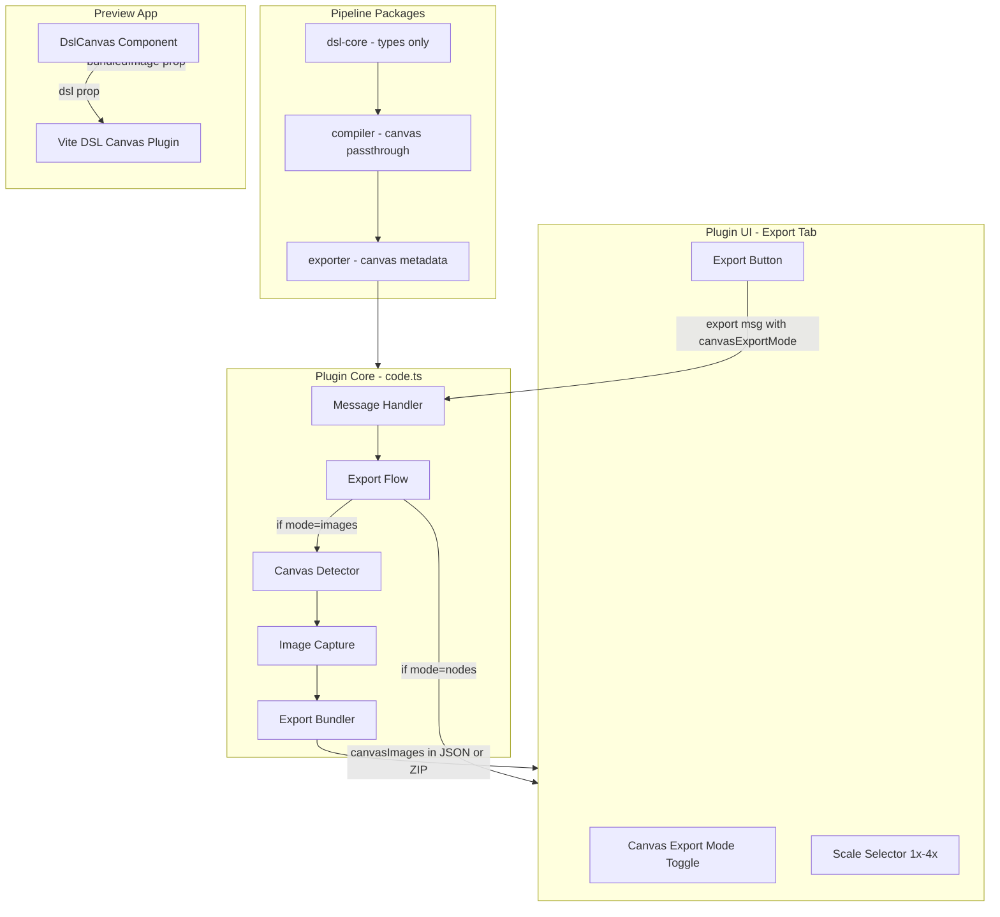
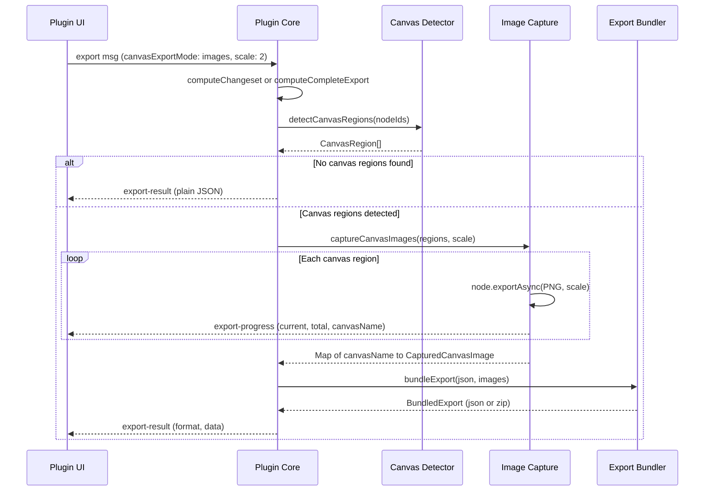
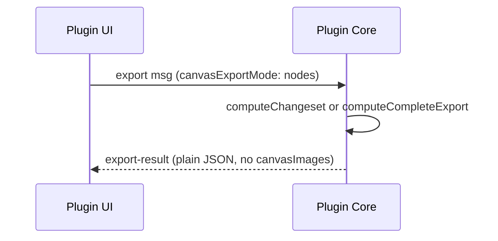

# Design Document — Drop Slot Features

## Overview

**Purpose**: This feature removes Figma native slot support from the DSL pipeline while repurposing the image capture and export bundling infrastructure for DslCanvas-only use. A new plugin UI toggle allows designers to choose between exporting DslCanvas regions as pixel-perfect images or as editable DSL node structures.

**Users**: Plugin users (designers) gain a clear export mode choice. Pipeline maintainers benefit from a simplified codebase without unused slot detection heuristics.

**Impact**: Removes slot-specific code across 8 packages (dsl-core, compiler, exporter, plugin, preview, and their tests). Refactors the image capture and bundling pipeline to canvas-only types. Adds one UI control to the plugin export tab.

### Goals
- Remove all Figma native slot features (detection, types, builders, Code Connect)
- Repurpose image capture and bundling for DslCanvas regions exclusively
- Add plugin UI toggle for canvas export mode (images vs DSL nodes)
- Preserve all existing DslCanvas functionality unchanged

### Non-Goals
- Adding new rendering capabilities to DslCanvas
- Supporting native Figma slot detection in any form
- Changing the CLI canvas workflow (render, --no-canvas)
- Modifying the Vite plugin server-side render path

## Architecture

### Existing Architecture Analysis

The current export pipeline follows a 3-stage pattern:
1. **Detection** (`slot-detector.ts`): 3-phase scan for native slots and DslCanvas regions
2. **Capture** (`image-capture.ts`): `exportAsync` PNG rendering with progress/cancellation
3. **Bundling** (`export-bundler.ts`): Size-based JSON/ZIP packaging with `fflate`

This pipeline is orchestrated by `runImageBundlePipeline()` in `code.ts` and triggered by export messages from the plugin UI.

**Key constraint**: The pipeline is cleanly isolated — detection, capture, and bundling are separate modules with thin integration in the orchestrator. Refactoring requires type changes but no structural changes.

### Architecture Pattern & Boundary Map



**Architecture Integration**:
- Selected pattern: Existing pipeline pattern preserved, narrowed from slot+canvas to canvas-only
- Domain boundaries: Plugin (detection + capture + bundling), packages (type removal), preview (DslCanvas simplification)
- Existing patterns preserved: Module-per-concern, message-based UI↔core communication, `exportAsync`-based capture
- New components: `canvas-detector.ts` replaces `slot-detector.ts`; no other new modules
- Steering compliance: No new dependencies, existing `fflate` retained, monorepo package boundaries respected

### Technology Stack

| Layer | Choice / Version | Role in Feature | Notes |
|-------|------------------|-----------------|-------|
| Plugin Runtime | Figma Plugin API | exportAsync for PNG capture, pluginData for canvas identification | No changes to API usage |
| Plugin Bundler | esbuild (IIFE) | Bundles canvas-detector, image-capture, export-bundler | fflate retained as bundled dep |
| ZIP Compression | fflate ^0.8.2 | ZIP archive for large canvas image exports | Existing dependency, no change |
| Preview | React + Vite | DslCanvas component simplification | Remove slotOverrides/nativeSlot |
| Types | TypeScript strict | Remove slot fields, add canvas-only types | All packages affected |

## System Flows

### Canvas Image Export Flow



### DSL Nodes Export Flow (No Image Capture)



## Requirements Traceability

| Requirement | Summary | Components | Interfaces | Flows |
|-------------|---------|------------|------------|-------|
| 1.1–1.6 | Remove slot detection, add canvas-only detection | CanvasDetector | `detectCanvasRegions()` | Canvas Image Export |
| 2.1–2.4 | Repurpose image capture for canvas | ImageCapture | `captureCanvasImages()` | Canvas Image Export |
| 3.1–3.6 | Repurpose export bundler for canvas | ExportBundler | `bundleExport()` | Canvas Image Export |
| 4.1–4.7 | Plugin UI toggle for canvas export mode | PluginUI | Export message protocol | Both flows |
| 5.1–5.6 | Remove slot fields from core types | DslCore types | `DslNode`, `FigmaNodeDict`, `PluginNodeDef` | — |
| 6.1–6.4 | Remove slot() builder | DslCore nodes | — | — |
| 7.1–7.6 | Remove slot handling from compiler | Compiler | — | — |
| 8.1–8.5 | Remove slot encoding from exporter | Exporter | — | — |
| 9.1–9.6 | Remove slot handling from plugin | PluginCore | — | — |
| 10.1–10.5 | Simplify DslCanvas component | DslCanvas | `DslCanvasProps` | — |
| 11.1–11.3 | Remove slot fields from changeset | DslCore changeset | — | — |
| 12.1–12.9 | Update documentation | Docs | — | — |
| 13.1–13.2 | Update spec metadata | Specs | — | — |
| 14.1–14.7 | Ensure no regressions | All | — | Both flows |

## Components and Interfaces

| Component | Domain/Layer | Intent | Req Coverage | Key Dependencies | Contracts |
|-----------|-------------|--------|--------------|------------------|-----------|
| CanvasDetector | Plugin | Detect DslCanvas regions via plugin data | 1.1–1.6 | Figma Plugin API (P0) | Service |
| ImageCapture | Plugin | Capture canvas PNG via exportAsync | 2.1–2.4 | CanvasDetector (P0), Figma API (P0) | Service |
| ExportBundler | Plugin | Bundle JSON + canvas images | 3.1–3.6 | fflate (P0) | Service |
| PluginUI | Plugin | Export tab with canvas mode toggle | 4.1–4.7 | PluginCore (P0) | State |
| PluginCore | Plugin | Orchestrate export flow | 9.1–9.6, 14.6–14.7 | All plugin modules (P0) | Service |
| DslCanvas | Preview | Render DSL or display bundled image | 10.1–10.5 | Vite plugin (P1) | State |
| DslCore Types | dsl-core | Shared type definitions | 5.1–5.6 | — | — |
| Compiler | compiler | Canvas passthrough | 7.1–7.6 | DslCore (P0) | — |
| Exporter | exporter | Canvas metadata export | 8.1–8.5 | DslCore (P0) | — |

### Plugin Layer

#### CanvasDetector

| Field | Detail |
|-------|--------|
| Intent | Detect DslCanvas regions within component trees by scanning for dsl-canvas plugin data |
| Requirements | 1.1, 1.2, 1.3, 1.4, 1.5, 1.6 |

**Responsibilities & Constraints**
- Walks direct children of COMPONENT/COMPONENT_SET nodes
- Reads `dsl-canvas` plugin data to identify canvas frames
- Extracts canvas name from parsed plugin data JSON
- Replaces the 3-phase SlotDetector with a single-phase scan

**Dependencies**
- Inbound: PluginCore — calls detectCanvasRegions during export (P0)
- External: Figma Plugin API — `getPluginData('dsl-canvas')` (P0)

**Contracts**: Service [x]

##### Service Interface
```typescript
interface CanvasRegion {
  readonly node: ExportableNode;
  readonly canvasName: string;
}

interface CanvasDetectableNode {
  readonly type: string;
  readonly name: string;
  readonly width: number;
  readonly height: number;
  readonly id: string;
  getPluginData?(key: string): string;
}

interface CanvasDetectableComponent {
  readonly type: string;
  readonly children: readonly CanvasDetectableNode[];
}

function detectCanvasRegions(
  componentNode: CanvasDetectableComponent,
): CanvasRegion[];
```
- Preconditions: componentNode is COMPONENT or COMPONENT_SET
- Postconditions: Returns array of canvas regions with valid node references and non-empty canvasName
- Invariants: Only nodes with valid `dsl-canvas` plugin data containing `isCanvas: true` are included

#### ImageCapture

| Field | Detail |
|-------|--------|
| Intent | Capture PNG images of canvas regions via Figma's exportAsync API |
| Requirements | 2.1, 2.2, 2.3, 2.4 |

**Responsibilities & Constraints**
- Calls `exportAsync` on each canvas region node
- Supports configurable scale (1x–4x, clamped)
- Reports progress and supports cancellation via abort signal
- Continues on per-node failure

**Dependencies**
- Inbound: PluginCore — provides CanvasRegion list (P0)
- External: Figma Plugin API — `node.exportAsync()` (P0)

**Contracts**: Service [x]

##### Service Interface
```typescript
interface CapturedCanvasImage {
  readonly pngBytes: Uint8Array;
  readonly scale: number;
  readonly width: number;
  readonly height: number;
}

interface CaptureOptions {
  scale?: number;
  onProgress?: (current: number, total: number, canvasName: string) => void;
  signal?: { aborted: boolean };
}

function captureCanvasImages(
  regions: CanvasRegion[],
  options?: CaptureOptions,
): Promise<Map<string, CapturedCanvasImage>>;
```
- Preconditions: Each region has a valid node with exportAsync capability
- Postconditions: Map keyed by canvasName; failed captures omitted
- Invariants: Scale clamped to 1–4 range

#### ExportBundler

| Field | Detail |
|-------|--------|
| Intent | Bundle export JSON with canvas images as base64 or ZIP |
| Requirements | 3.1, 3.2, 3.3, 3.4, 3.5, 3.6 |

**Responsibilities & Constraints**
- Estimates payload size and chooses format (base64 below 1MB, ZIP above)
- Embeds images as data URIs in `canvasImages` field (base64 mode)
- Packages as ZIP archive with separate PNG files (ZIP mode)
- Falls back to base64 if ZIP generation fails

**Dependencies**
- Inbound: PluginCore — provides JSON and captured images (P0)
- External: fflate ^0.8.2 — `zipSync()` for ZIP archive creation (P0)

**Contracts**: Service [x]

##### Service Interface
```typescript
interface CanvasImageEntry {
  readonly data: string;
  readonly scale: number;
  readonly width: number;
  readonly height: number;
}

type CanvasImageMap = Record<string, CanvasImageEntry>;

type ExportFormat = 'json' | 'zip';

interface BundledExport {
  readonly format: ExportFormat;
  readonly json?: string;
  readonly zipBytes?: Uint8Array;
  readonly imageCount: number;
  readonly totalImageBytes: number;
}

interface BundleOptions {
  sizeThreshold?: number;
}

function bundleExport(
  exportJson: Record<string, unknown>,
  capturedImages: Map<string, CapturedCanvasImage>,
  options?: BundleOptions,
): BundledExport;
```
- Preconditions: exportJson is valid JSON-serializable object
- Postconditions: Returns BundledExport with either json or zipBytes populated
- Invariants: Empty capturedImages map produces plain JSON without canvasImages field

#### PluginUI (Export Tab)

| Field | Detail |
|-------|--------|
| Intent | Provide canvas export mode toggle alongside existing export controls |
| Requirements | 4.1, 4.2, 4.3, 4.4, 4.5, 4.6, 4.7 |

**Contracts**: State [x]

##### State Management
- **New state**: `canvasExportMode` — `'images' | 'nodes'`, default `'nodes'`
- **Existing state**: `exportMode` (changeset/complete), `exportScale` (1-4), `exportScope` (selection/page)
- **UI behavior**: Scale selector visible only when `canvasExportMode === 'images'`
- **Message format**: Export message gains `canvasExportMode` field:

```typescript
interface ExportMessage {
  type: 'export-changeset' | 'export-complete';
  scope: 'selection' | 'page';
  scale?: number;
  canvasExportMode: 'images' | 'nodes';
}
```

**Implementation Notes**
- HTML select element with two options, placed before the scale selector
- JavaScript change handler toggles scale selector visibility
- Default value: `'nodes'`

### Plugin Orchestration

#### PluginCore (runCanvasImagePipeline)

| Field | Detail |
|-------|--------|
| Intent | Orchestrate canvas detection, image capture, and bundling during export |
| Requirements | 9.1–9.6, 14.6, 14.7 |

**Responsibilities & Constraints**
- Replaces `runImageBundlePipeline()` with canvas-only version
- Only executes when `canvasExportMode === 'images'`
- When `canvasExportMode === 'nodes'`, returns plain JSON immediately

**Contracts**: Service [x]

##### Service Interface
```typescript
async function runCanvasImagePipeline(
  nodeIds: ReadonlyArray<string>,
  exportJson: Record<string, unknown>,
  scale: number,
): Promise<BundledExport>;
```

**Implementation Notes**
- Message handler checks `msg.canvasExportMode` before calling pipeline
- When `'nodes'`: `JSON.stringify(exportJson)` returned directly
- When `'images'`: detect → capture → bundle flow executed
- Remove all `detectSlots`, `SlotDetectionResult`, `SlotDetectableComponent` imports
- Remove `formatSlotName`, `buildSlotPluginData`, `PLUGIN_DATA_SLOT` references
- Remove slot-specific frame creation logic in `case 'FRAME'`

### Preview Layer

#### DslCanvas Component

| Field | Detail |
|-------|--------|
| Intent | Render DSL JSON or display pre-captured canvas images |
| Requirements | 10.1, 10.2, 10.3, 10.4, 10.5 |

**Contracts**: State [x]

##### State Management
```typescript
interface DslCanvasProps {
  dsl?: FigmaNodeDict;
  bundledImage?: BundledImage;
  width?: number;
  scale?: number;
  className?: string;
  style?: CSSProperties;
  alt?: string;
}

interface BundledImage {
  dataUrl: string;
  width: number;
  height: number;
}
```

**Changes from current**:
- Remove `slotOverrides` prop
- Remove `applySlotOverrides()` function
- Remove `nativeSlot` from `BundledImage.sourceType` — remove `sourceType` field entirely
- Retain `bundledImage` prop for displaying canvas images from "As Images" export mode
- Rendering priority: bundledImage > dsl (via Vite plugin)

### Type Removal Layer

Types are removed from 3 packages in dependency order:

#### dsl-core Types

| Field | Detail |
|-------|--------|
| Intent | Remove slot-specific fields from shared type definitions |
| Requirements | 5.1, 5.2, 5.3, 5.4, 5.5 |

**Fields removed from DslNode**: `isSlot`, `slotName`, `preferredInstances`, `slotOverrides`
**Fields removed from PluginNodeDef**: `isSlot`, `slotPropertyName`, `slotProperties`, `slotOverrides`, `preferredInstances`
**Types removed**: `SlotProps`, `'SLOT'` from ComponentPropertyType
**Builder removed**: `slot()` function from nodes.ts, `slotOverrides` param from `instance()`
**Changeset fields removed**: `slotName`, `slotChangeType`, `slotContent`
**Diff fields removed**: `isSlot`, `slotPropertyName` from filter list

#### Compiler

| Field | Detail |
|-------|--------|
| Intent | Remove slot compilation logic |
| Requirements | 7.1, 7.2, 7.3, 7.4, 7.5, 7.6 |

**Removed**: `isSlot`/`slotName` propagation, slot-in-COMPONENT validation, SLOT property injection into componentPropertyDefinitions, `slotOverrides` compilation, `isSlot`+`isCanvas` mutual exclusivity check
**Fields removed from FigmaNodeDict**: `isSlot`, `slotName`, `preferredInstances`, `slotOverrides`

#### Exporter

| Field | Detail |
|-------|--------|
| Intent | Remove slot encoding from Figma export |
| Requirements | 8.1, 8.2, 8.3, 8.4, 8.5 |

**Removed**: `isSlot`/`slotPropertyName` on canvas nodes, `slotProperties` map, `slotOverrides` encoding, `figma.slot()` Code Connect generation

## Data Models

### Export Message Protocol

Current:
```typescript
{ type: 'export-changeset'|'export-complete', scope: 'selection'|'page', scale: number }
```

New:
```typescript
{ type: 'export-changeset'|'export-complete', scope: 'selection'|'page', scale: number, canvasExportMode: 'images'|'nodes' }
```

### Export JSON — canvasImages Field

When canvas export mode is "images", the exported JSON includes:

```typescript
{
  ...exportJson,
  canvasImages: {
    [canvasName: string]: {
      data: string;       // base64 data URI or ZIP file path
      scale: number;      // 1-4
      width: number;      // pixel width
      height: number;     // pixel height
    }
  }
}
```

## Error Handling

### Error Strategy
- **Canvas detection failure**: Log warning, continue export without images
- **Per-canvas capture failure**: Log error for specific canvas, omit from bundle, continue remaining
- **ZIP generation failure**: Fall back to base64 format, log warning
- **Abort/cancellation**: Return partial results collected so far

All error patterns are inherited from the existing slot pipeline — no new error scenarios introduced.

## Testing Strategy

### Unit Tests
- `canvas-detector.test.ts`: Canvas region detection via plugin data, empty results, non-canvas nodes skipped
- `image-capture.test.ts`: Canvas image capture with scale, progress, abort, per-node failure resilience
- `export-bundler.test.ts`: Canvas image bundling (base64 mode, ZIP mode, empty images, ZIP fallback)
- `slot.test.ts` removal: Delete entirely
- `slot-detector.test.ts` removal: Replace with canvas-detector tests
- `slot-utils.test.ts` removal: Delete entirely

### Integration Tests
- Type compilation: `npx tsc --noEmit` on all modified packages (dsl-core, compiler, exporter, plugin)
- Full test suite: `npx vitest run` from project root
- Plugin build: `npm run build` in plugin package (verify esbuild produces valid IIFE)

### E2E Tests
- Export with "As Images" mode: DslCanvas regions captured and bundled in canvasImages field
- Export with "As DSL Nodes" mode: Plain JSON without canvasImages field
- DslCanvas component: Renders bundled image when provided, falls back to server-side render
- CLI render: Per-canvas PNGs still produced (unchanged)
