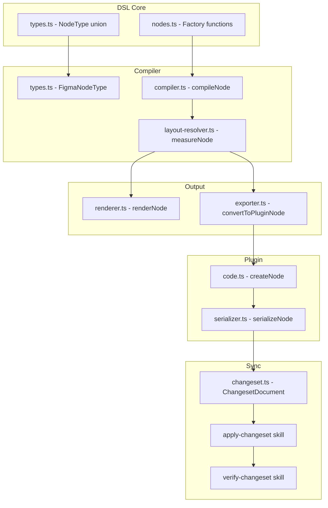
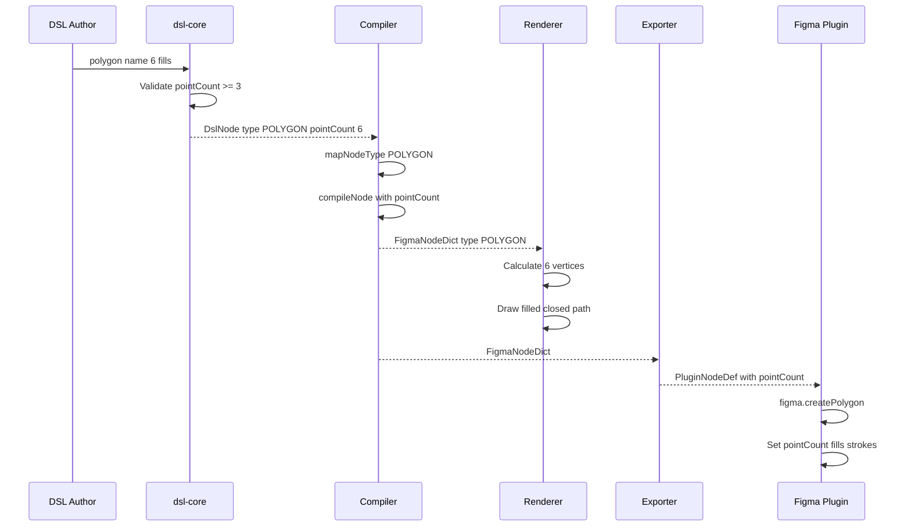
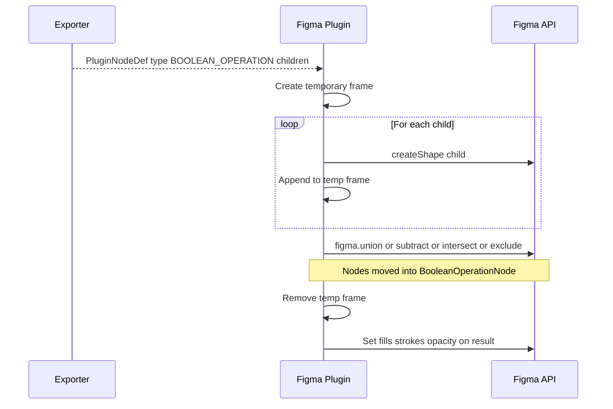
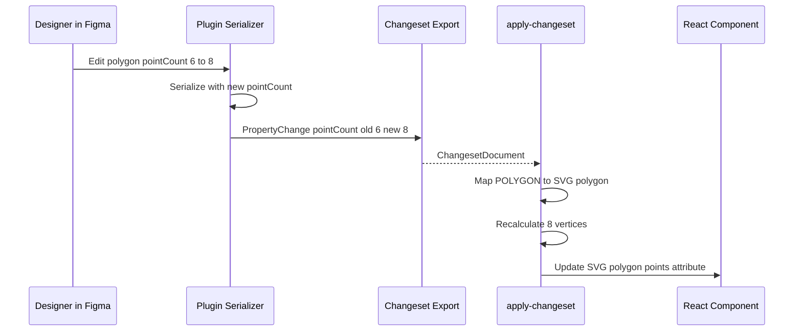
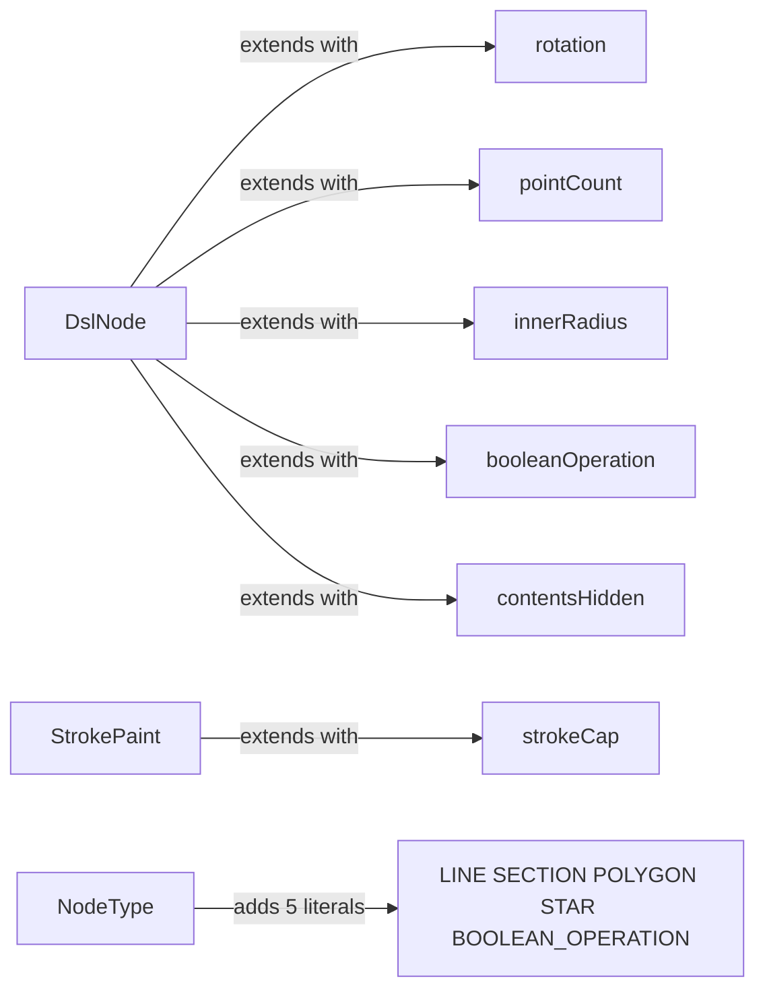

# Technical Design — dsl-node-types

## Overview

**Purpose**: This feature extends the DSL pipeline with five new Figma node types (LINE, SECTION, POLYGON, STAR, BOOLEAN_OPERATION), enabling declarative definition of geometric shapes, organizational sections, and composite boolean shapes across all pipeline stages including bidirectional sync.

**Users**: DSL authors use the new factory functions to define lines, shapes, and sections. Pipeline maintainers benefit from uniform integration across compiler, renderer, exporter, plugin, and sync workflows.

**Impact**: Extends the `NodeType` union from 9 to 14 types, adds 8 new factory functions, and modifies 10 existing source files across 6 packages. No new packages are created.

### Goals
- Add LINE, SECTION, POLYGON, STAR, BOOLEAN_OPERATION across all 7 pipeline stages
- Maintain bidirectional sync fidelity with React/CSS mappings for new types
- Follow existing pipeline patterns — uniform extension, no architectural changes

### Non-Goals
- Refactoring pipeline dispatch from switch statements to a plugin/registry pattern
- Supporting vector paths or freeform geometry (VECTOR node type)
- Implementing Figma-level constraints (ConstraintMixin) in the layout resolver
- Supporting complex strokes (variable width, dash patterns) beyond basic strokeCap

## Architecture

### Existing Architecture Analysis

The pipeline follows a linear staged architecture: DSL → Compiler → Renderer/Exporter → Plugin. Each stage uses typed interfaces (`DslNode` → `FigmaNodeDict` → `PluginNodeDef`). Node type dispatch is handled via switch statements in each stage. This design adds 5 new cases to each dispatch point while preserving the existing pattern.

The bidirectional sync layer (changeset types, apply/verify skills) operates on `PluginNodeDef` and `ChangesetDocument`. New node types must flow through this layer for round-trip support.

### Architecture Pattern & Boundary Map



**Architecture Integration**:
- Selected pattern: Uniform extension of existing switch/dispatch — no new abstractions
- Domain boundaries: Each package retains single responsibility; no cross-package coupling added
- Existing patterns preserved: Factory function pattern, typed interfaces, switch dispatch
- Steering compliance: TypeScript strict mode, no `any`, vitest tests, CSS Modules for React mappings

### Technology Stack

| Layer | Choice / Version | Role in Feature | Notes |
|-------|------------------|-----------------|-------|
| DSL Core | TypeScript 5.9 | Type definitions, factory functions | Extends existing DslNode, StrokePaint |
| Compiler | TypeScript + @napi-rs/canvas | Node compilation, layout resolution | New switch cases in mapNodeType, compileNode, measureNode |
| Renderer | @napi-rs/canvas 2D API | PNG rendering of new shapes | Vertex calculation for polygon/star, composite for boolean |
| Exporter | TypeScript | JSON export for plugin | Extends PluginNodeDef with new properties |
| Plugin | Figma Plugin API, esbuild | Figma node creation | figma.createLine/Polygon/Star/Section, figma.union/subtract/intersect/exclude |
| Sync | TypeScript, AI Skills | Changeset tracking, React mapping | Extends ChangesetDocument property paths |

## System Flows

### Forward Pipeline — New Node Type Compilation



### Boolean Operation — Plugin Creation



### Reverse Sync — Changeset Application



## Requirements Traceability

| Requirement | Summary | Components | Interfaces | Flows |
|-------------|---------|------------|------------|-------|
| 1.1–1.8 | LINE factory, compile, render, export, plugin | DslNode, nodes.ts, compiler.ts, renderer.ts, exporter.ts, code.ts | LineProps, StrokePaint.strokeCap | Forward pipeline |
| 2.1–2.7 | SECTION factory, compile, render, export, plugin | DslNode, nodes.ts, compiler.ts, layout-resolver.ts, renderer.ts, exporter.ts, code.ts | SectionProps | Forward pipeline |
| 3.1–3.8 | POLYGON factory, compile, render, export, plugin | DslNode, nodes.ts, compiler.ts, renderer.ts, exporter.ts, code.ts | PolygonProps | Forward pipeline |
| 4.1–4.7 | STAR factory, compile, render, export, plugin | DslNode, nodes.ts, compiler.ts, renderer.ts, exporter.ts, code.ts | StarProps | Forward pipeline |
| 5.1–5.8 | BOOLEAN_OPERATION factories, compile, render, export, plugin | DslNode, nodes.ts, compiler.ts, layout-resolver.ts, renderer.ts, exporter.ts, code.ts | BooleanOperationProps | Forward pipeline, Boolean creation |
| 6.1–6.7 | Cross-cutting pipeline types and exports | types.ts, compiler types.ts, index.ts | NodeType, FigmaNodeType, FigmaNodeDict | — |
| 7.1–7.8 | Changeset support for new node types | serializer.ts, changeset.ts | PluginNodeDef, PropertyChange | Reverse sync |
| 8.1–8.7 | React/CSS mapping for new node types | apply-changeset skill | — | Reverse sync |
| 9.1–9.4 | Verification for new node types | verify-changeset skill, renderer.ts | — | Reverse sync |
| 10.1–10.3 | Validator SVG/CSS recognition | dsl-compatible-layout.ts | ValidationRule | — |
| 11.1–11.5 | Calibration and round-trip tests | test files, examples/ | — | — |

## Components and Interfaces

| Component | Domain | Intent | Req Coverage | Key Dependencies | Contracts |
|-----------|--------|--------|--------------|------------------|-----------|
| DslNode types | dsl-core | Type definitions for 5 new node types | 6.1, 6.2 | — | Service |
| Factory functions | dsl-core | 8 new node constructors with validation | 1.1, 2.1, 3.1–3.2, 4.1–4.2, 5.1–5.2, 6.7 | DslNode types (P0) | Service |
| Compiler extension | compiler | Map and compile 5 new types | 1.2–1.3, 2.2–2.3, 3.3, 4.3, 5.3, 6.3, 6.6 | DslNode types (P0), FigmaNodeDict (P0) | Service |
| Layout resolver extension | compiler | Measure/position LINE, SECTION, BOOLEAN_OP | 2.4, 5.4 | Compiler (P0) | Service |
| Renderer extension | renderer | Canvas rendering for 5 new types | 1.4–1.5, 2.5, 3.4–3.6, 4.4–4.5, 5.5–5.6, 6.4 | Compiler (P0), @napi-rs/canvas (P0) | Service |
| Exporter extension | exporter | Export new types to PluginNodeDef | 1.6, 2.6, 3.7, 4.6, 5.7, 6.5 | FigmaNodeDict (P0) | Service |
| Plugin extension | plugin | Create Figma nodes for 5 new types | 1.7, 2.7, 3.8, 4.7, 5.8 | Figma Plugin API (P0) | Service |
| Serializer extension | plugin | Serialize new types for round-trip | 7.1–7.5 | PluginNodeDef (P0) | Service |
| Changeset paths | dsl-core | Support new property paths in changeset | 7.6–7.8 | ChangesetDocument (P0) | Service |
| Apply-changeset mapping | skill | Map new types to React/CSS | 8.1–8.7 | Changeset (P0) | — |
| Verify-changeset support | skill | Visual fidelity for new types | 9.1–9.4 | Renderer (P0), Capturer (P0) | — |
| Validator rules | validator | Recognize SVG/CSS patterns | 10.1–10.3 | ValidationRule (P1) | Service |

### DSL Core Layer

#### DslNode Type Extensions

| Field | Detail |
|-------|--------|
| Intent | Extend type system to support 5 new node types and their properties |
| Requirements | 6.1, 6.2 |

**Responsibilities & Constraints**
- Extend `NodeType` union with 5 new literal types
- Add new optional properties to `DslNode` interface
- Add `strokeCap` to `StrokePaint` interface
- Maintain backward compatibility — all additions are optional

**Contracts**: Service [x]

##### Service Interface

```typescript
// Extended NodeType union
type NodeType =
  | 'FRAME' | 'TEXT' | 'RECTANGLE' | 'ELLIPSE' | 'GROUP'
  | 'COMPONENT' | 'COMPONENT_SET' | 'INSTANCE'
  | 'LINE' | 'SECTION' | 'POLYGON' | 'STAR' | 'BOOLEAN_OPERATION';

// Extended StrokePaint
interface StrokePaint {
  color: RgbaColor;
  weight: number;
  align?: 'INSIDE' | 'CENTER' | 'OUTSIDE';
  strokeCap?: StrokeCap;
}

type StrokeCap =
  | 'NONE' | 'ROUND' | 'SQUARE'
  | 'ARROW_LINES' | 'ARROW_EQUILATERAL'
  | 'DIAMOND_FILLED' | 'TRIANGLE_FILLED' | 'CIRCLE_FILLED';

type BooleanOperationType = 'UNION' | 'INTERSECT' | 'SUBTRACT' | 'EXCLUDE';

// New properties on DslNode
interface DslNode {
  // ... existing properties ...
  rotation?: number;
  pointCount?: number;
  innerRadius?: number;
  booleanOperation?: BooleanOperationType;
  contentsHidden?: boolean;
}
```

- Preconditions: None — type-level changes only
- Postconditions: All existing DslNode values remain valid
- Invariants: `pointCount >= 3` when defined; `innerRadius` in [0, 1] when defined

#### Factory Functions

| Field | Detail |
|-------|--------|
| Intent | Provide 8 constructor functions with input validation |
| Requirements | 1.1, 1.8, 2.1, 3.1, 3.2, 4.1, 4.2, 5.1, 5.2, 6.7 |

**Responsibilities & Constraints**
- Follow existing `rectangle()` pattern: validate name, spread props, return DslNode
- Validate `pointCount >= 3` for polygon/star (throw at construction)
- Validate `children.length >= 2` for boolean operations (throw at construction)
- Default LINE stroke to 1px black if none provided
- Default STAR `innerRadius` to 0.382

**Dependencies**
- Inbound: DslNode types — type definitions (P0)

**Contracts**: Service [x]

##### Service Interface

```typescript
// Props interfaces
interface LineProps {
  size?: { x: number };
  strokes?: StrokePaint[];
  rotation?: number;
  opacity?: number;
  visible?: boolean;
  layoutGrow?: number;
  layoutSizingHorizontal?: LayoutSizing;
  layoutSizingVertical?: LayoutSizing;
}

interface SectionProps {
  size?: { x: number; y: number };
  fills?: Fill[];
  children?: DslNode[];
  contentsHidden?: boolean;
  visible?: boolean;
}

interface PolygonProps {
  pointCount: number;
  size?: { x: number; y: number };
  fills?: Fill[];
  strokes?: StrokePaint[];
  cornerRadius?: number;
  rotation?: number;
  opacity?: number;
  visible?: boolean;
  layoutGrow?: number;
  layoutSizingHorizontal?: LayoutSizing;
  layoutSizingVertical?: LayoutSizing;
}

interface StarProps {
  pointCount: number;
  innerRadius?: number;
  size?: { x: number; y: number };
  fills?: Fill[];
  strokes?: StrokePaint[];
  rotation?: number;
  opacity?: number;
  visible?: boolean;
  layoutGrow?: number;
  layoutSizingHorizontal?: LayoutSizing;
  layoutSizingVertical?: LayoutSizing;
}

interface BooleanOperationProps {
  children: DslNode[];
  fills?: Fill[];
  strokes?: StrokePaint[];
  opacity?: number;
  visible?: boolean;
}

// Factory functions
function line(name: string, props: LineProps): DslNode;
function section(name: string, props: SectionProps): DslNode;
function polygon(name: string, props: PolygonProps): DslNode;
function star(name: string, props: StarProps): DslNode;
function union(name: string, children: DslNode[], props?: Omit<BooleanOperationProps, 'children'>): DslNode;
function subtract(name: string, children: DslNode[], props?: Omit<BooleanOperationProps, 'children'>): DslNode;
function intersect(name: string, children: DslNode[], props?: Omit<BooleanOperationProps, 'children'>): DslNode;
function exclude(name: string, children: DslNode[], props?: Omit<BooleanOperationProps, 'children'>): DslNode;
```

- Preconditions: `name` is non-empty; `pointCount >= 3`; boolean children `>= 2`
- Postconditions: Returns valid DslNode; LINE has default stroke if none provided
- Invariants: Factory never returns undefined; validation errors throw synchronously

**Implementation Notes**
- SectionProps intentionally omits `opacity`, `strokes`, `rotation`, `autoLayout` — SectionNode does not support these in Figma
- Boolean operation functions accept children separately from props for ergonomic API: `union('icon', [circle, rect], { fills })`

### Compiler Layer

#### Compiler Extension

| Field | Detail |
|-------|--------|
| Intent | Map 5 new DSL types to Figma types and compile node-specific properties |
| Requirements | 1.2, 1.3, 2.2, 2.3, 3.3, 4.3, 5.3, 6.3, 6.6 |

**Responsibilities & Constraints**
- Extend `FigmaNodeType` with 5 new type literals
- Add 5 new cases to `mapNodeType()` switch
- Add node-specific property mapping in `compileNode()`
- SECTION: Skip auto-layout properties entirely
- BOOLEAN_OPERATION: Include `booleanOperation` field
- Unknown types: Emit warning and skip (6.6)

**Dependencies**
- Inbound: DslNode — input nodes (P0)
- Outbound: FigmaNodeDict — compiled output (P0)

**Contracts**: Service [x]

##### Service Interface

```typescript
// Extended FigmaNodeType
type FigmaNodeType =
  | 'FRAME' | 'TEXT' | 'RECTANGLE' | 'ROUNDED_RECTANGLE'
  | 'ELLIPSE' | 'GROUP' | 'COMPONENT' | 'COMPONENT_SET' | 'INSTANCE' | 'VECTOR'
  | 'LINE' | 'SECTION' | 'POLYGON' | 'STAR' | 'BOOLEAN_OPERATION';

// New properties on FigmaNodeDict
interface FigmaNodeDict {
  // ... existing properties ...
  pointCount?: number;
  innerRadius?: number;
  booleanOperation?: BooleanOperationType;
  strokeCap?: StrokeCap;
  rotation?: number;
  sectionContentsHidden?: boolean;
}
```

**Implementation Notes**
- `mapNodeType()` for all 5 new types returns the type directly (no RECTANGLE → ROUNDED_RECTANGLE logic needed)
- SECTION compilation must guard against `autoLayout` assignment — Figma throws if auto-layout is set on SectionNode
- STAR default `innerRadius` is 0.382 if not specified in DslNode

#### Layout Resolver Extension

| Field | Detail |
|-------|--------|
| Intent | Handle measurement and positioning for LINE, SECTION, BOOLEAN_OPERATION |
| Requirements | 2.4, 5.4 |

**Responsibilities & Constraints**
- LINE: Leaf node, size = `{ width: size.x, height: 0 }`
- POLYGON, STAR: Leaf shapes, use specified size
- SECTION: Absolute-positioned container, no auto-layout; children at explicit (x, y) or stacked sequentially
- BOOLEAN_OPERATION: Union bounding box of all children (same as GROUP behavior)

**Dependencies**
- Inbound: FigmaNodeDict — compiled nodes (P0)

**Implementation Notes**
- GROUP bounding box logic (lines 326–329 in layout-resolver.ts) is reused for BOOLEAN_OPERATION
- SECTION children stacking uses the same sequential placement as GROUP when no explicit coordinates exist

### Renderer Layer

#### Renderer Extension

| Field | Detail |
|-------|--------|
| Intent | Canvas 2D rendering for all 5 new node types |
| Requirements | 1.4, 1.5, 2.5, 3.4, 3.5, 3.6, 4.4, 4.5, 5.5, 5.6, 6.4 |

**Responsibilities & Constraints**
- LINE: Horizontal stroke from (0,0) to (width, 0); apply rotation transform if specified
- SECTION: Filled rectangle + name label above content area
- POLYGON: Regular polygon via vertex calculation; first vertex at -90°; optional corner radius
- STAR: Alternating outer/inner vertices; `pointCount * 2` total; first outer vertex at -90°
- BOOLEAN_OPERATION: Offscreen canvas compositing with appropriate `globalCompositeOperation`

**Dependencies**
- Inbound: FigmaNodeDict — compiled nodes (P0)
- External: @napi-rs/canvas — Canvas 2D API (P0)

**Contracts**: Service [x]

##### Service Interface

```typescript
// Helper functions for vertex calculation
function calculatePolygonVertices(
  pointCount: number,
  width: number,
  height: number,
): Array<{ x: number; y: number }>;

function calculateStarVertices(
  pointCount: number,
  innerRadius: number,
  width: number,
  height: number,
): Array<{ x: number; y: number }>;
```

**Implementation Notes**
- Polygon vertex formula: `angle = (2π * i / pointCount) - π/2`; `x = cx + rx * cos(angle)`; `y = cy + ry * sin(angle)`
- Star vertex formula: alternate outer (full radius) and inner (scaled by `innerRadius`) vertices for `pointCount * 2` total
- Boolean compositing modes: UNION → `source-over`, SUBTRACT → `destination-out`, INTERSECT → `destination-in`, EXCLUDE → `xor`
- When BOOLEAN_OPERATION has its own fills/strokes, apply to the composited result
- Corner radius on polygons: use quadratic bezier curves at vertices (approximate arc)
- Rotation: apply `ctx.save()`, `ctx.translate()`, `ctx.rotate()`, draw, `ctx.restore()`

### Exporter Layer

#### Exporter Extension

| Field | Detail |
|-------|--------|
| Intent | Include new node type properties in PluginNodeDef JSON output |
| Requirements | 1.6, 2.6, 3.7, 4.6, 5.7 |

**Responsibilities & Constraints**
- Extend `PluginNodeDef` interface with new optional properties
- Map new `FigmaNodeDict` properties to `PluginNodeDef` in `convertToPluginNode()`

**Dependencies**
- Inbound: FigmaNodeDict — compiled nodes (P0)
- Outbound: PluginNodeDef — plugin import format (P0)

**Contracts**: Service [x]

##### Service Interface

```typescript
// Extended PluginNodeDef
interface PluginNodeDef {
  // ... existing properties ...
  pointCount?: number;
  innerRadius?: number;
  booleanOperation?: string;
  strokeCap?: string;
  rotation?: number;
  sectionContentsHidden?: boolean;
}
```

### Plugin Layer

#### Plugin Node Creator Extension

| Field | Detail |
|-------|--------|
| Intent | Create Figma nodes for 5 new types using Figma Plugin API |
| Requirements | 1.7, 2.7, 3.8, 4.7, 5.8 |

**Responsibilities & Constraints**
- LINE: `figma.createLine()` + resize + stroke + strokeCap + rotation
- SECTION: `figma.createSection()` + `resizeWithoutConstraints()` + `sectionContentsHidden` + fills
- POLYGON: `figma.createPolygon()` + `pointCount` + fills + strokes + cornerRadius + rotation
- STAR: `figma.createStar()` + `pointCount` + `innerRadius` + fills + strokes + rotation
- BOOLEAN_OPERATION: Create children first → `figma.union/subtract/intersect/exclude(nodes, parent)` → set fills/strokes/opacity

**Dependencies**
- Inbound: PluginNodeDef — import JSON (P0)
- External: Figma Plugin API — node creation (P0)

**Implementation Notes**
- SECTION uses `resizeWithoutConstraints()` instead of `resize()` — SectionNode does not have LayoutMixin
- SECTION does not support `opacity` — skip opacity assignment for SECTION type
- BOOLEAN_OPERATION requires temporary frame pattern: create children in temp frame, combine, remove temp frame
- `figma.createBooleanOperation()` is deprecated — must use `figma.union()` etc.

#### Serializer Extension

| Field | Detail |
|-------|--------|
| Intent | Serialize new node types from Figma back to PluginNodeDef for round-trip |
| Requirements | 7.1–7.5 |

**Responsibilities & Constraints**
- LINE: Serialize length (width), stroke, strokeCap, rotation
- SECTION: Serialize fills, `sectionContentsHidden`
- POLYGON: Serialize `pointCount`, fills, strokes, cornerRadius
- STAR: Serialize `pointCount`, `innerRadius`, fills, strokes
- BOOLEAN_OPERATION: Serialize `booleanOperation`, children recursively, fills, strokes

**Dependencies**
- Inbound: Figma SceneNode — live Figma nodes (P0)
- Outbound: PluginNodeDef — serialized format (P0)

### Bidirectional Sync Layer

#### Changeset Property Paths

| Field | Detail |
|-------|--------|
| Intent | Support tracking changes to new node type properties in changeset documents |
| Requirements | 7.6–7.8 |

**Responsibilities & Constraints**
- Support property paths: `"pointCount"`, `"innerRadius"`, `"booleanOperation"`, `"strokeCap"`, `"contentsHidden"`, `"rotation"`
- Track structural changes (add/remove new node types) with full property snapshot
- No schema changes to `ChangesetDocument` — existing structure supports arbitrary `propertyPath` strings

**Implementation Notes**
- `ChangesetDocument` already uses string-based `propertyPath` — no structural changes needed
- Plugin edit tracking must emit change events for new properties when they change

#### Apply-Changeset React/CSS Mapping

| Field | Detail |
|-------|--------|
| Intent | Map design changes on new node types to React component code |
| Requirements | 8.1–8.7 |

**Responsibilities & Constraints**
- LINE → CSS `border-bottom` or `<hr>`: stroke color → `border-color`, weight → `border-width`, length → `width`
- POLYGON → inline SVG `<polygon>`: compute vertex `points` attribute from `pointCount` and size
- STAR → inline SVG `<polygon>`: compute vertex `points` from `pointCount`, `innerRadius`, size
- BOOLEAN_OPERATION → inline SVG with composited `<path>` or `<clipPath>` elements
- SECTION → skip (no React equivalent); log in summary report
- Geometry property changes (`pointCount`, `innerRadius`) → recalculate SVG vertex coordinates

**Implementation Notes**
- Vertex calculation functions for SVG `points` attribute match the renderer's vertex calculation logic
- Boolean operation SVG mapping is complex — emit as manual review item when structure changes

#### Verify-Changeset Support

| Field | Detail |
|-------|--------|
| Intent | Visual verification handles rendering and comparison for new node types |
| Requirements | 9.1–9.4 |

**Responsibilities & Constraints**
- Renderer produces accurate PNG for new types (covered by renderer extension)
- Capturer captures SVG rendering from React components at matching scale
- Per-node-type similarity thresholds: lower for boolean operations (anti-aliasing artifacts)
- Identify which new node type elements contribute to visual differences

### Validator Layer

#### DSL-Compatible Layout Rule Extension

| Field | Detail |
|-------|--------|
| Intent | Recognize SVG and CSS border patterns as valid DSL-compatible representations |
| Requirements | 10.1–10.3 |

**Responsibilities & Constraints**
- Recognize `<svg>`, `<polygon>`, `<line>`, `<clipPath>` as valid DSL-compatible elements
- Accept CSS `border-bottom` as valid LINE representation
- Informational suggestion (not error) when PNG used where a shape node would suffice

## Data Models

### Domain Model

The core data model extends three existing interfaces:



All new properties are optional on `DslNode`, maintaining backward compatibility. The `NodeType` discriminant determines which properties are meaningful for each node.

**Invariants**:
- `pointCount >= 3` when type is POLYGON or STAR
- `innerRadius` in [0, 1] when type is STAR
- `booleanOperation` must be set when type is BOOLEAN_OPERATION
- `children.length >= 2` when type is BOOLEAN_OPERATION

### Data Contracts & Integration

**PluginNodeDef extension** — the JSON format exchanged between exporter and plugin:

New fields added:
- `pointCount?: number`
- `innerRadius?: number`
- `booleanOperation?: string`
- `strokeCap?: string`
- `rotation?: number`
- `sectionContentsHidden?: boolean`

All fields optional, backward compatible with existing PluginNodeDef consumers.

## Error Handling

### Error Strategy

- **Validation errors** (construction time): `polygon()` throws if `pointCount < 3`; boolean functions throw if `children < 2`
- **Unknown node type** (compilation time): Emit console warning, skip node, continue processing remaining nodes (6.6)
- **Plugin creation failure**: Catch per-node, push error to errors array, continue with remaining nodes (existing pattern)
- **Boolean operation creation**: If `figma.union()` etc. returns null, skip node and report error

### Error Categories and Responses
- **User Errors**: Invalid `pointCount`, missing children → throw with descriptive message at factory level
- **System Errors**: Figma API failure during node creation → graceful skip, error logged
- **Business Logic Errors**: Unsupported node type in older pipeline version → warning + skip

## Testing Strategy

### Unit Tests
- `nodes.test.ts`: Factory function output shape, validation errors, default values (LINE default stroke, STAR default innerRadius)
- `compiler.test.ts`: `mapNodeType()` for 5 new types; `compileNode()` property mapping; SECTION auto-layout skip
- `renderer.test.ts`: Vertex calculation accuracy; composite operation selection; rotation transform
- `exporter.test.ts`: PluginNodeDef output includes all new properties

### Integration Tests
- Compile → render round-trip for each new node type (produce PNG, verify no exceptions)
- Compile → export round-trip (produce PluginNodeDef JSON, verify structure)
- Plugin serializer → PluginNodeDef round-trip for each new type

### Calibration Tests (11.1–11.5)
- Categories: `line-shapes`, `polygon-star-shapes`, `boolean-operations`, `section-layout`
- Example DSL files: divider line, hexagonal badge, 5-point star, boolean-subtracted icon, section grouping
- Round-trip test: DSL → export → serialize → compare against original
- Per-type similarity thresholds: boolean operations allow lower threshold (known anti-aliasing gap)
