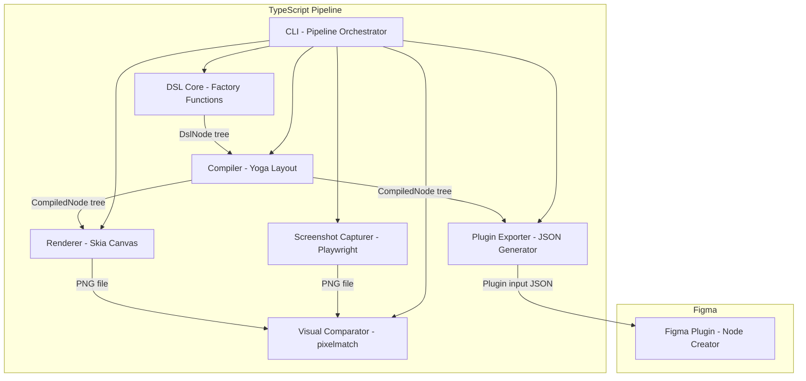
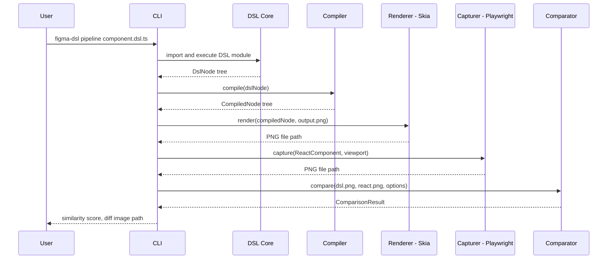
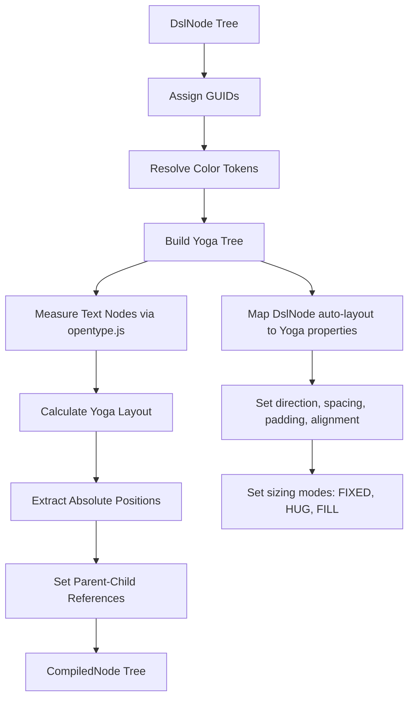

# Technical Design: Figma Component DSL

## Overview

**Purpose**: This feature delivers a domain-specific language for declaratively defining Figma component structures in TypeScript, enabling a Figma-free iteration loop where developers define components, render them as images, compare against React screenshots, and export to Figma when ready.

**Users**: Component developers and design system engineers use the DSL to define component structures in code, iterate on visual accuracy without Figma, and synchronize components between React and Figma.

**Impact**: Introduces a new all-TypeScript toolchain (DSL core, compiler, renderer, comparison engine, CLI, Figma plugin) that bridges the gap between the two reference implementations — combining figma_design_playground's component creation patterns with figma-html-renderer's rendering concepts, reimplemented with Skia (the same rendering engine Figma uses internally).

### Goals
- Provide a type-safe, declarative API for defining Figma node structures with auto-layout, colors, typography, and component variants
- Render DSL definitions as PNG images using Skia via @napi-rs/canvas, matching Figma's visual output with high fidelity
- Enable automated visual comparison between DSL renders and React component screenshots
- Export DSL definitions to Figma via a plugin that creates real components with properties and variants
- Expose all pipeline operations through a unified CLI — all in TypeScript, no cross-language dependencies

### Non-Goals
- Real-time collaborative editing of DSL definitions
- Full Figma feature parity (effects, masks, boolean operations, constraints, prototyping)
- DSL-to-React code generation (reverse direction)
- Figma file parsing (`.fig` → DSL) — potential future feature via fig2json
- Dark mode or responsive variant generation

## Architecture

> Detailed discovery notes and landscape research are in `research.md`. This section captures all decisions and contracts.

### Architecture Pattern & Boundary Map

**Selected pattern**: All-TypeScript Pipeline — sequential stages transform DSL definitions through compilation, rendering, comparison, and export. Each stage has a single responsibility and communicates via well-defined TypeScript interfaces.

**Rationale**: Landscape research (Satori, @react-pdf/renderer, Ink, react-figma) confirmed that every comparable project operates in a single language. The previous cross-language design (TypeScript → JSON → Python/PyCairo) is replaced with an all-TypeScript pipeline using @napi-rs/canvas (Skia) for rendering and Yoga WASM for layout. Skia is the same rendering engine Figma uses internally, providing the highest possible rendering fidelity.



**Domain boundaries**:
- **DSL Core**: Node definition and tree construction (TypeScript, zero dependencies)
- **Compiler**: Layout resolution via Yoga, GUID assignment, format conversion (TypeScript)
- **Renderer**: Visual rasterization via Skia/@napi-rs/canvas (TypeScript)
- **Capturer**: React component screenshot isolation (TypeScript/Playwright)
- **Comparator**: Pixel-level image diffing (TypeScript/pixelmatch)
- **Exporter**: Figma plugin input generation (TypeScript)
- **Plugin**: Figma node creation via Plugin API (TypeScript, runs in Figma sandbox)
- **CLI**: User-facing orchestration of all stages (TypeScript/Node.js)

**Existing patterns preserved**: Pipeline architecture concept from figma-html-renderer; component creation patterns from figma_design_playground plugin; CSS custom property design tokens; Satori's all-TypeScript Yoga+opentype.js pattern.

**New components rationale**: DSL Core provides type-safe node construction; Compiler bridges DSL trees to rendered output using Yoga for layout; Renderer uses Skia (same engine as Figma) for highest fidelity; Comparator and Capturer enable the visual iteration loop; CLI unifies all operations.

**Steering compliance**: TypeScript strict mode, no `any`; pipeline stages with single responsibility; immutable data between stages; no framework bloat; single-language (TypeScript) throughout.

### Technology Stack

| Layer | Choice / Version | Role in Feature | Notes |
|-------|------------------|-----------------|-------|
| DSL Core / CLI | TypeScript 5.9+, Node.js 22+ | DSL definition, compilation, orchestration | Strict mode, ES2023 target |
| Layout Engine | Yoga WASM (`yoga-layout` 3.x) | Flexbox layout resolution for auto-layout | ~200KB WASM, used by Satori/react-pdf/Ink |
| Renderer | @napi-rs/canvas 0.1.x (Skia) | Rasterize compiled nodes to PNG | Zero system deps, prebuilt binaries, same engine as Figma |
| Text Measurement | opentype.js 2.0+ | Font metric lookup for layout sizing | Same approach as Satori; parses .otf/.ttf |
| Screenshot Capture | Playwright 1.50+ | Headless browser React component screenshots | Element-level capture |
| Image Comparison | pixelmatch 6.0+, pngjs 7.0+ | Pixel-level visual diff | De facto standard (used by Playwright, jest, Vitest) |
| Image Processing | sharp 0.33+ | Resize/pad images before comparison | High-performance libvips binding |
| Figma Plugin | Figma Plugin API, esbuild | Create Figma nodes from DSL definitions | Same build toolchain as reference plugin |
| Package Management | npm workspaces | Monorepo for TypeScript packages | All packages in single language |

> Rationale for key technology choices is documented in `research.md` design decisions section.

### Monorepo Package Structure

```
packages/
├── dsl-core/          # DslCore + Compiler (zero external deps for core; yoga-layout + opentype.js for compiler)
│   ├── src/
│   │   ├── nodes/     # Factory functions, DslNode types
│   │   ├── compiler/  # Yoga mapping, GUID assignment, text measurement
│   │   ├── colors/    # Hex parsing, fill/gradient helpers, color tokens
│   │   └── index.ts   # Public API barrel export
│   ├── fonts/         # Bundled Inter .otf files
│   └── package.json
├── renderer/          # Renderer (depends on dsl-core, @napi-rs/canvas)
│   ├── src/
│   └── package.json
├── comparator/        # Capturer + Comparator (depends on playwright, pixelmatch, pngjs, sharp)
│   ├── src/
│   └── package.json
├── cli/               # CLI orchestrator (depends on all above packages)
│   ├── src/
│   └── package.json
└── figma-plugin/      # Figma plugin (depends on dsl-core types only; bundled with esbuild)
    ├── src/
    ├── ui.html
    └── package.json
```

**Inter-package dependency graph**:
```
cli → dsl-core, renderer, comparator
renderer → dsl-core
comparator → (none — receives PNG file paths, not package imports)
figma-plugin → dsl-core (types only, bundled at build time)
```

**Key decisions**:
- DslCore and Compiler are co-located in `dsl-core` because the Compiler's primary input is DslNode and they share types. Keeping them together avoids circular dependencies.
- Capturer and Comparator are co-located in `comparator` because they share the Playwright dependency and both operate on PNG files.
- `figma-plugin` imports only TypeScript types from `dsl-core` (for PluginInput, PluginNodeDef interfaces) — the plugin is bundled into a standalone `code.js` by esbuild with no runtime package dependencies.

### Environment Setup

The entire pipeline runs in TypeScript/Node.js. No Python, no cross-language bridge.

**Dependencies**:
- Node.js 22+ (single runtime requirement)
- `npm install` handles everything — @napi-rs/canvas ships prebuilt Skia binaries for macOS (x64/arm64), Linux (x64/arm64), and Windows (x64)
- No system library installation required (unlike PyCairo which required `brew install cairo`)

**Font Assets**:
- The Inter font family (.otf files for Regular, Medium, Semi Bold, Bold weights) is bundled in `packages/dsl-core/fonts/`
- opentype.js loads these files for text measurement — no system font dependency for the compiler
- @napi-rs/canvas registers the same bundled fonts for rendering — consistent measurement and rendering

**Doctor Command**:
- `figma-dsl doctor` verifies: Node.js version, @napi-rs/canvas availability, Playwright browsers, Inter font registration

## System Flows

### Full Pipeline Flow



### Compile Flow



## Requirements Traceability

| Requirement | Summary | Components | Interfaces | Flows |
|-------------|---------|------------|------------|-------|
| 1.1–1.7 | DSL node primitives (FRAME, TEXT, RECT, ELLIPSE, GROUP, hierarchy, visibility) | DslCore | NodeFactory, DslNode | — |
| 2.1–2.6 | Auto-layout system (direction, spacing, padding, alignment, sizing, flex-grow) | DslCore, Compiler | AutoLayoutConfig, YogaMapper | Compile Flow |
| 3.1–3.6 | Color and fill system (hex, solid, gradient, stroke, multi-fill, tokens) | DslCore, Compiler | ColorToken, Fill, StrokePaint | Compile Flow |
| 4.1–4.6 | Typography system (font, size, line-height, letter-spacing, alignment) | DslCore, Compiler | TextStyle, TextMeasurer | Compile Flow |
| 5.1–5.5 | Component and variant system (COMPONENT, properties, COMPONENT_SET, INSTANCE) | DslCore, Compiler, Exporter | ComponentDef, VariantAxis, InstanceRef | Compile Flow |
| 6.1–6.4 | DSL rendering to PNG | Renderer | RendererService | Pipeline Flow |
| 7.1–7.4 | React component screenshot capture | Capturer | CaptureService | Pipeline Flow |
| 8.1–8.4 | Visual comparison with diff | Comparator | CompareService | Pipeline Flow |
| 9.1–9.10 | Figma plugin — DSL to Figma components | Exporter, Plugin | PluginInputSchema, PluginRunner | — |
| 10.1–10.7 | CLI interface for all pipeline operations | CLI | CliCommands | Pipeline Flow |

## Components and Interfaces

| Component | Domain/Layer | Intent | Req Coverage | Key Dependencies | Contracts |
|-----------|--------------|--------|--------------|------------------|-----------|
| DslCore | DSL / Core | Declarative factory functions for node tree construction | 1.1–1.7, 2.1–2.6, 3.1–3.6, 4.1–4.6, 5.1–5.5 | None (P0) | Service |
| Compiler | DSL / Core | Resolve layout via Yoga, assign GUIDs, produce CompiledNode | 1.6, 2.1–2.6, 3.1–3.5, 4.1–4.6, 5.1–5.5 | DslCore (P0), yoga-layout (P0), opentype.js (P0) | Service |
| Renderer | Rendering / TypeScript | Rasterize CompiledNode to PNG via Skia | 6.1–6.4 | @napi-rs/canvas (P0) | Service |
| Capturer | Screenshot / TypeScript | Capture React component screenshots via Playwright | 7.1–7.4 | Playwright (P0) | Service |
| Comparator | Analysis / TypeScript | Pixel-level image diff with similarity scoring | 8.1–8.4 | pixelmatch (P0), pngjs (P0), sharp (P1) | Service |
| Exporter | Export / TypeScript | Generate Figma plugin input JSON from compiled nodes | 9.1–9.9 | Compiler (P0) | Service |
| Plugin | Export / Figma | Create Figma nodes from plugin input JSON | 9.1–9.10 | Figma Plugin API (P0) | Service |
| CLI | Interface / TypeScript | User-facing commands orchestrating all pipeline stages | 10.1–10.7 | All components (P0) | Service |

### DSL Core Layer

#### DslCore

| Field | Detail |
|-------|--------|
| Intent | Provide type-safe factory functions for constructing DSL node trees |
| Requirements | 1.1–1.7, 2.1–2.6, 3.1–3.6, 4.1–4.6, 5.1–5.5 |

**Responsibilities & Constraints**
- Expose factory functions (`frame`, `text`, `rectangle`, `ellipse`, `group`, `component`, `componentSet`, `instance`) that return `DslNode` objects
- Validate node property constraints at construction time (e.g., auto-layout only on FRAME/COMPONENT)
- Provide color helper functions (`hex`, `solid`, `gradient`, `colorToken`) that accept hex strings and produce fill objects
- Maintain immutability — factory functions return new objects, never mutate inputs

**Dependencies**
- None — this is the innermost core with zero external dependencies

**Contracts**: Service [x]

##### Service Interface
```typescript
// --- Node Types ---
type NodeType = 'FRAME' | 'TEXT' | 'RECTANGLE' | 'ELLIPSE' | 'GROUP'
  | 'COMPONENT' | 'COMPONENT_SET' | 'INSTANCE';

// --- Color & Fill ---
interface RgbaColor {
  r: number; // 0–1
  g: number;
  b: number;
  a: number;
}

interface SolidFill {
  type: 'SOLID';
  color: RgbaColor;
  opacity: number;
  visible: boolean;
}

interface GradientStop {
  color: RgbaColor;
  position: number; // 0–1
}

interface GradientFill {
  type: 'GRADIENT_LINEAR';
  gradientStops: GradientStop[];
  gradientTransform: [[number, number, number], [number, number, number]];
  opacity: number;
  visible: boolean;
}

type Fill = SolidFill | GradientFill;

interface StrokePaint {
  color: RgbaColor;
  weight: number;
  align?: 'INSIDE' | 'CENTER' | 'OUTSIDE';
}

// --- Auto-Layout ---
interface AutoLayoutConfig {
  direction: 'HORIZONTAL' | 'VERTICAL';
  spacing?: number;
  padX?: number;
  padY?: number;
  padTop?: number;
  padRight?: number;
  padBottom?: number;
  padLeft?: number;
  align?: 'MIN' | 'CENTER' | 'MAX' | 'SPACE_BETWEEN';
  counterAlign?: 'MIN' | 'CENTER' | 'MAX';
  sizing?: 'FIXED' | 'HUG' | 'FILL';
  widthSizing?: 'FIXED' | 'HUG' | 'FILL';
  heightSizing?: 'FIXED' | 'HUG' | 'FILL';
}

// --- Typography ---
interface TextStyle {
  fontFamily?: string;       // default: 'Inter'
  fontWeight?: 400 | 500 | 600 | 700;
  fontSize?: number;         // pixels
  lineHeight?: { value: number; unit: 'PERCENT' | 'PIXELS' };
  letterSpacing?: { value: number; unit: 'PERCENT' | 'PIXELS' };
  textAlignHorizontal?: 'LEFT' | 'CENTER' | 'RIGHT';
  color?: string;            // hex string, convenience shorthand
}

// --- Component Properties ---
type ComponentPropertyType = 'TEXT' | 'BOOLEAN' | 'INSTANCE_SWAP';

interface ComponentProperty {
  name: string;
  type: ComponentPropertyType;
  defaultValue: string | boolean;
  preferredValues?: string[]; // for INSTANCE_SWAP, reference component names
}

// --- DSL Node (AST) ---
interface DslNode {
  type: NodeType;
  name: string;
  size?: { x: number; y: number };
  fills?: Fill[];
  strokes?: StrokePaint[];
  cornerRadius?: number;
  cornerRadii?: { topLeft: number; topRight: number; bottomLeft: number; bottomRight: number };
  opacity?: number;
  visible?: boolean;
  clipContent?: boolean;
  children?: DslNode[];

  // Auto-layout (FRAME, COMPONENT)
  autoLayout?: AutoLayoutConfig;
  layoutGrow?: number;
  layoutSizingHorizontal?: 'FIXED' | 'HUG' | 'FILL';
  layoutSizingVertical?: 'FIXED' | 'HUG' | 'FILL';

  // Text (TEXT only)
  characters?: string;
  textStyle?: TextStyle;

  // Component (COMPONENT only)
  componentProperties?: ComponentProperty[];

  // Component Set (COMPONENT_SET only)
  variantAxes?: Record<string, string[]>;

  // Instance (INSTANCE only)
  componentRef?: string;
  propertyOverrides?: Record<string, string | boolean>;
}

// --- Factory Functions ---
function frame(name: string, props: FrameProps): DslNode;
function text(characters: string, style?: TextStyle): DslNode;
function rectangle(name: string, props: RectangleProps): DslNode;
function ellipse(name: string, props: EllipseProps): DslNode;
function group(name: string, children: DslNode[]): DslNode;
function component(name: string, props: ComponentProps): DslNode;
function componentSet(name: string, props: ComponentSetProps): DslNode;
function instance(componentRef: string, overrides?: Record<string, string | boolean>): DslNode;

// --- Color Helpers ---
function hex(value: string): RgbaColor;               // '#7c3aed' → {r, g, b, a: 1}
function solid(hexValue: string, opacity?: number): SolidFill;
function gradient(stops: { hex: string; position: number }[], angle?: number): GradientFill;
function defineTokens(tokens: Record<string, string>): ColorTokenMap;
function token(map: ColorTokenMap, name: string): SolidFill;

// --- Layout Helpers ---
function horizontal(config?: Partial<AutoLayoutConfig>): AutoLayoutConfig;
function vertical(config?: Partial<AutoLayoutConfig>): AutoLayoutConfig;
```
- Preconditions: Node names must be non-empty strings; size values must be positive; color hex strings must be valid 6-digit hex
- Postconditions: Returns a well-formed DslNode tree with correct type discrimination
- Invariants: DslNode objects are immutable after construction; children arrays are defensively copied

**Implementation Notes**
- Factory function prop types (FrameProps, RectangleProps, etc.) are subsets of DslNode properties relevant to each node type — defined via `Pick` and `Partial` for type safety
- `horizontal()` and `vertical()` are convenience wrappers that set `direction` and merge defaults
- Color tokens are resolved at compile time, not at DSL construction time

---

#### Compiler

| Field | Detail |
|-------|--------|
| Intent | Transform DslNode trees into CompiledNode trees with resolved layout (via Yoga) and absolute positions |
| Requirements | 1.6, 2.1–2.6, 3.1–3.5, 4.1–4.6, 5.1–5.5 |

**Responsibilities & Constraints**
- Assign counter-based GUIDs to all nodes (sessionID=0, auto-incrementing localID)
- Resolve color token references to concrete RGBA values
- Build a parallel Yoga node tree, map Figma auto-layout properties to Yoga equivalents, and compute layout
- Measure text nodes using opentype.js to inform Yoga's layout calculation
- Extract computed positions from Yoga and produce CompiledNode tree with absolute transforms
- Set `parentIndex` references with correct guid and position ordering
- Validate the tree and report errors with source location context

**Dependencies**
- Inbound: DslCore — provides DslNode tree (P0)
- External: yoga-layout 3.x (WASM) — flexbox layout computation (P0)
- External: opentype.js 2.0+ — font metric lookup for text measurement (P0)

**Contracts**: Service [x]

##### Service Interface
```typescript
// --- Compiled Node (renderer-ready format) ---
interface CompiledNode {
  guid: [number, number];                    // [sessionID, localID]
  type: string;
  name: string;
  size: { x: number; y: number };
  position: { x: number; y: number };        // absolute position from Yoga layout
  transform: [[number, number, number],
              [number, number, number],
              [number, number, number]];      // 3x3 affine matrix
  fills: ResolvedFill[];
  strokes?: ResolvedStroke[];
  cornerRadius?: number;
  cornerRadii?: { topLeft: number; topRight: number; bottomLeft: number; bottomRight: number };
  opacity: number;
  visible: boolean;
  clipContent?: boolean;
  children: CompiledNode[];
  parentIndex?: { guid: [number, number]; position: string };

  // Auto-layout passthrough (for Figma plugin consumption)
  stackMode?: 'HORIZONTAL' | 'VERTICAL';
  itemSpacing?: number;
  paddingTop?: number;
  paddingRight?: number;
  paddingBottom?: number;
  paddingLeft?: number;
  primaryAxisAlignItems?: 'MIN' | 'CENTER' | 'MAX' | 'SPACE_BETWEEN';
  counterAxisAlignItems?: 'MIN' | 'CENTER' | 'MAX';
  layoutSizingHorizontal?: 'FIXED' | 'HUG' | 'FILL';
  layoutSizingVertical?: 'FIXED' | 'HUG' | 'FILL';

  // Text
  characters?: string;
  textStyle?: ResolvedTextStyle;
  textLines?: string[];

  // Component
  componentProperties?: Record<string, { type: string; defaultValue: string | boolean }>;

  // Instance
  componentId?: string;
  overriddenProperties?: Record<string, string | boolean>;
}

interface ResolvedFill {
  type: 'SOLID' | 'GRADIENT_LINEAR';
  color?: RgbaColor;
  gradientStops?: GradientStop[];
  gradientTransform?: [[number, number, number], [number, number, number]];
  opacity: number;
}

interface ResolvedStroke {
  color: RgbaColor;
  weight: number;
  align: 'INSIDE' | 'CENTER' | 'OUTSIDE';
}

interface ResolvedTextStyle {
  fontFamily: string;
  fontWeight: number;
  fontSize: number;
  lineHeight: number;         // resolved to pixels
  letterSpacing: number;      // resolved to pixels
  textAlignHorizontal: 'LEFT' | 'CENTER' | 'RIGHT';
  color: RgbaColor;
}

interface CompileResult {
  root: CompiledNode;
  nodeCount: number;
  errors: CompileError[];
}

interface CompileError {
  message: string;
  nodePath: string;     // e.g., "Button > Label"
  nodeType: string;
}

interface CompilerService {
  compile(node: DslNode): CompileResult;
}
```
- Preconditions: Input DslNode tree must be well-formed (validated by DslCore factories)
- Postconditions: All nodes have assigned GUIDs, resolved positions via Yoga, and valid parentIndex references
- Invariants: GUID uniqueness within a compilation unit; all token references resolved

**Implementation Notes**
- Transform matrix composition: parent transform x child offset = child absolute transform. Root node transform is identity.
- Text line splitting on `\n`; width is the maximum line width from opentype.js measurement

##### Component Registry & Instance Resolution

The Compiler maintains a `ComponentRegistry` to resolve INSTANCE nodes to their target COMPONENT definitions during compilation.

```typescript
interface ComponentRegistry {
  /** Register a component definition (called during tree traversal for COMPONENT nodes) */
  register(name: string, node: DslNode): void;

  /** Resolve a component reference by name (called for INSTANCE nodes) */
  resolve(componentRef: string): DslNode | undefined;

  /** Get all registered component names */
  names(): string[];
}
```

**Resolution algorithm**:
1. **Registration pass**: Before layout computation, the Compiler performs a depth-first traversal of the DslNode tree. Every COMPONENT node is registered in the `ComponentRegistry` by its `name` property. COMPONENT_SET children (variant components) are registered with their full `Key=Value, Key=Value` variant name.
2. **Instance resolution**: When the Compiler encounters an INSTANCE node, it looks up `componentRef` in the registry. If found, the Compiler clones the referenced component's subtree, applies `propertyOverrides` (replacing TEXT property values, toggling BOOLEAN visibility, swapping INSTANCE_SWAP children), and compiles the resulting tree as if it were inline.
3. **Error handling**: If `componentRef` is not found in the registry, a `CompileError` is emitted with `message: "Unresolved component reference: '{componentRef}'"` and the node path. The INSTANCE node is compiled as an empty frame with a warning.
4. **Scope**: The registry is scoped to a single `compile()` call — it is created fresh for each compilation unit and freed after.

##### Yoga Layout Mapping

The Compiler maps Figma auto-layout properties to Yoga equivalents via a `YogaMapper` module. This mapping is the key integration point.

```typescript
interface YogaMapper {
  /** Create a Yoga node tree mirroring the DslNode tree */
  buildYogaTree(node: DslNode, textMeasurer: TextMeasurer): YogaNode;

  /** Extract computed layout from Yoga tree into position/size data */
  extractLayout(yogaRoot: YogaNode): Map<DslNode, { x: number; y: number; width: number; height: number }>;
}
```

**Figma-to-Yoga property mapping**:

| Figma Auto-Layout | Yoga Property | Notes |
|-------------------|---------------|-------|
| `direction: 'HORIZONTAL'` | `flexDirection: FlexDirection.Row` | — |
| `direction: 'VERTICAL'` | `flexDirection: FlexDirection.Column` | — |
| `spacing` | `gap` | Yoga 3.x supports gap natively |
| `padX` / `padY` | `paddingHorizontal` / `paddingVertical` | — |
| `padTop/Right/Bottom/Left` | `paddingTop/Right/Bottom/Left` | — |
| `align: 'MIN'` | `justifyContent: FlexStart` | Primary axis |
| `align: 'CENTER'` | `justifyContent: Center` | — |
| `align: 'MAX'` | `justifyContent: FlexEnd` | — |
| `align: 'SPACE_BETWEEN'` | `justifyContent: SpaceBetween` | — |
| `counterAlign: 'MIN'` | `alignItems: FlexStart` | Counter axis |
| `counterAlign: 'CENTER'` | `alignItems: Center` | — |
| `counterAlign: 'MAX'` | `alignItems: FlexEnd` | — |
| `sizing: 'FIXED'` | explicit `width` / `height` | From node `size` |
| `sizing: 'HUG'` | No explicit size; Yoga auto-sizes | — |
| `sizing: 'FILL'` | `flexGrow: 1`, `flexBasis: 0` | — |
| `layoutGrow` | `flexGrow` | For spacer elements |

**How it works**:
1. Walk the DslNode tree and create a parallel Yoga node tree
2. For each node with `autoLayout`, set the corresponding Yoga properties via the mapping table
3. For TEXT nodes, register a custom Yoga measure function that uses opentype.js to return text dimensions
4. For FIXED-size nodes without auto-layout, set explicit width/height on the Yoga node
5. Call `yogaRoot.calculateLayout()` — Yoga resolves all sizes and positions
6. Walk the Yoga tree and extract `getComputedLeft()`, `getComputedTop()`, `getComputedWidth()`, `getComputedHeight()` for each node
7. Free Yoga nodes after extraction

**Worked Examples**:

*Example 1 — Horizontal button with label*:
```
frame('Button', {
  autoLayout: horizontal({ spacing: 8, padX: 16, padY: 8 }),
  fills: [solid('#7c3aed')],
  children: [
    text('Click me', { fontSize: 14, fontWeight: 500 })
  ]
})
```
Yoga tree: Row container (gap=8, padding=16/8) with text child. Text measured by opentype.js → ~52x17px. Yoga computes: Button 84x33px, text at (16, 8).

*Example 2 — Vertical card with FILL-width title*:
```
frame('Card', {
  size: { x: 300, y: 200 },
  autoLayout: vertical({ spacing: 12, padX: 16, padY: 16 }),
  children: [
    text('Title', { fontSize: 18, layoutSizingHorizontal: 'FILL' }),
    text('Body text here', { fontSize: 14, layoutSizingHorizontal: 'FILL' })
  ]
})
```
Yoga tree: Column container (300x200 fixed, gap=12, padding=16). Both texts: flexGrow=1 horizontal → Yoga allocates width=268. Title at (16, 16), Body at (16, 50).

*Example 3 — Nested layout (badge inside horizontal row)*:
```
frame('Row', {
  autoLayout: horizontal({ spacing: 12, padX: 8, padY: 4, counterAlign: 'CENTER' }),
  children: [
    text('Label', { fontSize: 14 }),
    frame('Badge', {
      autoLayout: horizontal({ padX: 8, padY: 2 }),
      fills: [solid('#ef4444')],
      children: [text('3', { fontSize: 12 })]
    })
  ]
})
```
Yoga computes bottom-up: "3" ~7x14px → Badge 23x18px. "Label" ~33x17px → Row 84x26px. Counter-axis center aligns Label and Badge vertically within Row.

##### Text Measurement

```typescript
interface TextMeasurement {
  width: number;    // total advance width in pixels
  height: number;   // lineCount x lineHeight
}

interface TextMeasurer {
  /** Load a font file (.otf/.ttf) and register it by family+weight */
  loadFont(path: string, family: string, weight: number): void;

  /** Measure text dimensions using loaded font metrics */
  measure(characters: string, style: TextStyle): TextMeasurement;

  /** Create a Yoga measure function for text nodes */
  createYogaMeasureFunc(characters: string, style: TextStyle): YogaMeasureFunction;
}
```

**How it works**:
- opentype.js parses `.otf`/`.ttf` files and provides per-glyph advance widths with GPOS/GSUB kerning
- For each text node, sums glyph advance widths (scaled to `fontSize`) for width; uses `lineHeight` (or `fontSize x 1.2` default) x line count for height
- Multi-line text splits on `\n`; width is the maximum line width
- The Inter font files are bundled in `packages/dsl-core/fonts/`
- The `createYogaMeasureFunc` method returns a function that Yoga calls during layout to determine text node intrinsic size

**Limitations**: Minor width differences (< 1px per glyph) vs. Skia rendering due to different hinting. Absorbed by the visual comparison threshold.

---

### Rendering Layer

#### Renderer

| Field | Detail |
|-------|--------|
| Intent | Rasterize CompiledNode trees to PNG images using Skia via @napi-rs/canvas |
| Requirements | 6.1–6.4 |

**Responsibilities & Constraints**
- Accept CompiledNode tree (in-process, no serialization needed)
- Render all supported node types: FRAME, COMPONENT, COMPONENT_SET, INSTANCE, RECTANGLE, ELLIPSE, TEXT, GROUP
- Apply fills (solid colors, linear gradients), strokes, corner radius, opacity, clipping
- Render text with correct font, size, weight, and alignment using Skia's text API
- Resolve image asset paths relative to a configurable asset directory
- Output PNG to specified path; throw typed errors with node path context

**Dependencies**
- Inbound: Compiler — provides CompiledNode tree (P0)
- External: @napi-rs/canvas 0.1.x — Skia rendering engine (P0)

**Contracts**: Service [x]

##### Service Interface
```typescript
interface RenderOptions {
  backgroundColor?: RgbaColor;     // default: white {r:1,g:1,b:1,a:1}
  scale?: number;                   // default: 1
  assetDir?: string;                // for image asset resolution
}

interface RenderResult {
  pngPath: string;
  width: number;
  height: number;
}

interface RenderError {
  message: string;
  nodePath: string;
  nodeType: string;
}

interface RendererService {
  render(node: CompiledNode, outputPath: string, options?: RenderOptions): RenderResult;
}
```
- Preconditions: CompiledNode tree must have resolved positions and sizes (from Yoga layout)
- Postconditions: Output PNG exists at specified path with correct dimensions
- Invariants: Renderer is stateless — each render call is independent

**Implementation Notes**
- Uses @napi-rs/canvas `Canvas` and `CanvasRenderingContext2D` — familiar HTML Canvas API
- Font registration: `GlobalFonts.registerFromPath()` for bundled Inter fonts at startup
- Gradient fills: `CanvasRenderingContext2D.createLinearGradient()` with gradient transform conversion from Figma's rotation matrix
- Rounded rectangles: `ctx.roundRect()` (Skia supports per-corner radii natively)
- Clipping: `ctx.save()` → `ctx.clip()` → render children → `ctx.restore()`
- Node traversal: recursive pre-order walk, dispatching by node type to specific render functions
- Skia is the same engine Figma uses internally — highest possible rendering fidelity

---

### Screenshot & Comparison Layer

#### Capturer

| Field | Detail |
|-------|--------|
| Intent | Capture isolated React component screenshots via headless browser |
| Requirements | 7.1–7.4 |

**Responsibilities & Constraints**
- Launch headless Chromium via Playwright
- Render a single React component in isolation (not a full page)
- Configure viewport size per capture request
- Produce PNG with white background matching DSL render background
- Clean up browser resources after capture

**Dependencies**
- External: Playwright 1.50+ — headless browser automation (P0)

**Contracts**: Service [x]

##### Service Interface
```typescript
interface CaptureOptions {
  viewport: { width: number; height: number };
  selector?: string;            // CSS selector for element capture (default: '#root > *')
  background?: 'white' | 'transparent';
  deviceScaleFactor?: number;   // default: 1
}

interface CaptureResult {
  pngPath: string;
  width: number;
  height: number;
}

interface CaptureService {
  capture(
    componentPath: string,       // path to React component module
    props: Record<string, unknown>,
    outputPath: string,
    options: CaptureOptions
  ): Promise<CaptureResult>;

  captureUrl(
    url: string,                 // URL of running dev server
    outputPath: string,
    options: CaptureOptions
  ): Promise<CaptureResult>;
}
```
- Preconditions: Component module must export a default React component or named export; Playwright browsers must be installed
- Postconditions: PNG file exists at outputPath with dimensions matching the rendered component bounds
- Invariants: Each capture uses a fresh browser context to prevent state leakage

**Implementation Notes**

Two capture modes serve different workflows:

**Mode 1 — `capture()` (isolated component rendering)**:
- Generates a temporary HTML file that imports the target React component module via a dynamic `import()` and renders it into a `#root` div using `ReactDOM.createRoot()`
- Launches an ephemeral Vite dev server (`createServer()` from `vite` API) with `configFile: false`, `root` pointed at a temp directory containing the generated HTML, and `resolve.alias` mapping `@/` to the project's `src/` for component dependency resolution
- Waits for the Vite server to be ready, then navigates Playwright to `http://localhost:{port}/`
- After screenshot capture, calls `server.close()` and removes the temp directory
- CSS Modules and design token imports resolve naturally through Vite's built-in CSS handling — no special configuration needed

**Mode 2 — `captureUrl()` (existing dev server)**:
- Navigates Playwright directly to the provided URL (e.g., a running Storybook or Vite dev server)
- Simpler but requires the user to manage their own dev server lifecycle

**Common to both modes**:
- Element-level screenshot via `element.screenshot({ type: 'png' })` captures only the component, not the full page
- Viewport configuration: `page.setViewportSize({ width, height })` before navigation
- Each capture uses a fresh Playwright browser context to prevent state leakage

---

#### Comparator

| Field | Detail |
|-------|--------|
| Intent | Compare two PNG images pixel-by-pixel and produce similarity metrics and diff visualization |
| Requirements | 8.1–8.4 |

**Responsibilities & Constraints**
- Load and decode two PNG images to raw RGBA buffers
- Resize/pad images to matching dimensions if they differ (with warning), using sharp
- Run pixel-level comparison and count mismatched pixels
- Calculate similarity score as percentage
- Generate diff image highlighting areas of divergence
- Report pass/fail against configurable threshold

**Dependencies**
- External: pixelmatch 6.0+ — pixel comparison algorithm (P0)
- External: pngjs 7.0+ — PNG encode/decode to raw buffers (P0)
- External: sharp 0.33+ — image resize/pad when dimensions differ (P1)

**Contracts**: Service [x]

##### Service Interface
```typescript
interface CompareOptions {
  threshold?: number;           // pixelmatch sensitivity, 0–1 (default: 0.1)
  failThreshold?: number;       // similarity % below which comparison fails (default: 95)
  diffColor?: [number, number, number];  // RGB for diff pixels (default: [255, 0, 0])
  antiAliasing?: boolean;       // detect and ignore AA differences (default: true)
}

interface CompareResult {
  similarity: number;           // 0–100 percentage
  mismatchedPixels: number;
  totalPixels: number;
  diffImagePath: string | null; // path to generated diff PNG, null if identical
  dimensionMatch: boolean;      // false if images were resized for comparison
  passed: boolean;              // similarity >= failThreshold
}

interface CompareService {
  compare(
    imagePath1: string,
    imagePath2: string,
    diffOutputPath: string,
    options?: CompareOptions
  ): Promise<CompareResult>;
}
```
- Preconditions: Both image paths must point to valid PNG files
- Postconditions: CompareResult contains accurate pixel counts; diff image (if generated) exists at diffOutputPath
- Invariants: Comparison is commutative — `compare(a, b)` equals `compare(b, a)` in similarity score

**Implementation Notes**
- When images differ in dimensions, the smaller image is padded with the background color (white) using sharp. `dimensionMatch: false` signals this to the caller.
- pngjs decodes PNG to `Uint8Array` of RGBA pixel data, which pixelmatch consumes directly
- Anti-aliased pixel detection is enabled by default to reduce false positives from font rendering differences between Skia and browser rendering

---

### Export Layer

#### Exporter

| Field | Detail |
|-------|--------|
| Intent | Generate Figma plugin input JSON from compiled CompiledNode tree |
| Requirements | 9.1–9.9 |

**Responsibilities & Constraints**
- Transform CompiledNode into a format optimized for the Figma plugin's consumption
- Preserve auto-layout properties (not just computed positions) so the plugin creates real auto-layout frames
- Include component property definitions for the plugin to register via `addComponentProperty()`
- Include variant axis information for `combineAsVariants()` grouping
- Generate component placement instructions (page name, sequential positioning)

**Dependencies**
- Inbound: Compiler — provides CompiledNode tree (P0)

**Contracts**: Service [x]

##### Service Interface
```typescript
interface PluginInput {
  version: string;                         // schema version
  components: PluginComponentDef[];
  page: string;                            // target page name (default: 'Component Library')
}

interface PluginComponentDef {
  name: string;
  type: 'COMPONENT' | 'COMPONENT_SET';
  node: PluginNodeDef;                     // full node tree for plugin consumption
  properties?: ComponentProperty[];        // for addComponentProperty()
  variants?: PluginVariantDef[];           // for combineAsVariants()
}

interface PluginNodeDef {
  type: string;
  name: string;
  size: { x: number; y: number };
  fills: ResolvedFill[];
  strokes?: ResolvedStroke[];
  cornerRadius?: number;
  cornerRadii?: { topLeft: number; topRight: number; bottomLeft: number; bottomRight: number };
  opacity: number;
  visible: boolean;
  clipContent?: boolean;
  children: PluginNodeDef[];

  // Auto-layout (preserved for Figma plugin to create real auto-layout frames)
  autoLayout?: {
    direction: 'HORIZONTAL' | 'VERTICAL';
    spacing?: number;
    paddingTop?: number;
    paddingRight?: number;
    paddingBottom?: number;
    paddingLeft?: number;
    primaryAxisAlignItems?: 'MIN' | 'CENTER' | 'MAX' | 'SPACE_BETWEEN';
    counterAxisAlignItems?: 'MIN' | 'CENTER' | 'MAX';
  };
  layoutSizingHorizontal?: 'FIXED' | 'HUG' | 'FILL';
  layoutSizingVertical?: 'FIXED' | 'HUG' | 'FILL';

  // Text
  characters?: string;
  textStyle?: ResolvedTextStyle;

  // Component
  componentProperties?: Record<string, { type: string; defaultValue: string | boolean }>;

  // Instance
  componentRef?: string;
  overriddenProperties?: Record<string, string | boolean>;
}

interface PluginVariantDef {
  name: string;                           // 'Variant=Primary, Size=Large'
  axes: Record<string, string>;           // { Variant: 'Primary', Size: 'Large' }
  node: PluginNodeDef;
}

interface ExporterService {
  generatePluginInput(compiled: CompileResult): PluginInput;
  writePluginInput(input: PluginInput, outputPath: string): void;
}
```
- Preconditions: CompileResult must contain zero errors
- Postconditions: PluginInput JSON is valid and contains all component definitions with properties and variants
- Invariants: Variant names follow Figma's `Key=Value, Key=Value` convention

---

#### Plugin

| Field | Detail |
|-------|--------|
| Intent | Parse PluginInput JSON and create Figma nodes using the Plugin API |
| Requirements | 9.1–9.10 |

**Responsibilities & Constraints**
- Read PluginInput JSON (pasted or loaded from file in plugin UI)
- Create Figma nodes recursively: frames, text (with async font loading), rectangles, ellipses, components
- Apply auto-layout properties from node definitions (using `setAutoLayout()` pattern from reference)
- Apply fills, strokes, corner radius, opacity
- Register component properties via `addComponentProperty()`
- Combine variant components via `figma.combineAsVariants()`
- Create instances with property overrides
- Place components on the target page with sequential positioning
- Output JSON mapping of component names to Figma node IDs
- Report errors via `figma.notify()` without crashing

**Dependencies**
- Inbound: Exporter — provides PluginInput JSON (P0)
- External: Figma Plugin API — node creation and manipulation (P0)
- External: esbuild — plugin compilation (P1)

**Contracts**: Service [x]

##### Service Interface
```typescript
// Plugin internal interface (runs in Figma sandbox)
interface PluginRunner {
  run(input: PluginInput): Promise<PluginOutput>;
}

interface PluginOutput {
  nodeIds: Record<string, string>;         // componentName → figmaNodeId
  created: number;
  errors: string[];
}
```
- Preconditions: PluginInput JSON is valid; required fonts are available in Figma
- Postconditions: All valid components created on target page; nodeIds mapping output to console
- Invariants: Invalid nodes are skipped (not crash) with error notification

**Implementation Notes**
- Mirrors the reference plugin's architecture: helper functions for color conversion, auto-layout, text creation, and shape creation
- Font loading: loads Inter Regular/Medium/Semi Bold/Bold before node creation (same pattern as reference)
- Node creation is recursive: for each node in the tree, dispatch by type to the appropriate `figma.create*()` call, then process children
- Error handling: wrap each node creation in try/catch; accumulate errors; notify user and continue

---

### Interface Layer

#### CLI

| Field | Detail |
|-------|--------|
| Intent | User-facing command-line interface orchestrating all pipeline operations |
| Requirements | 10.1–10.7 |

**Responsibilities & Constraints**
- Provide subcommands for each pipeline stage: `compile`, `render`, `capture`, `compare`, `pipeline`, `export`, `doctor`
- Orchestrate all stages in-process (no subprocess calls — everything is TypeScript)
- Report errors with context (which stage failed, what input caused it) and exit with non-zero status
- Support configuration via command-line flags and optional config file

**Dependencies**
- Inbound: All components (P0)

**Contracts**: Service [x]

##### Service Interface
```typescript
// CLI commands
interface CliCommands {
  compile(dslPath: string, options: { output?: string }): Promise<void>;
  render(dslPath: string, options: { output?: string; scale?: number; bg?: string }): Promise<void>;
  capture(componentPath: string, options: { output?: string; viewport?: string; props?: string }): Promise<void>;
  compare(image1: string, image2: string, options: { output?: string; threshold?: number }): Promise<void>;
  pipeline(dslPath: string, componentPath: string, options: PipelineOptions): Promise<void>;
  export(dslPath: string, options: { output?: string; page?: string }): Promise<void>;
  doctor(): Promise<void>;
}

interface PipelineOptions {
  output?: string;         // output directory
  viewport?: string;       // WxH format, e.g., '800x600'
  threshold?: number;      // comparison fail threshold
  scale?: number;          // render scale factor
}
```

**Implementation Notes**
- Built with Node.js `parseArgs` (no framework dependency, matching "No Framework Bloat" principle)
- All pipeline stages are in-process TypeScript calls — no subprocess management needed
- The `render` command calls Compiler then Renderer in sequence (DSL → CompiledNode → PNG)
- The `pipeline` command chains: compile → render → capture → compare, stopping on first error
- Exit codes: 0 = success, 1 = pipeline failure (comparison below threshold), 2 = runtime error

## Data Models

### Domain Model


**Aggregates and boundaries**:
- `DslNode` is the root aggregate for the DSL domain — all construction goes through factory functions
- `CompiledNode` is the root aggregate for the compiled domain — produced exclusively by the Compiler
- `CompareResult` is a value object produced by the Comparator

**Business rules**:
- Auto-layout is only valid on FRAME and COMPONENT node types
- TEXT nodes must have `characters` set; other node types must not
- COMPONENT_SET nodes must contain at least one COMPONENT child
- INSTANCE nodes must reference a valid component name via `componentRef`
- Variant component names must follow `Key=Value, Key=Value` format

### Logical Data Model

**CompiledNode** (internal TypeScript interface — no JSON serialization needed for renderer):

The CompiledNode structure contains all information needed for rendering. Unlike the previous design which used JSON interchange with Python, the CompiledNode is passed in-process to the Renderer.

| Field | Type | Required | Description |
|-------|------|----------|-------------|
| guid | [number, number] | Yes | Unique node identifier |
| type | string | Yes | Node type enum |
| name | string | Yes | Display name |
| size | {x, y} | Yes | Width and height (from Yoga) |
| position | {x, y} | Yes | Absolute position (from Yoga) |
| transform | number[3][3] | Yes | Absolute affine transform |
| fills | ResolvedFill[] | Yes | Resolved fill array |
| children | CompiledNode[] | Yes | Child nodes |
| opacity | number | Yes | 0–1 |
| visible | boolean | Yes | Visibility flag |

**PluginNodeDef** (JSON serialization for Figma plugin):

The Exporter produces PluginInput JSON for consumption by the Figma plugin. This preserves auto-layout properties (not just computed positions) so the plugin creates real auto-layout frames in Figma.

**ColorTokenMap** (design token storage):

| Field | Type | Description |
|-------|------|-------------|
| name | string | Token name (e.g., 'primary600') |
| hex | string | Hex color value |
| resolved | RgbaColor | Pre-computed RGBA |

## Error Handling

### Error Strategy
Each pipeline stage produces typed errors with contextual information. Errors are categorized by recoverability.

### Error Categories and Responses
**DSL Construction Errors** (immediate throw): Invalid hex string → `InvalidColorError` with hex value; missing required property → `MissingPropertyError` with node name and property; invalid node nesting → `InvalidChildError` with parent and child types.

**Compile Errors** (accumulated, reported after pass): Layout overflow → warning with node path; circular component reference → `CircularRefError`; unresolved token → `UnresolvedTokenError`.

**Render Errors** (typed exceptions): Missing font → warning with fallback notification; unsupported node type → skip with warning; invalid fill → skip fill with warning.

**Pipeline Errors** (CLI level): Stage failure → stop pipeline, report which stage failed and the underlying error; comparison failure (below threshold) → exit code 1 with similarity report.

## Testing Strategy

### Unit Tests
- **DslCore factory functions**: Verify each factory produces correct DslNode structure with type, default values, and child nesting (parameterized across all node types)
- **Color helpers**: Verify hex parsing, solid/gradient fill construction, token resolution for valid and edge-case inputs
- **Yoga layout mapping**: Verify that Figma auto-layout properties map correctly to Yoga equivalents; verify computed positions match expected values for horizontal/vertical/nested layouts
- **Compiler GUID assignment**: Verify unique, deterministic GUID generation across tree depths
- **Comparator scoring**: Verify similarity calculation with identical images (100%), completely different images (~0%), and known diff patterns

### Integration Tests
- **Compile + Render pipeline**: DSL definition → compile → render → verify output PNG exists and has expected dimensions
- **Compile + Export pipeline**: DSL definition → compile → export → verify PluginInput JSON is valid and contains expected component structures with preserved auto-layout properties
- **Full pipeline**: DSL definition → compile → render → capture → compare → verify CompareResult matches expectations
- **Error propagation**: Verify that render errors are correctly captured and reported by the CLI with context

### E2E Tests
- **CLI compile command**: Invoke `figma-dsl compile` on sample DSL files, verify JSON output schema
- **CLI pipeline command**: Invoke `figma-dsl pipeline` end-to-end, verify similarity score and output files
- **CLI error reporting**: Invoke with invalid inputs, verify non-zero exit code and descriptive error messages

### Visual Regression
- **Reference component comparison**: Render all 16 reference components (Button variants, Badge, Hero, etc.) from DSL definitions and compare against screenshots of the same components rendered in React. Establish baseline similarity scores and track regression over time.
