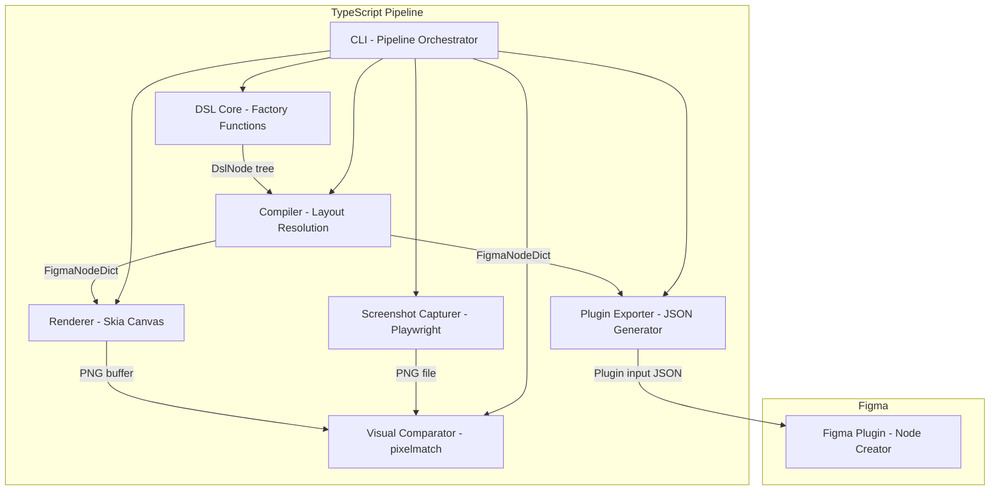
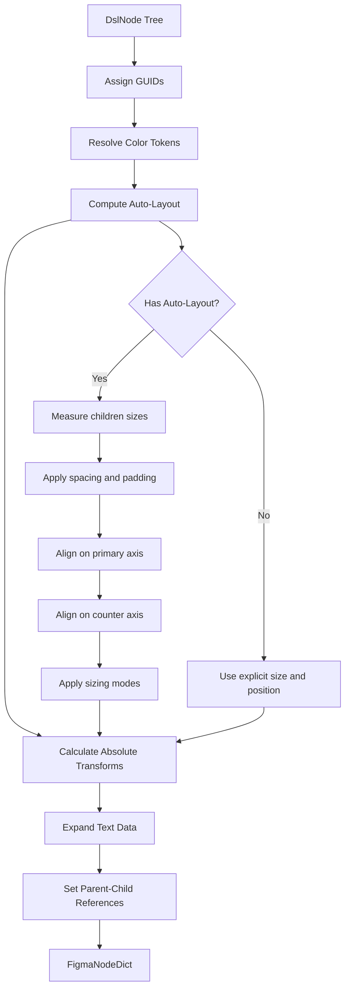
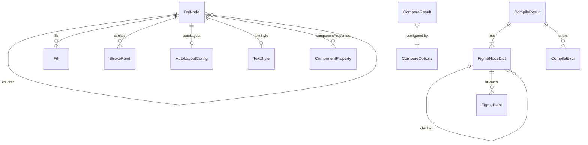

# Technical Design: Figma Component DSL

## Overview

**Purpose**: This feature delivers a domain-specific language for declaratively defining Figma component structures in TypeScript, enabling a Figma-free iteration loop where developers define components, render them as images, compare against React screenshots, and export to Figma when ready.

**Users**: Component developers and design system engineers use the DSL to define component structures in code, iterate on visual accuracy without Figma, and synchronize components between React and Figma.

**Impact**: Introduces a new toolchain (DSL core, compiler, renderer, comparison engine, CLI, Figma plugin) that bridges the gap between the two reference implementations — combining figma_design_playground's component creation patterns with figma-html-renderer's rendering techniques, reimplemented as a single-language TypeScript pipeline.

### Goals
- Provide a type-safe, declarative API for defining Figma node structures with auto-layout, colors, typography, and component variants
- Render DSL definitions as PNG images using @napi-rs/canvas (Skia backend), matching Figma's visual output
- Enable automated visual comparison between DSL renders and React component screenshots
- Export DSL definitions to Figma via a plugin that creates real components with properties and variants
- Expose all pipeline operations through a unified CLI
- Eliminate all Python dependencies — the entire pipeline runs in a single TypeScript/Node.js process

### Non-Goals
- Real-time collaborative editing of DSL definitions
- Full Figma feature parity (effects, masks, boolean operations, constraints, prototyping)
- DSL-to-React code generation (reverse direction)
- Figma file parsing (`.fig` → DSL)
- Dark mode or responsive variant generation

## Architecture

### Architecture Pattern & Boundary Map

**Selected pattern**: Single-Language Pipeline with AST Core — sequential stages transform DSL definitions through compilation, rendering, comparison, and export. All stages are TypeScript modules running in the same Node.js process.

**Rationale**: Inspired by figma-html-renderer's 5-stage pipeline, but implemented entirely in TypeScript. Eliminates the cross-language bridge (Python subprocess) from the previous design. @napi-rs/canvas provides Skia-backed rendering with zero system dependencies, making the pipeline self-contained.



**Domain boundaries**:
- **DSL Core**: Node definition and tree construction (TypeScript)
- **Compiler**: Layout resolution, GUID assignment, format conversion (TypeScript)
- **Renderer**: Visual rasterization from compiled node dictionaries via Canvas 2D API (TypeScript/@napi-rs/canvas)
- **Capturer**: React component screenshot isolation (TypeScript/Playwright)
- **Comparator**: Pixel-level image diffing (TypeScript/pixelmatch)
- **Exporter**: Figma plugin input generation (TypeScript)
- **Plugin**: Figma node creation via Plugin API (TypeScript, runs in Figma sandbox)
- **CLI**: User-facing orchestration of all stages (TypeScript/Node.js)

**Existing patterns preserved**: Pipeline architecture from figma-html-renderer (reimplemented in TypeScript); component creation patterns from figma_design_playground plugin; CSS custom property design tokens.

**New components rationale**: DSL Core provides type-safe node construction; Compiler bridges DSL trees to the renderer's expected format; Renderer uses @napi-rs/canvas (Skia) instead of PyCairo; Comparator and Capturer enable the visual iteration loop; CLI unifies all operations.

**Steering compliance**: TypeScript strict mode, no `any`; pipeline stages with single responsibility; immutable data between stages; no framework bloat; zero system dependency rendering via pre-built Skia binaries.

### Technology Stack

| Layer | Choice / Version | Role in Feature | Notes |
|-------|------------------|-----------------|-------|
| DSL Core / CLI | TypeScript 5.9+, Node.js 22+ | DSL definition, compilation, orchestration | Strict mode, ES2023 target |
| Renderer | @napi-rs/canvas 0.1.96+ | Rasterize compiled nodes to PNG via Skia Canvas 2D API | Zero system deps, pre-built binaries |
| Screenshot Capture | Playwright 1.50+ | Headless browser React component screenshots | Node.js API, element-level capture |
| Image Comparison | pixelmatch 6.0+, pngjs 7.0+ | Pixel-level visual diff | Zero-dependency comparison, pngjs for PNG decode/encode |
| Figma Plugin | Figma Plugin API, esbuild | Create Figma nodes from DSL definitions | Same build toolchain as reference plugin |
| Package Management | npm workspaces | Monorepo for TypeScript packages | DSL core, CLI, renderer, and plugin as separate workspace packages |
| Text Measurement | opentype.js 2.0+ | Font metric lookup for auto-layout HUG sizing | Parses .otf/.ttf for glyph advance widths |

> PyCairo, Pillow, fig2sketch, fig-kiwi, and all Python packaging (pyproject.toml, pip) have been removed. See `research.md` for the evaluation of alternatives and migration rationale.

### Font Assets

- The Inter font family (.otf files for Regular, Medium, Semi Bold, Bold weights) is bundled in `packages/dsl-core/fonts/`
- opentype.js loads these files for text measurement in the Compiler
- @napi-rs/canvas loads them via `GlobalFonts.registerFromPath()` for text rendering — no system font dependency
- Both the Compiler (measurement) and Renderer (drawing) use the same bundled font files, minimizing measurement-rendering discrepancy

## System Flows

### Full Pipeline Flow


### Compile Flow



## Requirements Traceability

| Requirement | Summary | Components | Interfaces | Flows |
|-------------|---------|------------|------------|-------|
| 1.1–1.7 | DSL node primitives (FRAME, TEXT, RECT, ELLIPSE, GROUP, hierarchy, visibility) | DslCore | NodeFactory, DslNode | — |
| 2.1–2.6 | Auto-layout system (direction, spacing, padding, alignment, sizing, flex-grow) | DslCore, Compiler | AutoLayoutConfig, LayoutResolver | Compile Flow |
| 3.1–3.6 | Color and fill system (hex, solid, gradient, stroke, multi-fill, tokens) | DslCore, Compiler | ColorToken, Fill, StrokePaint | Compile Flow |
| 4.1–4.6 | Typography system (font, size, line-height, letter-spacing, alignment) | DslCore, Compiler | TextStyle, TextDataExpander | Compile Flow |
| 5.1–5.5 | Component and variant system (COMPONENT, properties, COMPONENT_SET, INSTANCE) | DslCore, Compiler, Exporter | ComponentDef, VariantAxis, InstanceRef | Compile Flow |
| 6.1–6.4 | DSL rendering to PNG | Renderer | RendererService | Pipeline Flow |
| 7.1–7.4 | React component screenshot capture | Capturer | CaptureService | Pipeline Flow |
| 8.1–8.4 | Visual comparison with diff | Comparator | CompareService | Pipeline Flow |
| 9.1–9.10 | Figma plugin — DSL to Figma components | Exporter, Plugin | PluginInputSchema, PluginRunner | — |
| 10.1–10.7 | CLI interface for all pipeline operations | CLI | CliCommands | Pipeline Flow |

## Components and Interfaces

| Component | Domain/Layer | Intent | Req Coverage | Key Dependencies | Contracts |
|-----------|--------------|--------|--------------|------------------|-----------|
| DslCore | DSL / Core | Declarative factory functions for node tree construction | 1.1–1.7, 2.1–2.6, 3.1–3.6, 4.1–4.6, 5.1–5.5 | None (P0) | Service |
| Compiler | DSL / Core | Resolve layout, assign GUIDs, produce FigmaNodeDict | 1.6, 2.1–2.6, 3.1–3.5, 4.1–4.6, 5.1–5.5 | DslCore (P0), opentype.js (P0) | Service |
| Renderer | Rendering / TypeScript | Rasterize FigmaNodeDict to PNG via @napi-rs/canvas | 6.1–6.4 | @napi-rs/canvas (P0) | Service |
| Capturer | Rendering / TypeScript | Capture React component screenshots via Playwright | 7.1–7.4 | Playwright (P0) | Service |
| Comparator | Analysis / TypeScript | Pixel-level image diff with similarity scoring | 8.1–8.4 | pixelmatch (P0), pngjs (P0) | Service |
| Exporter | Export / TypeScript | Generate Figma plugin input JSON from compiled nodes | 9.1–9.9 | Compiler (P0) | Service |
| Plugin | Export / Figma | Create Figma nodes from plugin input JSON | 9.1–9.10 | Figma Plugin API (P0) | Service |
| CLI | Interface / TypeScript | User-facing commands orchestrating all pipeline stages | 10.1–10.7 | All components (P0) | Service |

### DSL Core Layer

#### DslCore

| Field | Detail |
|-------|--------|
| Intent | Provide type-safe factory functions for constructing DSL node trees |
| Requirements | 1.1–1.7, 2.1–2.6, 3.1–3.6, 4.1–4.6, 5.1–5.5 |

**Responsibilities & Constraints**
- Expose factory functions (`frame`, `text`, `rectangle`, `ellipse`, `group`, `component`, `componentSet`, `instance`) that return `DslNode` objects
- Validate node property constraints at construction time (e.g., auto-layout only on FRAME/COMPONENT)
- Provide color helper functions (`hex`, `solid`, `gradient`, `colorToken`) that accept hex strings and produce fill objects
- Maintain immutability — factory functions return new objects, never mutate inputs

**Dependencies**
- None — this is the innermost core with zero external dependencies

**Contracts**: Service [x]

##### Service Interface
```typescript
// --- Node Types ---
type NodeType = 'FRAME' | 'TEXT' | 'RECTANGLE' | 'ELLIPSE' | 'GROUP'
  | 'COMPONENT' | 'COMPONENT_SET' | 'INSTANCE';

// --- Color & Fill ---
interface RgbaColor {
  r: number; // 0–1
  g: number;
  b: number;
  a: number;
}

interface SolidFill {
  type: 'SOLID';
  color: RgbaColor;
  opacity: number;
  visible: boolean;
}

interface GradientStop {
  color: RgbaColor;
  position: number; // 0–1
}

interface GradientFill {
  type: 'GRADIENT_LINEAR';
  gradientStops: GradientStop[];
  gradientTransform: [[number, number, number], [number, number, number]];
  opacity: number;
  visible: boolean;
}

type Fill = SolidFill | GradientFill;

interface StrokePaint {
  color: RgbaColor;
  weight: number;
  align?: 'INSIDE' | 'CENTER' | 'OUTSIDE';
}

// --- Auto-Layout ---
interface AutoLayoutConfig {
  direction: 'HORIZONTAL' | 'VERTICAL';
  spacing?: number;
  padX?: number;
  padY?: number;
  padTop?: number;
  padRight?: number;
  padBottom?: number;
  padLeft?: number;
  align?: 'MIN' | 'CENTER' | 'MAX' | 'SPACE_BETWEEN';
  counterAlign?: 'MIN' | 'CENTER' | 'MAX';
  sizing?: 'FIXED' | 'HUG' | 'FILL';
  widthSizing?: 'FIXED' | 'HUG' | 'FILL';
  heightSizing?: 'FIXED' | 'HUG' | 'FILL';
}

// --- Typography ---
interface TextStyle {
  fontFamily?: string;       // default: 'Inter'
  fontWeight?: 400 | 500 | 600 | 700;
  fontSize?: number;         // pixels
  lineHeight?: { value: number; unit: 'PERCENT' | 'PIXELS' };
  letterSpacing?: { value: number; unit: 'PERCENT' | 'PIXELS' };
  textAlignHorizontal?: 'LEFT' | 'CENTER' | 'RIGHT';
  color?: string;            // hex string, convenience shorthand
}

// --- Component Properties ---
type ComponentPropertyType = 'TEXT' | 'BOOLEAN' | 'INSTANCE_SWAP';

interface ComponentProperty {
  name: string;
  type: ComponentPropertyType;
  defaultValue: string | boolean;
  preferredValues?: string[]; // for INSTANCE_SWAP, reference component names
}

// --- DSL Node (AST) ---
interface DslNode {
  type: NodeType;
  name: string;
  size?: { x: number; y: number };
  fills?: Fill[];
  strokes?: StrokePaint[];
  cornerRadius?: number;
  cornerRadii?: { topLeft: number; topRight: number; bottomLeft: number; bottomRight: number };
  opacity?: number;
  visible?: boolean;
  clipContent?: boolean;
  children?: DslNode[];

  // Auto-layout (FRAME, COMPONENT)
  autoLayout?: AutoLayoutConfig;
  layoutGrow?: number;
  layoutSizingHorizontal?: 'FIXED' | 'HUG' | 'FILL';
  layoutSizingVertical?: 'FIXED' | 'HUG' | 'FILL';

  // Text (TEXT only)
  characters?: string;
  textStyle?: TextStyle;

  // Component (COMPONENT only)
  componentProperties?: ComponentProperty[];

  // Component Set (COMPONENT_SET only)
  variantAxes?: Record<string, string[]>;

  // Instance (INSTANCE only)
  componentRef?: string;
  propertyOverrides?: Record<string, string | boolean>;
}

// --- Factory Functions ---
function frame(name: string, props: FrameProps): DslNode;
function text(characters: string, style?: TextStyle): DslNode;
function rectangle(name: string, props: RectangleProps): DslNode;
function ellipse(name: string, props: EllipseProps): DslNode;
function group(name: string, children: DslNode[]): DslNode;
function component(name: string, props: ComponentProps): DslNode;
function componentSet(name: string, props: ComponentSetProps): DslNode;
function instance(componentRef: string, overrides?: Record<string, string | boolean>): DslNode;

// --- Color Helpers ---
function hex(value: string): RgbaColor;               // '#7c3aed' → {r, g, b, a: 1}
function solid(hexValue: string, opacity?: number): SolidFill;
function gradient(stops: { hex: string; position: number }[], angle?: number): GradientFill;
function defineTokens(tokens: Record<string, string>): ColorTokenMap;
function token(map: ColorTokenMap, name: string): SolidFill;

// --- Layout Helpers ---
function horizontal(config?: Partial<AutoLayoutConfig>): AutoLayoutConfig;
function vertical(config?: Partial<AutoLayoutConfig>): AutoLayoutConfig;
```
- Preconditions: Node names must be non-empty strings; size values must be positive; color hex strings must be valid 6-digit hex
- Postconditions: Returns a well-formed DslNode tree with correct type discrimination
- Invariants: DslNode objects are immutable after construction; children arrays are defensively copied

**Implementation Notes**
- Factory function prop types (FrameProps, RectangleProps, etc.) are subsets of DslNode properties relevant to each node type — defined via `Pick` and `Partial` for type safety
- `horizontal()` and `vertical()` are convenience wrappers that set `direction` and merge defaults
- Color tokens are resolved at compile time, not at DSL construction time

---

#### Compiler

| Field | Detail |
|-------|--------|
| Intent | Transform DslNode trees into FigmaNodeDict with resolved layout and absolute positions |
| Requirements | 1.6, 2.1–2.6, 3.1–3.5, 4.1–4.6, 5.1–5.5 |

**Responsibilities & Constraints**
- Assign counter-based GUIDs to all nodes (sessionID=0, auto-incrementing localID)
- Resolve color token references to concrete RGBA values
- Compute auto-layout: measure children, apply spacing/padding/alignment, determine sizes for HUG/FILL modes
- Calculate absolute transform matrices for each node
- Expand text nodes with `textData` and `derivedTextData` structures for the renderer
- Set `parentIndex` references with correct guid and position ordering
- Validate the tree and report errors with source location context

**Dependencies**
- Inbound: DslCore — provides DslNode tree (P0)
- External: opentype.js 2.0+ — font metric lookup for text measurement (P0)

**Contracts**: Service [x]

##### Service Interface
```typescript
// --- Compiled Output (Figma node dictionary format) ---
interface FigmaNodeDict {
  guid: [number, number];                    // [sessionID, localID]
  type: string;
  name: string;
  size: { x: number; y: number };
  transform: [[number, number, number],
              [number, number, number],
              [number, number, number]];      // 3×3 affine matrix
  fillPaints: FigmaPaint[];
  strokes?: FigmaStroke[];
  strokeWeight?: number;
  cornerRadius?: number;
  opacity: number;
  visible: boolean;
  clipContent?: boolean;
  children: FigmaNodeDict[];
  parentIndex?: { guid: [number, number]; position: string };

  // Auto-layout passthrough (for Figma plugin consumption)
  stackMode?: 'HORIZONTAL' | 'VERTICAL';
  itemSpacing?: number;
  paddingTop?: number;
  paddingRight?: number;
  paddingBottom?: number;
  paddingLeft?: number;
  primaryAxisAlignItems?: 'MIN' | 'CENTER' | 'MAX' | 'SPACE_BETWEEN';
  counterAxisAlignItems?: 'MIN' | 'CENTER' | 'MAX';
  layoutSizingHorizontal?: 'FIXED' | 'HUG' | 'FILL';
  layoutSizingVertical?: 'FIXED' | 'HUG' | 'FILL';

  // Text
  textData?: { characters: string; lines: string[] };
  derivedTextData?: { baselines: Baseline[]; fontMetaData: FontMeta[] };
  fontSize?: number;
  fontFamily?: string;
  textAlignHorizontal?: 'LEFT' | 'CENTER' | 'RIGHT';

  // Component
  componentProperties?: Record<string, { type: string; defaultValue: string | boolean }>;
  componentPropertyDefinitions?: Record<string, { type: string; defaultValue: string | boolean }>;

  // Instance
  componentId?: string;
  overriddenProperties?: Record<string, string | boolean>;
}

interface Baseline {
  lineY: number;
  lineHeight: number;
  firstCharIndex: number;
  endCharIndex: number;
}

interface FontMeta {
  fontFamily: string;
  fontStyle: string;
  fontWeight: number;
  fontSize: number;
}

interface CompileResult {
  root: FigmaNodeDict;
  nodeCount: number;
  errors: CompileError[];
}

interface CompileError {
  message: string;
  nodePath: string;     // e.g., "Button > Label"
  nodeType: string;
}

interface CompilerService {
  compile(node: DslNode): CompileResult;
  compileToJson(node: DslNode): string;
}
```
- Preconditions: Input DslNode tree must be well-formed (validated by DslCore factories)
- Postconditions: All nodes have assigned GUIDs, resolved transforms, and valid parentIndex references; auto-layout children have computed positions
- Invariants: Output conforms to FigmaNodeDict schema; GUID uniqueness within a compilation unit

**Implementation Notes**
- Auto-layout algorithm implements a subset of CSS Flexbox: single-axis layout with spacing, padding, alignment, and sizing modes (FIXED/HUG/FILL). Does not support wrap, absolute positioning, or constraints.
- Text baseline computation uses font metrics (ascent/descent) for accurate vertical positioning. For initial implementation, uses simplified line-height-based baselines with one line per `\n` delimiter.
- Transform matrix composition: parent transform × child offset = child absolute transform. Root node transform is identity.

##### Text Measurement Strategy

The Compiler must know text node dimensions to resolve HUG-contents sizing on parent frames. The Compiler uses **opentype.js** to measure text in TypeScript.

```typescript
interface TextMeasurement {
  width: number;    // total advance width in pixels
  height: number;   // lineCount × lineHeight (or fontSize × 1.2 default)
}

interface TextMeasurer {
  /** Load a font file (.otf/.ttf) and register it by family+weight */
  loadFont(path: string, family: string, weight: number): void;

  /** Measure text dimensions using loaded font metrics */
  measure(characters: string, style: TextStyle): TextMeasurement;
}
```

**How it works**:
- opentype.js parses `.otf`/`.ttf` files and provides per-glyph advance widths and font-level ascent/descent metrics
- For each text node, the measurer sums glyph advance widths (scaled to `fontSize`) to compute width, and uses `lineHeight` (or `fontSize × 1.2` default) × line count for height
- Multi-line text splits on `\n`; width is the maximum line width
- The Inter font files are bundled in `packages/dsl-core/fonts/` so measurement works offline without system fonts
- Kerning and ligatures are applied using opentype.js's built-in GPOS/GSUB table support

**Limitations**: Letter-perfect parity with Skia's text rendering is not guaranteed — minor width differences (< 1px per glyph) may occur. These differences are absorbed by the visual comparison threshold (default 95% similarity). Discrepancy is expected to be smaller than the previous PyCairo design since both Skia and opentype.js parse the same font files.

##### Layout Algorithm Specification

The auto-layout algorithm resolves DslNode trees with `autoLayout` configurations into absolute positions and sizes. It operates in two passes.

**Pass 1 — Bottom-up measurement** (leaf to root):
1. Leaf nodes (TEXT, RECTANGLE, ELLIPSE) have intrinsic sizes: explicit `size` property, or measured via TextMeasurer for TEXT nodes
2. FRAME/COMPONENT nodes with `sizing: 'HUG'` compute their size from children:
   - Primary axis: sum of child sizes along axis + `spacing × (childCount - 1)` + padding
   - Counter axis: maximum child size along counter axis + padding
3. FRAME/COMPONENT nodes with `sizing: 'FIXED'` use their explicit `size`
4. Nodes with `sizing: 'FILL'` defer sizing to Pass 2 (they need parent context)

**Pass 2 — Top-down positioning** (root to leaf):
1. Root node position is (0, 0)
2. For each auto-layout container, distribute children along the primary axis:
   - Compute available space: container size − padding − total spacing
   - Allocate FIXED and HUG children first (their sizes are known from Pass 1)
   - Distribute remaining space among FILL children equally
   - Position children sequentially with `spacing` gaps
3. Apply alignment:
   - `primaryAxisAlignItems`: MIN (pack start), CENTER (center block), MAX (pack end), SPACE_BETWEEN (distribute spacing evenly)
   - `counterAxisAlignItems`: MIN (align start), CENTER (center), MAX (align end)
4. For each child, compute absolute transform: parent transform × child offset
5. FILL children inside a HUG parent are treated as HUG (FILL has no meaning when parent size is content-determined)

**Worked Examples**:

*Example 1 — Horizontal button with label*:
```
frame('Button', {
  autoLayout: horizontal({ spacing: 8, padX: 16, padY: 8 }),
  fills: [solid('#7c3aed')],
  children: [
    text('Click me', { fontSize: 14, fontWeight: 500 })
  ]
})
```
Pass 1: Text "Click me" measured → ~52×17px. Button HUG sizing → width: 52 + 16 + 16 = 84px, height: 17 + 8 + 8 = 33px.
Pass 2: Text positioned at offset (16, 8) within button frame.

*Example 2 — Vertical card with FILL-width title*:
```
frame('Card', {
  size: { x: 300, y: 200 },
  autoLayout: vertical({ spacing: 12, padX: 16, padY: 16 }),
  children: [
    text('Title', { fontSize: 18, layoutSizingHorizontal: 'FILL' }),
    text('Body text here', { fontSize: 14, layoutSizingHorizontal: 'FILL' })
  ]
})
```
Pass 1: Card is FIXED (300×200). Title measured → ~40×22px, Body measured → ~95×17px. Both have FILL horizontal → deferred.
Pass 2: Available width = 300 − 16 − 16 = 268px. Both texts get width=268 (FILL). Title at (16, 16), Body at (16, 16 + 22 + 12 = 50).

*Example 3 — Nested layout (badge inside horizontal row)*:
```
frame('Row', {
  autoLayout: horizontal({ spacing: 12, padX: 8, padY: 4, counterAlign: 'CENTER' }),
  children: [
    text('Label', { fontSize: 14 }),
    frame('Badge', {
      autoLayout: horizontal({ padX: 8, padY: 2 }),
      fills: [solid('#ef4444')],
      children: [text('3', { fontSize: 12 })]
    })
  ]
})
```
Pass 1 (bottom-up): "3" measured → ~7×14px. Badge HUG → 7+8+8=23px × 14+2+2=18px. "Label" measured → ~33×17px. Row HUG → 8 + 33 + 12 + 23 + 8 = 84px × max(17, 18) + 4 + 4 = 26px.
Pass 2 (top-down): Row height=26. "Label" (17px tall) centered at y = 4 + (26−4−4−17)/2 = 4.5 ≈ 5. Badge (18px tall) centered at y = 4 + (26−4−4−18)/2 = 4. Within Badge, "3" at offset (8, 2).

---

### Rendering Layer

#### Renderer

| Field | Detail |
|-------|--------|
| Intent | Rasterize FigmaNodeDict to PNG images using @napi-rs/canvas (Skia backend) |
| Requirements | 6.1–6.4 |

**Responsibilities & Constraints**
- Accept FigmaNodeDict objects directly (in-process, no serialization boundary)
- Render all supported node types: FRAME, COMPONENT, COMPONENT_SET, INSTANCE, RECTANGLE, ELLIPSE, TEXT, GROUP
- Apply fills (solid colors, linear gradients), strokes, corner radius, opacity, clipping
- Render text with correct font, size, weight, and baseline positioning using registered fonts
- Resolve image asset paths relative to a configurable asset directory
- Return PNG buffer or write to specified path; throw typed errors on failure

**Dependencies**
- Inbound: Compiler — provides FigmaNodeDict (P0)
- External: @napi-rs/canvas 0.1.96+ — Skia-based Canvas 2D API (P0)

**Contracts**: Service [x]

##### Service Interface
```typescript
interface RenderOptions {
  backgroundColor: RgbaColor;     // default: {r: 1, g: 1, b: 1, a: 1} (white)
  scale: number;                  // default: 1
  assetDir?: string;              // base path for image asset resolution
}

interface RenderResult {
  pngBuffer: Buffer;
  width: number;
  height: number;
}

interface RenderError {
  message: string;
  nodePath: string;
  nodeType: string;
}

interface RendererService {
  /** Initialize renderer and register bundled fonts */
  initialize(fontDir: string): void;

  /** Render FigmaNodeDict to PNG buffer */
  render(node: FigmaNodeDict, options?: Partial<RenderOptions>): RenderResult;

  /** Render and write to file */
  renderToFile(node: FigmaNodeDict, outputPath: string, options?: Partial<RenderOptions>): RenderResult;
}
```
- Preconditions: Fonts must be registered via `initialize()` before first render; transforms must be pre-computed (no layout resolution)
- Postconditions: Output PNG buffer contains correct rasterization at specified scale
- Invariants: Renderer is stateless after initialization — each render call is independent

**Implementation Notes**
- Rendering follows a recursive tree traversal with Canvas 2D context save/restore stack:
  1. `ctx.save()` → apply node transform via `ctx.setTransform(a, b, c, d, tx, ty)`
  2. Apply opacity via `ctx.globalAlpha`
  3. Apply clipping if `clipContent` is true: draw shape path then `ctx.clip()`
  4. Draw fills: solid via `ctx.fillStyle = rgba(...)`, gradient via `ctx.createLinearGradient()` with stops
  5. Draw shape: `ctx.fillRect()` for FRAME/RECTANGLE, `ctx.roundRect()` for rounded corners, `ctx.arc()` + `ctx.fill()` for ELLIPSE
  6. Draw text: `ctx.font = 'weight size family'`, `ctx.fillText(characters, x, y)`
  7. Draw strokes: `ctx.strokeStyle`, `ctx.lineWidth`, `ctx.stroke()`
  8. Recurse into children
  9. `ctx.restore()`
- Gradient fills use `ctx.createLinearGradient(x0, y0, x1, y1)` with gradient transform applied — this was a gap in the PyCairo renderer that is resolved natively by the Canvas API
- Font registration: `GlobalFonts.registerFromPath(fontPath, 'Inter')` called once during `initialize()`
- Text rendering uses CSS font syntax: `ctx.font = '600 14px Inter'`
- Canvas creation: `createCanvas(width * scale, height * scale)` with root node size determining canvas dimensions
- PNG export: `canvas.toBuffer('image/png')` returns a Node.js Buffer

---

### Screenshot & Comparison Layer

#### Capturer

| Field | Detail |
|-------|--------|
| Intent | Capture isolated React component screenshots via headless browser |
| Requirements | 7.1–7.4 |

**Responsibilities & Constraints**
- Launch headless Chromium via Playwright
- Render a single React component in isolation (not a full page)
- Configure viewport size per capture request
- Produce PNG with white background matching DSL render background
- Clean up browser resources after capture

**Dependencies**
- External: Playwright 1.50+ — headless browser automation (P0)

**Contracts**: Service [x]

##### Service Interface
```typescript
interface CaptureOptions {
  viewport: { width: number; height: number };
  selector?: string;            // CSS selector for element capture (default: '#root > *')
  background?: 'white' | 'transparent';
  deviceScaleFactor?: number;   // default: 1
}

interface CaptureResult {
  pngPath: string;
  width: number;
  height: number;
}

interface CaptureService {
  capture(
    componentPath: string,       // path to React component module
    props: Record<string, unknown>,
    outputPath: string,
    options: CaptureOptions
  ): Promise<CaptureResult>;

  captureUrl(
    url: string,                 // URL of running dev server
    outputPath: string,
    options: CaptureOptions
  ): Promise<CaptureResult>;
}
```
- Preconditions: Component module must export a default React component or named export; Playwright browsers must be installed
- Postconditions: PNG file exists at outputPath with dimensions matching the rendered component bounds
- Invariants: Each capture uses a fresh browser context to prevent state leakage

**Implementation Notes**
- Two capture modes: (1) `capture()` spins up a minimal Vite server that renders the component in isolation; (2) `captureUrl()` navigates to an existing dev server URL
- Element-level screenshot via `element.screenshot({ type: 'png' })` captures only the component, not the full page
- Viewport configuration: `page.setViewportSize({ width, height })` before navigation

---

#### Comparator

| Field | Detail |
|-------|--------|
| Intent | Compare two PNG images pixel-by-pixel and produce similarity metrics and diff visualization |
| Requirements | 8.1–8.4 |

**Responsibilities & Constraints**
- Load and decode two PNG images to raw RGBA buffers
- Resize/pad images to matching dimensions if they differ (with warning)
- Run pixel-level comparison and count mismatched pixels
- Calculate similarity score as percentage
- Generate diff image highlighting areas of divergence
- Report pass/fail against configurable threshold

**Dependencies**
- External: pixelmatch 6.0+ — pixel comparison algorithm (P0)
- External: pngjs 7.0+ — PNG encode/decode to raw buffers (P0)

**Contracts**: Service [x]

##### Service Interface
```typescript
interface CompareOptions {
  threshold?: number;           // pixelmatch sensitivity, 0–1 (default: 0.1)
  failThreshold?: number;       // similarity % below which comparison fails (default: 95)
  diffColor?: [number, number, number];  // RGB for diff pixels (default: [255, 0, 0])
  antiAliasing?: boolean;       // detect and ignore AA differences (default: true)
}

interface CompareResult {
  similarity: number;           // 0–100 percentage
  mismatchedPixels: number;
  totalPixels: number;
  diffImagePath: string | null; // path to generated diff PNG, null if identical
  dimensionMatch: boolean;      // false if images were resized for comparison
  passed: boolean;              // similarity >= failThreshold
}

interface CompareService {
  compare(
    imagePath1: string,
    imagePath2: string,
    diffOutputPath: string,
    options?: CompareOptions
  ): Promise<CompareResult>;
}
```
- Preconditions: Both image paths must point to valid PNG files
- Postconditions: CompareResult contains accurate pixel counts; diff image (if generated) exists at diffOutputPath
- Invariants: Comparison is commutative — `compare(a, b)` equals `compare(b, a)` in similarity score

**Implementation Notes**
- When images differ in dimensions, the smaller image is padded with the background color (white) to match the larger. `dimensionMatch: false` signals this to the caller.
- pngjs decodes PNG to `Uint8Array` of RGBA pixel data, which pixelmatch consumes directly
- Diff image uses red (`[255, 0, 0]`) for mismatched pixels by default; anti-aliased pixel detection is enabled to reduce false positives from font rendering differences

---

### Export Layer

#### Exporter

| Field | Detail |
|-------|--------|
| Intent | Generate Figma plugin input JSON from compiled FigmaNodeDict |
| Requirements | 9.1–9.9 |

**Responsibilities & Constraints**
- Transform compiled FigmaNodeDict into a format optimized for the Figma plugin's consumption
- Preserve auto-layout properties (not just computed transforms) so the plugin creates real auto-layout frames
- Include component property definitions for the plugin to register via `addComponentProperty()`
- Include variant axis information for `combineAsVariants()` grouping
- Generate component placement instructions (page name, sequential positioning)

**Dependencies**
- Inbound: Compiler — provides FigmaNodeDict (P0)

**Contracts**: Service [x]

##### Service Interface
```typescript
interface PluginInput {
  version: string;                         // schema version
  components: PluginComponentDef[];
  page: string;                            // target page name (default: 'Component Library')
}

interface PluginComponentDef {
  name: string;
  type: 'COMPONENT' | 'COMPONENT_SET';
  node: FigmaNodeDict;                    // full node tree
  properties?: ComponentProperty[];       // for addComponentProperty()
  variants?: PluginVariantDef[];          // for combineAsVariants()
}

interface PluginVariantDef {
  name: string;                           // 'Variant=Primary, Size=Large'
  axes: Record<string, string>;           // { Variant: 'Primary', Size: 'Large' }
  node: FigmaNodeDict;
}

interface ExporterService {
  generatePluginInput(compiled: CompileResult): PluginInput;
  writePluginInput(input: PluginInput, outputPath: string): void;
}
```
- Preconditions: CompileResult must contain zero errors
- Postconditions: PluginInput JSON is valid and contains all component definitions with properties and variants
- Invariants: Variant names follow Figma's `Key=Value, Key=Value` convention

---

#### Plugin

| Field | Detail |
|-------|--------|
| Intent | Parse PluginInput JSON and create Figma nodes using the Plugin API |
| Requirements | 9.1–9.10 |

**Responsibilities & Constraints**
- Read PluginInput JSON (pasted or loaded from file in plugin UI)
- Create Figma nodes recursively: frames, text (with async font loading), rectangles, ellipses, components
- Apply auto-layout properties from node definitions (using `setAutoLayout()` pattern from reference)
- Apply fills, strokes, corner radius, opacity
- Register component properties via `addComponentProperty()`
- Combine variant components via `figma.combineAsVariants()`
- Create instances with property overrides
- Place components on the target page with sequential positioning
- Output JSON mapping of component names to Figma node IDs
- Report errors via `figma.notify()` without crashing

**Dependencies**
- Inbound: Exporter — provides PluginInput JSON (P0)
- External: Figma Plugin API — node creation and manipulation (P0)
- External: esbuild — plugin compilation (P1)

**Contracts**: Service [x]

##### Service Interface
```typescript
// Plugin internal interface (runs in Figma sandbox)
interface PluginRunner {
  run(input: PluginInput): Promise<PluginOutput>;
}

interface PluginOutput {
  nodeIds: Record<string, string>;         // componentName → figmaNodeId
  created: number;
  errors: string[];
}
```
- Preconditions: PluginInput JSON is valid; required fonts are available in Figma
- Postconditions: All valid components created on target page; nodeIds mapping output to console
- Invariants: Invalid nodes are skipped (not crash) with error notification

**Implementation Notes**
- Mirrors the reference plugin's architecture: helper functions for color conversion, auto-layout, text creation, and shape creation
- Font loading: loads Inter Regular/Medium/Semi Bold/Bold before node creation (same pattern as reference)
- Node creation is recursive: for each node in the tree, dispatch by type to the appropriate `figma.create*()` call, then process children
- Error handling: wrap each node creation in try/catch; accumulate errors; notify user and continue

---

### Interface Layer

#### CLI

| Field | Detail |
|-------|--------|
| Intent | User-facing command-line interface orchestrating all pipeline operations |
| Requirements | 10.1–10.7 |

**Responsibilities & Constraints**
- Provide subcommands for each pipeline stage: `compile`, `render`, `capture`, `compare`, `pipeline`, `export`
- Orchestrate all stages as in-process TypeScript module calls (no subprocess management)
- Report errors with context (which stage failed, what input caused it) and exit with non-zero status
- Support configuration via command-line flags and optional config file

**Dependencies**
- Inbound: All components (P0)

**Contracts**: Service [x]

##### Service Interface
```typescript
// CLI commands
interface CliCommands {
  compile(dslPath: string, options: { output?: string }): Promise<void>;
  render(jsonPath: string, options: { output?: string; scale?: number; bg?: string }): Promise<void>;
  capture(componentPath: string, options: { output?: string; viewport?: string; props?: string }): Promise<void>;
  compare(image1: string, image2: string, options: { output?: string; threshold?: number }): Promise<void>;
  pipeline(dslPath: string, componentPath: string, options: PipelineOptions): Promise<void>;
  export(dslPath: string, options: { output?: string; page?: string }): Promise<void>;
}

interface PipelineOptions {
  output?: string;         // output directory
  viewport?: string;       // WxH format, e.g., '800x600'
  threshold?: number;      // comparison fail threshold
  scale?: number;          // render scale factor
}
```

**Implementation Notes**
- Built with Node.js `parseArgs` (no framework dependency, matching "No Framework Bloat" principle)
- All pipeline stages are direct TypeScript module calls — no subprocess management, no cross-language bridge
- The `pipeline` command chains: compile → render → capture → compare, stopping on first error
- Exit codes: 0 = success, 1 = pipeline failure (comparison below threshold), 2 = runtime error
- The `render` command accepts either a DSL path (compile + render) or a pre-compiled JSON path (render only)

## Data Models

### Domain Model



**Aggregates and boundaries**:
- `DslNode` is the root aggregate for the DSL domain — all construction goes through factory functions
- `FigmaNodeDict` is the root aggregate for the compiled domain — produced exclusively by the Compiler
- `CompareResult` is a value object produced by the Comparator

**Business rules**:
- Auto-layout is only valid on FRAME and COMPONENT node types
- TEXT nodes must have `characters` set; other node types must not
- COMPONENT_SET nodes must contain at least one COMPONENT child
- INSTANCE nodes must reference a valid component name via `componentRef`
- Variant component names must follow `Key=Value, Key=Value` format

### Logical Data Model

**FigmaNodeDict Schema** (internal TypeScript type, no cross-language serialization boundary):

The FigmaNodeDict structure mirrors Figma's internal node representation as documented in the figma-html-renderer reference. Key fields:

| Field | Type | Required | Description |
|-------|------|----------|-------------|
| guid | [number, number] | Yes | Unique node identifier |
| type | string | Yes | Node type enum |
| name | string | Yes | Display name |
| size | {x: number, y: number} | Yes | Width and height |
| transform | number[3][3] | Yes | Absolute affine transform |
| fillPaints | Paint[] | Yes | Fill array (may be empty) |
| children | FigmaNodeDict[] | Yes | Child nodes (may be empty) |
| parentIndex | {guid, position} | No | Parent reference (absent on root) |
| opacity | number | Yes | 0–1 |
| visible | boolean | Yes | Visibility flag |

Full schema details for FigmaPaint, text properties, and component properties are defined in the Compiler service interface above.

**ColorTokenMap** (design token storage):

| Field | Type | Description |
|-------|------|-------------|
| name | string | Token name (e.g., 'primary600') |
| hex | string | Hex color value |
| resolved | RgbaColor | Pre-computed RGBA |

## Error Handling

### Error Strategy
Each pipeline stage produces typed errors with contextual information. Errors are categorized by recoverability. All errors are TypeScript types — no cross-language error propagation.

### Error Categories and Responses
**DSL Construction Errors** (immediate throw): Invalid hex string → `InvalidColorError` with hex value; missing required property → `MissingPropertyError` with node name and property; invalid node nesting → `InvalidChildError` with parent and child types.

**Compile Errors** (accumulated, reported after pass): Layout overflow → warning with node path; circular component reference → `CircularRefError`; unresolved token → `UnresolvedTokenError`.

**Render Errors** (in-process, typed): Missing font → warning with fallback notification; unsupported node type → skip with warning; invalid paint → skip fill with warning. All errors are thrown as `RenderError` instances, caught and reported by the CLI.

**Pipeline Errors** (CLI level): Stage failure → stop pipeline, report which stage failed and the underlying error; comparison failure (below threshold) → exit code 1 with similarity report.

## Testing Strategy

### Unit Tests
- **DslCore factory functions**: Verify each factory produces correct DslNode structure with type, default values, and child nesting (parameterized across all node types)
- **Color helpers**: Verify hex parsing, solid/gradient fill construction, token resolution for valid and edge-case inputs
- **Compiler layout resolution**: Verify auto-layout computation for horizontal/vertical direction, spacing, padding, alignment, and sizing modes against expected transform matrices
- **Compiler GUID assignment**: Verify unique, deterministic GUID generation across tree depths
- **Renderer shape drawing**: Verify that rendering a single FRAME/RECTANGLE/ELLIPSE/TEXT node produces non-empty PNG with expected dimensions
- **Comparator scoring**: Verify similarity calculation with identical images (100%), completely different images (~0%), and known diff patterns

### Integration Tests
- **Compile + Render pipeline**: DSL definition → compile → render → verify output PNG exists and has expected dimensions
- **Compile + Export pipeline**: DSL definition → compile → export → verify PluginInput JSON is valid and contains expected component structures
- **Full pipeline**: DSL definition → compile → render → capture → compare → verify CompareResult matches expectations

### E2E Tests
- **CLI compile command**: Invoke `figma-dsl compile` on sample DSL files, verify JSON output schema
- **CLI pipeline command**: Invoke `figma-dsl pipeline` end-to-end, verify similarity score and output files
- **CLI error reporting**: Invoke with invalid inputs, verify non-zero exit code and descriptive error messages

### Visual Regression
- **Reference component comparison**: Render all 16 reference components (Button variants, Badge, Hero, etc.) from DSL definitions and compare against screenshots of the same components rendered in React. Establish baseline similarity scores and track regression over time.
