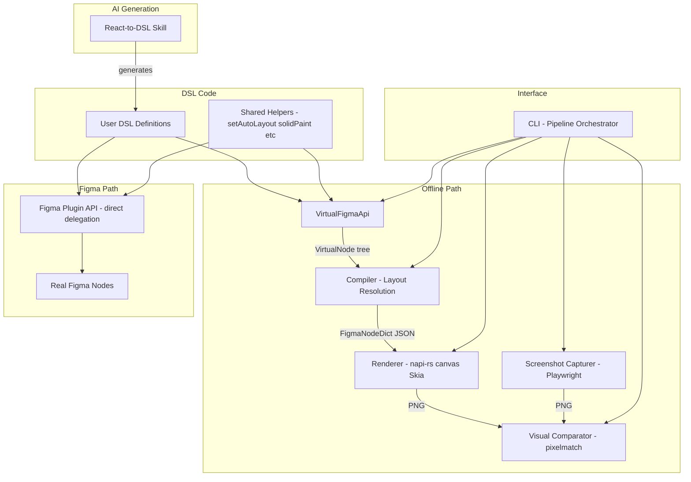
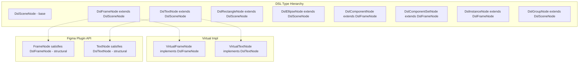
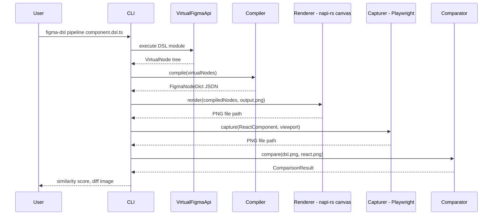
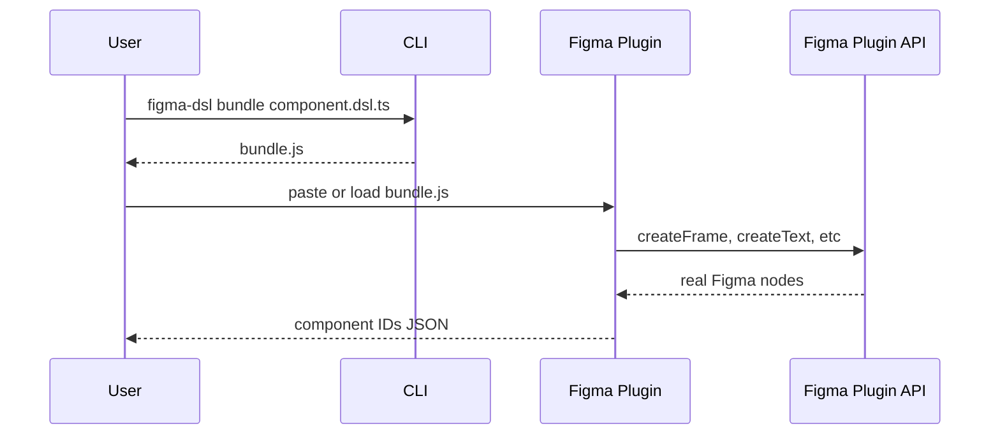
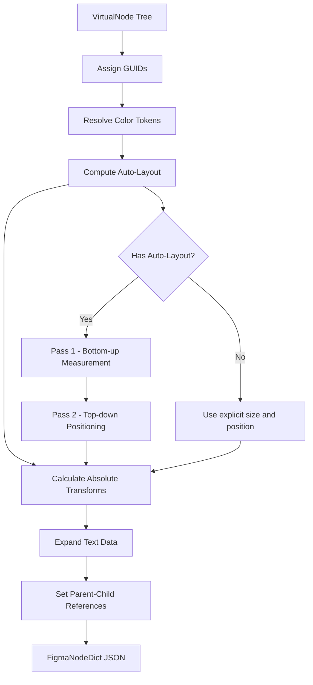
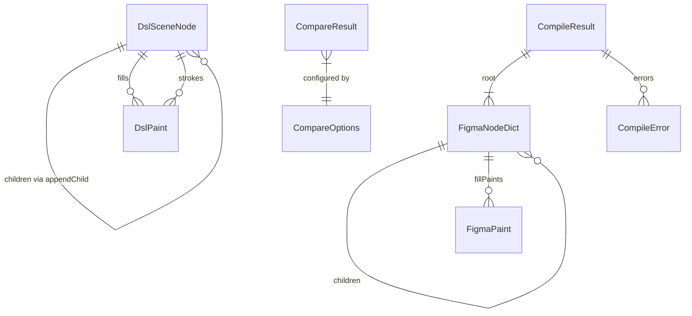

# Technical Design: Figma Component DSL

## Overview

**Purpose**: This feature delivers a DSL for defining Figma component structures in TypeScript where the DSL language IS Figma Plugin API code. The same `createFrame()`, `solidPaint()`, `setAutoLayout()` calls work both offline (producing virtual node trees for rendering and comparison) and inside a Figma plugin (producing real Figma nodes). An AI skill generates DSL definitions from React components to bootstrap the workflow.

**Users**: Component developers and design system engineers use the DSL to define component structures, iterate visually without Figma, and synchronize components between React and Figma.

**Impact**: Introduces a dual-environment adapter layer, a rendering/comparison pipeline, a Figma plugin runtime, and an AI-powered React-to-DSL generator — bridging figma_design_playground's component creation patterns with figma-html-renderer's rendering pipeline.

### Goals
- Provide a Figma Plugin API-compatible TypeScript API that runs in both offline and Figma environments
- Render DSL definitions as PNG images using @napi-rs/canvas (Skia), matching Figma's visual output
- Enable automated visual comparison between DSL renders and React component screenshots
- Execute DSL code directly in a Figma plugin to create real components — no translation layer
- Generate DSL definitions from React components via AI skill
- Expose all pipeline operations through a unified CLI

### Non-Goals
- Full Figma Plugin API coverage (only the subset needed for component definition)
- Real-time collaborative editing of DSL definitions
- Full Figma feature parity (effects, masks, boolean operations, constraints, prototyping)
- Figma file parsing (`.fig` → DSL) — that is figma-html-renderer's domain
- Dark mode or responsive variant generation

## Architecture

### Architecture Pattern & Boundary Map

**Selected pattern**: Adapter with Pipeline — a shared `FigmaApi` interface provides `createFrame()`, `createText()`, etc. with two implementations: `VirtualFigmaApi` (offline, produces virtual node trees) and real Figma Plugin API (in-plugin, delegates to `figma.create*()`). Helper functions (`setAutoLayout()`, `solidPaint()`, `gradientPaint()`, `hexToRGB()`) are pure data transforms shared between both environments. The virtual node path feeds into a compilation pipeline (layout resolution → rendering → comparison).

**Rationale**: Mirrors Figma's own membrane/adapter pattern (see `research.md`). Users write one codebase that runs everywhere. Eliminates the Exporter translation layer from the v1 design.



**Domain boundaries**:
- **FigmaApi Adapter**: Interface abstraction over node creation (TypeScript)
- **VirtualFigmaApi**: Offline node construction producing VirtualNode trees (TypeScript)
- **Shared Helpers**: Pure functions for colors, layout, text — environment-agnostic (TypeScript)
- **Compiler**: Layout resolution, GUID assignment, format conversion to FigmaNodeDict (TypeScript)
- **Renderer**: Visual rasterization from node dictionaries (TypeScript/@napi-rs/canvas)
- **Capturer**: React component screenshot isolation (TypeScript/Playwright)
- **Comparator**: Pixel-level image diffing (TypeScript/pixelmatch)
- **Plugin Runtime**: Loads and executes bundled DSL code with real Figma API (TypeScript, Figma sandbox)
- **AI Skill**: Claude Code skill for React-to-DSL generation (SKILL.md)
- **CLI**: User-facing orchestration (TypeScript/Node.js)

**Steering compliance**: TypeScript strict mode, no `any`; pipeline stages with single responsibility; immutable data between stages; no framework bloat; @napi-rs/canvas (Skia) for rendering; single-language TypeScript stack.

### Shared Type Hierarchy (Cross-Environment Type Strategy)

The DSL defines its own type hierarchy (`DslFrameNode`, `DslTextNode`, etc.) covering the Figma Plugin API property subset used by the DSL. This is the keystone enabling "one codebase, two environments":

- **DSL types** (`packages/dsl-core/types.ts`): Declare the interface contracts — `DslFrameNode`, `DslTextNode`, `DslComponentNode`, `DslSceneNode`, `DslPaint`, etc. These are the types that DSL user code imports and targets.
- **Virtual environment**: `VirtualFrameNode` implements `DslFrameNode`. The `VirtualFigmaApi.createFrame()` returns `DslFrameNode`.
- **Plugin environment**: Figma's `FrameNode` (from `@figma/plugin-typings`) satisfies `DslFrameNode` structurally — TypeScript's structural typing means no explicit `implements` is needed. The plugin shim's `createFrame()` returns `DslFrameNode` (widened from Figma's `FrameNode`).
- **DSL code writes**: `const frame: DslFrameNode = createFrame();` — this compiles in both environments.

The DSL types are a strict subset of Figma's types. Properties not covered by the DSL (e.g., `effects`, `constraints`, `reactions`) are intentionally excluded. If Figma adds new properties, the DSL types only need updating if the new property is within scope of the requirements.



### Technology Stack

| Layer | Choice / Version | Role in Feature | Notes |
|-------|------------------|-----------------|-------|
| DSL Core / CLI | TypeScript 5.9+, Node.js 22+ | DSL API, compilation, orchestration | Strict mode, ES2023 target |
| Renderer | @napi-rs/canvas 0.1.96+ | Rasterize node dictionaries to PNG via Skia Canvas 2D API | Zero system deps, in-process rendering |
| Screenshot Capture | Playwright 1.50+ | Headless browser React component screenshots | Element-level capture |
| Image Comparison | pixelmatch 6.0+, pngjs 7.0+ | Pixel-level visual diff | Zero-dependency comparison |
| Figma Plugin | Figma Plugin API, esbuild | Execute DSL code to create Figma nodes | Same build toolchain as reference plugin |
| Package Management | npm workspaces | Monorepo for TypeScript packages | dsl-core, cli, plugin as separate packages |
| Text Measurement | opentype.js 2.0+ | Font metric lookup for auto-layout HUG sizing | Bundled Inter font files |
| AI Skill | Claude Code Skills (.claude/skills/) | React-to-DSL generation | SKILL.md with Agent Skills standard |

### Environment Management

The entire stack runs in a single Node.js process — no cross-language coordination required. The `figma-dsl doctor` command verifies Node.js version and Inter font availability.

The Inter font family (.otf files for Regular, Medium, Semi Bold, Bold) is bundled in `packages/dsl-core/fonts/` for offline text measurement via opentype.js and registered with `@napi-rs/canvas` via `GlobalFonts.registerFromPath()` for rendering.

## System Flows

### Full Pipeline Flow (Offline Path)



### Figma Plugin Execution Flow



### Compile Flow



## Requirements Traceability

| Requirement | Summary | Components | Interfaces | Flows |
|-------------|---------|------------|------------|-------|
| 1.1–1.5 | DSL as Figma Plugin API code (dual-env, helpers) | FigmaApiAdapter, SharedHelpers | FigmaApi, VirtualFigmaApi | — |
| 1.6–1.12 | Node primitives (FRAME, TEXT, RECT, ELLIPSE, GROUP, hierarchy, visibility) | FigmaApiAdapter | FigmaApi, VirtualNode | — |
| 2.1–2.7 | Auto-layout system (setAutoLayout helper, direction, spacing, padding, alignment, sizing) | SharedHelpers, Compiler | AutoLayoutConfig, LayoutResolver | Compile Flow |
| 3.1–3.6 | Color and fill system (solidPaint, gradientPaint, hexToRGB, tokens) | SharedHelpers | SolidPaint, GradientPaint, ColorToken | — |
| 4.1–4.6 | Typography system (font properties, Figma text model) | FigmaApiAdapter, Compiler | TextStyle, TextMeasurer | Compile Flow |
| 5.1–5.5 | Component and variant system (createComponent, addComponentProperty, combineAsVariants, createInstance) | FigmaApiAdapter | ComponentDef, VariantAxis | — |
| 6.1–6.4 | DSL rendering to PNG | Renderer | RendererService | Pipeline Flow |
| 7.1–7.4 | React component screenshot capture | Capturer | CaptureService | Pipeline Flow |
| 8.1–8.4 | Visual comparison with diff | Comparator | CompareService | Pipeline Flow |
| 9.1–9.8 | Figma plugin — direct DSL execution | PluginRuntime | PluginRunner | Plugin Execution Flow |
| 10.1–10.7 | CLI interface for all pipeline operations | CLI | CliCommands | Pipeline Flow |
| 11.1–11.10 | AI-powered React-to-DSL generation | ReactToDslSkill | SKILL.md | — |
| 12.1–12.5 | Supported styling patterns (CSS Modules, design tokens, variants, sizes) | ReactToDslSkill, SharedHelpers | SKILL.md, DesignTokenMap | — |
| 12.6–12.9 | Supported layout patterns (flexbox, grid, containers, viewport) | ReactToDslSkill, Capturer | SKILL.md, CaptureService | Pipeline Flow |
| 12.10–12.12 | Supported typography patterns (Inter, size scale, headings) | ReactToDslSkill, SharedHelpers, Compiler | SKILL.md, TextMeasurer | — |
| 12.13–12.15 | Supported color and fill patterns (solid, gradient, border) | ReactToDslSkill, SharedHelpers | SKILL.md, SolidPaint, GradientPaint | — |
| 12.16–12.20 | Supported composition patterns (children, arrays, nesting, conditional, boolean) | ReactToDslSkill | SKILL.md | — |
| 12.21–12.24 | Supported prop and variant patterns (variant axes, size axes, Cartesian product, string props) | ReactToDslSkill, FigmaApiAdapter | SKILL.md, ComponentDef, VariantAxis | — |
| 12.25–12.32 | Out-of-scope exclusions (animations, scroll, backdrop-filter, gradient text, SVG icons, CDN images, shadow, dark mode) | ReactToDslSkill, Capturer | SKILL.md, CaptureService | — |

## Components and Interfaces

| Component | Domain/Layer | Intent | Req Coverage | Key Dependencies | Contracts |
|-----------|--------------|--------|--------------|------------------|-----------|
| FigmaApiAdapter | DSL / Core | Dual-environment interface for node creation | 1.1–1.12, 4.1–4.6, 5.1–5.5 | None (P0) | Service |
| SharedHelpers | DSL / Core | Pure helper functions shared across environments | 2.1–2.7, 3.1–3.6, 12.2–12.3, 12.10–12.11 | None (P0) | Service |
| Compiler | DSL / Core | Resolve layout, assign GUIDs, produce FigmaNodeDict | 1.11, 2.1–2.7, 3.1–3.5, 4.1–4.6, 5.1–5.5 | FigmaApiAdapter (P0), opentype.js (P0) | Service |
| Renderer | Rendering / TypeScript | Rasterize FigmaNodeDict to PNG via @napi-rs/canvas | 6.1–6.4 | @napi-rs/canvas (P0) | Service |
| Capturer | Rendering / TypeScript | Capture React component screenshots via Playwright | 7.1–7.4, 12.9, 12.25–12.26 | Playwright (P0) | Service |
| Comparator | Analysis / TypeScript | Pixel-level image diff with similarity scoring | 8.1–8.4 | pixelmatch (P0), pngjs (P0) | Service |
| PluginRuntime | Export / Figma | Execute bundled DSL code with real Figma Plugin API | 9.1–9.8 | Figma Plugin API (P0), esbuild (P1) | Service |
| CLI | Interface / TypeScript | User-facing commands orchestrating all pipeline stages | 10.1–10.7 | All components (P0) | Service |
| ReactToDslSkill | AI / Skill | Generate DSL code from React component source | 11.1–11.10, 12.1–12.32 | Claude Code Skills system (P0) | — |

### DSL Core Layer

#### FigmaApiAdapter

| Field | Detail |
|-------|--------|
| Intent | Provide a Figma Plugin API-compatible interface with virtual and real implementations |
| Requirements | 1.1–1.12, 4.1–4.6, 5.1–5.5 |

**Responsibilities & Constraints**
- Define a `FigmaApi` interface with methods returning DSL types: `createFrame(): DslFrameNode`, `createText(): Promise<DslTextNode>`, `createRectangle(): DslRectangleNode`, etc.
- `createText()` is async in both environments — in the plugin it awaits `figma.loadFontAsync()`, in virtual mode it resolves immediately. This ensures DSL code always uses `await createText()`, providing uniform behavior across environments.
- `VirtualFigmaApi` implementation returns objects implementing DSL type interfaces, with property setters that accumulate state for the Compiler
- Virtual nodes support `appendChild()`, direct property assignment (`node.fills = [...]`, `node.layoutMode = 'HORIZONTAL'`), and `addComponentProperty()` / `createInstance()` / `combineAsVariants()` for component semantics
- In the plugin environment, the adapter delegates directly to `figma.createFrame()`, `figma.createText()`, etc. — return types are widened to DSL types via structural compatibility
- Validate property constraints at assignment time (e.g., `layoutMode` only on FRAME/COMPONENT)

**Dependencies**
- None — this is the innermost core with zero external dependencies

**Contracts**: Service [x]

##### Service Interface
```typescript
// --- Shared DSL Type Hierarchy (packages/dsl-core/types.ts) ---
// DSL code targets these types. Both VirtualNode and Figma Plugin API
// types satisfy them via TypeScript structural typing.

type DslNodeType = 'FRAME' | 'TEXT' | 'RECTANGLE' | 'ELLIPSE' | 'GROUP'
  | 'COMPONENT' | 'COMPONENT_SET' | 'INSTANCE';

interface DslSceneNode {
  readonly type: DslNodeType;
  name: string;
  x: number;
  y: number;
  width: number;
  height: number;
  rotation: number;
  opacity: number;
  visible: boolean;
  fills: DslPaint[];
  strokes: DslPaint[];
  strokeWeight: number;
  cornerRadius: number;
  clipContent: boolean;
  readonly children: readonly DslSceneNode[];
  appendChild(child: DslSceneNode): void;
  resize(width: number, height: number): void;
}

interface DslFrameNode extends DslSceneNode {
  layoutMode: 'NONE' | 'HORIZONTAL' | 'VERTICAL';
  itemSpacing: number;
  paddingTop: number;
  paddingRight: number;
  paddingBottom: number;
  paddingLeft: number;
  primaryAxisAlignItems: 'MIN' | 'CENTER' | 'MAX' | 'SPACE_BETWEEN';
  counterAxisAlignItems: 'MIN' | 'CENTER' | 'MAX';
  layoutSizingHorizontal: 'FIXED' | 'HUG' | 'FILL';
  layoutSizingVertical: 'FIXED' | 'HUG' | 'FILL';
}

interface DslTextNode extends DslSceneNode {
  characters: string;
  fontFamily: string;
  fontWeight: number;
  fontSize: number;
  lineHeight: { value: number; unit: 'PERCENT' | 'PIXELS' } | { unit: 'AUTO' };
  letterSpacing: { value: number; unit: 'PERCENT' | 'PIXELS' };
  textAlignHorizontal: 'LEFT' | 'CENTER' | 'RIGHT';
}

interface DslRectangleNode extends DslSceneNode {
  cornerRadius: number;
}

interface DslEllipseNode extends DslSceneNode {}

interface DslGroupNode extends DslSceneNode {}

interface DslComponentNode extends DslFrameNode {
  addComponentProperty(name: string, type: 'TEXT' | 'BOOLEAN' | 'INSTANCE_SWAP', defaultValue: string | boolean): void;
  createInstance(): DslInstanceNode;
}

interface DslComponentSetNode extends DslFrameNode {}

interface DslInstanceNode extends DslFrameNode {
  readonly mainComponent: DslComponentNode;
  setProperties(overrides: Record<string, string | boolean>): void;
}

// --- Paint Types (match Figma Plugin API paint format) ---
interface DslSolidPaint {
  type: 'SOLID';
  color: { r: number; g: number; b: number };
  opacity?: number;
  visible?: boolean;
}

interface DslGradientPaint {
  type: 'GRADIENT_LINEAR';
  gradientStops: Array<{ color: { r: number; g: number; b: number; a: number }; position: number }>;
  gradientTransform: [[number, number, number], [number, number, number]];
  opacity?: number;
  visible?: boolean;
}

type DslPaint = DslSolidPaint | DslGradientPaint;

// --- FigmaApi Interface ---
// All DSL code imports from 'figma-dsl'. In virtual env, resolved to
// VirtualFigmaApi. In plugin env, resolved to a shim delegating to figma.*.
// createText() is async in both envs to unify font-loading semantics.
interface DslFigmaApi {
  createFrame(): DslFrameNode;
  createText(): Promise<DslTextNode>;
  createRectangle(): DslRectangleNode;
  createEllipse(): DslEllipseNode;
  createComponent(): DslComponentNode;
  createGroup(children: DslSceneNode[], parent: DslSceneNode): DslGroupNode;
  combineAsVariants(components: DslComponentNode[], parent: DslSceneNode): DslComponentSetNode;
}
```
- Preconditions: Method calls must follow Figma API semantics (e.g., `appendChild` only on container nodes)
- Postconditions:
  - `createFrame/Rectangle/Ellipse/Component()`: Returns a new node with default property values
  - `createText()`: Returns a `Promise<DslTextNode>` — in virtual env resolves immediately; in plugin env resolves after `figma.loadFontAsync()` completes for the default font (Inter Regular)
  - `combineAsVariants(components, parent)`: Creates a new `DslComponentSetNode`, reparents all input components as its children (removing them from their previous parent), and the component set inherits the `Key=Value, Key=Value` naming from child component names
  - `createInstance()` on `DslComponentNode`: Creates a new `DslInstanceNode` with `mainComponent` back-pointer to the source component; the instance inherits the component's default property values; property overrides are applied via `setProperties()`
  - `resize(width, height)`: Sets both `width` and `height` in a single call (matches Figma's `node.resize()` method)
- Invariants: DSL type property names and value types are a strict subset of Figma Plugin API types; Figma's `FrameNode` structurally satisfies `DslFrameNode`; children order matches insertion order

**Implementation Notes**
- `VirtualFigmaApi` internally creates objects implementing DSL type interfaces — the Compiler reads their state to produce FigmaNodeDict
- In the plugin environment, DSL code imports from a shim module that wraps `figma.createFrame()` etc. with DSL return type widening. `createText()` in the plugin shim calls `figma.loadFontAsync({ family: 'Inter', style: 'Regular' })` before returning the `TextNode`
- The `VirtualFigmaApi` is instantiated once per DSL execution and provides the entry point for all node creation
- `combineAsVariants()` in virtual mode creates a `VirtualComponentSetNode`, reparents input components (updating their `parentIndex`), and validates that all children have names matching `Key=Value` format. In plugin mode, it delegates directly to `figma.combineAsVariants()`
- `createInstance()` in virtual mode creates a `VirtualInstanceNode` with a reference to the source component and a shallow copy of default property values. In plugin mode, it delegates to `component.createInstance()`

---

#### SharedHelpers

| Field | Detail |
|-------|--------|
| Intent | Provide environment-agnostic helper functions matching the reference plugin's utilities |
| Requirements | 2.1–2.7, 3.1–3.6, 12.2–12.3, 12.10–12.11 |

**Responsibilities & Constraints**
- `hexToRGB(hex: string)`: Convert hex color strings to `{ r, g, b }` in 0.0–1.0 range
- `solidPaint(hex: string, opacity?: number)`: Return a `SolidPaint` object
- `gradientPaint(stops: { color: string; position: number }[], angle?: number)`: Return a `GradientPaint` with rotation matrix
- `setAutoLayout(node: FrameNode, config: AutoLayoutOptions)`: Set auto-layout properties on a frame node
- These functions are pure data transforms — they work identically in both environments because they only produce plain objects or set properties on the node argument

**Dependencies**
- None — pure functions with no external dependencies

**Contracts**: Service [x]

##### Service Interface
```typescript
// --- Color Helpers (match reference plugin signatures) ---
function hexToRGB(hex: string): { r: number; g: number; b: number };
function solidPaint(hex: string, opacity?: number): DslSolidPaint;
function gradientPaint(
  stops: Array<{ color: string; position: number }>,
  angle?: number
): DslGradientPaint;

// --- Auto-Layout Helper (match reference plugin signature) ---
interface AutoLayoutOptions {
  direction: 'HORIZONTAL' | 'VERTICAL';
  spacing?: number;
  padX?: number;
  padY?: number;
  padTop?: number;
  padRight?: number;
  padBottom?: number;
  padLeft?: number;
  align?: 'MIN' | 'CENTER' | 'MAX' | 'SPACE_BETWEEN';
  counterAlign?: 'MIN' | 'CENTER' | 'MAX';
  sizing?: 'FIXED' | 'HUG' | 'FILL';
  widthSizing?: 'FIXED' | 'HUG' | 'FILL';
  heightSizing?: 'FIXED' | 'HUG' | 'FILL';
}

function setAutoLayout(node: DslFrameNode, options: AutoLayoutOptions): void;

// --- Color Token System ---
type ColorTokenMap = Record<string, string>;  // tokenName → hex
function defineTokens(tokens: ColorTokenMap): ColorTokenMap;
function tokenPaint(tokens: ColorTokenMap, name: string): DslSolidPaint;

// --- Reference Design Token Constants (12.2–12.3, 12.10–12.11) ---
// Pre-defined token maps matching the reference library's tokens.css.
// AI skill and manual DSL authors import these for consistency.

/** Color scales: primary-50..900, gray-50..950, pink, orange, cyan, green */
const REFERENCE_COLORS: ColorTokenMap;

/** Semantic tokens: text-primary, bg-primary, border-default, etc. */
const SEMANTIC_COLORS: ColorTokenMap;

/** Gradient definitions: gradient-primary, gradient-hero, gradient-cta, etc. */
const REFERENCE_GRADIENTS: Record<string, { stops: Array<{ color: string; position: number }>; angle: number }>;

/** Spacing scale: space-1 (4px) through space-24 (96px) */
const SPACING_SCALE: Record<string, number>;

/** Border radius scale: radius-sm (2px) through radius-full (9999px) */
const RADIUS_SCALE: Record<string, number>;

/** Typography size scale: text-xs (12px) through text-6xl (60px) */
const FONT_SIZE_SCALE: Record<string, number>;

/** Font weight map: regular (400), medium (500), semibold (600), bold (700) */
const FONT_WEIGHTS: Record<string, number>;
```
- Preconditions: Hex strings must be valid 6-digit hex with `#` prefix; gradient angles in degrees
- Postconditions: Paint objects are Figma Plugin API-compatible; `setAutoLayout` mutates the node's layout properties in place
- Invariants: `gradientPaint` rotation matrix is mathematically correct for the given angle

**Implementation Notes**
- `setAutoLayout` maps `padX` → `paddingLeft` + `paddingRight`, `padY` → `paddingTop` + `paddingBottom`
- `gradientPaint` computes transform matrix: `[[cos(θ), sin(θ), 0.5], [-sin(θ), cos(θ), 0.5]]` where θ is the angle in radians
- These helpers are the exact same functions used by the reference plugin, extracted as a shared module

---

#### Compiler

| Field | Detail |
|-------|--------|
| Intent | Transform VirtualNode trees into FigmaNodeDict JSON with resolved layout and absolute positions |
| Requirements | 1.11, 2.1–2.7, 3.1–3.5, 4.1–4.6, 5.1–5.5 |

**Responsibilities & Constraints**
- Assign counter-based GUIDs to all nodes (sessionID=0, auto-incrementing localID)
- Resolve color token references to concrete RGBA values
- Compute auto-layout: two-pass algorithm (bottom-up measurement + top-down positioning)
- Calculate absolute transform matrices for each node
- Expand text nodes with `textData` and `derivedTextData` structures for the renderer
- Set `parentIndex` references with correct guid and position ordering
- Validate the tree and report errors with source location context

**Dependencies**
- Inbound: FigmaApiAdapter — provides VirtualNode tree (P0)
- External: opentype.js 2.0+ — font metric lookup for text measurement (P0)

**Contracts**: Service [x]

##### Service Interface
```typescript
// --- Compiled Output (informed by figma-html-renderer node dict format) ---
interface FigmaNodeDict {
  guid: [number, number];
  type: string;
  name: string;
  size: { x: number; y: number };
  transform: [[number, number, number],
              [number, number, number],
              [number, number, number]];
  fillPaints: FigmaPaint[];
  strokes?: FigmaStroke[];
  strokeWeight?: number;
  cornerRadius?: number;
  opacity: number;
  visible: boolean;
  clipContent?: boolean;
  children: FigmaNodeDict[];
  parentIndex?: { guid: [number, number]; position: string };

  // Auto-layout passthrough (for reference)
  stackMode?: 'HORIZONTAL' | 'VERTICAL';
  itemSpacing?: number;
  paddingTop?: number;
  paddingRight?: number;
  paddingBottom?: number;
  paddingLeft?: number;
  primaryAxisAlignItems?: 'MIN' | 'CENTER' | 'MAX' | 'SPACE_BETWEEN';
  counterAxisAlignItems?: 'MIN' | 'CENTER' | 'MAX';

  // Text
  textData?: { characters: string; lines: string[] };
  derivedTextData?: { baselines: Baseline[]; fontMetaData: FontMeta[] };
  fontSize?: number;
  fontFamily?: string;
  textAlignHorizontal?: 'LEFT' | 'CENTER' | 'RIGHT';

  // Component
  componentPropertyDefinitions?: Record<string, { type: string; defaultValue: string | boolean }>;
  componentId?: string;
  overriddenProperties?: Record<string, string | boolean>;
}

interface CompileResult {
  root: FigmaNodeDict;
  nodeCount: number;
  errors: CompileError[];
}

interface CompileError {
  message: string;
  nodePath: string;
  nodeType: string;
}

interface CompilerService {
  compile(rootNode: DslSceneNode): CompileResult;
  compileToJson(rootNode: DslSceneNode): string;
}
```
- Preconditions: Input VirtualNode tree must be well-formed (constructed via FigmaApi)
- Postconditions: All nodes have assigned GUIDs, resolved transforms, and valid parentIndex references
- Invariants: Output JSON conforms to FigmaNodeDict schema; GUID uniqueness within compilation

##### Text Measurement Strategy

The Compiler uses **opentype.js** to measure text in TypeScript without a rendering engine. See `research.md` for detailed rationale.

```typescript
interface TextMeasurer {
  loadFont(path: string, family: string, weight: number): void;
  measure(characters: string, style: { fontSize: number; fontFamily?: string; fontWeight?: number; lineHeight?: { value: number; unit: string } }): { width: number; height: number };
}
```

##### Layout Algorithm Specification

Two-pass auto-layout resolution. See `research.md` for decision rationale.

**Pass 1 — Bottom-up measurement** (leaf to root):
1. Leaf nodes have intrinsic sizes: explicit `width`/`height`, or measured via TextMeasurer for TEXT nodes
2. FRAME/COMPONENT nodes with `layoutSizingHorizontal/Vertical: 'HUG'` compute size from children: primary axis sum + spacing + padding; counter axis max + padding
3. `'FIXED'` nodes use their explicit size
4. `'FILL'` nodes defer sizing to Pass 2

**Pass 2 — Top-down positioning** (root to leaf):
1. Root node position is (0, 0)
2. For each auto-layout container: compute available space, allocate FIXED/HUG first, distribute remaining to FILL children equally, position with spacing gaps
3. Apply alignment: `primaryAxisAlignItems` (MIN/CENTER/MAX/SPACE_BETWEEN), `counterAxisAlignItems` (MIN/CENTER/MAX)
4. Compute absolute transform: parent transform × child offset
5. FILL children inside HUG parent treated as HUG

**Worked Examples**:

*Example 1 — Horizontal button*:
```typescript
const button = createFrame();
button.name = 'Button';
button.fills = [solidPaint('#7c3aed')];
setAutoLayout(button, { direction: 'HORIZONTAL', spacing: 8, padX: 16, padY: 8 });
const label = await createText();
label.characters = 'Click me';
label.fontSize = 14;
button.appendChild(label);
```
Pass 1: Text "Click me" → ~52×17px. Button HUG → 52+16+16=84px × 17+8+8=33px.
Pass 2: Text at offset (16, 8).

*Example 2 — Vertical card with FILL-width children*:
```typescript
const card = createFrame();
card.name = 'Card';
card.resize(300, 200);
setAutoLayout(card, { direction: 'VERTICAL', spacing: 12, padX: 16, padY: 16 });
const title = await createText();
title.characters = 'Title';
title.fontSize = 18;
title.layoutSizingHorizontal = 'FILL';
card.appendChild(title);
```
Pass 1: Card is FIXED (300×200). Title measured → ~40×22px, FILL horizontal deferred.
Pass 2: Available width = 300−16−16 = 268px. Title gets width=268. Title at (16, 16).

---

### Rendering Layer

#### Renderer

| Field | Detail |
|-------|--------|
| Intent | Rasterize FigmaNodeDict to PNG images using @napi-rs/canvas (Skia Canvas 2D API) |
| Requirements | 6.1–6.4 |

**Responsibilities & Constraints**
- Accept a `FigmaNodeDict` object directly (in-process, no serialization boundary)
- Render all supported node types: FRAME, COMPONENT, COMPONENT_SET, INSTANCE, RECTANGLE, ELLIPSE, TEXT, GROUP
- Apply fills (solid colors, linear gradients), strokes, corner radius, opacity, clipping
- Render text with correct font, size, weight, and baseline positioning using Skia text engine
- Output PNG to specified path or return as `Buffer`

**Dependencies**
- Inbound: Compiler — provides `FigmaNodeDict` object (P0)
- External: @napi-rs/canvas 0.1.96+ — Skia-backed Canvas 2D API (P0)

**Contracts**: Service [x]

##### Service Interface
```typescript
interface RenderOptions {
  backgroundColor: { r: number; g: number; b: number; a: number };
  scale: number;
  assetDir?: string;
}

interface RenderResult {
  pngPath: string;
  width: number;
  height: number;
}

interface RendererService {
  render(root: FigmaNodeDict, outputPath: string, options?: Partial<RenderOptions>): Promise<RenderResult>;
  renderToBuffer(root: FigmaNodeDict, options?: Partial<RenderOptions>): Promise<Buffer>;
}
```
- Preconditions: Input `FigmaNodeDict` has pre-computed transforms (output of Compiler)
- Postconditions: Output PNG exists at specified path; dimensions match root node size × scale
- Invariants: Renderer is stateless; font registration happens once at module load via `GlobalFonts.registerFromPath()`

**Implementation Notes**
- Uses standard Canvas 2D API: `ctx.fillRect()` for rectangles, `ctx.arc()` for ellipses, `ctx.roundRect()` for rounded rectangles, `ctx.fillText()` for text, `ctx.createLinearGradient()` for gradients, `ctx.clip()` for clipping, `ctx.setTransform()` for affine transforms, `ctx.globalAlpha` for opacity
- Fonts registered at startup via `GlobalFonts.registerFromPath()` with bundled Inter font files — same fonts used by opentype.js for measurement
- PNG export via `canvas.toBuffer('image/png')` — encoding runs in libuv thread pool (non-blocking)
- Skia rendering engine matches Playwright/Chromium's rendering (both use Skia), improving visual comparison accuracy between DSL renders and React screenshots

---

### Screenshot & Comparison Layer

#### Capturer

| Field | Detail |
|-------|--------|
| Intent | Capture isolated React component screenshots via headless browser |
| Requirements | 7.1–7.4, 12.9, 12.25–12.26 |

**Dependencies**
- External: Playwright 1.50+ (P0)

**Contracts**: Service [x]

##### Service Interface
```typescript
interface CaptureOptions {
  viewport: { width: number; height: number };
  selector?: string;
  background?: 'white' | 'transparent';
  deviceScaleFactor?: number;
  scrollPosition?: number;  // pixels from top (12.26), default: 0
}

interface CaptureResult {
  pngPath: string;
  width: number;
  height: number;
}

interface CaptureService {
  capture(componentPath: string, props: Record<string, unknown>, outputPath: string, options: CaptureOptions): Promise<CaptureResult>;
  captureUrl(url: string, outputPath: string, options: CaptureOptions): Promise<CaptureResult>;
}
```

**Implementation Notes**
- Two capture modes: (1) `capture()` spins up minimal Vite server for isolated render; (2) `captureUrl()` navigates to existing dev server
- Element-level screenshot via `element.screenshot({ type: 'png' })`
- **Responsive capture (12.9)**: Each invocation captures at a single viewport width — responsive variants are handled by invoking capture multiple times with different viewport options, not by representing responsiveness in a single DSL
- **Static snapshot (12.25–12.26)**: Screenshots capture the component at rest — CSS animations and transitions render in their initial or default state. Scroll position defaults to 0 (top of page); configurable via `scrollPosition` option for components with scroll-dependent styling (e.g., Navbar blur)

---

#### Comparator

| Field | Detail |
|-------|--------|
| Intent | Compare two PNG images pixel-by-pixel with similarity scoring and diff visualization |
| Requirements | 8.1–8.4 |

**Dependencies**
- External: pixelmatch 6.0+ (P0), pngjs 7.0+ (P0)

**Contracts**: Service [x]

##### Service Interface
```typescript
interface CompareOptions {
  threshold?: number;
  failThreshold?: number;
  diffColor?: [number, number, number];
  antiAliasing?: boolean;
}

interface CompareResult {
  similarity: number;
  mismatchedPixels: number;
  totalPixels: number;
  diffImagePath: string | null;
  dimensionMatch: boolean;
  passed: boolean;
}

interface CompareService {
  compare(imagePath1: string, imagePath2: string, diffOutputPath: string, options?: CompareOptions): Promise<CompareResult>;
}
```

**Implementation Notes**
- When images differ in dimensions, the smaller is padded with background color; `dimensionMatch: false` signals this
- Anti-aliased pixel detection enabled to reduce false positives from font rendering

---

### Plugin Layer

#### PluginRuntime

| Field | Detail |
|-------|--------|
| Intent | Execute bundled DSL code directly in the Figma plugin environment |
| Requirements | 9.1–9.8 |

**Responsibilities & Constraints**
- Load a JS bundle (produced by CLI `bundle` command) containing DSL definitions
- Execute DSL code where `createFrame()`, `solidPaint()`, `setAutoLayout()` etc. delegate directly to the real Figma Plugin API (`figma.createFrame()`, etc.)
- Font loading is handled transparently by the `createText()` shim — each `await createText()` call loads the required font before returning the text node. Additional font weights (Medium, Semi Bold, Bold) are loaded on demand when `fontWeight` is set to a non-default value.
- Register component properties, combine variants, create instances — all via real Figma API
- Place created components on a dedicated page ("Component Library") with sequential positioning
- Output JSON mapping of component names to Figma node IDs
- Wrap each node creation in try/catch; report errors via `figma.notify()`; continue on failure

**Dependencies**
- Inbound: CLI `bundle` command — provides JS bundle (P0)
- External: Figma Plugin API — node creation and manipulation (P0)
- External: esbuild — bundle compilation (P1)

**Contracts**: Service [x]

##### Service Interface
```typescript
// Plugin shim module — re-exports Figma globals for DSL code
// DSL code imports: import { createFrame, createText, solidPaint, setAutoLayout } from 'figma-dsl'
// In plugin env, these resolve to:
const createFrame = (): DslFrameNode => figma.createFrame();
const createText = async (): Promise<DslTextNode> => {
  const node = figma.createText();
  await figma.loadFontAsync({ family: 'Inter', style: 'Regular' });
  return node;
};
const createRectangle = (): DslRectangleNode => figma.createRectangle();
const createEllipse = (): DslEllipseNode => figma.createEllipse();
const createComponent = (): DslComponentNode => figma.createComponent();
const combineAsVariants = (c: DslComponentNode[], p: DslSceneNode): DslComponentSetNode =>
  figma.combineAsVariants(c as ComponentNode[], p as BaseNode & ChildrenMixin);
// solidPaint, gradientPaint, hexToRGB, setAutoLayout — shared helpers, identical in both envs

interface PluginOutput {
  nodeIds: Record<string, string>;
  created: number;
  errors: string[];
}
```
- Preconditions: Bundle is valid JS; required fonts available in Figma
- Postconditions: All valid components created on target page; nodeIds mapping output
- Invariants: Invalid nodes skipped with error notification

**Implementation Notes**
- The bundle uses esbuild to resolve all DSL imports into a single IIFE that exports an async `main()` function
- Font loading is handled per `createText()` call — the shim's `createText()` loads Inter Regular by default. When DSL code sets `node.fontWeight = 600`, a property setter triggers `figma.loadFontAsync({ family: 'Inter', style: 'Semi Bold' })`. This eliminates the need for a pre-scan pass.
- The plugin UI provides a text area for pasting the bundle or a file picker for loading it
- Error handling: per-node try/catch wrapping, errors accumulated and shown via `figma.notify()`

---

### Interface Layer

#### CLI

| Field | Detail |
|-------|--------|
| Intent | User-facing command-line interface orchestrating all pipeline operations |
| Requirements | 10.1–10.7 |

**Contracts**: Service [x]

##### Service Interface
```typescript
interface CliCommands {
  compile(dslPath: string, options: { output?: string }): Promise<void>;
  render(jsonPath: string, options: { output?: string; scale?: number; bg?: string }): Promise<void>;
  capture(componentPath: string, options: { output?: string; viewport?: string; props?: string }): Promise<void>;
  compare(image1: string, image2: string, options: { output?: string; threshold?: number }): Promise<void>;
  pipeline(dslPath: string, componentPath: string, options: PipelineOptions): Promise<void>;
  bundle(dslPath: string, options: { output?: string }): Promise<void>;
  doctor(): Promise<void>;
}

interface PipelineOptions {
  output?: string;
  viewport?: string;
  threshold?: number;
  scale?: number;
}
```

**Implementation Notes**
- Built with Node.js `parseArgs` (no framework dependency)
- Renderer invoked in-process via `RendererService.render()` — no subprocess, no serialization boundary
- The `bundle` command uses esbuild to package DSL definitions for Figma plugin execution
- The `pipeline` command chains: compile → render → capture → compare, stopping on first error
- Exit codes: 0 = success, 1 = comparison below threshold, 2 = runtime error

---

### AI Generation Layer

#### ReactToDslSkill

| Field | Detail |
|-------|--------|
| Intent | Claude Code skill that generates DSL definitions from React component source code |
| Requirements | 11.1–11.10, 12.1–12.32 |

**Responsibilities & Constraints**

*Supported pattern analysis (12.1–12.24):*
- Accept a React component file path as argument (e.g., `/react-to-dsl src/components/Button/Button.tsx`)
- Read the component's `.tsx` file, associated `.module.css` or style files, and `types.ts` for prop interfaces
- **CSS Modules (12.1)**: Parse `.module.css` files and resolve `styles[variant]` dynamic key access to identify variant-specific styling
- **Design tokens (12.2–12.3)**: Resolve CSS custom property references (`var(--color-primary-600)`) through `tokens.css` to concrete hex values; use `REFERENCE_COLORS` and `SEMANTIC_COLORS` constants from SharedHelpers
- **Flexbox layout (12.6)**: Map `display: flex`, `flex-direction`, `justify-content`, `align-items`, `gap`, `padding` → `setAutoLayout()` calls with correct direction, spacing, padding, alignment
- **Grid layout (12.7)**: Map `grid-template-columns: repeat(N, 1fr)` with `gap` → nested Auto Layout structure (vertical container with N horizontal child frames per row)
- **Container patterns (12.8)**: Map `max-width` + `margin: 0 auto` → FRAME with `layoutSizingHorizontal: 'FIXED'` at container width
- **Typography (12.10–12.12)**: Map HTML heading elements (`<h1>`–`<h3>`, `<p>`, `<span>`) to TEXT nodes with appropriate `fontSize` from `FONT_SIZE_SCALE` and `fontWeight` from `FONT_WEIGHTS`
- **Colors (12.13–12.14)**: Map CSS color values and `linear-gradient()` to `solidPaint()` / `gradientPaint()` calls
- **Borders (12.15)**: Map `border` and `border-radius` → stroke and `cornerRadius` properties
- **Children (12.16)**: Map `children: ReactNode` → DSL `appendChild()` calls
- **Array data (12.17)**: Map `.map()` rendering → repeated child node creation in DSL
- **Nesting (12.18)**: Map composed components → nested DSL function calls (e.g., `buildPricingCard()` called inside `buildPricingTable()`)
- **Conditional (12.19)**: Map `{value && <Element>}` → conditional node creation or `visible: false`
- **Boolean props (12.20)**: Map `fullWidth?: boolean` → `addComponentProperty(name, 'BOOLEAN', default)`
- **Variant props (12.21)**: Map `variant: 'primary' | 'secondary'` → `combineAsVariants()` COMPONENT_SET
- **Size props (12.22)**: Map `size: 'sm' | 'md' | 'lg'` → additional variant axis
- **Cartesian product (12.23)**: When both variant and size props exist, generate all combinations (e.g., 4 variants × 3 sizes = 12 variant components)
- **String props (12.24)**: Map `title?: string` → `addComponentProperty(name, 'TEXT', default)`
- Generate Code Connect `.figma.tsx` stub using `figma.enum()`, `figma.string()`, `figma.boolean()`, `figma.instance()`

*Out-of-scope handling (12.25–12.32):*
- **Animations (12.25)**: Ignore CSS `transition`, `animation`, `@keyframes`; render static state only
- **Scroll state (12.26)**: Ignore scroll-based conditional styling (e.g., Navbar `scrolled` class); render default (unscrolled) state
- **Backdrop filter (12.27)**: Emit `// TODO: backdrop-filter not supported` comment; omit from DSL
- **Gradient text (12.28)**: Emit `// TODO: gradient text (background-clip: text) not supported` comment; use fallback solid color from the first gradient stop
- **SVG icons (12.29)**: Emit `// TODO: replace with icon asset` comment; generate placeholder RECTANGLE or ELLIPSE node with icon dimensions
- **External images (12.30)**: Emit `// TODO: external image` comment with URL; generate placeholder RECTANGLE with image dimensions if determinable
- **Box shadow (12.31)**: Emit `// TODO: box-shadow not supported` comment; omit from DSL (Figma effects out of scope)
- **Dark mode (12.32)**: Generate DSL for light mode only; note that dark mode requires a separate invocation with theme override

**Dependencies**
- External: Claude Code Skills system (P0) — provides invocation mechanism
- External: Source component files — React `.tsx`, CSS Modules, type definitions (P0)

**Contracts**: — (AI skill, no programmatic interface)

##### Skill Definition
```yaml
# .claude/skills/react-to-dsl/SKILL.md frontmatter
---
name: react-to-dsl
description: >
  Generate Figma DSL definitions from React component source code.
  Analyzes JSX structure, CSS styles, and prop interfaces to produce
  DSL code using Figma Plugin API patterns (createFrame, solidPaint,
  setAutoLayout, etc.) and Code Connect binding stubs.
---
```

**Skill Instructions** (markdown body of SKILL.md):
1. Read the target React component file and its associated `.module.css` file
2. Read `tokens.css` to resolve CSS custom property values to concrete hex/px values
3. Read the component's prop type interface (from `types.ts` or inline)
4. Analyze the JSX tree structure and map each element to DSL node creation calls
5. Parse CSS Modules classes referenced by the component; resolve `styles[variant]` patterns
6. Map CSS flexbox properties to `setAutoLayout()` configurations
7. Map `grid-template-columns: repeat(N, 1fr)` to nested Auto Layout structures
8. Map CSS color values and design token references to `solidPaint()` / `gradientPaint()` calls using `REFERENCE_COLORS`
9. Map typography CSS to text node properties using `FONT_SIZE_SCALE` and `FONT_WEIGHTS`
10. If the component has variant props (union types), generate a `combineAsVariants()` COMPONENT_SET with Cartesian product of all variant axes
11. If the component has boolean props, generate `addComponentProperty()` calls
12. If the component has string props, generate `addComponentProperty(name, 'TEXT', default)` calls
13. For out-of-scope patterns (animations, gradient text, SVG icons, external images, box-shadow, backdrop-filter), emit `// TODO:` comments with fallback nodes
14. Output the DSL definition file (`.dsl.ts`)
15. Output a Code Connect stub file (`.figma.tsx`)

**Implementation Notes**
- The skill is a `.claude/skills/react-to-dsl/SKILL.md` file in the project repository
- It leverages Claude's understanding of both React/CSS patterns and Figma API semantics
- Output quality depends on the LLM — generated code should be reviewed and refined through the visual comparison loop
- The skill reads existing DSL examples in the project for style consistency (few-shot learning from codebase)
- The skill imports `REFERENCE_COLORS`, `SEMANTIC_COLORS`, `FONT_SIZE_SCALE`, `FONT_WEIGHTS`, `SPACING_SCALE`, and `RADIUS_SCALE` from SharedHelpers to generate token-aware DSL code
- For components with both variant and size props (e.g., Button: 4 variants × 3 sizes = 12), the skill generates all Cartesian product combinations as individual variant components named `variant=primary, size=sm`, etc.

## Data Models

### Domain Model



**Aggregates and boundaries**:
- `DslSceneNode` (and subtypes) is the root aggregate for the DSL domain — created by `DslFigmaApi` methods, implemented by VirtualNode in offline mode
- `FigmaNodeDict` is the root aggregate for the compiled domain — produced exclusively by the Compiler
- `CompareResult` is a value object produced by the Comparator

**Business rules**:
- Auto-layout (`layoutMode`) is only valid on `DslFrameNode` subtypes (FRAME, COMPONENT, COMPONENT_SET, INSTANCE)
- TEXT nodes must have `characters` set; other node types must not
- COMPONENT_SET nodes must contain at least one COMPONENT child (enforced by `combineAsVariants()` postcondition)
- INSTANCE nodes must reference a valid component via `mainComponent` (set by `createInstance()` postcondition)
- Variant component names must follow `Key=Value, Key=Value` format
- DSL type property names and types are a strict subset of Figma Plugin API types — structural compatibility is enforced by TypeScript compiler

### Logical Data Model

**FigmaNodeDict Schema** — output format of the Compiler, consumed directly by the Renderer. Full schema defined in Compiler service interface above. Key fields:

| Field | Type | Required | Description |
|-------|------|----------|-------------|
| guid | [number, number] | Yes | Unique node identifier |
| type | string | Yes | Node type enum |
| name | string | Yes | Display name |
| size | {x: number, y: number} | Yes | Width and height |
| transform | number[3][3] | Yes | Absolute affine transform |
| fillPaints | Paint[] | Yes | Fill array (may be empty) |
| children | FigmaNodeDict[] | Yes | Child nodes (may be empty) |
| opacity | number | Yes | 0–1 |
| visible | boolean | Yes | Visibility flag |

## Error Handling

### Error Strategy
Each pipeline stage produces typed errors with contextual information.

### Error Categories and Responses
**VirtualNode Errors** (immediate throw): Invalid property type → `TypeError`; invalid child append → `InvalidChildError`; missing required property at compile time → `CompileError`.

**Compile Errors** (accumulated): Layout overflow → warning with node path; circular component reference → `CircularRefError`; unresolved token → `UnresolvedTokenError`.

**Render Errors** (in-process): Missing font → fallback with warning; unsupported node type → skip with warning.

**Plugin Errors** (per-node catch): Node creation failure → `figma.notify()` with error, skip and continue; font loading failure → report and degrade.

**Pipeline Errors** (CLI level): Stage failure → stop pipeline, report which stage failed; comparison below threshold → exit code 1 with similarity report. All errors are in-process TypeScript exceptions — no cross-language error format needed.

## Testing Strategy

### Unit Tests
- **VirtualFigmaApi**: Verify `createFrame()`, `createText()`, etc. produce VirtualNode objects with correct types and default values; verify `appendChild` builds correct tree
- **SharedHelpers**: Verify `hexToRGB`, `solidPaint`, `gradientPaint`, `setAutoLayout` produce correct output for valid and edge-case inputs; verify `gradientPaint` rotation matrix
- **Compiler layout**: Verify two-pass auto-layout for horizontal/vertical, spacing, padding, alignment, sizing modes against expected transforms (use worked examples as test specs)
- **Compiler GUID assignment**: Verify unique, deterministic GUID generation
- **Comparator scoring**: Verify similarity calculation with identical (100%), different (~0%), and known diff patterns

### Integration Tests
- **Compile + Render**: VirtualNode tree → compile → render → verify PNG exists and has expected dimensions
- **Full pipeline**: DSL definition → compile → render → capture → compare → verify CompareResult
- **Plugin bundle**: DSL definition → bundle → verify bundle is valid JS that references expected Figma API calls
- **Error propagation**: Verify renderer errors (missing font, invalid node) correctly captured and reported by CLI

### E2E Tests
- **CLI compile**: Invoke `figma-dsl compile` on sample DSL files, verify JSON output
- **CLI pipeline**: End-to-end, verify similarity score and output files
- **CLI bundle**: Invoke `figma-dsl bundle`, verify output is loadable JS
- **CLI error reporting**: Invalid inputs → non-zero exit code and descriptive errors

### Visual Regression
- **Reference components**: Render all 16 reference components from DSL definitions using Figma Plugin API-style code, compare against React component screenshots. Establish baseline similarity scores.
- **Supported pattern coverage (12.1–12.24)**: For each supported pattern category (CSS Modules, flexbox, grid, typography, colors, variants, composition), include at least one reference component that exercises the pattern. Verify that the AI skill generates correct DSL for each.
- **Out-of-scope fallback verification (12.25–12.32)**: Verify that components with out-of-scope patterns (e.g., Navbar with scroll state, LogoCloud with marquee, Hero with gradient text) generate DSL with appropriate `// TODO:` comments and fallback nodes rather than errors.
