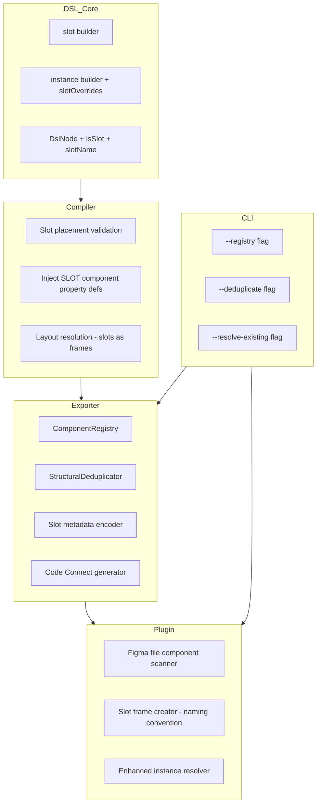
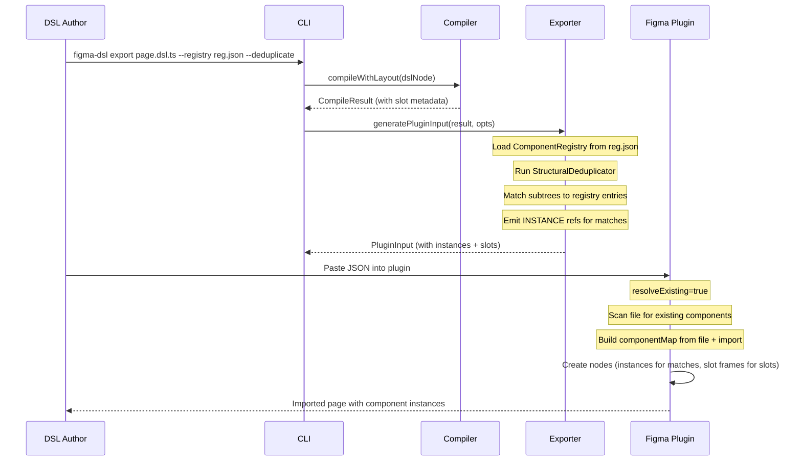
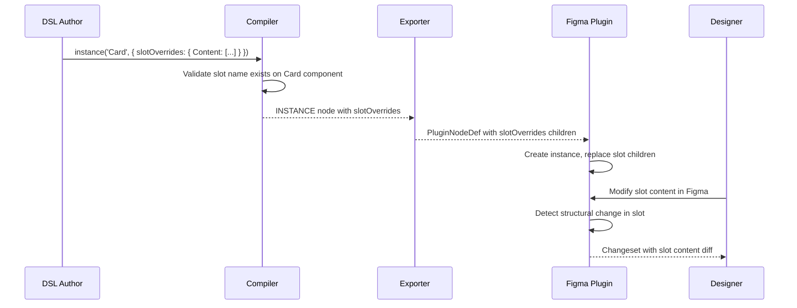
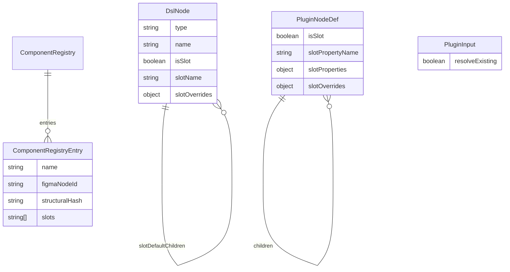

# Design Document — Figma Slots & Component Reuse

## Overview

**Purpose**: This feature delivers component reuse on page export and Figma slot support to DSL authors, plugin users, and designers.

**Users**: DSL authors use `slot()` and `instance()` builders. Plugin users get proper component-instance hierarchies and slot-ready frames on import. Designers get components with composable slot regions and changesets that capture slot edits.

**Impact**: Extends `@figma-dsl/core` (types + builders), `@figma-dsl/compiler` (slot validation + property injection), `@figma-dsl/exporter` (registry matching + dedup + slot encoding), `@figma-dsl/plugin` (file-wide component resolution + slot frame creation), and `@figma-dsl/cli` (new flags). Adds a Code Connect generation module to the exporter.

### Goals
- Enable Figma page imports to reuse existing components instead of duplicating subtrees
- Support Figma slots in the DSL so components have composable child areas
- Generate Code Connect bindings with `figma.slot()` for Dev Mode integration
- Automatically deduplicate repeated component patterns on page export
- Capture slot content changes bidirectionally via changesets

### Non-Goals
- Programmatic slot creation via Figma Plugin API (not available — see `research.md`)
- Full Figma REST API integration for remote component library resolution
- Slot-based visual rendering in @napi-rs/canvas (slots render as regular frames in PNG output)
- Variant-aware slot definitions (slots are uniform across variants in this phase)

## Architecture

### Existing Architecture Analysis

The pipeline follows a linear flow: DSL definition → compile (with layout) → render to PNG / export to Figma JSON → Figma plugin import. Key integration points:

- **DslNode** (core) → **FigmaNodeDict** (compiler) → **PluginNodeDef** (exporter) → **Figma SceneNode** (plugin)
- Each stage maps properties 1:1 with minimal transformation
- Component properties flow as `componentPropertyDefinitions` (COMPONENT nodes) and `componentId` + `overriddenProperties` (INSTANCE nodes)
- Plugin maintains `componentMap: Map<string, ComponentNode>` for intra-session instance resolution

**Constraints to respect**:
- Plugin sandbox: no filesystem access, limited memory, async image creation
- Figma Plugin API: `ComponentPropertyType` = `'BOOLEAN' | 'TEXT' | 'INSTANCE_SWAP' | 'VARIANT'` — no `SLOT`
- PluginNodeDef uses readonly arrays/properties — additions must maintain immutability

### Architecture Pattern & Boundary Map



**Architecture Integration**:
- Selected pattern: Extend existing pipeline with new fields and optional processing passes
- Domain boundaries: Slot semantics defined in core, validated in compiler, encoded in exporter, created in plugin
- Existing patterns preserved: DslNode → FigmaNodeDict → PluginNodeDef linear transformation; readonly plugin types; componentMap-based instance resolution
- New components rationale: Registry (enables cross-session reuse), Deduplicator (automatic page-level optimization), CodeConnectGenerator (new output format)
- Steering compliance: TypeScript strict mode, no `any`, vitest testing, single-responsibility modules

### Technology Stack

| Layer | Choice / Version | Role in Feature | Notes |
|-------|------------------|-----------------|-------|
| Core types | @figma-dsl/core (TypeScript 5.9) | DslNode slot fields, PluginNodeDef slot fields, ComponentRegistry type | Extends existing types |
| Compiler | @figma-dsl/compiler | Slot validation, SLOT property injection | Extends compileNode |
| Exporter | @figma-dsl/exporter | Registry matching, dedup, slot encoding, Code Connect generation | New functions in existing package |
| Plugin | @figma-dsl/plugin (esbuild IIFE) | File scanner, slot frame creation, enhanced instance resolver | Figma sandbox constraints apply |
| CLI | @figma-dsl/cli | New flags on export/batch/pipeline commands | Passes options to exporter/plugin |

## System Flows

### Page Export with Component Reuse



### Slot Content Override Flow



## Requirements Traceability

| Requirement | Summary | Components | Interfaces | Flows |
|-------------|---------|------------|------------|-------|
| 1.1 | Exporter accepts componentRegistry option | ComponentRegistry, Exporter | ExportOptions | Page Export |
| 1.2 | Exporter emits INSTANCE for registry matches | Exporter, StructuralDeduplicator | ExportOptions | Page Export |
| 1.3 | CLI --registry flag | CLI | CLI options | Page Export |
| 1.4 | Batch auto-builds registry | CLI, Exporter | ExportOptions | Page Export |
| 1.5 | Structure divergence warning | Exporter, ComponentRegistry | — | Page Export |
| 2.1 | Plugin searches local componentMap first | Plugin InstanceResolver | — | Page Export |
| 2.2 | Plugin searches Figma file for existing components | Plugin FileScanner | PluginInput | Page Export |
| 2.3 | Plugin creates instance of existing component | Plugin InstanceResolver | — | Page Export |
| 2.4 | Fallback to flat FRAME | Plugin InstanceResolver | — | Page Export |
| 2.5 | resolveExisting flag in PluginInput | PluginInput schema | PluginInput | Page Export |
| 3.1 | slot() builder function | SlotBuilder | DslNode | — |
| 3.2 | Slot name parameter | SlotBuilder | SlotProps | — |
| 3.3 | defaultChildren option | SlotBuilder | SlotProps | — |
| 3.4 | Standard frame options | SlotBuilder | SlotProps, FrameProps | — |
| 3.5 | Validation: slot inside COMPONENT only | Compiler SlotValidation | CompileError | — |
| 3.6 | isSlot + slotName on DslNode | DslNode type | — | — |
| 4.1 | Compiler passes isSlot/slotName through | Compiler | FigmaNodeDict | — |
| 4.2 | Slot-in-COMPONENT validation | Compiler SlotValidation | CompileError | — |
| 4.3 | SLOT property in componentPropertyDefinitions | Compiler | FigmaNodeDict | — |
| 4.4 | Layout resolution for slots | Compiler LayoutResolver | — | — |
| 5.1 | Exporter includes isSlot in PluginNodeDef | Exporter SlotEncoder | PluginNodeDef | — |
| 5.2 | slotProperties map on component | Exporter SlotEncoder | PluginNodeDef | — |
| 5.3 | Slot override encoding for instances | Exporter SlotEncoder | PluginNodeDef | Slot Override |
| 6.1 | Plugin creates slot frame with naming convention | Plugin SlotFrameCreator | — | Page Export |
| 6.2 | Plugin sets slot name from slotPropertyName | Plugin SlotFrameCreator | — | — |
| 6.3 | Plugin creates default children in slot | Plugin SlotFrameCreator | — | — |
| 6.4 | Fallback when API lacks SLOT support | Plugin SlotFrameCreator | — | — |
| 6.5 | Preferred instances configuration | Plugin SlotFrameCreator | — | — |
| 7.1 | Code Connect with figma.slot() | CodeConnectGenerator | CodeConnectOutput | — |
| 7.2 | Single slot maps to children | CodeConnectGenerator | — | — |
| 7.3 | Multiple slots map to named props | CodeConnectGenerator | — | — |
| 7.4 | Include Figma URL in connect() call | CodeConnectGenerator | CodeConnectOutput | — |
| 8.1 | --deduplicate flag on export | CLI, StructuralDeduplicator | ExportOptions | Page Export |
| 8.2 | Structural identity definition | StructuralDeduplicator | StructuralHash | — |
| 8.3 | Extract COMPONENT, replace with INSTANCE | StructuralDeduplicator | PluginNodeDef | Page Export |
| 8.4 | Components ordered before instances | StructuralDeduplicator | PluginInput | Page Export |
| 8.5 | Dedup log summary | StructuralDeduplicator | — | — |
| 9.1 | instance() accepts slotOverrides | InstanceBuilder | DslNode | Slot Override |
| 9.2 | Compiler includes slotOverrides | Compiler | FigmaNodeDict | Slot Override |
| 9.3 | Exporter encodes slotOverrides | Exporter SlotEncoder | PluginNodeDef | Slot Override |
| 9.4 | Plugin replaces slot children | Plugin SlotFrameCreator | — | Slot Override |
| 9.5 | Invalid slot name warning | Compiler SlotValidation | CompileError | — |
| 10.1 | Detect slot content addition | Plugin EditTracker | EditLogEntry | — |
| 10.2 | Detect slot content removal | Plugin EditTracker | EditLogEntry | — |
| 10.3 | Detect slot content reorder | Plugin EditTracker | EditLogEntry | — |
| 10.4 | Serialize slot children in changeset | Plugin Serializer | ChangesetDocument | — |
| 10.5 | Changeset Applicator updates DSL source | Changeset Applicator | — | — |

## Components and Interfaces

| Component | Domain/Layer | Intent | Req Coverage | Key Dependencies | Contracts |
|-----------|-------------|--------|--------------|------------------|-----------|
| SlotBuilder | Core/DSL | Create slot DslNodes | 3.1–3.6 | DslNode types (P0) | — |
| ComponentRegistry | Exporter/Data | Track known components for reuse | 1.1–1.5 | — | Service, State |
| StructuralDeduplicator | Exporter/Logic | Detect and extract repeated subtrees | 8.1–8.5 | PluginNodeDef (P0) | Service |
| SlotEncoder | Exporter/Logic | Encode slot metadata in PluginNodeDef | 5.1–5.3 | PluginNodeDef (P0) | — |
| CodeConnectGenerator | Exporter/Output | Generate .figma.tsx Code Connect files | 7.1–7.4 | PluginInput (P0) | Service |
| FileScanner | Plugin/Import | Scan Figma file for existing components | 2.1–2.5 | Figma Plugin API (P0) | Service |
| SlotFrameCreator | Plugin/Import | Create slot frames with naming convention | 6.1–6.5 | Figma Plugin API (P0) | — |
| InstanceResolver | Plugin/Import | Resolve instances across local map + file | 2.1–2.4 | FileScanner (P1), componentMap (P0) | — |
| SlotEditTracker | Plugin/Export | Detect and serialize slot content changes | 10.1–10.4 | EditTracker (P0), Serializer (P0) | — |

### Core / DSL Layer

#### SlotBuilder (slot() function)

| Field | Detail |
|-------|--------|
| Intent | Create DslNode with slot semantics from a builder function |
| Requirements | 3.1, 3.2, 3.3, 3.4, 3.5, 3.6 |

**Responsibilities & Constraints**
- Creates a FRAME-type DslNode with `isSlot: true` and `slotName` set
- Validates that `name` is non-empty
- Defers parent validation (slot-inside-COMPONENT) to compiler

**Dependencies**
- Inbound: DSL authors call `slot()` in `.dsl.ts` files
- Outbound: DslNode type, FrameProps type (P0)

##### Service Interface
```typescript
interface SlotProps {
  readonly size?: { x: number; y: number };
  readonly autoLayout?: AutoLayoutConfig;
  readonly fills?: Fill[];
  readonly cornerRadius?: number;
  readonly layoutSizingHorizontal?: 'FIXED' | 'HUG' | 'FILL';
  readonly layoutSizingVertical?: 'FIXED' | 'HUG' | 'FILL';
  readonly defaultChildren?: DslNode[];
  readonly preferredInstances?: string[];
}

function slot(name: string, props?: SlotProps): DslNode;
// Returns: DslNode with type='FRAME', isSlot=true, slotName=name
// Preconditions: name is non-empty string
// Postconditions: Returned node has isSlot=true, children set from defaultChildren
```

**Implementation Notes**
- Extends existing `nodes.ts` pattern — one function per node type
- `preferredInstances` stored on DslNode for downstream Code Connect / plugin use
- Runtime validation only checks name; compile-time validation checks parent context

### Exporter Layer

#### ComponentRegistry

| Field | Detail |
|-------|--------|
| Intent | Maintain a map of known component names to structural definitions for reuse matching |
| Requirements | 1.1, 1.2, 1.3, 1.4, 1.5 |

**Responsibilities & Constraints**
- Loads from JSON file (--registry) or builds incrementally during batch export
- Matches component names to incoming subtree roots
- Compares structural hash to detect divergence
- Immutable after construction (no side effects during export)

**Dependencies**
- Inbound: CLI passes registry file path or batch context (P0)
- Outbound: Exporter uses for instance substitution (P0)
- External: Filesystem for JSON read (P1)

**Contracts**: Service [x] / State [x]

##### Service Interface
```typescript
interface ComponentRegistryEntry {
  readonly name: string;
  readonly figmaNodeId?: string;
  readonly structuralHash: string;
  readonly properties: Record<string, { type: string; defaultValue: string | boolean }>;
  readonly slots: string[];
}

interface ComponentRegistry {
  readonly entries: ReadonlyMap<string, ComponentRegistryEntry>;
}

function loadRegistry(filePath: string): ComponentRegistry;
function buildRegistryFromBatch(exportedComponents: PluginNodeDef[]): ComponentRegistry;
function matchComponent(registry: ComponentRegistry, subtreeRoot: PluginNodeDef): ComponentRegistryEntry | null;
function computeStructuralHash(node: PluginNodeDef): string;
```
- Preconditions: Registry file exists and is valid JSON (for loadRegistry)
- Postconditions: Returns immutable ComponentRegistry
- Error: Returns empty registry if file not found (with warning)

##### State Management
- Registry JSON file format:
```typescript
interface RegistryFile {
  readonly schemaVersion: string;
  readonly components: ComponentRegistryEntry[];
}
```
- Persistence: Written after batch export, read at start of next export
- No concurrency concerns — single CLI process

#### StructuralDeduplicator

| Field | Detail |
|-------|--------|
| Intent | Analyze a node tree for structurally identical subtrees, extract shared components |
| Requirements | 8.1, 8.2, 8.3, 8.4, 8.5 |

**Responsibilities & Constraints**
- Computes structural hash per subtree (type + name + layout + child structure)
- Groups identical subtrees
- Extracts first occurrence as COMPONENT
- Replaces subsequent occurrences with INSTANCE + property overrides
- Maintains output ordering: components before instances

**Dependencies**
- Inbound: Exporter invokes during generatePluginInput when --deduplicate is set (P0)
- Outbound: Produces modified PluginNodeDef tree (P0)

**Contracts**: Service [x]

##### Service Interface
```typescript
interface DeduplicationResult {
  readonly extractedComponents: PluginNodeDef[];
  readonly modifiedTree: PluginNodeDef;
  readonly summary: DeduplicationSummary;
}

interface DeduplicationSummary {
  readonly extractedCount: number;
  readonly instanceCount: number;
  readonly components: Array<{ name: string; instances: number }>;
}

function deduplicate(root: PluginNodeDef): DeduplicationResult;
function computeStructuralHash(node: PluginNodeDef): string;
function extractPropertyOverrides(
  template: PluginNodeDef,
  instance: PluginNodeDef,
): Record<string, string | boolean>;
```
- Preconditions: Root node is a valid PluginNodeDef tree
- Postconditions: extractedComponents + modifiedTree produces identical visual output when imported
- Structural hash excludes: characters, fills, opacity, size (these become overrides)
- Structural hash includes: type, name (base pattern), stackMode, itemSpacing, padding, alignment, child count, child hashes (recursive)

#### CodeConnectGenerator

| Field | Detail |
|-------|--------|
| Intent | Generate Code Connect .figma.tsx binding files from exported component data |
| Requirements | 7.1, 7.2, 7.3, 7.4 |

**Responsibilities & Constraints**
- Generates one .figma.tsx file per component
- Maps slot properties to `figma.slot('Name')`
- Maps text/boolean properties to `figma.string()`/`figma.boolean()`
- Uses component's Figma node ID for the connect URL

**Dependencies**
- Inbound: Called after plugin import returns node ID map (P0)
- Outbound: Writes .figma.tsx files to component directories (P0)
- External: @figma/code-connect library types (P1)

**Contracts**: Service [x]

##### Service Interface
```typescript
interface CodeConnectInput {
  readonly componentName: string;
  readonly figmaNodeId: string;
  readonly figmaFileKey: string;
  readonly properties: Record<string, { type: string; defaultValue: string | boolean }>;
  readonly slots: string[];
  readonly reactComponentPath: string;
}

interface CodeConnectOutput {
  readonly fileName: string;
  readonly content: string;
}

function generateCodeConnect(input: CodeConnectInput): CodeConnectOutput;
function generateCodeConnectBatch(inputs: CodeConnectInput[]): CodeConnectOutput[];
```
- Single slot named `Content` or `Children` → maps to React `children` prop
- Multiple slots → each maps to a named React prop (camelCase of slot name)
- Generated file includes `figma.connect(Component, 'figma-url', { props, example })`

### Plugin Layer

#### FileScanner

| Field | Detail |
|-------|--------|
| Intent | Scan the current Figma file to find existing components by name |
| Requirements | 2.2, 2.3, 2.5 |

**Responsibilities & Constraints**
- Uses `figma.root.findAllWithCriteria({ types: ['COMPONENT'] })` for efficient search
- Builds a `Map<string, ComponentNode>` from results
- Runs once per import session (cached)
- Only activated when `resolveExisting: true` in PluginInput

**Dependencies**
- Inbound: Plugin import handler triggers scan (P0)
- Outbound: Populates componentMap for InstanceResolver (P0)
- External: Figma Plugin API — `figma.root.findAllWithCriteria()` (P0)

**Contracts**: Service [x]

##### Service Interface
```typescript
// Plugin-side (runs in Figma sandbox)
function scanFileForComponents(): Map<string, ComponentNode>;
// Returns: Map of component name → ComponentNode
// Uses: figma.root.findAllWithCriteria({ types: ['COMPONENT'] })
// Handles: Duplicate names (first match wins, log warning)
// Performance: O(n) where n = total components in file; cached per session
```

#### SlotFrameCreator

| Field | Detail |
|-------|--------|
| Intent | Create frames with slot naming convention during component import |
| Requirements | 6.1, 6.2, 6.3, 6.4, 6.5 |

**Responsibilities & Constraints**
- Creates frames named `[Slot] {slotName}` for nodes with `isSlot: true`
- Stores slot metadata in plugin data for changeset tracking
- Creates default children inside the slot frame
- Logs guidance message for manual slot conversion

**Dependencies**
- Inbound: createNode() dispatches to SlotFrameCreator for slot nodes (P0)
- Outbound: Created Figma FrameNode (P0)
- External: Figma Plugin API — figma.createFrame() (P0)

**Implementation Notes**
- Naming convention `[Slot] {slotName}` is discoverable via Figma's layer panel
- When Figma adds `SLOT` to ComponentPropertyType, update to use `addComponentProperty('name', 'SLOT', ...)`
- Plugin data stores `{ isSlot: true, slotName: string, preferredInstances?: string[] }` for changeset awareness

## Data Models

### Domain Model



### Logical Data Model

**DslNode extensions** (added fields):
```typescript
// Added to existing DslNode interface
readonly isSlot?: boolean;
readonly slotName?: string;
readonly slotOverrides?: Record<string, DslNode[]>;
readonly preferredInstances?: string[];
```

**PluginNodeDef extensions** (added fields):
```typescript
// Added to existing PluginNodeDef interface
readonly isSlot?: boolean;
readonly slotPropertyName?: string;
readonly slotProperties?: Record<string, {
  readonly defaultContentNodeIndex?: number;
  readonly preferredInstances?: string[];
}>;
readonly slotOverrides?: Record<string, ReadonlyArray<PluginNodeDef>>;
```

**PluginInput extension** (added field):
```typescript
// Added to existing PluginInput interface
readonly resolveExisting?: boolean;
```

**FigmaNodeDict extensions** (added fields in compiler types):
```typescript
// Added to existing FigmaNodeDict interface
isSlot?: boolean;
slotName?: string;
slotOverrides?: Record<string, FigmaNodeDict[]>;
```

### Data Contracts & Integration

**Component Registry File** (`component-registry.json`):
```typescript
{
  schemaVersion: "1.0.0",
  components: [
    {
      name: "Button",
      figmaNodeId: "5:1238",
      structuralHash: "a1b2c3d4...",
      properties: { "Label": { type: "TEXT", defaultValue: "Click me" } },
      slots: ["Leading Icon", "Trailing Icon"]
    }
  ]
}
```

**Changeset extension for slot changes**:
```typescript
// PropertyChange with slot context
{
  propertyPath: "children.2.slotContent",
  changeType: "modified",
  slotName: "Content",
  oldValue: { /* serialized old children */ },
  newValue: { /* serialized new children */ },
  description: "Slot 'Content' children changed"
}
```

## Error Handling

### Error Strategy
- **Compile-time**: Slot placement errors (slot outside COMPONENT) emit CompileError — fail-fast
- **Export-time**: Registry mismatch warnings (structure diverged) — warn, continue
- **Import-time**: Missing component for instance — fallback to FRAME, log warning
- **Import-time**: Slot API unavailable — use naming convention, log guidance message

### Error Categories and Responses
**User Errors**: Invalid slot name (empty string) → validation error at `slot()` call. Slot outside COMPONENT → CompileError with path. Invalid slot override name → CompileError warning.
**System Errors**: Registry file not found → empty registry with warning. Figma file scan failure → skip file scan, use local map only.
**Business Logic Errors**: Structural hash mismatch → warning with component name and divergence details.

## Testing Strategy

### Unit Tests
- `slot()` builder creates correct DslNode with isSlot/slotName (core)
- `slot()` inside non-COMPONENT parent triggers compile error (compiler)
- `computeStructuralHash()` produces identical hashes for identical structures (exporter)
- `deduplicate()` extracts components and creates instances with correct overrides (exporter)
- `matchComponent()` finds registry entry by name and validates structural hash (exporter)

### Integration Tests
- Full pipeline: DSL with slots → compile → export → verify PluginNodeDef contains slot metadata
- Deduplication: Page with 3 identical cards → export with --deduplicate → 1 COMPONENT + 3 INSTANCE in output
- Registry: Batch export of 2 DSL files → second file references component from first → INSTANCE in output
- Code Connect generation: Component with 2 slots → generates .figma.tsx with 2 `figma.slot()` calls

### E2E Tests
- Import a component with slots into Figma → verify `[Slot] Content` frame created with default children
- Import a page with `resolveExisting: true` → verify instances link to existing file components
- Modify slot content in Figma → export changeset → verify slot changes captured
