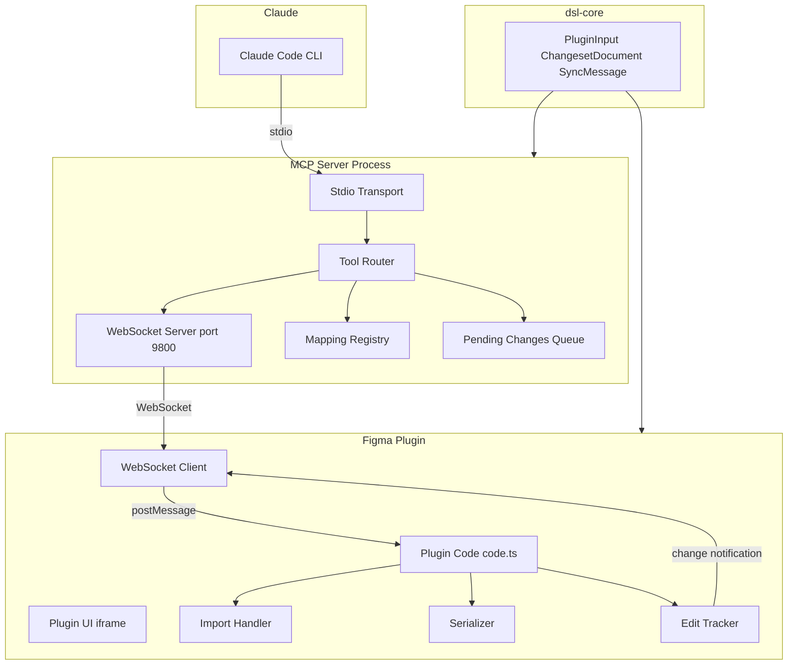
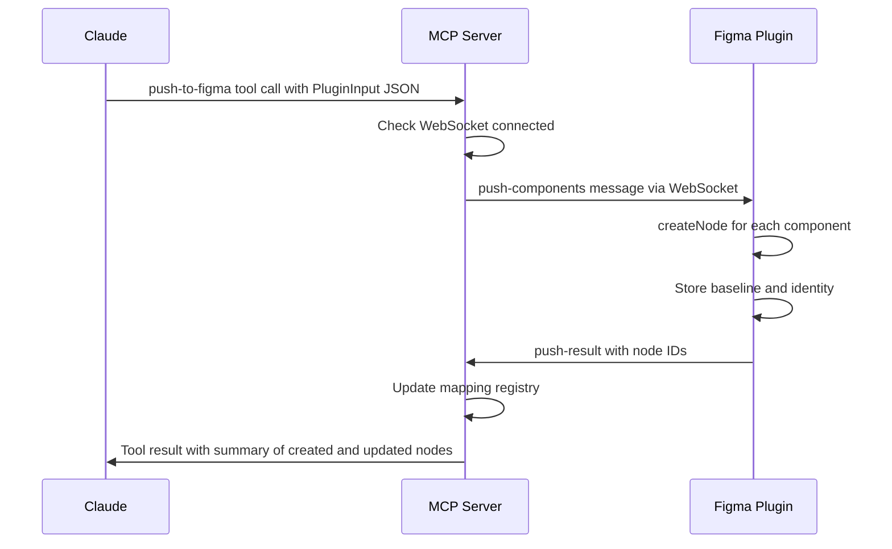
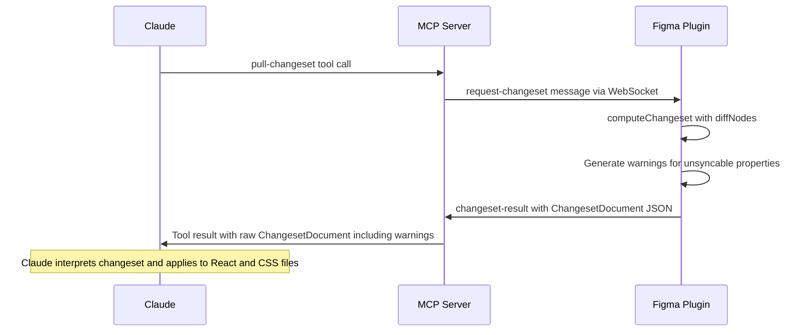
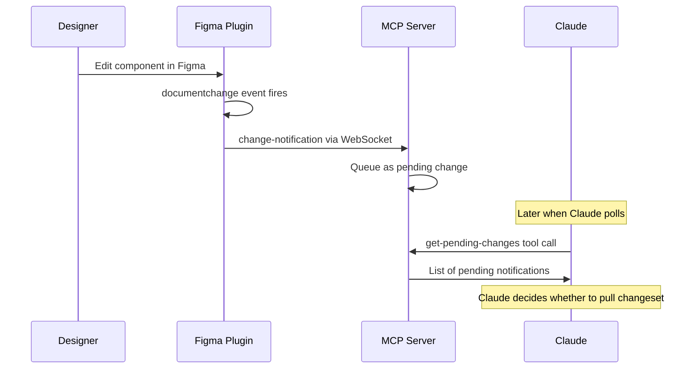
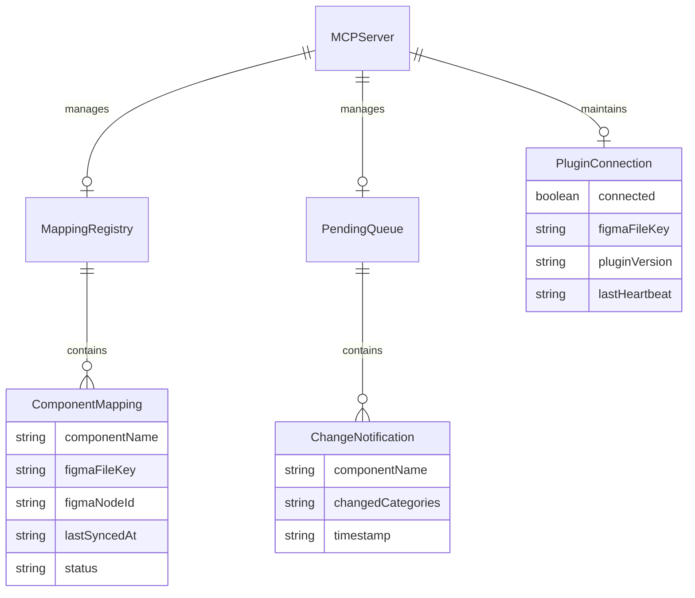

# Design Document — Real-Time Sync MCP Server

## Overview

**Purpose**: This feature delivers a real-time bidirectional sync bridge between React components and Figma designs via an MCP (Model Context Protocol) server. The MCP server is a thin JSON interface — it relays PluginInput and ChangesetDocument JSON between Claude and the Figma plugin without generating React or CSS code.

**Users**: Developers use Claude Code CLI to push component updates to Figma and pull design changes back as structured changesets. Designers edit components in Figma Desktop; the plugin forwards changes to the MCP server. Claude interprets changesets and applies code modifications autonomously.

**Impact**: Extends the current batch export/import workflow into a real-time connected workflow. Adds a new `@figma-dsl/mcp-server` package and extends the existing Figma plugin with WebSocket communication.

### Goals
- Enable Claude to push PluginInput JSON to Figma via MCP tool calls
- Enable Claude to pull ChangesetDocument JSON from Figma via MCP tool calls
- Provide real-time change notifications from Figma to Claude
- Maintain a persistent component mapping registry (React ↔ Figma)
- Surface human-readable sync activity in Claude Desktop output
- Detect and warn about unsyncable properties

### Non-Goals
- MCP server does not compile DSL, generate React code, or modify CSS — Claude handles all code changes
- No Figma REST API integration (plugin-only communication)
- No multi-user conflict resolution (single developer + single designer assumed)
- No automatic file watching on the React side (Claude triggers pushes explicitly)
- No persistent sync sessions — connection is always-on while plugin is open

## Architecture

> See `research.md` for detailed findings on MCP SDK API, Figma plugin WebSocket capabilities, and existing message protocol analysis.

### Existing Architecture Analysis

The current pipeline is batch-oriented:

```
.dsl.ts → compile → export → PluginInput JSON → [copy/paste] → Plugin → Figma nodes
Figma edits → Plugin export button → [copy/paste] → ChangesetDocument JSON → apply-changeset skill
```

Key constraints:
- Plugin (`packages/plugin/`) communicates via `figma.ui.onmessage` only — no external networking
- Plugin already tracks edits via `documentchange` and computes changesets via `diffNodes()`
- Shared types (`PluginInput`, `ChangesetDocument`, `ComponentIdentity`) in `@figma-dsl/core`
- No MCP server, no `.claude/mcp.json`, no WebSocket communication

### Architecture Pattern & Boundary Map



**Architecture Integration**:
- Selected pattern: Message relay — MCP server bridges two communication channels (stdio ↔ WebSocket) without business logic
- Domain boundaries: MCP server owns connection management and mapping registry; plugin owns Figma API operations; Claude owns code intelligence
- Existing patterns preserved: monorepo package structure, plugin message-based architecture, shared types in `dsl-core`
- New components rationale: `@figma-dsl/mcp-server` (MCP tool definitions + WebSocket server), WebSocket client in plugin UI (thin relay)
- Steering compliance: TypeScript strict mode, no `any`, vitest, npm workspaces

### Technology Stack

| Layer | Choice / Version | Role in Feature | Notes |
|-------|------------------|-----------------|-------|
| MCP SDK | @modelcontextprotocol/sdk ^1.27 | McpServer, StdioServerTransport, tool registration | Peer dep: zod ^3.25 |
| WebSocket Server | ws ^8 | Accept plugin connections on port 9800 | Lightweight, Node-native |
| Schema Validation | zod ^3.25 | MCP tool input schemas | Required by MCP SDK |
| Shared Types | @figma-dsl/core | PluginInput, ChangesetDocument, SyncMessage types | Extended, not new |
| Plugin Build | esbuild (IIFE) | Bundle plugin with WebSocket client | Existing toolchain |
| Testing | vitest | MCP server unit + integration tests | Existing toolchain |
| Runtime | Node.js >= 22 | MCP server process | Existing requirement |

## System Flows

### Flow 1: Push Component to Figma (Code → Design)



Key decision: Claude is responsible for compiling and exporting the PluginInput JSON before calling the push tool. The MCP server does not run the DSL pipeline.

### Flow 2: Pull Changeset from Figma (Design → Code)



Key decision: The ChangesetDocument JSON is returned verbatim to Claude. The MCP server does not parse, filter, or transform it.

### Flow 3: Real-Time Change Notification



Key decision: Notifications are queued, not pushed. Claude polls pending changes via MCP tool. This avoids the need for server-initiated MCP messages (which stdio transport does not support).

## Requirements Traceability

| Requirement | Summary | Components | Interfaces | Flows |
|-------------|---------|------------|------------|-------|
| 1.1 | MCP tool endpoints over stdio | MCPServer | StdioTransport | All |
| 1.2 | Configurable via .claude/mcp.json | MCPServer | MCP config | — |
| 1.3 | WebSocket connection registration | MCPServer | WSServer | All |
| 1.4 | Disconnection status reporting | MCPServer | get-status tool | — |
| 1.5 | Port conflict error | MCPServer | WSServer init | — |
| 1.6 | Disconnected state on tool invocation | MCPServer | ToolRouter | All |
| 2.1 | Push PluginInput via MCP tool | MCPServer | push-to-figma tool | Flow 1 |
| 2.2 | Plugin creates/updates nodes | PluginCode | ImportHandler | Flow 1 |
| 2.3 | Record mapping on first push | MCPServer | MappingRegistry | Flow 1 |
| 2.4 | In-place update on subsequent push | PluginCode | ImportHandler | Flow 1 |
| 2.5 | Error when plugin disconnected | MCPServer | ToolRouter | Flow 1 |
| 2.6 | Acknowledgment with node IDs | PluginCode, WSClient | push-result message | Flow 1 |
| 3.1 | Pull changeset MCP tool | MCPServer | pull-changeset tool | Flow 2 |
| 3.2 | Plugin computes changeset | PluginCode | Serializer, diffNodes | Flow 2 |
| 3.3 | Return changeset without transformation | MCPServer | ToolRouter | Flow 2 |
| 3.4 | Pull complete export MCP tool | MCPServer | pull-export tool | Flow 2 |
| 3.5 | Return PluginInput without transformation | MCPServer | ToolRouter | Flow 2 |
| 3.6 | Transparent relay | MCPServer | ToolRouter | Flow 2 |
| 4.1 | Plugin forwards documentchange | PluginCode, WSClient | change-notification msg | Flow 3 |
| 4.2 | Queue pending changes | MCPServer | PendingQueue | Flow 3 |
| 4.3 | Get-pending-changes MCP tool | MCPServer | get-pending-changes tool | Flow 3 |
| 4.4 | Clear on retrieval | MCPServer | PendingQueue | Flow 3 |
| 4.5 | Summary-only notification | PluginCode | change-notification msg | Flow 3 |
| 5.1 | Mapping registry associates names to IDs | MCPServer | MappingRegistry | Flow 1 |
| 5.2 | Auto-create mapping on first push | MCPServer | MappingRegistry | Flow 1 |
| 5.3 | List mappings MCP tool | MCPServer | list-mappings tool | — |
| 5.4 | CRUD mappings MCP tool | MCPServer | update-mapping tool | — |
| 5.5 | JSON file storage | MCPServer | MappingRegistry | — |
| 5.6 | Stale mapping on Figma deletion | PluginCode, MCPServer | component-deleted msg | — |
| 6.1 | Connection status MCP tool | MCPServer | get-status tool | — |
| 6.2 | Heartbeat timestamp | MCPServer, WSClient | heartbeat message | — |
| 6.3 | Tracked components list | MCPServer | list-mappings tool | — |
| 6.4 | Setup instructions when never connected | MCPServer | get-status tool | — |
| 7.1 | WebSocket on configurable port | WSClient, WSServer | ws://localhost:9800 | All |
| 7.2 | Handshake message | WSClient | handshake message | — |
| 7.3 | Typed JSON message protocol | SyncMessageTypes | SyncMessage union | All |
| 7.4 | push-components message handling | PluginCode | ImportHandler | Flow 1 |
| 7.5 | request-changeset message handling | PluginCode | Serializer | Flow 2 |
| 7.6 | request-export message handling | PluginCode | Serializer | Flow 2 |
| 7.7 | Reconnection with indicator | WSClient, PluginUI | reconnect logic | — |
| 8.1 | Push summary output | MCPServer | push-to-figma result | Flow 1 |
| 8.2 | Pull changeset human-readable summary | MCPServer | pull-changeset result | Flow 2 |
| 8.3 | Description field on PropertyChange | ChangesetDocument | description field | Flow 2 |
| 8.4 | File modification output | Claude (skill) | — | — |
| 8.5 | Notification summary output | MCPServer | get-pending-changes result | Flow 3 |
| 8.6 | Inline warning presentation | MCPServer | pull-changeset result | Flow 2 |
| 9.1 | Warnings array in changeset | PluginCode | ChangesetDocument.warnings | Flow 2 |
| 9.2 | Known DSL pipeline constraint warnings | PluginCode | Warning rules | Flow 2 |
| 9.3 | Warning severity classification | PluginCode | ChangesetWarning type | Flow 2 |
| 9.4 | Relay warnings without filtering | MCPServer | ToolRouter | Flow 2 |
| 9.5 | Warning data structure | ChangesetWarning type | propertyPath, severity, description | Flow 2 |

## Components and Interfaces

| Component | Domain | Intent | Req Coverage | Key Dependencies | Contracts |
|-----------|--------|--------|--------------|-----------------|-----------|
| MCPServer | MCP Server | Expose MCP tools over stdio, route to WebSocket | 1.1–1.6, 2.1, 2.3, 2.5, 3.1, 3.3–3.6, 4.2–4.4, 6.1–6.4, 8.1–8.2, 8.5–8.6, 9.4 | @modelcontextprotocol/sdk (P0), ws (P0) | Service |
| MappingRegistry | MCP Server | Persist React↔Figma component mappings | 5.1–5.6 | fs (P0) | Service, State |
| PendingQueue | MCP Server | Queue real-time change notifications | 4.2–4.4 | — | State |
| WSClient (Plugin) | Plugin | WebSocket relay in plugin UI iframe | 7.1–7.3, 7.7 | ws://localhost (P0) | — |
| PluginMessageHandler | Plugin | Handle new WebSocket-originated messages | 7.4–7.6, 4.1, 4.5, 9.1–9.3 | Existing plugin code (P0) | — |
| SyncMessageTypes | dsl-core | Typed WebSocket message definitions | 7.3 | — | Service |
| ChangesetWarning | dsl-core | Warning type for unsyncable properties | 9.1–9.5 | — | Service |

### MCP Server Domain

#### MCPServer (Entry Point)

| Field | Detail |
|-------|--------|
| Intent | Initialize MCP server with stdio transport, register all tools, start WebSocket server, route tool calls to plugin via WebSocket |
| Requirements | 1.1, 1.2, 1.3, 1.4, 1.5, 1.6, 2.1, 2.3, 2.5, 3.1, 3.3, 3.4, 3.5, 3.6, 4.2, 4.3, 4.4, 6.1, 6.2, 6.3, 6.4, 8.1, 8.2, 8.5, 8.6, 9.4 |

**Responsibilities & Constraints**
- Initialize `McpServer` with stdio transport on process start
- Start WebSocket server (`ws`) on configurable port (default 9800, env `FIGMA_SYNC_PORT`)
- Register 7 MCP tools (see Service Interface)
- Route tool calls that require Figma interaction through WebSocket to plugin
- Manage connection state: track connected/disconnected, last heartbeat, Figma file key
- Reject Figma-dependent tool calls with descriptive error when plugin is disconnected

**Dependencies**
- External: @modelcontextprotocol/sdk — MCP server framework (P0)
- External: ws — WebSocket server (P0)
- External: zod — Tool input schema validation (P0)
- Inbound: Claude via stdio — tool invocations (P0)
- Inbound: Figma Plugin via WebSocket — responses and notifications (P0)
- Outbound: MappingRegistry — mapping CRUD (P1)
- Outbound: PendingQueue — notification storage (P1)

**Contracts**: Service [x] / State [x]

##### Service Interface

```typescript
// MCP Tools registered by the server

interface PushToFigmaInput {
  readonly pluginInput: string; // JSON-serialized PluginInput
}

interface PullChangesetInput {
  readonly componentNames?: ReadonlyArray<string>; // empty = all tracked
}

interface PullExportInput {
  readonly componentNames?: ReadonlyArray<string>;
  readonly pageName?: string;
}

interface UpdateMappingInput {
  readonly componentName: string;
  readonly figmaFileKey: string;
  readonly figmaNodeId: string;
}

interface RemoveMappingInput {
  readonly componentName: string;
}

// Tool definitions (registered via server.registerTool):
// 1. "push-to-figma"      — PushToFigmaInput → summary of created/updated nodes
// 2. "pull-changeset"     — PullChangesetInput → ChangesetDocument JSON with warnings
// 3. "pull-export"        — PullExportInput → PluginInput JSON (complete snapshot)
// 4. "get-pending-changes"— void → list of pending change notifications
// 5. "get-status"         — void → connection status, tracked components, heartbeat
// 6. "list-mappings"      — void → all component mappings
// 7. "update-mapping"     — UpdateMappingInput → confirmation
// 8. "remove-mapping"     — RemoveMappingInput → confirmation
```

- Preconditions: Tools 1–3 require WebSocket connection to plugin (return error otherwise)
- Postconditions: Tool results include human-readable text summaries for Claude Desktop output (8.1, 8.2, 8.5)
- Invariants: MCP server never modifies ChangesetDocument or PluginInput content — transparent relay

##### State Management

```typescript
interface ServerState {
  readonly wsConnected: boolean;
  readonly figmaFileKey: string | null;
  readonly pluginVersion: string | null;
  readonly lastHeartbeat: string | null;
  readonly connectedSince: string | null;
}
```

- Persistence: Connection state is in-memory (reset on server restart)
- Concurrency: Single stdio connection + single WebSocket connection; no concurrency concerns

**Implementation Notes**
- Integration: Server entry point at `packages/mcp-server/src/server.ts`; bin stub at `bin/figma-dsl-sync`
- Validation: All tool inputs validated via Zod schemas before processing
- Risks: WebSocket server port conflict — detect and report via tool error response

#### MappingRegistry

| Field | Detail |
|-------|--------|
| Intent | Persist bidirectional mappings between component names and Figma node IDs |
| Requirements | 5.1, 5.2, 5.3, 5.4, 5.5, 5.6 |

**Responsibilities & Constraints**
- Read/write mapping JSON file at configurable path (default `.figma-sync/mappings.json`)
- Auto-create mapping directory if it does not exist
- Provide CRUD operations: list, get, add/update, remove, markStale
- Mappings are keyed by component name (unique per project)

**Dependencies**
- External: Node.js fs — file I/O (P0)

**Contracts**: Service [x] / State [x]

##### Service Interface

```typescript
interface ComponentMapping {
  readonly componentName: string;
  readonly figmaFileKey: string;
  readonly figmaNodeId: string;
  readonly lastSyncedAt: string;
  readonly status: 'active' | 'stale';
}

interface MappingRegistryFile {
  readonly schemaVersion: string;
  readonly mappings: Record<string, ComponentMapping>;
}

interface MappingRegistryService {
  list(): ReadonlyArray<ComponentMapping>;
  get(componentName: string): ComponentMapping | undefined;
  upsert(mapping: ComponentMapping): void;
  remove(componentName: string): void;
  markStale(componentName: string): void;
  save(): void;
  load(): void;
}
```

- Preconditions: File path must be writable
- Postconditions: `save()` writes atomically (write temp file + rename)
- Invariants: Component names are unique within the registry

##### State Management
- Persistence: JSON file at `.figma-sync/mappings.json`, loaded on server start, saved after each mutation
- Concurrency: Single-threaded Node.js process; no concurrent access

#### PendingQueue

| Field | Detail |
|-------|--------|
| Intent | Queue real-time change notifications from plugin for Claude to poll |
| Requirements | 4.2, 4.3, 4.4 |

**Responsibilities & Constraints**
- Accept change notifications from WebSocket messages
- Return all pending notifications on poll and clear the queue
- Provide count for status queries

**Contracts**: State [x]

##### State Management

```typescript
interface ChangeNotification {
  readonly componentName: string;
  readonly changedCategories: ReadonlyArray<string>; // e.g., "fills", "typography", "layout"
  readonly timestamp: string;
}
```

- Persistence: In-memory only (notifications are ephemeral; lost on server restart)
- Concurrency: Single-threaded

### Plugin Domain

#### WSClient (Plugin UI WebSocket Relay)

| Field | Detail |
|-------|--------|
| Intent | Open WebSocket from plugin UI iframe to MCP server and relay messages bidirectionally |
| Requirements | 7.1, 7.2, 7.3, 7.7 |

**Responsibilities & Constraints**
- Open `ws://localhost:{port}` WebSocket from plugin UI iframe
- Send handshake message on connect (Figma file key, plugin version)
- Relay incoming WebSocket messages to plugin code via `parent.postMessage`
- Relay outgoing plugin messages to WebSocket via `ws.send`
- Display connection status indicator in plugin UI
- Reconnect on disconnect with 5-second interval

**Dependencies**
- External: Browser WebSocket API — available in plugin UI iframe (P0)
- Outbound: Plugin code — via `parent.postMessage` (P0)

**Contracts**: None (UI-only, communicates via postMessage)

**Implementation Notes**
- Integration: WebSocket client code added to the inline HTML UI string in `code.ts`
- Validation: Check `readyState` before sending; buffer messages during reconnection
- Risks: Figma may close plugin UI on inactivity; heartbeat timer (30s) keeps connection alive

#### PluginMessageHandler (Extensions to code.ts)

| Field | Detail |
|-------|--------|
| Intent | Handle new message types originating from WebSocket relay |
| Requirements | 7.4, 7.5, 7.6, 4.1, 4.5, 9.1, 9.2, 9.3 |

**Responsibilities & Constraints**
- Handle `push-components` message: delegate to existing `createNode()` import flow, return node IDs
- Handle `request-changeset` message: delegate to existing `computeChangeset()`, add warnings, return ChangesetDocument
- Handle `request-export` message: delegate to existing `computeCompleteExport()`, return PluginInput
- Forward `documentchange` edit log entries as `change-notification` messages via WebSocket
- Generate warnings for unsyncable properties during changeset computation

**Dependencies**
- Inbound: WSClient — WebSocket messages (P0)
- Internal: Existing createNode, computeChangeset, computeCompleteExport functions (P0)

**Implementation Notes**
- Integration: Add new message type handlers in existing `figma.ui.onmessage` switch. Existing import/export/changeset message types remain unchanged for backward compatibility with UI buttons.
- The `change-notification` message is sent proactively when `documentchange` fires, not in response to a request.

### Shared Types Domain

#### SyncMessageTypes (in @figma-dsl/core)

| Field | Detail |
|-------|--------|
| Intent | Define typed WebSocket message protocol shared by MCP server and plugin |
| Requirements | 7.3 |

**Contracts**: Service [x]

##### Service Interface

```typescript
// Client → Server messages
interface HandshakeMessage {
  readonly type: 'handshake';
  readonly figmaFileKey: string;
  readonly pluginVersion: string;
  readonly userId: string;
}

interface HeartbeatMessage {
  readonly type: 'heartbeat';
  readonly timestamp: string;
}

interface PushResultMessage {
  readonly type: 'push-result';
  readonly requestId: string;
  readonly nodeIds: Record<string, string>; // componentName → nodeId
  readonly summary: string;
}

interface ChangesetResultMessage {
  readonly type: 'changeset-result';
  readonly requestId: string;
  readonly changeset: ChangesetDocument;
}

interface ExportResultMessage {
  readonly type: 'export-result';
  readonly requestId: string;
  readonly pluginInput: PluginInput;
}

interface ChangeNotificationMessage {
  readonly type: 'change-notification';
  readonly componentName: string;
  readonly changedCategories: ReadonlyArray<string>;
  readonly timestamp: string;
}

interface ComponentDeletedMessage {
  readonly type: 'component-deleted';
  readonly componentName: string;
  readonly nodeId: string;
}

// Server → Client messages
interface PushComponentsMessage {
  readonly type: 'push-components';
  readonly requestId: string;
  readonly pluginInput: PluginInput;
}

interface RequestChangesetMessage {
  readonly type: 'request-changeset';
  readonly requestId: string;
  readonly componentNames?: ReadonlyArray<string>;
}

interface RequestExportMessage {
  readonly type: 'request-export';
  readonly requestId: string;
  readonly componentNames?: ReadonlyArray<string>;
  readonly pageName?: string;
}

// Union types
type ClientMessage =
  | HandshakeMessage
  | HeartbeatMessage
  | PushResultMessage
  | ChangesetResultMessage
  | ExportResultMessage
  | ChangeNotificationMessage
  | ComponentDeletedMessage;

type ServerMessage =
  | PushComponentsMessage
  | RequestChangesetMessage
  | RequestExportMessage;

type SyncMessage = ClientMessage | ServerMessage;
```

#### ChangesetWarning (in @figma-dsl/core)

| Field | Detail |
|-------|--------|
| Intent | Warning type for unsyncable properties included in ChangesetDocument |
| Requirements | 9.1, 9.2, 9.3, 9.5 |

**Contracts**: Service [x]

##### Service Interface

```typescript
type WarningSeverity = 'info' | 'warning' | 'error';

interface ChangesetWarning {
  readonly propertyPath: string;
  readonly severity: WarningSeverity;
  readonly description: string;
  readonly unsupportedValue?: unknown;
}

// Extended ChangesetDocument (backward-compatible addition)
interface ChangesetDocument {
  readonly schemaVersion: string;
  readonly timestamp: string;
  readonly source: ChangesetSource;
  readonly components: ReadonlyArray<ComponentChangeEntry>;
  readonly warnings?: ReadonlyArray<ChangesetWarning>; // NEW — optional for backward compat
}
```

## Data Models

### Domain Model



**Aggregates**:
- `MappingRegistry` is the aggregate root for component mappings — persisted to JSON file
- `PendingQueue` is the aggregate root for change notifications — ephemeral, in-memory

**Invariants**:
- Component names are unique in the mapping registry
- Notifications are cleared after retrieval (exactly-once delivery to Claude)
- Only one WebSocket connection is active at a time

### Data Contracts & Integration

**MCP Server ↔ Claude (stdio)**:
- MCP tool input/output as JSON-RPC over stdio
- Tool results contain `content: [{ type: 'text', text: string }]` with human-readable summaries

**MCP Server ↔ Plugin (WebSocket)**:
- JSON messages with `type` discriminator (see SyncMessageTypes)
- Request-response correlated via `requestId` field
- Notifications are fire-and-forget (no requestId)

**Serialization**: JSON with UTF-8 encoding, matching existing pipeline conventions

## Error Handling

### Error Strategy
- MCP tool errors: Return `{ isError: true, content: [{ type: 'text', text: errorMessage }] }`
- WebSocket errors: Log and update connection state; report via get-status tool
- Plugin errors: Return error messages via WebSocket response; MCP server relays to Claude

### Error Categories and Responses

**Connection Errors**:
- Plugin not connected → MCP tool returns "Figma plugin is not connected. Open Figma Desktop and ensure the sync plugin is running."
- WebSocket port in use → Server startup fails with descriptive message
- Plugin disconnects mid-request → MCP tool returns timeout error after 30 seconds

**Data Errors**:
- Invalid PluginInput JSON → MCP tool returns Zod validation error
- Plugin changeset computation fails → Plugin returns error message; MCP server relays
- Mapping file corrupt/unreadable → Re-create with empty registry, log warning

## Testing Strategy

### Unit Tests
- MCP tool registration and Zod schema validation
- MappingRegistry CRUD operations (list, get, upsert, remove, markStale)
- PendingQueue enqueue/dequeue/clear behavior
- SyncMessage type serialization/deserialization
- ChangesetWarning generation rules

### Integration Tests
- MCP tool call → WebSocket message → mock plugin response → tool result
- Push flow: push-to-figma → push-components message → push-result → mapping created
- Pull flow: pull-changeset → request-changeset message → changeset-result → tool output
- Notification flow: change-notification received → queued → get-pending-changes returns and clears

### E2E Tests
- Full MCP server startup → plugin WebSocket connection → handshake → push → pull cycle
- Reconnection: disconnect plugin → verify status → reconnect → verify recovery

## Optional Sections

### Security Considerations
- WebSocket server binds to `127.0.0.1` only (localhost) — no external network exposure
- No authentication on WebSocket (acceptable for local-only development tool)
- MCP server has no access to Figma tokens — plugin handles all Figma API calls
- Mapping registry may contain Figma file keys — treat as non-sensitive development artifacts

### Performance & Scalability
- **WebSocket message size**: PluginInput JSON for typical page (10-20 components) is 50-200KB — well within WebSocket limits
- **Changeset computation**: Existing `diffNodes()` completes in <100ms for typical component trees
- **MCP tool response time target**: <2 seconds for push/pull operations (dominated by Figma API operations in plugin)
- **Pending queue**: Expected <100 notifications per session; in-memory array is sufficient
