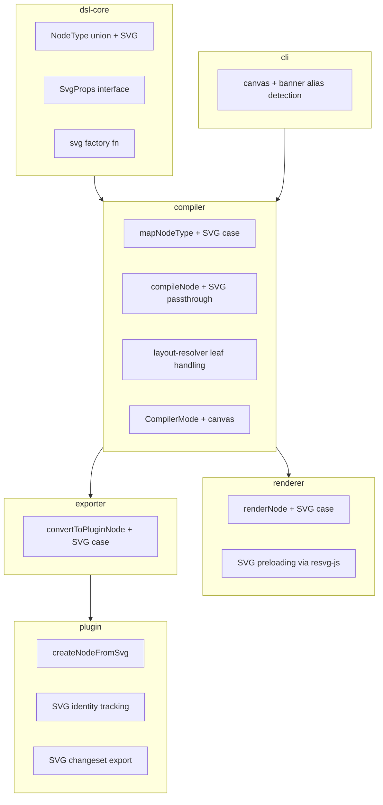
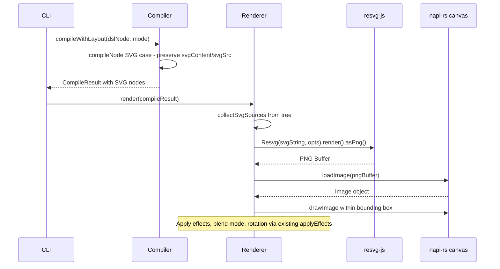
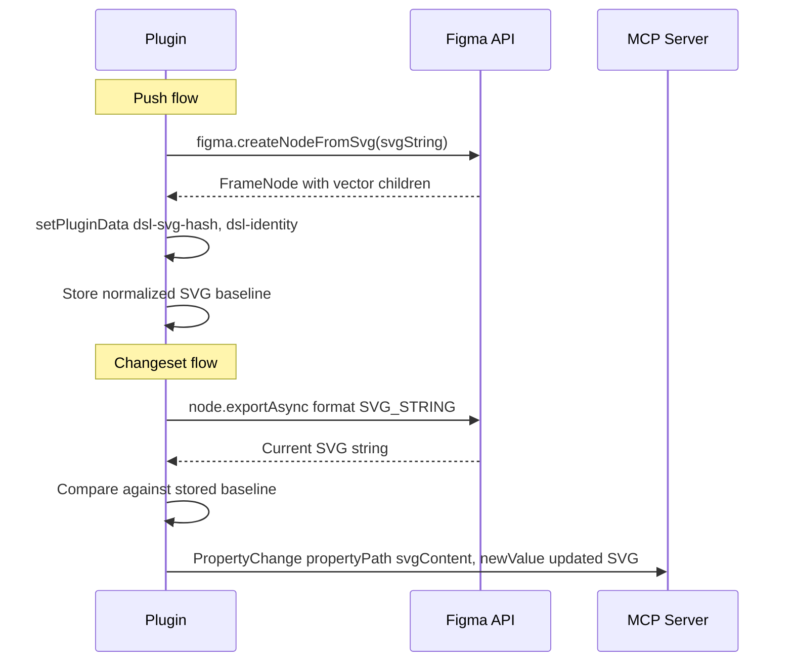

# Design Document: SVG Node Support

## Overview

**Purpose**: This feature adds SVG as a first-class node type in the DSL pipeline, enabling developers to include rich vector graphics in compositions with full visual effects, layout participation, and Figma bidirectional sync. It also renames "banner mode" to "canvas mode" to reflect its broader purpose.

**Users**: DSL authors use `svg()` in `.dsl.ts` files. The renderer rasterizes SVGs to PNG. The Figma plugin creates native vector nodes via `createNodeFromSvg()`. The MCP server relays SVG changeset data for bidirectional sync.

**Impact**: Extends the existing pipeline with a new leaf node type (SVG) following the established IMAGE node pattern. Adds `@resvg/resvg-js` as a renderer dependency. Renames the mode string from `'banner'` to `'canvas'` across all packages.

### Goals
- SVG node type with inline content and file source support
- PNG rendering via `@resvg/resvg-js` with effects, blend modes, rotation
- Figma export via `createNodeFromSvg()` with identity tracking for sync
- Canvas mode rename with backward-compatible `'banner'` alias

### Non-Goals
- SVG editing or manipulation within the DSL (SVG content is opaque)
- SVG-to-DSL conversion (decomposing SVG into FRAME/RECTANGLE/etc. nodes)
- Animated SVG support (SMIL or CSS animations)
- SVG optimization or minification

## Architecture

### Existing Architecture Analysis

The pipeline follows a strict package chain: `dsl-core` → `compiler` → `renderer` / `exporter` → `plugin`. Each node type is implemented as: type union member → props interface → factory function → compiler case → renderer case → exporter case → plugin case. The IMAGE node is the closest architectural analog to SVG — both are leaf nodes with external content, a bounding box, and visual properties.

### Architecture Pattern & Boundary Map

**Selected pattern**: Extend existing packages (Option A from gap analysis). SVG is a leaf node like IMAGE — no new packages needed.



**Existing patterns preserved**: Node type dispatch, mode threading, image preloading, plugin data identity tracking, changeset schema.

**New component rationale**: No new packages. Each existing package gains a new case for SVG, plus `@resvg/resvg-js` added to renderer dependencies.

### Technology Stack

| Layer | Choice / Version | Role in Feature | Notes |
|-------|------------------|-----------------|-------|
| SVG Rasterization | `@resvg/resvg-js` ^2.x | SVG string → PNG buffer for renderer | Rust/NAPI, zero deps, 12 ops/s. See `research.md` for benchmarks |
| Canvas Rendering | `@napi-rs/canvas` ^0.1.96 | Draws rasterized SVG PNG onto render canvas | Existing dependency, unchanged |
| Figma Plugin API | `figma.createNodeFromSvg()` | Creates native vector nodes from SVG string | Returns FrameNode wrapping vectors |
| Figma Export | `exportAsync({ format: 'SVG_STRING' })` | Extracts SVG from Figma nodes for changeset | Available since Plugin API Update 64 |

## System Flows

### SVG Render Flow



### SVG Figma Sync Flow



## Requirements Traceability

| Requirement | Summary | Components | Interfaces | Flows |
|-------------|---------|------------|------------|-------|
| 1.1–1.7 | SVG node constructor with props | dsl-core: NodeType, SvgProps, svg() | `SvgProps`, `DslNode` | — |
| 2.1–2.6 | SVG PNG rendering | renderer: renderNode SVG case, svg-loader | `SvgCache`, `renderSvgNode()` | SVG Render Flow |
| 3.1–3.4 | SVG compilation and layout | compiler: compileNode, layout-resolver | `FigmaNodeDict` SVG fields | — |
| 4.1–4.4 | SVG Figma plugin export | exporter, plugin | `PluginNodeDef` SVG fields | SVG Figma Sync Flow |
| 5.1–5.5 | SVG bidirectional sync | plugin, mcp-server | `PropertyChange`, plugin data | SVG Figma Sync Flow |
| 6.1–6.5 | Canvas mode rename | cli, compiler, dsl-core, exporter, validator | `CompilerMode` | — |
| 7.1–7.4 | SVG validator rules | validator | `svg-content` rule | — |

## Components and Interfaces

| Component | Domain/Layer | Intent | Req Coverage | Key Dependencies | Contracts |
|-----------|--------------|--------|--------------|------------------|-----------|
| SvgProps + svg() | dsl-core | SVG node type definition and factory | 1.1–1.7 | — | Service |
| compileNode SVG | compiler | SVG compilation with data passthrough | 3.1–3.4 | dsl-core (P0) | Service |
| renderSvgNode | renderer | SVG rasterization and canvas drawing | 2.1–2.6 | @resvg/resvg-js (P0), @napi-rs/canvas (P0) | Service |
| exportSvgNode | exporter | SVG plugin JSON generation | 4.1–4.2 | dsl-core (P0) | Service |
| createSvgInFigma | plugin | Figma SVG node creation and identity | 4.3–4.4, 5.1–5.4 | Figma Plugin API (P0) | Service, State |
| svgChangesetExport | plugin | SVG changeset detection and export | 5.2–5.3 | Figma Plugin API (P0) | Service |
| canvasModeRename | cli/compiler/all | Mode rename with deprecated alias | 6.1–6.5 | — | — |
| svg-content rule | validator | SVG node validation | 7.1–7.4 | dsl-core (P0) | Service |

### dsl-core Layer

#### SvgProps and svg() Factory

| Field | Detail |
|-------|--------|
| Intent | Define the SVG node type, props interface, and factory function |
| Requirements | 1.1, 1.2, 1.3, 1.4, 1.5, 1.6, 1.7 |

**Responsibilities & Constraints**
- Add `'SVG'` to the `NodeType` union
- Define `SvgProps` interface with `svgContent`, `src`, `size`, and visual properties
- Implement `svg(name, props)` factory returning a `DslNode` of type `'SVG'`
- Validate that at least one of `svgContent` or `src` is provided at construction time

**Contracts**: Service [x]

##### Service Interface

```typescript
// Addition to NodeType union (types.ts)
export type NodeType = 'FRAME' | 'TEXT' | 'RECTANGLE' | 'ELLIPSE' | 'GROUP'
  | 'COMPONENT' | 'COMPONENT_SET' | 'INSTANCE' | 'IMAGE'
  | 'LINE' | 'SECTION' | 'POLYGON' | 'STAR' | 'BOOLEAN_OPERATION'
  | 'SVG';

// New interface (types.ts)
export interface SvgProps {
  svgContent?: string;
  src?: string;
  size: { x: number; y: number };
  cornerRadius?: number;
  clipContent?: boolean;
  opacity?: number;
  visible?: boolean;
  x?: number;
  y?: number;
  rotation?: number;
  effects?: EffectDefinition[];
  blendMode?: BlendMode;
  layoutSizingHorizontal?: 'FIXED' | 'HUG' | 'FILL';
  layoutSizingVertical?: 'FIXED' | 'HUG' | 'FILL';
}

// New DslNode fields (types.ts, added to DslNode interface)
// svgContent?: string;
// svgSrc?: string;

// Factory function (nodes.ts)
export function svg(name: string, props: SvgProps): DslNode;
```
- Preconditions: `name` is non-empty; at least one of `svgContent` or `src` is provided
- Postconditions: Returns a valid `DslNode` with `type: 'SVG'`
- Invariants: `svgContent` and `svgSrc` are mutually preferred (svgContent takes precedence if both provided)

**Implementation Notes**
- Follow the `image()` factory pattern exactly (lines 180–197 in nodes.ts)
- Store `svgContent` and `svgSrc` as separate fields on `DslNode` (parallel to `imageSrc`)
- Export `svg` and `SvgProps` from `index.ts`

### compiler Layer

#### compileNode SVG Case

| Field | Detail |
|-------|--------|
| Intent | Compile SVG nodes with data passthrough and layout resolution |
| Requirements | 3.1, 3.2, 3.3, 3.4 |

**Responsibilities & Constraints**
- Add `'SVG'` case to `mapNodeType()` — direct pass-through
- Add SVG data passthrough in `compileNode()` — preserve `svgContent` and `svgSrc`
- Resolve relative `svgSrc` paths against asset directory (same as IMAGE `imageSrc` resolution)
- SVG nodes are leaf nodes in layout resolver — use explicit size only, like IMAGE
- In canvas mode, position via absolute `x`/`y`; in standard mode, participate in auto-layout

**Contracts**: Service [x]

##### Service Interface

```typescript
// Addition to FigmaNodeDict (compiler/src/types.ts)
// svgContent?: string;
// svgSrc?: string;

// CompilerMode update
export type CompilerMode = 'standard' | 'canvas';
// 'banner' accepted at CLI entry, normalized to 'canvas'
```
- Preconditions: SVG node has valid `svgContent` or `svgSrc`
- Postconditions: Compiled node includes SVG data; layout resolver assigns correct position
- Invariants: If `svgSrc` is relative, it is resolved before inclusion in compiled output

**Implementation Notes**
- Validation: emit compile error if neither `svgContent` nor `svgSrc` present (parallel to IMAGE `imageSrc` validation)
- If both `svgContent` and `svgSrc` are present, emit warning, use `svgContent` (req 1.4)
- Banner mode properties (effects, blendMode, rotation) already handled generically — SVG nodes benefit automatically

### renderer Layer

#### renderSvgNode

| Field | Detail |
|-------|--------|
| Intent | Rasterize SVG content to PNG and draw on canvas |
| Requirements | 2.1, 2.2, 2.3, 2.4, 2.5, 2.6 |

**Responsibilities & Constraints**
- Preload SVG content during image preloading phase → rasterize via `@resvg/resvg-js` → store as `Image` in cache
- Add `'SVG'` case in `renderNode()` switch — draw cached image within bounding box
- Effects, blend mode, and rotation are applied by the existing generic infrastructure (lines 495–501 in renderer.ts)
- On SVG parse/load failure, draw placeholder and log diagnostic (same pattern as IMAGE placeholder)

**Dependencies**
- External: `@resvg/resvg-js` ^2.x — SVG string → PNG buffer rasterization (P0)
- Inbound: `@napi-rs/canvas` — `loadImage(pngBuffer)` to create drawable Image (P0)
- Inbound: `@figma-dsl/compiler` — compiled FigmaNodeDict with SVG data (P0)

**Contracts**: Service [x]

##### Service Interface

```typescript
// New type (renderer/src/svg-loader.ts or image-loader.ts extension)
export type SvgCache = ReadonlyMap<string, Image>;

// Preload function
export async function preloadSvgContent(
  nodes: ReadonlyArray<FigmaNodeDict>,
  assetDir: string,
): Promise<SvgCache>;

// Rasterization (internal)
// Uses: new Resvg(svgString, { fitTo: { mode: 'width', value: width } }).render().asPng()
// Then: loadImage(pngBuffer) → Image
```
- Preconditions: SVG content is a valid SVG string or file path resolves to valid SVG
- Postconditions: Cache contains `Image` objects keyed by SVG content hash or source path
- Invariants: Failed SVGs produce a logged warning and are absent from cache (renderer draws placeholder)

**Implementation Notes**
- Add `@resvg/resvg-js` to `packages/renderer/package.json` dependencies
- SVG preloading can extend or parallel the existing `preloadImages()` in image-loader.ts
- Rasterization target size comes from the node's `size.x` and `size.y` for pixel-accurate output
- Cache key: use `svgSrc` for file-based SVGs, content hash for inline SVGs

### exporter Layer

#### exportSvgNode

| Field | Detail |
|-------|--------|
| Intent | Include SVG data in Figma plugin JSON output |
| Requirements | 4.1, 4.2 |

**Responsibilities & Constraints**
- Add SVG case in `convertToPluginNode()` — include `svgContent` or read `svgSrc` file content
- Preserve all visual properties (effects, blend mode, rotation, opacity) — already handled generically
- Embed SVG content as string in plugin JSON (no base64 encoding needed — SVG is text)

**Contracts**: Service [x]

##### Service Interface

```typescript
// PluginNodeDef extension (dsl-core/src/plugin-types.ts)
// readonly svgContent?: string;
```
- Preconditions: Compiled node has SVG data
- Postconditions: Plugin JSON node includes `svgContent` as a string field

### plugin Layer

#### createSvgInFigma

| Field | Detail |
|-------|--------|
| Intent | Create native Figma vector nodes from SVG and track identity |
| Requirements | 4.3, 4.4, 5.1 |

**Responsibilities & Constraints**
- Add `'SVG'` case in `createNode()` switch — call `figma.createNodeFromSvg(svgContent)`
- The returned `FrameNode` wraps native vector nodes — resize to match declared `size`
- Store plugin data: `dsl-svg-hash` (content hash of original SVG), `dsl-svg-baseline` (Figma-normalized SVG via `exportAsync({ format: 'SVG_STRING' })`)
- Apply `dsl-identity` for standard sync tracking

**Dependencies**
- External: Figma Plugin API `createNodeFromSvg()` (P0)
- External: Figma Plugin API `exportAsync({ format: 'SVG_STRING' })` (P0)

**Contracts**: Service [x] / State [x]

##### Service Interface

```typescript
// In createNode() switch (plugin/src/code.ts)
case 'SVG': {
  // figma.createNodeFromSvg(def.svgContent) → FrameNode
  // Resize to def.size
  // Apply visual properties (opacity, visible, cornerRadius)
  // Store plugin data for identity and baseline
}
```

##### State Management
- `dsl-svg-hash`: SHA-256 hash of original SVG content string
- `dsl-svg-baseline`: Figma-normalized SVG string (captured via `exportAsync` after creation)
- `dsl-identity`: Standard identity object (component name, DSL path, timestamp, node ID)
- Persistence: Figma plugin data API (`setPluginData`/`getPluginData`)

#### svgChangesetExport

| Field | Detail |
|-------|--------|
| Intent | Detect SVG modifications in Figma and export as changeset entries |
| Requirements | 5.2, 5.3, 5.4, 5.5 |

**Responsibilities & Constraints**
- During changeset export, check SVG-tagged nodes for modifications
- Export current SVG via `exportAsync({ format: 'SVG_STRING' })`
- Compare against stored `dsl-svg-baseline`
- If different, emit `PropertyChange` with `propertyPath: 'svgContent'`, `newValue: currentSvg`

**Contracts**: Service [x]

##### Service Interface

```typescript
// PropertyChange for SVG (uses existing schema)
{
  propertyPath: 'svgContent',
  changeType: 'modified',
  oldValue: undefined, // baseline stored in plugin data, not in changeset
  newValue: '<svg>...updated SVG...</svg>',
  description: 'SVG content modified in Figma',
}
```
- Preconditions: Node has `dsl-svg-baseline` plugin data
- Postconditions: Changeset includes SVG content change if node was modified
- Invariants: Unmodified SVG nodes produce no changeset entry

### cli Layer

#### canvasModeRename

| Field | Detail |
|-------|--------|
| Intent | Accept 'canvas' as primary mode, 'banner' as deprecated alias |
| Requirements | 6.1, 6.2, 6.3, 6.4 |

**Implementation Notes**
- Mode detection in `loadDslModule()`: accept both `'canvas'` and `'banner'`
- Normalize `'banner'` → `'canvas'` with deprecation warning: `"Warning: mode 'banner' is deprecated. Use 'canvas' instead."`
- All internal pipeline uses `'canvas'` only
- Update `CompilerMode` type: `'standard' | 'canvas'`
- Update `PluginInput.mode`: `'standard' | 'canvas'`
- Update `ValidationPreset`: rename `'banner'` preset to `'canvas'`
- Update all user-facing log messages, help text, and documentation

### validator Layer

#### svg-content Rule

| Field | Detail |
|-------|--------|
| Intent | Validate SVG nodes for content presence and mode-appropriate properties |
| Requirements | 7.1, 7.2, 7.3, 7.4 |

**Contracts**: Service [x]

##### Service Interface

```typescript
// New rule file: validator/src/rules/svg-content.ts
// Rule ID: 'svg-content'
// Checks:
// 1. SVG node has svgContent or src (error if neither)
// 2. SVG node src file exists (warning if missing)
// 3. SVG node uses effects/rotation in standard mode (warning)
// 4. All SVG properties allowed in canvas mode (no warnings)
```

**Implementation Notes**
- Follow existing rule file pattern (e.g., `dsl-compatible-layout.ts`)
- Add `'svg-content'` to presets: `'canvas'` preset → `'off'`, other presets → `'error'`/`'warning'` as appropriate

## Data Models

### Domain Model

**SVG Node** is a value object within the DSL node tree:
- `svgContent: string | undefined` — inline SVG markup
- `svgSrc: string | undefined` — file path or URL to external SVG
- Invariant: at least one must be defined

**SVG Identity** (plugin-side, stored as plugin data):
- `dsl-svg-hash: string` — SHA-256 of original SVG content
- `dsl-svg-baseline: string` — Figma-normalized SVG (post-createNodeFromSvg export)

### Data Contracts & Integration

**Plugin JSON Extension** (PluginNodeDef):
```typescript
{
  type: 'SVG',
  name: string,
  size: { x: number, y: number },
  svgContent: string,       // Full SVG markup
  opacity?: number,
  visible?: boolean,
  cornerRadius?: number,
  effects?: EffectDefinition[],
  blendMode?: BlendMode,
  rotation?: number,
}
```

**Changeset SVG Entry** (uses existing PropertyChange):
```typescript
{
  propertyPath: 'svgContent',
  changeType: 'modified',
  newValue: '<svg>...</svg>',  // Figma-exported SVG string
  description: 'SVG content modified in Figma',
}
```

## Error Handling

### Error Categories and Responses

**User Errors**:
- Missing SVG content: `svg()` factory throws `"SVG node must have svgContent or src"` → developer fixes DSL file
- Invalid SVG markup: Renderer logs warning, draws placeholder → developer checks SVG validity
- Missing SVG file: Validator emits warning for non-existent `src` → developer checks file path

**System Errors**:
- `@resvg/resvg-js` parse failure: Renderer catches error, logs diagnostic with SVG source, draws placeholder rectangle
- Figma `createNodeFromSvg()` failure: Plugin logs error, skips SVG node, continues with remaining nodes
- `exportAsync` failure during changeset: Plugin logs warning, omits SVG from changeset

## Testing Strategy

### Unit Tests
- `svg()` factory: validates name, requires svgContent or src, sets defaults, handles both sources
- `compileNode` SVG case: preserves svgContent/svgSrc, resolves relative paths, emits warning for dual source
- `svg-content` validator rule: error on missing content, warning on missing file, mode-aware checks
- Mode rename: CompilerMode accepts 'canvas', CLI normalizes 'banner' to 'canvas'

### Integration Tests
- Full pipeline: SVG DSL file → compile → render → PNG output with SVG content visible
- Exporter: SVG node → plugin JSON with svgContent preserved
- Changeset: SVG modifications detected and exported as PropertyChange entries

### E2E Tests
- Plugin: `createNodeFromSvg()` creates valid Figma nodes with correct size and identity
- Round-trip: push SVG → modify in Figma → pull changeset → verify svgContent change captured
