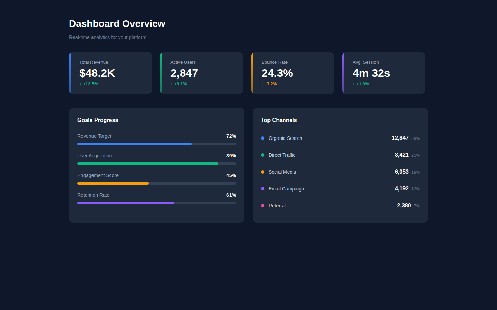
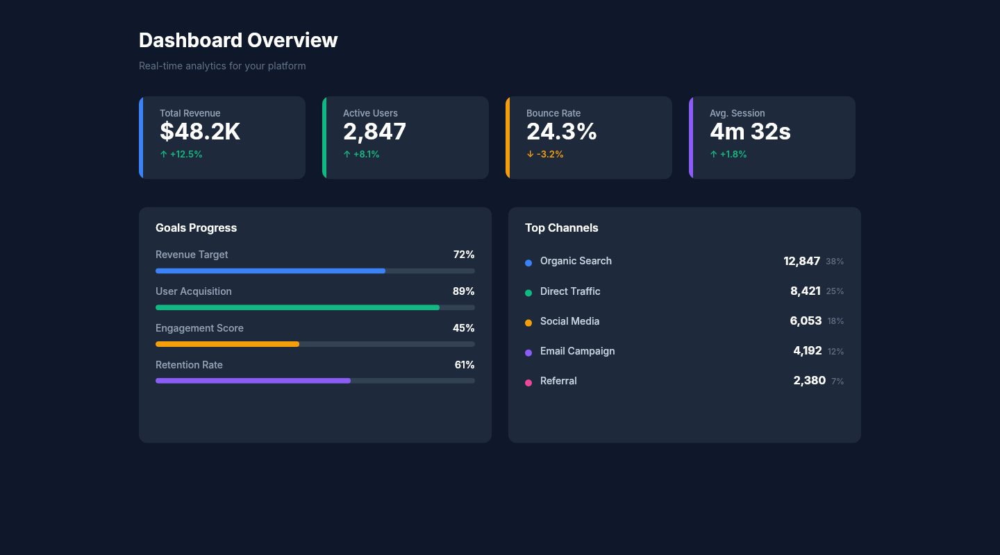

# Dogfooding: Analytics Dashboard
> Date: 2026-03-14 | Iteration: 2 of 3

## Theme
**Analytics Dashboard** — Dark slate background with blue, emerald, amber, and violet accents for a data analytics UI
DSL features stressed: FILL sizing, SPACE_BETWEEN alignment, gradient fills (accent bars), ellipse nodes (dots), mixed H+V auto-layout, clipContent, opacity

## Components created
- `StatCard` — Stat card with gradient accent bar, label, value, and trend indicator (reused from prior session)
- `ProgressBar` — Label + percentage header with colored fill bar on gray track (reused from prior session)
- `MetricRow` — Metric row with colored dot, label, value, and sub-value using SPACE_BETWEEN (reused from prior session)

## Renders

### Browser (React)

### DSL Pipeline

## Comparison

| Area | Match? | Issue | Type | Fixed? |
|---|---|---|---|---|
| Page background | YES | — | — | — |
| Stat card gradient accent bars | YES | — | — | — |
| Stat card FILL sizing | YES | — | — | — |
| Progress bar SPACE_BETWEEN | YES | — | — | — |
| Progress bar fills (proportional) | YES | — | — | — |
| Metric row SPACE_BETWEEN | YES | — | — | — |
| Ellipse dots (colored circles) | YES | — | — | — |
| Two-column horizontal layout | YES | — | — | — |
| Text colors and sizes | YES | — | — | — |

## Pipeline fixes
- None needed — all tested features rendered correctly.

## Known pipeline gaps (not fixed)
- None discovered in this iteration.

## Commits
- (pending — will be committed with other iterations)
