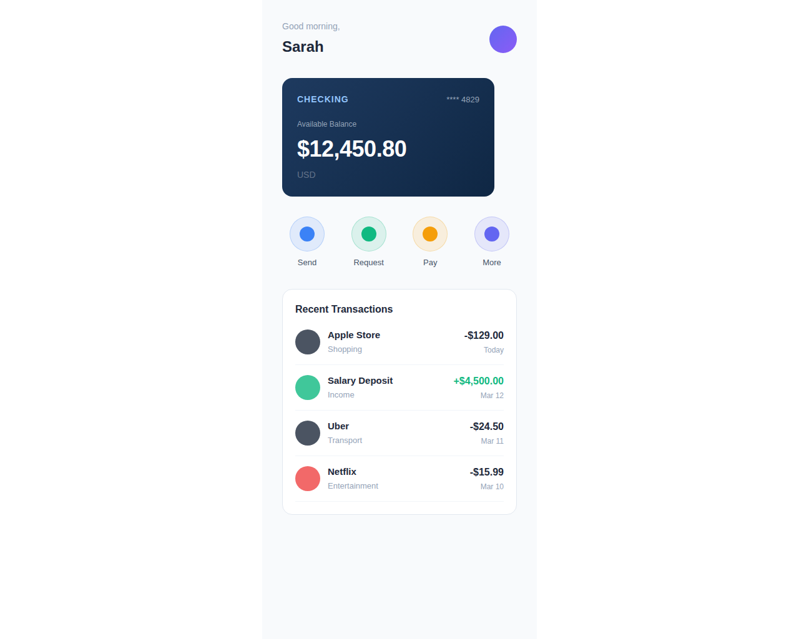
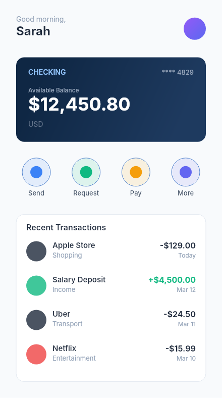

# Dogfooding: Banking App
> Date: 2026-03-14 | Iteration: 3 of 3

## Theme
**Banking App** — Mobile finance UI with precise sizing, ellipse shapes, and subtle fills
DSL features stressed: ellipse, gradient, opacity, SPACE_BETWEEN, FILL sizing (nested), strokes, cornerRadius, precise fixed sizing

## Components created
- `AccountCard` — Bank account card with gradient background, type label, balance display
- `TransactionRow` — Transaction entry with icon circle, merchant info, amount, and date
- `QuickAction` — Circular icon button with label for quick banking actions

## Renders

### Browser (React)

### DSL Pipeline

## Comparison

| Area | Match? | Issue | Type | Fixed? |
|---|---|---|---|---|
| Header greeting + avatar | YES | — | — | — |
| Account card gradient | YES | — | — | — |
| Quick action circles | YES | — | — | — |
| Transaction rows | YES | — | — | — |
| Ellipse shapes | YES | — | — | — |
| Opacity on icons | YES | — | — | — |
| SPACE_BETWEEN alignment | YES | — | — | — |
| FILL sizing (nested) | YES | Benefited from iteration 2 pipeline fix | — | — |

## Pipeline fixes
- None needed — all features rendered correctly (including the FILL fix from iteration 2)

## Commits
- (committed with iteration)
