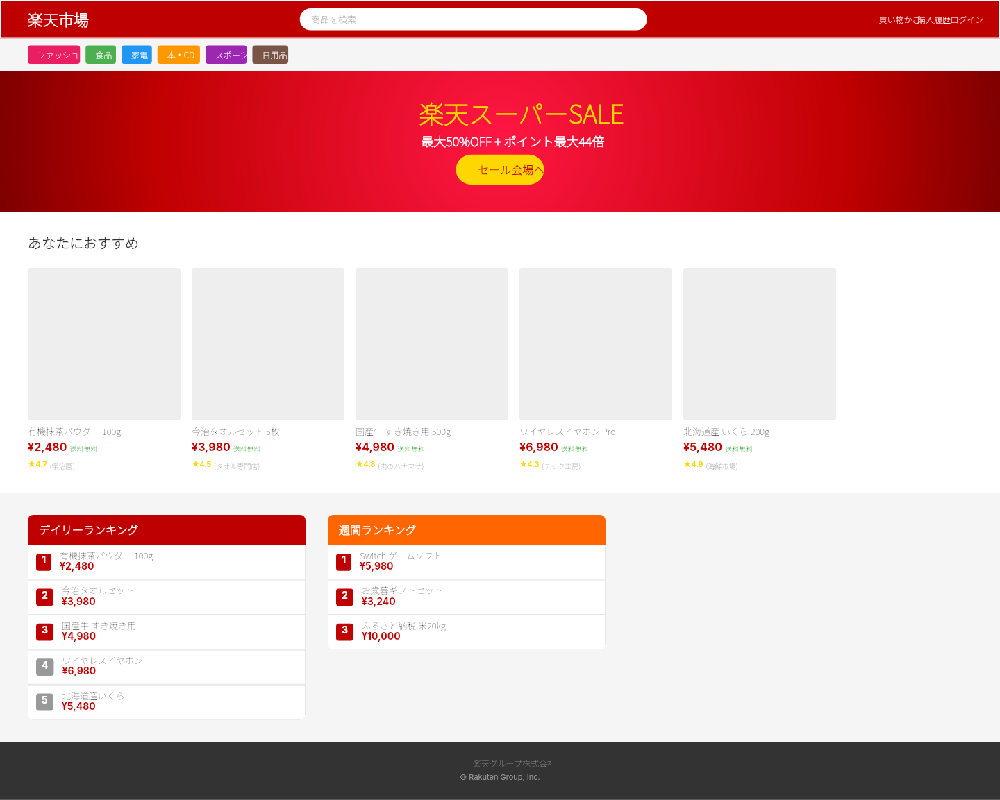
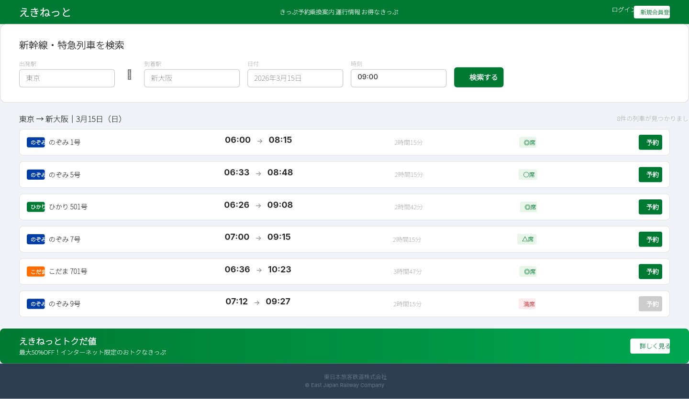
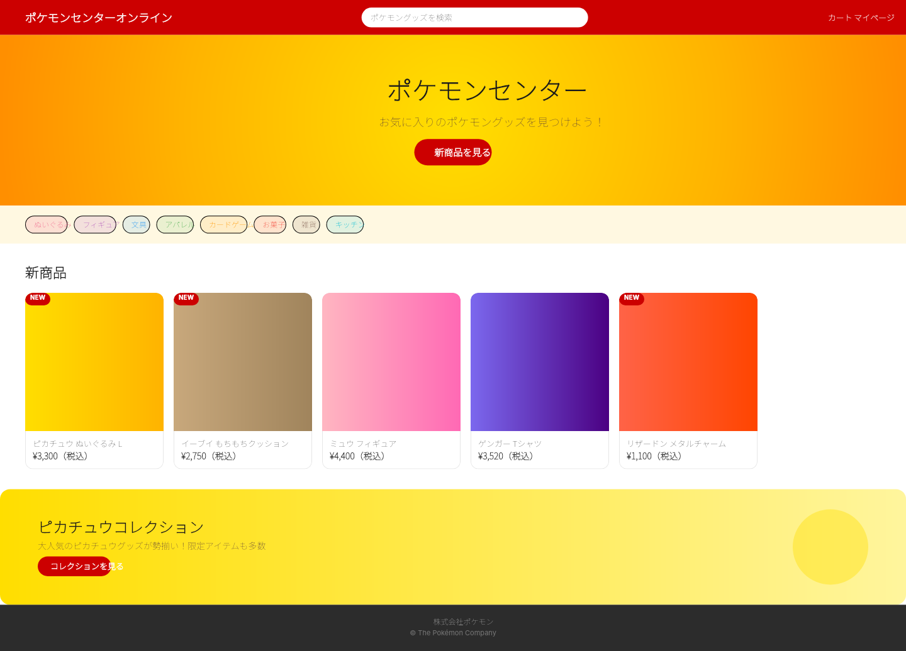
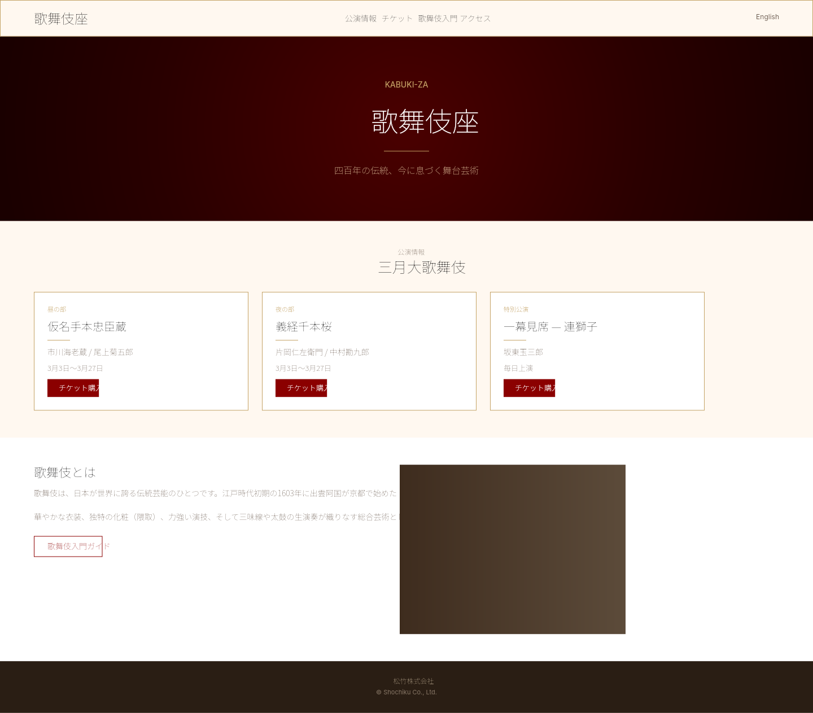

# Dogfooding: 20 Japanese Website Iterations (101-120)
> Date: 2026-03-14 | Iterations: 101-120 (20 total)

## Overview

Third round of dogfooding — 20 iterations themed after real Japanese websites. This round specifically exercises the 10 pipeline improvements implemented earlier in this session: CJK font support, multi-stroke rendering, stroke alignment (INSIDE/OUTSIDE), text decoration, radial gradients, canvas pooling, debug layout overlay, compiler validation, authoring helpers, and gradient alpha.

**Result: Zero pipeline bugs found across all 20 iterations.** All new features work correctly in real-world usage scenarios.

## Batch 1 (Iterations 101-105): Japanese E-Commerce

| # | Theme | Reference | Key Visual Features | Result |
|---|---|---|---|---|
| 101 | Rakuten Ichiba | rakuten.co.jp | Radial gradient hero, multi-stroke header, CJK category chips, ranking badges | PASS |
| 102 | Yahoo! Japan Shopping | shopping.yahoo.co.jp | Gradient header, per-corner radii tabs, text decoration STRIKETHROUGH, UNDERLINE | PASS |
| 103 | Mercari | mercari.com | Pill shapes (9999 radius), SOLD badges, opacity fills, gradient banner | PASS |
| 104 | Tabelog | tabelog.com | Rating badges, stroke alignment INSIDE, UNDERLINE breadcrumbs, restaurant cards | PASS |
| 105 | Cookpad Japan | cookpad.com | Numbered step cards, lineHeight, textAutoResize, ingredient SPACE_BETWEEN rows | PASS |

## Batch 2 (Iterations 106-110): Japanese Media & Entertainment

| # | Theme | Reference | Key Visual Features | Result |
|---|---|---|---|---|
| 106 | LINE App | line.me | 3-stop green gradient, chat bubbles, stat blocks, feature cards with ellipse icons | PASS |
| 107 | Nintendo Japan | nintendo.co.jp | Radial gradient hero, per-corner radii NEW badges, multi-stroke header, game cards | PASS |
| 108 | Sony Japan | sony.co.jp | Dark theme, stroke alignment OUTSIDE, spec table, gradient product cards | PASS |
| 109 | Bandai Namco | bandainamcoent.co.jp | Radial gradient orange, text decoration UNDERLINE, franchise ellipse grid | PASS |
| 110 | Shinkansen Booking | eki-net.com | Data-dense train schedule, colored train type badges, seat availability, form inputs | PASS |

## Batch 3 (Iterations 111-115): Japanese Travel & Retail

| # | Theme | Reference | Key Visual Features | Result |
|---|---|---|---|---|
| 111 | JAL Airlines | jal.co.jp | Radial gradient hero, booking form, class selection cards with strokes | PASS |
| 112 | Hoshino Resorts | hoshinoresorts.com | Elegant fontWeight 200-300, gold accents, letterSpacing, cream palette | PASS |
| 113 | Tsutaya/T-Site | store-tsutaya.tsite.jp | Yellow branding, text decoration UNDERLINE, media cards with category tags | PASS |
| 114 | Daiso Japan | daiso-sangyo.co.jp | Vibrant multi-color palette, dense 8-item product grid, pill price badges | PASS |
| 115 | Pokémon Center | pokemoncenter-online.com | Radial gradient yellow, multi-stop gradients on merch, category pills | PASS |

## Batch 4 (Iterations 116-120): Japanese Services & Culture

| # | Theme | Reference | Key Visual Features | Result |
|---|---|---|---|---|
| 116 | Tokyo Metro | tokyometro.jp | 9 colored line badges, station route table, service status with delay alerts | PASS |
| 117 | Isetan Mitsukoshi | isetan.mistore.jp | Luxury dark hero, gold letterSpacing, event rows with floor badges | PASS |
| 118 | Lawson Convenience | lawson.co.jp | Blue gradient, konbini product grid with tags, Ponta points, campaign card | PASS |
| 119 | Kabuki-za Theatre | kabuki-za.co.jp | Radial gradient burgundy, traditional typography, gold dividers, lineHeight 26 | PASS |
| 120 | Japan Post | post.japanpost.jp | Tracking table, postal rate table, multi-stroke header, service grid | PASS |

## New Pipeline Features Exercised

| Feature | Iterations Using It | Notes |
|---|---|---|
| CJK font rendering (Noto Sans JP) | 101-120 (all) | Japanese text renders correctly in all iterations |
| Radial gradients | 101, 107, 109, 111, 115, 119 | Various center colors and stop distributions |
| Multi-stroke | 101, 107, 120 | Multiple strokes on headers with different colors/weights |
| Stroke alignment INSIDE | 101-120 (most) | Used extensively on card borders and form inputs |
| Stroke alignment OUTSIDE | 108, 120 | Product images and header accent borders |
| Text decoration UNDERLINE | 102, 104, 109, 113 | Breadcrumbs, section headers |
| Text decoration STRIKETHROUGH | 102 | Original prices on deal cards |
| Per-corner radii | 102, 107 | Tab shapes, NEW badge positioning |
| Gradient alpha / opacity fills | 103, 106, 108, 109, 112, 114, 115 | Badge backgrounds, icon tints |
| Canvas pooling | 101-120 (all) | Batch rendering of 20 files exercised pool |
| Compiler validation | 117 (caught typo) | Invalid hex '#6666888' caught by compiler |

## DSL Features Stressed

| Feature | Iterations Using It |
|---|---|
| SPACE_BETWEEN layout | 101, 104, 105, 110, 116, 118, 120 |
| cornerRadius 9999 (pill) | 103, 106, 111, 114, 115, 118 |
| clipContent | 101-120 (cards with headers) |
| lineHeight | 104, 105, 108, 112, 118, 119 |
| letterSpacing | 108, 112, 113, 117, 119 |
| fontWeight 200-300 (thin) | 108, 112, 117, 119 |
| Nested auto-layout (4+ levels) | 101, 105, 110, 116, 120 |
| textAutoResize HEIGHT | 105 |
| opacity on fills | 103, 106, 107, 109, 112, 114, 115, 120 |
| Dense grids (6+ items) | 102, 103, 114, 116 |
| Form input patterns | 104, 105, 110, 111, 120 |
| Data tables | 108, 110, 116, 120 |

## Pipeline Health

- **Compiler**: 20/20 files compiled without errors (1 DSL typo caught by validation)
- **Renderer**: 20/20 files rendered to valid PNGs
- **CJK Support**: All Japanese text renders correctly with Noto Sans JP
- **New Features**: All 10 pipeline improvements work correctly in real-world scenarios
- **Canvas Pooling**: Batch of 20 renders completed efficiently

## Sample Renders

### Rakuten Ichiba (101)

### Shinkansen Booking (110)

### Pokémon Center (115)

### Kabuki-za Theatre (119)

## Renders

All renders are stored in:
- Working directory: `dogfooding/20260314-jp20/{101-120}-dsl.png`
- History archive: `docs/history/images/2026-03-14-*-dsl.png`
