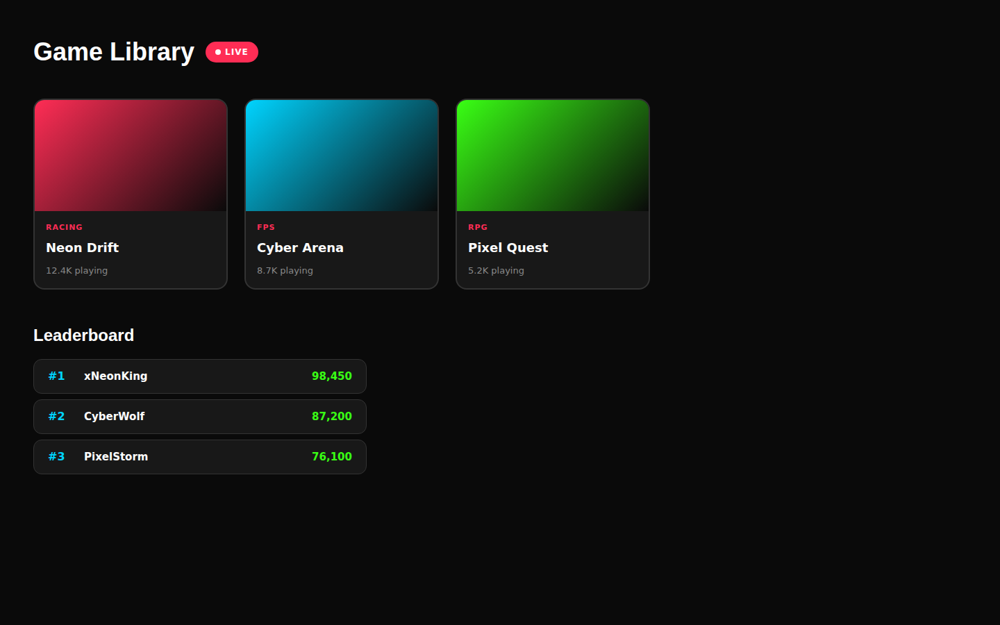
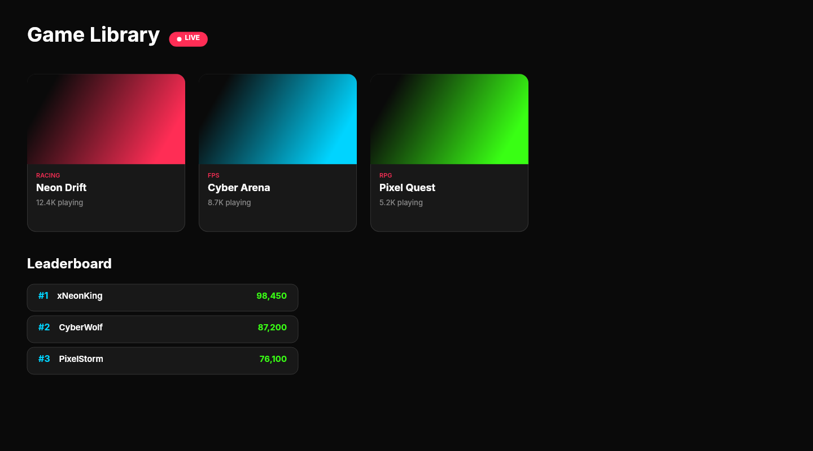

# Dogfooding: Neon Gaming
> Date: 2026-03-14 | Iteration: 1 of 3

## Theme
**Neon Gaming** — Dark background with neon pink, electric blue, and neon green accents for a gaming UI
DSL features stressed: gradient fills, gradient angles (135deg), thick strokes (2px), high cornerRadius (16px, 9999px pill), clipContent, ellipse nodes, horizontal auto-layout

## Components created
- `GameCard` — Game card with gradient image placeholder, genre label, title, and player count
- `LiveBadge` — Red pill badge with white dot and "LIVE" text
- `LeaderboardRow` — Horizontal row with rank, username, and score in neon colors

## Renders

### Browser (React)

### DSL Pipeline

## Comparison

| Area | Match? | Issue | Type | Fixed? |
|---|---|---|---|---|
| Page background | YES | — | — | — |
| Header layout | YES | — | — | — |
| LIVE badge (pill shape, ellipse dot) | YES | — | — | — |
| Card gradient fills (135deg) | YES | — | — | — |
| Card corners (16px) | YES | — | — | — |
| Card strokes (2px border) | YES | — | — | — |
| clipContent (image clipped to rounded corners) | YES | — | — | — |
| Text colors and sizes | YES | — | — | — |
| Leaderboard rows with strokes | YES | — | — | — |

## Pipeline fixes
- None needed — all tested features rendered correctly.

## Known pipeline gaps (not fixed)
- None discovered in this iteration.

## Commits
- (pending — will be committed with other iterations)
