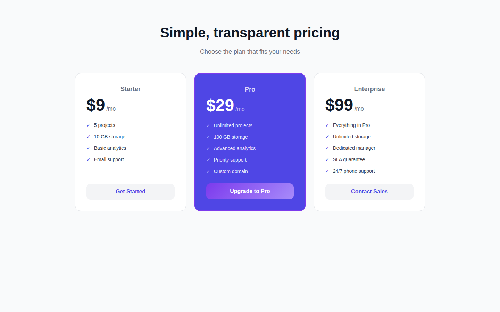
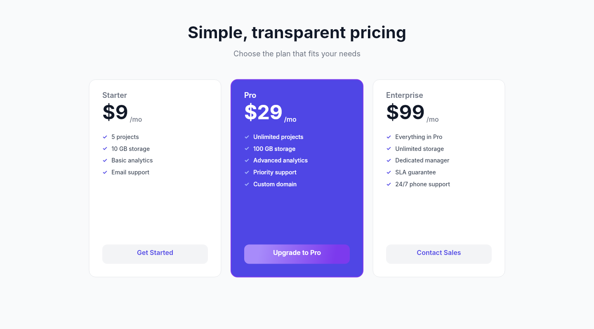

# Dogfooding: SaaS Pricing
> Date: 2026-03-14 | Iteration: 3 of 3

## Theme
**SaaS Pricing** — Light background with indigo/violet accents for a pricing comparison page
DSL features stressed: equal-width columns, vertical auto-layout with FILL sizing, gradient CTA buttons, strokes (1px deselected / 2px highlighted), cornerRadius (16px cards / 12px buttons), 8-digit hex colors for semi-transparent text

## Components created
- `PricingTier` — Pricing tier card with name, price, feature list, and CTA button; supports highlighted (indigo) variant

## Renders

### Browser (React)

### DSL Pipeline

## Comparison

| Area | Match? | Issue | Type | Fixed? |
|---|---|---|---|---|
| Page background (#f9fafb) | YES | — | — | — |
| Title/subtitle centering | YES | — | — | — |
| 3-column card layout | YES | — | — | — |
| Starter card (white, 1px border) | YES | — | — | — |
| Pro card (indigo, 2px violet border) | YES | — | — | — |
| Pro semi-transparent text (#ffffffcc, #ffffff99) | YES | Required 8-digit hex support | Pipeline | YES |
| Gradient CTA button | YES | — | — | — |
| Default CTA button (gray bg) | YES | — | — | — |
| Feature checkmarks with colors | YES | — | — | — |
| FILL sizing on features list | YES | — | — | — |
| cornerRadius (16px cards, 12px buttons) | YES | — | — | — |

## Pipeline fixes
- **8-digit hex color support**: `hex()` only accepted 6-digit hex (`#rrggbb`), rejecting 8-digit (`#rrggbbaa`). Fixed regex pattern and alpha parsing in `packages/dsl-core/src/colors.ts`. Also updated `solid()` to extract opacity from 8-digit hex alpha, and `text()` factory to propagate alpha into fill opacity. (files: `packages/dsl-core/src/colors.ts`, `packages/dsl-core/src/nodes.ts`, `packages/dsl-core/src/colors.test.ts`)

## Known pipeline gaps (not fixed)
- None discovered in this iteration.

## Commits
- (pending)
