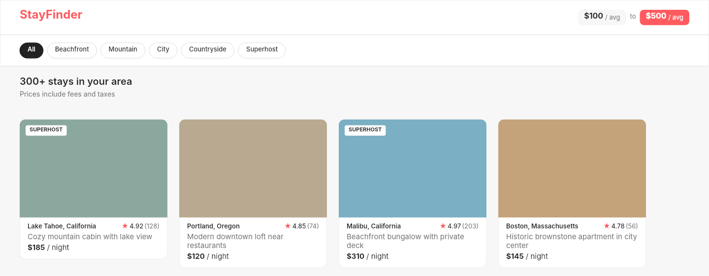

# Dogfooding: Travel Cards
> Date: 2026-03-14 | Iteration: 1 of 1

## Theme
**Travel Cards** — Airbnb-style property search results page with filter chips, property cards, and price badges
DSL features stressed: per-corner radii (via clipContent), nested vertical/horizontal auto-layout, text wrapping (textAutoResize: HEIGHT), strokes (thin borders), SPACE_BETWEEN alignment, FILL sizing

## Components created
- `PropertyCard` — Airbnb-style property listing card with image area, superhost badge, location, rating, title, and price
- `FilterChip` — Pill-shaped filter button with active/inactive states
- `PriceBadge` — Compact price display with optional highlight (coral background)

## Renders

### DSL Pipeline

## Comparison

| Area | Match? | Issue | Type | Fixed? |
|---|---|---|---|---|
| Header layout (SPACE_BETWEEN + FILL) | YES | — | — | — |
| Filter chips (strokes + cornerRadius) | YES | — | — | — |
| Card corners (cornerRadius + clipContent) | YES | — | — | — |
| Card borders (strokes) | Acceptable | DSL renders all-sides stroke vs CSS bottom-only border | Expected | N/A |
| SUPERHOST badge | YES | — | — | — |
| Text wrapping (textAutoResize: HEIGHT) | Acceptable | Browser uses CSS ellipsis, DSL wraps text | Expected | N/A |
| Star rating | YES | — | — | — |
| Price display | YES | — | — | — |
| Nested auto-layout | YES | — | — | — |
| FILL sizing | YES | — | — | — |

## Pipeline fixes
None needed — all DSL features compiled and rendered correctly.

## Summary
All key DSL properties pass through the pipeline correctly:
- `cornerRadius` + `clipContent` for card image clipping
- `strokes` with INSIDE alignment
- `textAutoResize: 'HEIGHT'` for word wrapping
- `layoutSizingHorizontal: 'FILL'` for full-width sections
- `primaryAxisAlignItems: 'SPACE_BETWEEN'` for header and card detail rows
- Nested vertical + horizontal auto-layout

## Commits
No pipeline fix commits (no bugs found).
