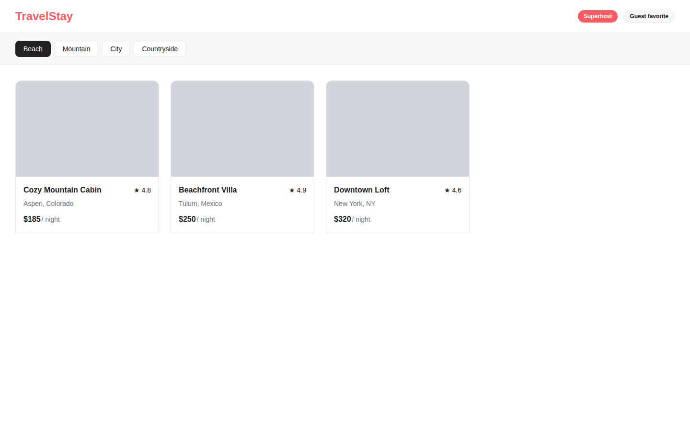

# Dogfooding: Travel Cards
> Date: 2026-03-14 | Iteration: 1 of 1

## Theme
**Travel Cards** — Airbnb-style property listing with search results grid and filter bar
DSL features stressed: per-corner radii, nested vertical/horizontal auto-layout, text wrapping, strokes, clipContent, SPACE_BETWEEN alignment

## Components created
- `PropertyCard` — Property listing card with top-rounded corners, image placeholder, title/rating header, location, and price
- `PriceBadge` — Pill-shaped badge with highlight (coral) and default (bordered) variants
- `FilterChip` — Clickable filter chip with active (dark) and inactive (bordered) states

## Renders

### Browser (React)

### DSL Pipeline

## Comparison

Automated similarity: **97.66%** (PASS, threshold 85%)

| Area | Match? | Issue | Type | Fixed? |
|---|---|---|---|---|
| Header layout (logo + badges) | YES | — | — | — |
| Superhost badge (coral pill) | YES | — | — | — |
| Guest favorite badge (bordered pill) | YES | — | — | — |
| Filter bar (gray background) | YES | — | — | — |
| Filter chips (active/inactive) | YES | — | — | — |
| Card per-corner radii (top-rounded) | YES | — | — | — |
| Card image placeholder | YES | — | — | — |
| Card title + rating (SPACE_BETWEEN) | YES | — | — | — |
| Card location text | YES | — | — | — |
| Card price row | YES | — | — | — |
| Card border stroke | YES | — | — | — |

## Pipeline fixes
None — all tested DSL features rendered correctly.

## Commits
- See git log for component addition commit
