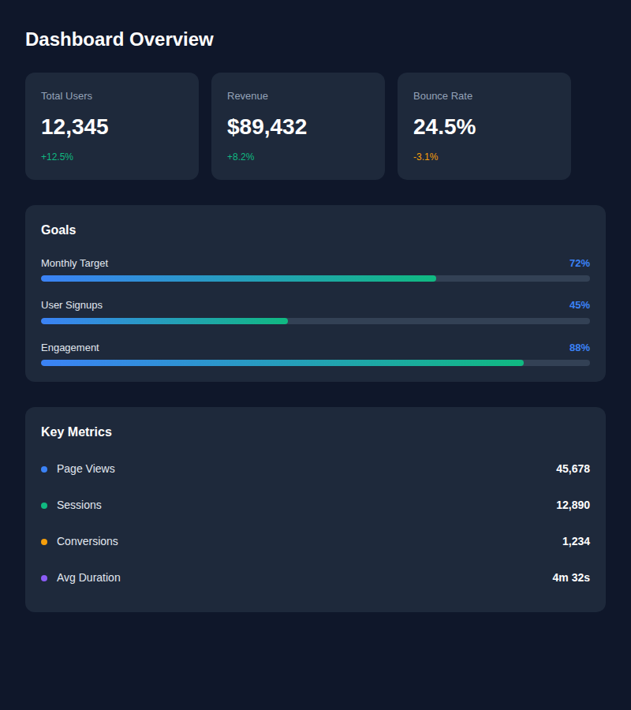
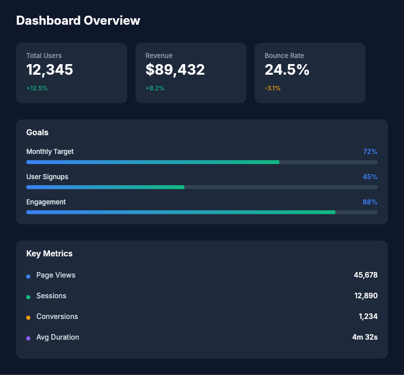

# Dogfooding: Analytics Dashboard
> Date: 2026-03-15 | Iteration: 2 of 10

## Theme
**Analytics Dashboard** — Dark data dashboard with stat cards, progress bars, and metric rows
DSL features stressed: FILL sizing, SPACE_BETWEEN alignment, gradient fills, ellipse dots, mixed H/V auto-layout, opacity spacers

## Components created
- `AnalyticsStatCard` — Card with label, large value, and change percentage
- `AnalyticsProgressBar` — Label + percentage header with gradient fill bar
- `AnalyticsMetricRow` — SPACE_BETWEEN row with colored dot, name, and value

## Renders

### Browser (React)

### DSL Pipeline

## Comparison

| Area | Match? | Issue | Type | Fixed? |
|---|---|---|---|---|
| Stat cards | YES | — | — | — |
| Progress bars (gradient) | YES | — | — | — |
| SPACE_BETWEEN rows | YES | — | — | — |
| FILL sizing | YES | — | — | — |
| Ellipse dots | YES | — | — | — |
| Typography | YES | — | — | — |

## Pipeline fixes
None needed — all features rendered correctly.

## Known pipeline gaps (not fixed)
None discovered in this iteration.

## Figma Plugin JSON
Ready-to-import file: [figma-plugin/2026-03-15-analytics-dashboard-plugin.json](figma-plugin/2026-03-15-analytics-dashboard-plugin.json)

## Commits
- (included in dogfooding batch commit)
