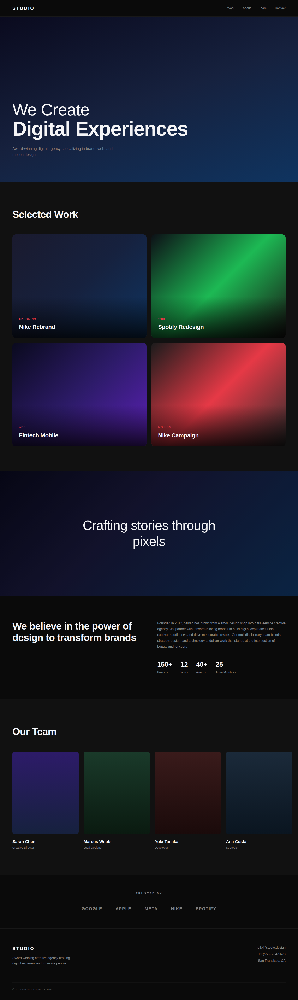
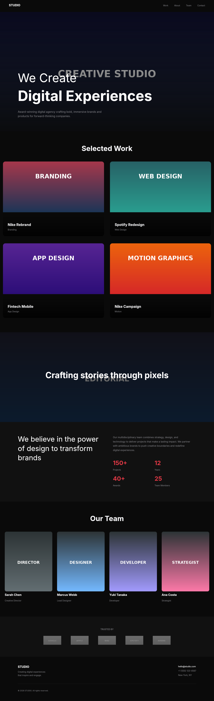

# Dogfooding: Awwwards Creative Agency
> Date: 2026-03-15 | Iteration: 1 of 1

## Theme
**Awwwards Creative Agency** — Bold, image-heavy portfolio page inspired by awwwards-winning creative agency sites with dramatic typography, full-bleed images, and dark theme.
DSL features stressed: image(), imageFill(), gradient overlays on images, large typography (80-96px), clipContent, cornerRadius, opacity, nested auto-layout, FILL sizing, SPACE_BETWEEN, textAutoResize, letterSpacing

## Components created
- `AwwwardsShowcase` — Full creative agency portfolio page with hero, project grid, editorial strip, about section, team grid, client logos, and footer

## Renders

### Browser (React)

### DSL Pipeline

## Comparison

| Area | Match? | Issue | Type | Fixed? |
|---|---|---|---|---|
| Navbar | YES | — | — | — |
| Hero (imageFill + gradient overlay) | YES | Both render correctly | — | — |
| Hero text | YES | Large typography renders well | — | — |
| Selected Work grid | YES | 2x2 grid with images | — | — |
| Project card images | YES | image() nodes render correctly | — | — |
| Editorial strip (imageFill) | YES | Full-width image fill works | — | — |
| About two-column layout | YES | Text wrapping + stats | — | — |
| Team member images | YES | image() with cornerRadius works | — | — |
| Client logos (opacity) | YES | image() with opacity: 0.5 works | — | — |
| Footer | YES | SPACE_BETWEEN layout correct | — | — |

## Pipeline fixes
- None needed — all DSL features worked correctly

## DSL authoring fixes
- **Image path resolution**: Fixed all DSL files to use `../assets/` instead of `./assets/` since DSL files are in `workspace/dsl/` and assets are in `workspace/assets/`

## Known pipeline gaps (not fixed)
- **No absolute positioning in auto-layout**: Project card overlay (gradient + text on top of image) cannot be achieved via overlapping children in auto-layout. Text appears below image instead of overlaid. This is a documented limitation.

## Features validated
- `image()` node — renders external PNG images correctly
- `imageFill()` — background image fills on frames work correctly
- Multi-fill stacking — `imageFill()` + `gradient()` overlay works
- `opacity` on image nodes — client logos at 50% opacity
- `cornerRadius` on images — team member cards with rounded corners
- Large typography (80px, 96px) — renders correctly
- `letterSpacing` — renders correctly
- `textAutoResize: 'HEIGHT'` — wrapping text works
- `clipContent` — clips overflowing children
- `SPACE_BETWEEN` — navbar and footer spacing
- `FILL` sizing — sections stretch to parent width
- Nested auto-layout — complex page structure

## Figma Plugin JSON
Ready-to-import file: [figma-plugin/2026-03-15-awwwards-agency-plugin.json](figma-plugin/2026-03-15-awwwards-agency-plugin.json)

## Commits
- See git log for commit hashes
