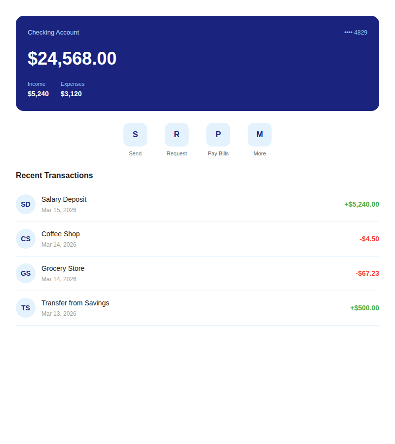
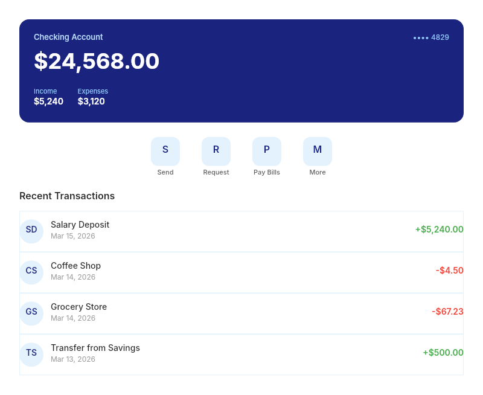

# Dogfooding: Banking App
> Date: 2026-03-15 | Iteration: 5 of 10

## Theme
**Banking App** — Light banking UI with navy balance card and transaction list
DSL features stressed: FIXED sizing, FILL width, counterAlign CENTER/MAX, stroke alignment, pill cornerRadius, per-side padding

## Components created
- `BankBalanceCard` — Navy card with balance, income/expenses footer
- `BankTransactionRow` — Row with circle avatar, name/date, colored amount

## Renders

### Browser (React)

### DSL Pipeline

## Comparison

| Area | Match? | Issue | Type | Fixed? |
|---|---|---|---|---|
| Balance card | YES | — | — | — |
| Quick action buttons (centered) | YES | — | — | — |
| Transaction rows (FILL) | YES | — | — | — |
| Avatar circles | YES | — | — | — |
| Green/red amounts | YES | — | — | — |

## Pipeline fixes
None needed.

## Figma Plugin JSON
Ready-to-import file: [figma-plugin/2026-03-15-banking-app-plugin.json](figma-plugin/2026-03-15-banking-app-plugin.json)

## Commits
- (included in dogfooding batch commit)
