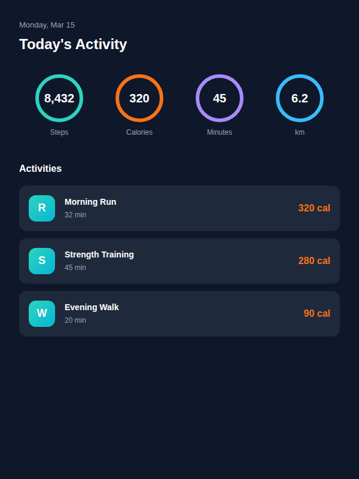
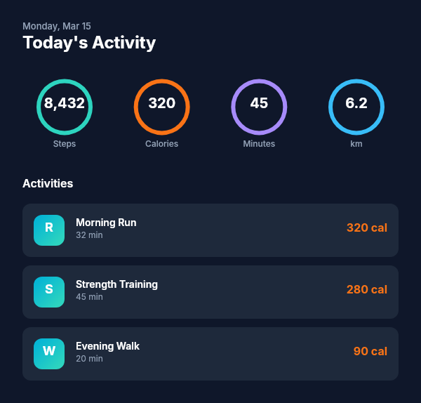

# Dogfooding: Fitness Tracker
> Date: 2026-03-15 | Iteration: 10 of 10

## Theme
**Fitness Tracker** — Dark fitness app with stat rings and activity cards (custom theme, not from catalog)
DSL features stressed: ellipse strokes (ring indicators), gradient fills for icons, SPACE_BETWEEN, colored strokes on circular frames, hex() stroke helper

## Components created
- `FitnessStatRing` — Circular ring with centered value and label
- `FitnessActivityCard` — Row with gradient icon, activity info, calorie count

## Renders

### Browser (React)

### DSL Pipeline

## Comparison

| Area | Match? | Issue | Type | Fixed? |
|---|---|---|---|---|
| Stat rings (stroked circles) | YES | — | — | — |
| Colored strokes | YES | — | — | — |
| Gradient activity icons | YES | — | — | — |
| SPACE_BETWEEN distribution | YES | — | — | — |
| Dark theme | YES | — | — | — |

## Pipeline fixes
None needed.

## Figma Plugin JSON
Ready-to-import file: [figma-plugin/2026-03-15-fitness-tracker-plugin.json](figma-plugin/2026-03-15-fitness-tracker-plugin.json)

## Commits
- (included in dogfooding batch commit)
