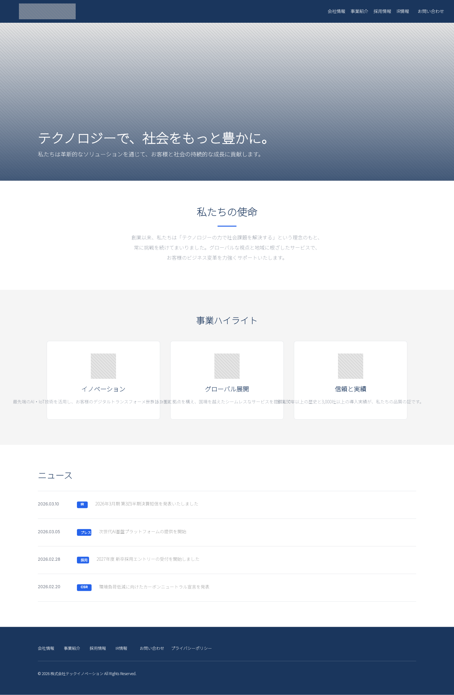
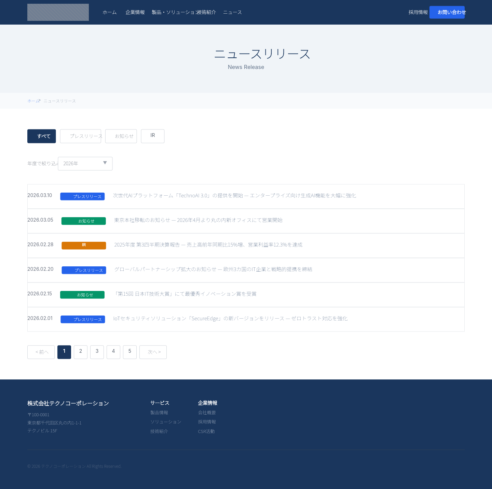
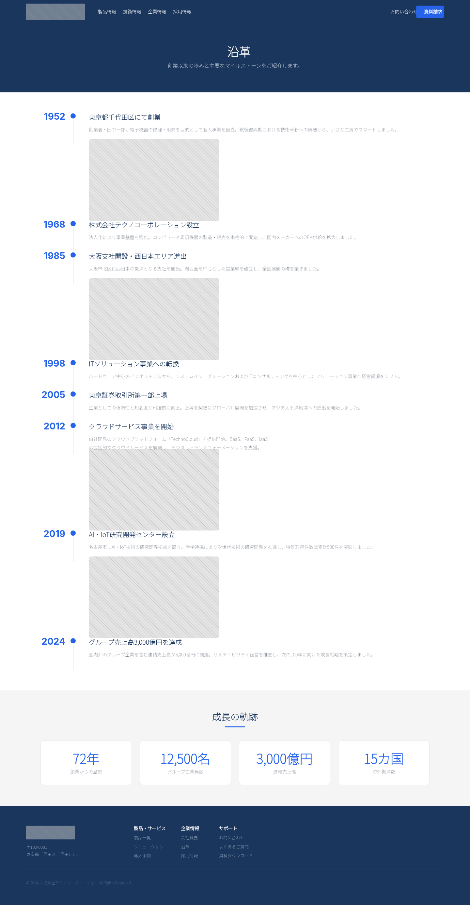
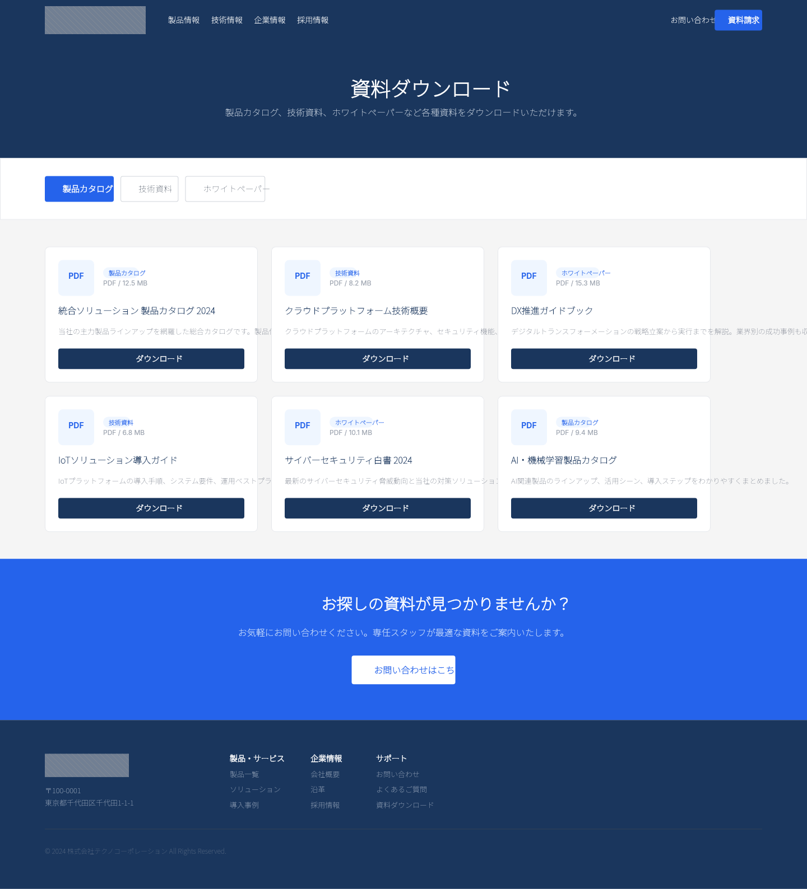

# Dogfooding: Japanese Corporate Pages
> Date: 2026-03-15 | Iteration: 1 of 1 (bulk)

## Theme
**Japanese Corporate Pages** — 20 professional Japanese corporate website pages covering all common corporate site sections. Navy/white/gray color scheme with accent blue.
DSL features stressed: image(), imageFill(), CJK text rendering, nested auto-layout (H+V), FILL sizing, SPACE_BETWEEN, cornerRadius, strokes, gradients, opacity, clipContent, text wrapping (textAutoResize: HEIGHT), badge/card patterns, dividers, stat blocks

## Pages Created (20)

| # | File | Page Name | Description |
|---|------|-----------|-------------|
| 1 | `jp-corporate-top.dsl.ts` | 企業トップ | Corporate top page with hero, mission, business highlights, news |
| 2 | `jp-about.dsl.ts` | 会社概要 | Company overview with philosophy, info table, office images |
| 3 | `jp-services.dsl.ts` | 事業紹介 | Business services with service cards and detail sections |
| 4 | `jp-careers.dsl.ts` | 採用情報 | Recruitment with values, employee voices, open positions |
| 5 | `jp-ir.dsl.ts` | IR情報 | Investor relations with financial highlights, calendar, library |
| 6 | `jp-contact.dsl.ts` | お問い合わせ | Contact form layout with map and office info |
| 7 | `jp-news.dsl.ts` | ニュースリリース | News list with category filters and pagination |
| 8 | `jp-products.dsl.ts` | 製品・ソリューション | Product lineup with tech overview and support info |
| 9 | `jp-technology.dsl.ts` | 技術紹介 | Technology page with R&D philosophy and tech areas |
| 10 | `jp-csr.dsl.ts` | CSR・サステナビリティ | CSR page with initiatives and SDGs commitment |
| 11 | `jp-ceo-message.dsl.ts` | 代表メッセージ | CEO message with portrait and company vision |
| 12 | `jp-locations.dsl.ts` | 拠点情報 | Office locations with map and global network |
| 13 | `jp-partners.dsl.ts` | パートナー企業 | Partner companies with logo grid and benefits |
| 14 | `jp-case-studies.dsl.ts` | 導入事例 | Case studies with client cards and results |
| 15 | `jp-events.dsl.ts` | セミナー・イベント | Seminars & events with featured event and calendar |
| 16 | `jp-downloads.dsl.ts` | 資料ダウンロード | Document download center with category tabs |
| 17 | `jp-faq.dsl.ts` | よくあるご質問 | FAQ with categorized Q&A sections |
| 18 | `jp-history.dsl.ts` | 沿革 | Company timeline from 1952 to present |
| 19 | `jp-group.dsl.ts` | グループ企業 | Group companies with subsidiary cards |
| 20 | `jp-privacy.dsl.ts` | プライバシーポリシー | Privacy policy with structured legal sections |

## Renders

All 20 pages rendered at 1440px width. Representative samples:

### Corporate Top (企業トップ)

### News Release (ニュースリリース)

### Company History (沿革)

### Downloads (資料ダウンロード)

## Comparison

| Area | Match? | Issue | Type | Fixed? |
|---|---|---|---|---|
| CJK text rendering | YES | Japanese text renders correctly via Noto Sans JP | — | — |
| Image nodes | YES | All image() nodes render with correct sizing | — | — |
| imageFill backgrounds | YES | Hero sections with image backgrounds render correctly | — | — |
| Nested auto-layout | YES | Complex H+V nesting works across all pages | — | — |
| FILL sizing | YES | Children stretch properly within parents | — | — |
| SPACE_BETWEEN | YES | Navigation bars and rows distribute correctly | — | — |
| Corner radii | YES | Cards, badges, buttons all render with correct radii | — | — |
| Strokes | YES | Borders on cards, tables, form fields render correctly | — | — |
| Gradients | YES | Hero sections and accent elements use gradients properly | — | — |
| Text wrapping | YES | Long Japanese text wraps at specified widths | — | — |
| Stat blocks | YES | Large numbers with labels render correctly | — | — |
| Badge patterns | YES | Category pills and tags render as expected | — | — |
| Dividers | YES | Horizontal separators with FILL sizing work | — | — |

## Pipeline Fixes
No pipeline bugs found in this iteration. All 20 pages compiled, rendered, and exported without errors.

## Known Pipeline Gaps (not fixed)
No new pipeline gaps discovered. The pipeline handles all features used across these 20 pages correctly.

## Figma Plugin JSON
Ready-to-import files for all 20 pages:
- [jp-corporate-top](figma-plugin/2026-03-15-jp-corporate-top-plugin.json)
- [jp-about](figma-plugin/2026-03-15-jp-about-plugin.json)
- [jp-services](figma-plugin/2026-03-15-jp-services-plugin.json)
- [jp-careers](figma-plugin/2026-03-15-jp-careers-plugin.json)
- [jp-ir](figma-plugin/2026-03-15-jp-ir-plugin.json)
- [jp-contact](figma-plugin/2026-03-15-jp-contact-plugin.json)
- [jp-news](figma-plugin/2026-03-15-jp-news-plugin.json)
- [jp-products](figma-plugin/2026-03-15-jp-products-plugin.json)
- [jp-technology](figma-plugin/2026-03-15-jp-technology-plugin.json)
- [jp-csr](figma-plugin/2026-03-15-jp-csr-plugin.json)
- [jp-ceo-message](figma-plugin/2026-03-15-jp-ceo-message-plugin.json)
- [jp-locations](figma-plugin/2026-03-15-jp-locations-plugin.json)
- [jp-partners](figma-plugin/2026-03-15-jp-partners-plugin.json)
- [jp-case-studies](figma-plugin/2026-03-15-jp-case-studies-plugin.json)
- [jp-events](figma-plugin/2026-03-15-jp-events-plugin.json)
- [jp-downloads](figma-plugin/2026-03-15-jp-downloads-plugin.json)
- [jp-faq](figma-plugin/2026-03-15-jp-faq-plugin.json)
- [jp-history](figma-plugin/2026-03-15-jp-history-plugin.json)
- [jp-group](figma-plugin/2026-03-15-jp-group-plugin.json)
- [jp-privacy](figma-plugin/2026-03-15-jp-privacy-plugin.json)

## Commits
See git log for commits in this session.
