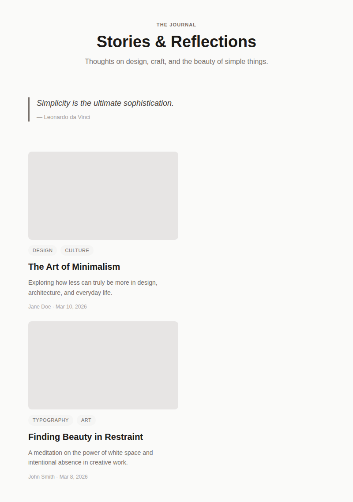
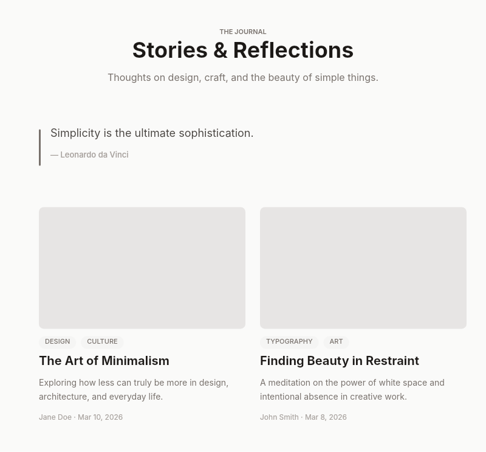

# Dogfooding: Minimal Blog
> Date: 2026-03-15 | Iteration: 3 of 10

## Theme
**Minimal Blog** — Light, typographic blog layout with off-white tones
DSL features stressed: typography variety (11px-36px), text alignment (CENTER), line height, letter spacing, textAutoResize:HEIGHT, pill cornerRadius

## Components created
- `BlogArticleCard` — Card with image placeholder, tag pills, title, excerpt, byline
- `BlogBlockquote` — Horizontal bar + italic quote + attribution

## Renders

### Browser (React)

### DSL Pipeline

## Comparison

| Area | Match? | Issue | Type | Fixed? |
|---|---|---|---|---|
| Centered header | YES | — | — | — |
| Blockquote layout | YES | — | — | — |
| Tag pills | YES | — | — | — |
| Text wrapping | YES | — | — | — |
| Typography variety | YES | — | — | — |
| Letter spacing | YES | — | — | — |

## Pipeline fixes
None needed.

## Known pipeline gaps (not fixed)
None discovered.

## Figma Plugin JSON
Ready-to-import file: [figma-plugin/2026-03-15-minimal-blog-plugin.json](figma-plugin/2026-03-15-minimal-blog-plugin.json)

## Commits
- (included in dogfooding batch commit)
