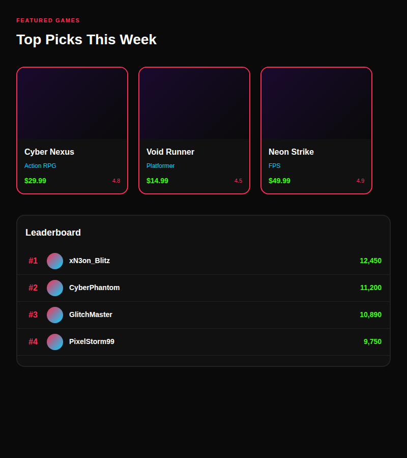
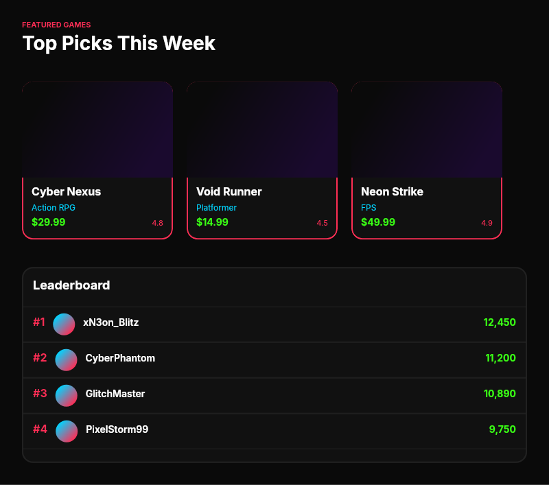

# Dogfooding: Neon Gaming
> Date: 2026-03-15 | Iteration: 4 of 10

## Theme
**Neon Gaming** — Dark gaming UI with neon pink, electric blue, neon green accents
DSL features stressed: gradient fills (multi-stop), gradient angles, thick strokes (2px), high cornerRadius, clipContent, SPACE_BETWEEN

## Components created
- `NeonGameCard` — Card with gradient artwork, neon border, price/rating row
- `NeonLeaderboardRow` — Row with gradient avatar circle, rank, name, score

## Renders

### Browser (React)

### DSL Pipeline

## Comparison

| Area | Match? | Issue | Type | Fixed? |
|---|---|---|---|---|
| Game cards with thick stroke | YES | — | — | — |
| Gradient artwork fills | YES | — | — | — |
| Clip content on cards | YES | — | — | — |
| Gradient avatar circles | YES | — | — | — |
| Neon colors | YES | — | — | — |
| SPACE_BETWEEN price row | YES | — | — | — |

## Pipeline fixes
None needed.

## Known pipeline gaps (not fixed)
None discovered.

## Figma Plugin JSON
Ready-to-import file: [figma-plugin/2026-03-15-neon-gaming-plugin.json](figma-plugin/2026-03-15-neon-gaming-plugin.json)

## Commits
- (included in dogfooding batch commit)
