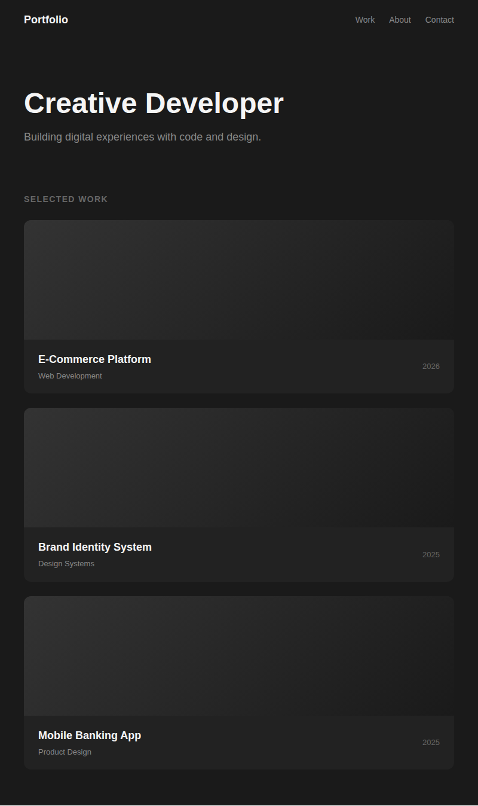
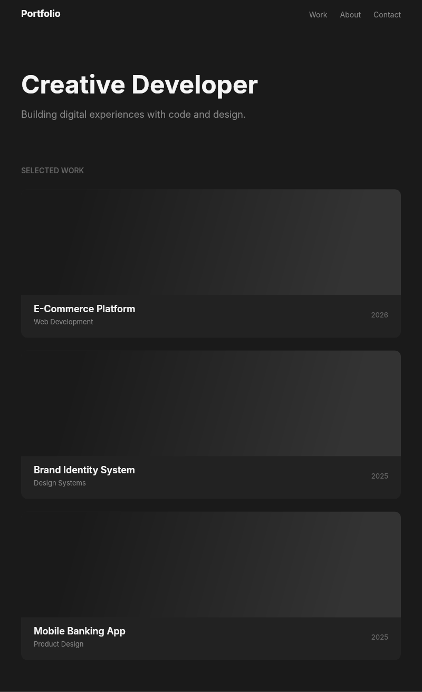

# Dogfooding: Portfolio Showcase
> Date: 2026-03-15 | Iteration: 9 of 10

## Theme
**Portfolio Showcase** — Dark portfolio with large hero typography and project cards
DSL features stressed: large typography (48px), SPACE_BETWEEN nav, gradient fills, wide full-width cards, clipContent, full-width sections

## Components created
- `PortfolioProjectCard` — Wide card with gradient image, title/category, year

## Renders

### Browser (React)

### DSL Pipeline

## Comparison

| Area | Match? | Issue | Type | Fixed? |
|---|---|---|---|---|
| 48px hero text | YES | — | — | — |
| SPACE_BETWEEN nav | YES | — | — | — |
| Wide project cards | YES | — | — | — |
| Gradient card images | YES | — | — | — |
| FILL width | YES | — | — | — |

## Pipeline fixes
None needed.

## Figma Plugin JSON
Ready-to-import file: [figma-plugin/2026-03-15-portfolio-showcase-plugin.json](figma-plugin/2026-03-15-portfolio-showcase-plugin.json)

## Commits
- (included in dogfooding batch commit)
