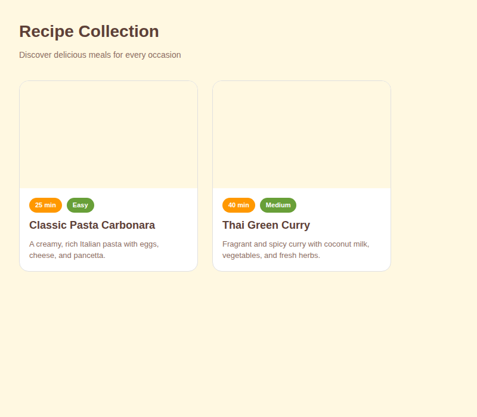
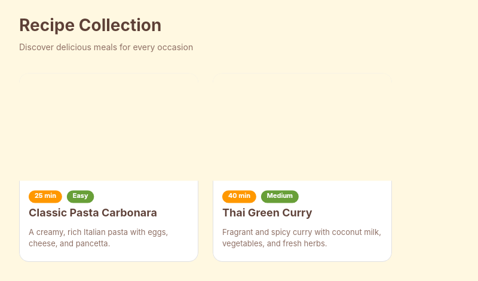

# Dogfooding: Recipe Cookbook
> Date: 2026-03-15 | Iteration: 6 of 10

## Theme
**Recipe Cookbook** — Warm, cream-toned recipe card layout
DSL features stressed: tall vertical cards, nested H in V auto-layout, text wrapping, clipContent, cornerRadius with strokes

## Components created
- `RecipeCard` — Card with image area, time/difficulty badges, title, description

## Renders

### Browser (React)

### DSL Pipeline

## Comparison

| Area | Match? | Issue | Type | Fixed? |
|---|---|---|---|---|
| Card with clipContent | YES | — | — | — |
| Nested badges in card | YES | — | — | — |
| Text wrapping | YES | — | — | — |
| Warm color theme | YES | — | — | — |

## Pipeline fixes
None needed.

## Figma Plugin JSON
Ready-to-import file: [figma-plugin/2026-03-15-recipe-cookbook-plugin.json](figma-plugin/2026-03-15-recipe-cookbook-plugin.json)

## Commits
- (included in dogfooding batch commit)
