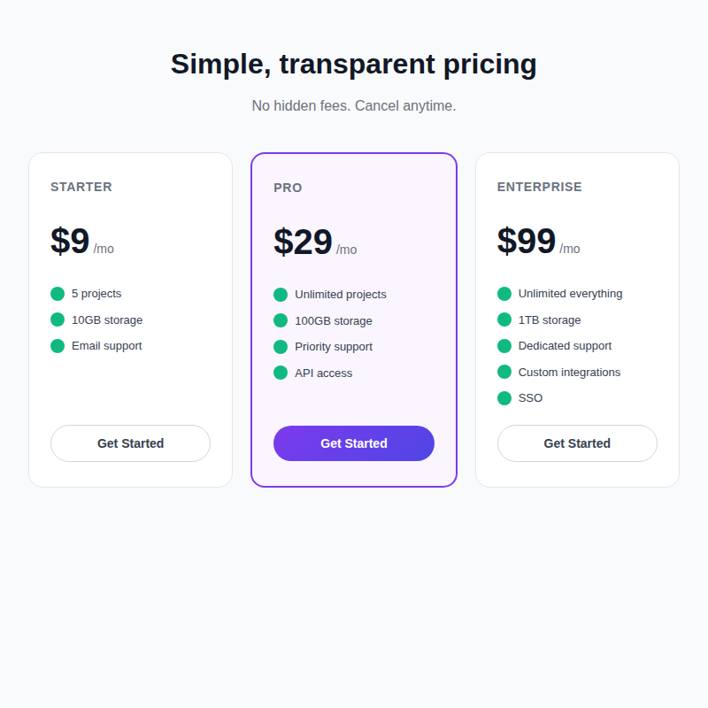
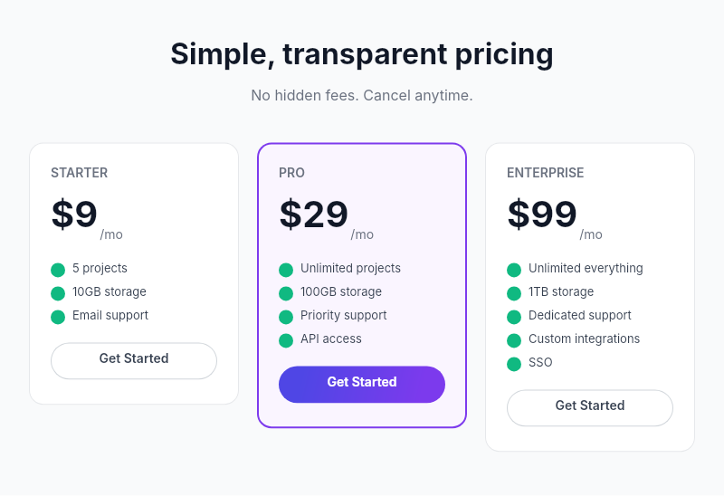

# Dogfooding: SaaS Pricing
> Date: 2026-03-15 | Iteration: 7 of 10

## Theme
**SaaS Pricing** — Clean pricing comparison with 3 tier cards
DSL features stressed: equal-width FILL columns, FILL vertical sizing (flex: 1), gradient CTA buttons, strokes for deselected state, counterAlign MAX for /mo baseline

## Components created
- `PricingTierCard` — Card with tier name, price, feature list, CTA button

## Renders

### Browser (React)

### DSL Pipeline

## Comparison

| Area | Match? | Issue | Type | Fixed? |
|---|---|---|---|---|
| FILL columns | YES | — | — | — |
| Gradient CTA button | YES | — | — | — |
| Stroke borders | YES | — | — | — |
| Feature check dots (ellipse) | YES | — | — | — |
| Vertical FILL (flex:1) | YES | — | — | — |

## Pipeline fixes
None needed.

## Figma Plugin JSON
Ready-to-import file: [figma-plugin/2026-03-15-saas-pricing-plugin.json](figma-plugin/2026-03-15-saas-pricing-plugin.json)

## Commits
- (included in dogfooding batch commit)
