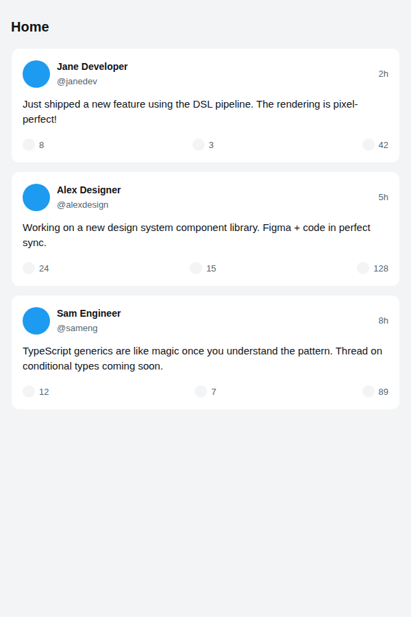
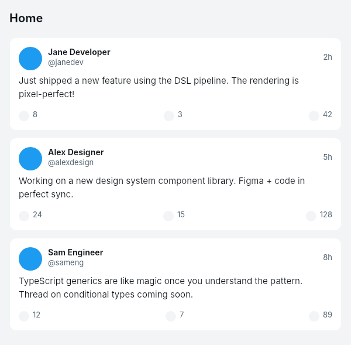

# Dogfooding: Social Feed
> Date: 2026-03-15 | Iteration: 8 of 10

## Theme
**Social Feed** — Light social media feed with post cards
DSL features stressed: ellipse nodes (avatars), SPACE_BETWEEN action bars, text wrapping, mixed font weights, nested groups

## Components created
- `SocialPostCard` — Post card with avatar, user info, body text, action bar

## Renders

### Browser (React)

### DSL Pipeline

## Comparison

| Area | Match? | Issue | Type | Fixed? |
|---|---|---|---|---|
| Ellipse avatars | YES | — | — | — |
| SPACE_BETWEEN actions | YES | — | — | — |
| Text wrapping | YES | — | — | — |
| Post card layout | YES | — | — | — |

## Pipeline fixes
None needed.

## Figma Plugin JSON
Ready-to-import file: [figma-plugin/2026-03-15-social-feed-plugin.json](figma-plugin/2026-03-15-social-feed-plugin.json)

## Commits
- (included in dogfooding batch commit)
