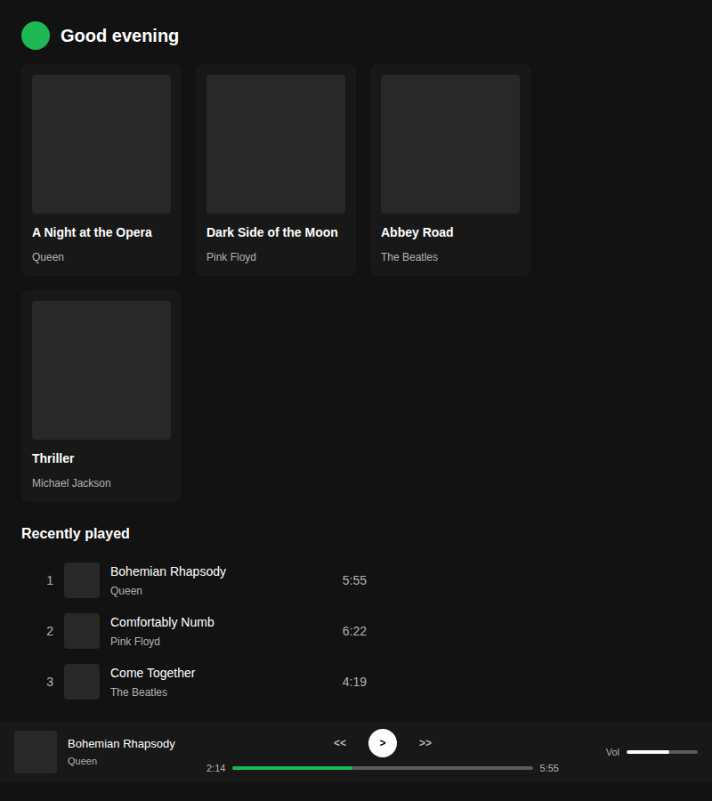
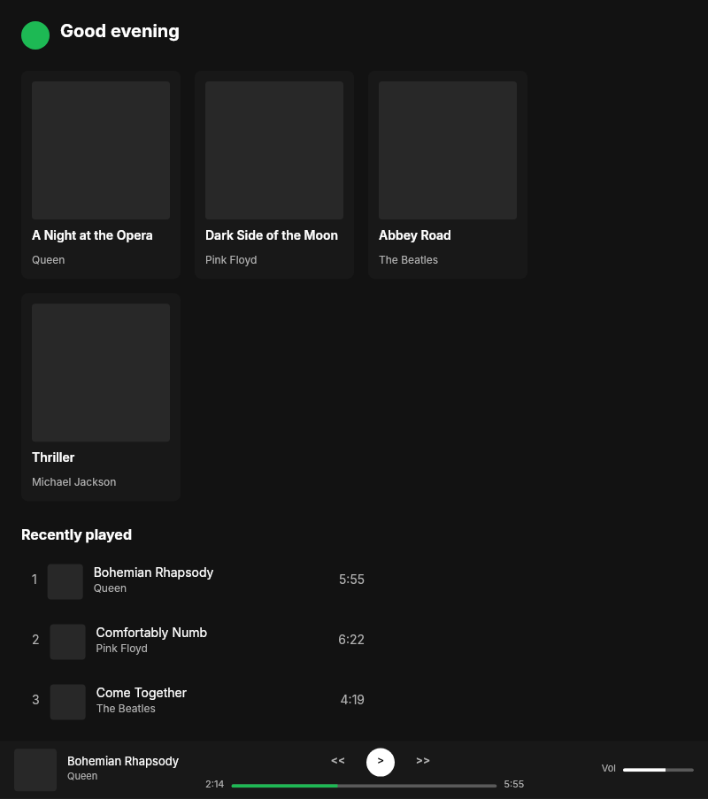

# Dogfooding: Spotify Dark
> Date: 2026-03-15 | Iteration: 1 of 10

## Theme
**Spotify Dark** — Music streaming dark UI with green accents
DSL features stressed: dark fills, pill cornerRadius (9999), horizontal auto-layout, ellipse nodes, opacity, small text sizes

## Components created
- `SpotifyAlbumCard` — Dark card with artwork placeholder, title, artist
- `SpotifyPlaylistRow` — Horizontal row with index, thumbnail, song info, duration
- `SpotifyNowPlayingBar` — Player bar with track info, controls, progress bar, volume

## Renders

### Browser (React)

### DSL Pipeline

## Comparison

| Area | Match? | Issue | Type | Fixed? |
|---|---|---|---|---|
| Header layout | YES | — | — | — |
| Album cards | YES | — | — | — |
| Playlist rows | YES | — | — | — |
| Now playing bar | YES | — | — | — |
| Progress bars | YES | — | — | — |
| Typography | YES | — | — | — |

## Pipeline fixes
None needed — all features rendered correctly.

## Known pipeline gaps (not fixed)
None discovered in this iteration.

## Figma Plugin JSON
Ready-to-import file: [figma-plugin/2026-03-15-spotify-dark-plugin.json](figma-plugin/2026-03-15-spotify-dark-plugin.json)

## Commits
- (included in dogfooding batch commit)
