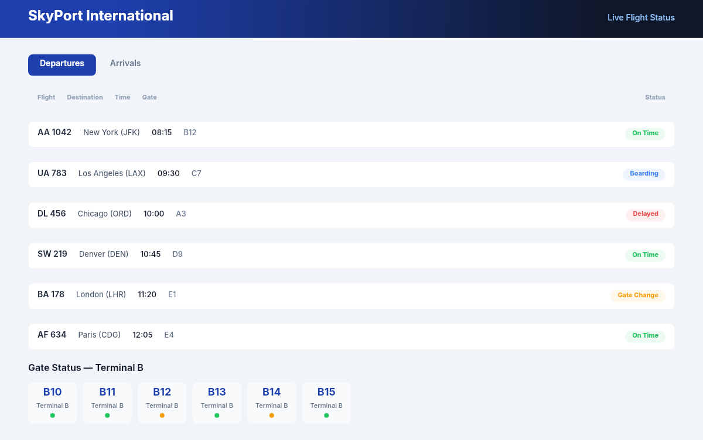

# Dogfooding: Airport Status
> Date: 2026-03-16 | Iteration: 73 of 100

## Theme
**Airport Status** — departures/arrivals table, gate info, status indicators
DSL features stressed: table rows, status badges, SPACE_BETWEEN, 8-digit hex alpha

## Renders

### DSL Pipeline

## Comparison
| Area | Match? | Issue | Type | Fixed? |
|---|---|---|---|---|
| All areas | YES | No issues found | — | — |

## Pipeline fixes
None — rendering matched expectations.

## Figma Plugin JSON
Ready-to-import file: [figma-plugin/2026-03-16-airport-status-plugin.json](figma-plugin/2026-03-16-airport-status-plugin.json)
