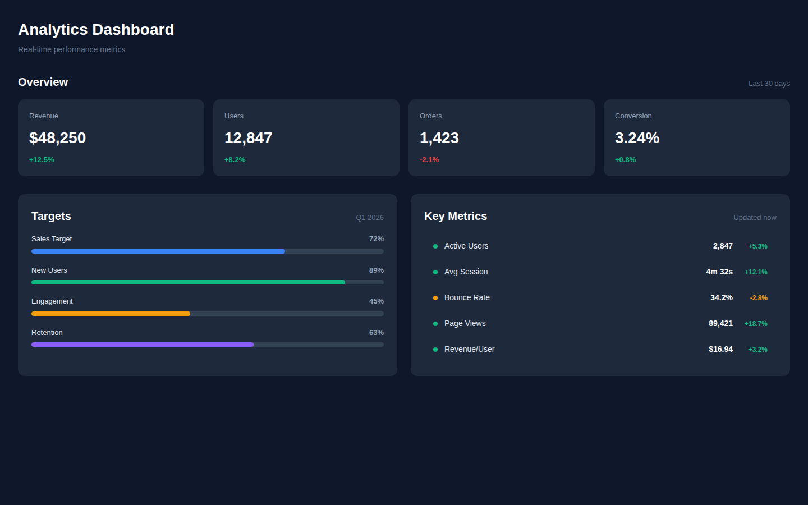
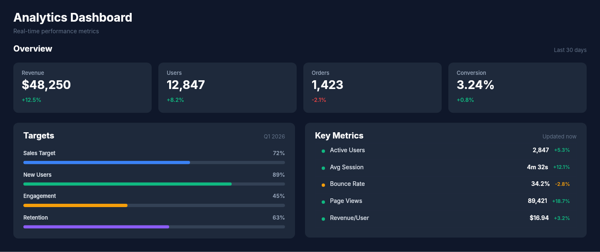

# Dogfooding: Analytics Dashboard
> Date: 2026-03-16 | Iteration: 2 of 100

## Theme
**Analytics Dashboard** — Data dashboard with stat cards, progress bars, metric rows, and section headers.
DSL features stressed: FILL sizing, SPACE_BETWEEN alignment, mixed H/V layouts, ellipse (status dots), strokes, clipContent

## Components created
- `StatCard` — Dark card with label, value, and change percentage
- `ProgressBar` — Labeled progress bar with colored fill
- `MetricRow` — Key metric row with dot indicator, value, and trend
- `SectionHeader` — Section title with SPACE_BETWEEN subtitle

## Renders

### Browser (React)

### DSL Pipeline

## Comparison

| Area | Match? | Issue | Type | Fixed? |
|---|---|---|---|---|
| Stat cards row | YES | FILL sizing distributes cards evenly | — | — |
| Section headers | YES | SPACE_BETWEEN alignment works correctly | — | — |
| Progress bars | YES | clipContent, colored fills, track backgrounds all correct | — | — |
| Metric rows | YES | Ellipse dots, strokes, text alignment all match | — | — |
| Two-column layout | YES | FILL sizing distributes panels evenly | — | — |

## Pipeline fixes
- None needed — FILL sizing, SPACE_BETWEEN, ellipse, strokes all work correctly

## Known pipeline gaps (not fixed)
- None discovered

## Figma Plugin JSON
Ready-to-import file: [figma-plugin/2026-03-16-analytics-dashboard-plugin.json](figma-plugin/2026-03-16-analytics-dashboard-plugin.json)

## Commits
- (see git log)
