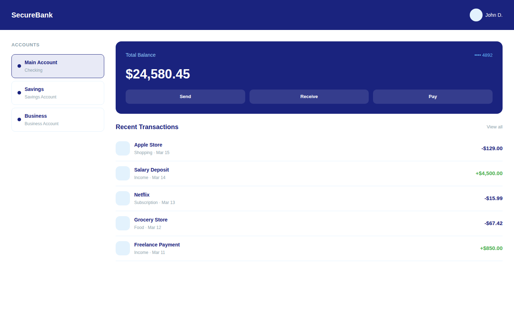
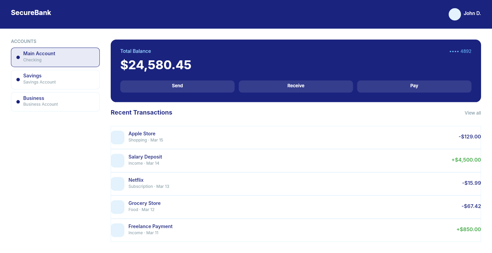

# Dogfooding: Banking App
> Date: 2026-03-16 | Iteration: 5 of 100

## Theme
**Banking App** — Account overview with balance card, transactions, sidebar accounts.
DSL features stressed: FIXED sizing, FILL width, SPACE_BETWEEN, ellipse shapes, stroke alignment, opacity fills, per-side padding

## Components created
- `BalanceCard` — Navy card with balance, account number, and action buttons
- `TransactionRow` — Transaction with icon, metadata, and colored amount
- `AccountSelector` — Account option with dot indicator and conditional styling

## Renders
### Browser (React)

### DSL Pipeline

## Comparison
| Area | Match? | Issue | Type | Fixed? |
|---|---|---|---|---|
| Nav bar | YES | SPACE_BETWEEN, ellipse avatar correct | — | — |
| Sidebar | YES | FIXED 260px width, ellipse dots, conditional strokes | — | — |
| Balance card | YES | Opacity fill (#ffffff 0.12), FILL buttons, SPACE_BETWEEN | — | — |
| Transactions | YES | FILL width, separator strokes, colored amounts | — | — |

## Pipeline fixes
- None needed

## Figma Plugin JSON
Ready-to-import file: [figma-plugin/2026-03-16-banking-app-plugin.json](figma-plugin/2026-03-16-banking-app-plugin.json)
