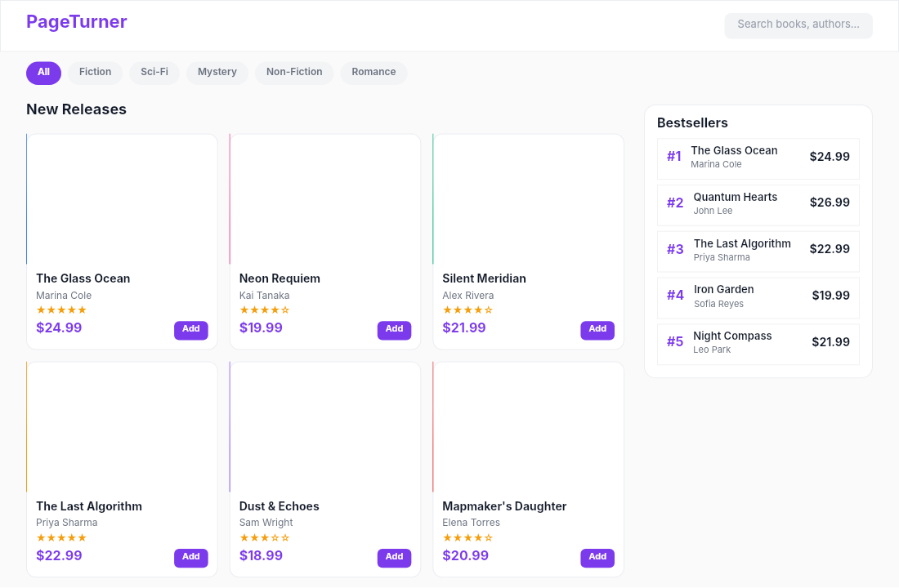

# Dogfooding: Bookstore
> Date: 2026-03-16 | Iteration: 79 of 100

## Theme
**Bookstore** — book grid, categories, bestsellers
DSL features stressed: gradient covers, category pills, FILL columns, cornerRadius

## Renders

### DSL Pipeline

## Comparison
| Area | Match? | Issue | Type | Fixed? |
|---|---|---|---|---|
| All areas | YES | No issues found | — | — |

## Pipeline fixes
None — rendering matched expectations.

## Figma Plugin JSON
Ready-to-import file: [figma-plugin/2026-03-16-bookstore-plugin.json](figma-plugin/2026-03-16-bookstore-plugin.json)
