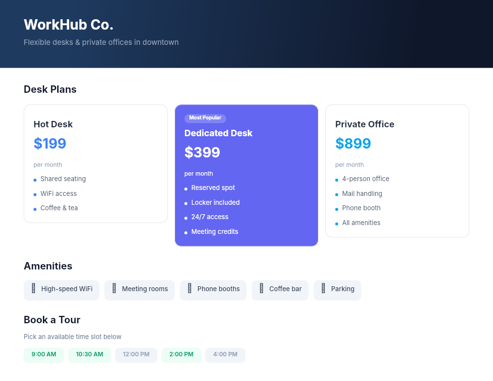

# Dogfooding: Coworking Space
> Date: 2026-03-16 | Iteration: 57 of 100

## Theme
**Coworking Space** — desk booking, amenities, pricing
DSL features stressed: gradient hero, amenity cards, FILL columns, SPACE_BETWEEN

## Renders

### DSL Pipeline

## Comparison
| Area | Match? | Issue | Type | Fixed? |
|---|---|---|---|---|
| All areas | YES | No issues found | — | — |

## Pipeline fixes
None — rendering matched expectations.

## Figma Plugin JSON
Ready-to-import file: [figma-plugin/2026-03-16-coworking-plugin.json](figma-plugin/2026-03-16-coworking-plugin.json)
