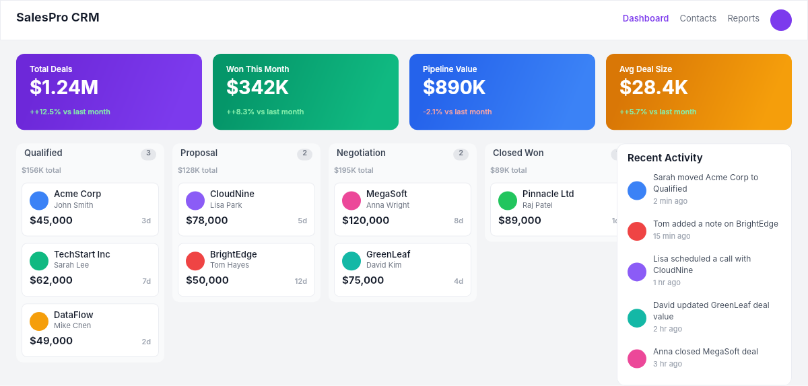

# Dogfooding: Dashboard CRM
> Date: 2026-03-16 | Iteration: 58 of 100

## Theme
**Dashboard CRM** — contact list, deal pipeline, activity feed
DSL features stressed: table rows, status badges, SPACE_BETWEEN, ellipse avatars

## Renders

### DSL Pipeline

## Comparison
| Area | Match? | Issue | Type | Fixed? |
|---|---|---|---|---|
| All areas | YES | No issues found | — | — |

## Pipeline fixes
None — rendering matched expectations.

## Figma Plugin JSON
Ready-to-import file: [figma-plugin/2026-03-16-dashboard-crm-plugin.json](figma-plugin/2026-03-16-dashboard-crm-plugin.json)
