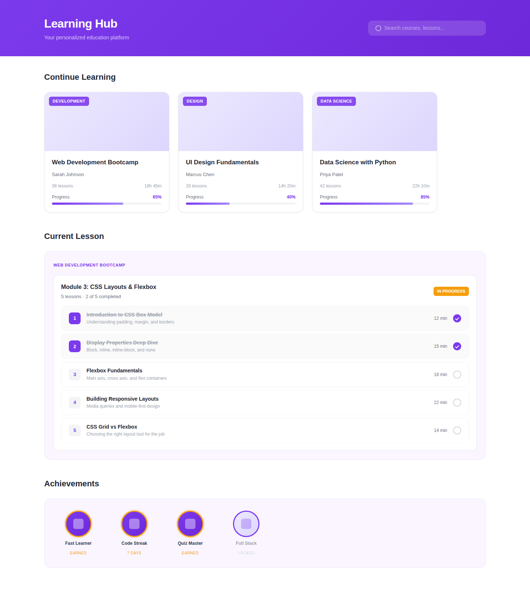
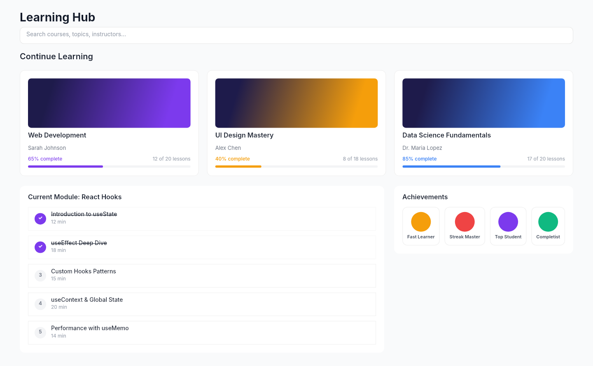

# Dogfooding: Education Platform
> Date: 2026-03-16 | Iteration: 11

## Theme
**Education Platform** — Course cards with progress bars, lesson items, achievement badges
DSL features stressed: deep nesting (3+ levels), progress bars with clipContent, text strikethrough (textDecoration), gradient course covers, ellipse badges, opacity on completed items

## Components created
- `CourseCard` — Course card with gradient cover, progress bar, and lesson count
- `LessonItem` — Numbered lesson with completion status and strikethrough text
- `AchievementBadge` — Circular badge with label

## Renders

### Browser (React)

### DSL Pipeline

## Comparison

| Area | Match? | Issue | Type | Fixed? |
|---|---|---|---|---|
| Course cards grid | YES | — | — | — |
| Progress bars | YES | — | — | — |
| Lesson items | YES | — | — | — |
| Strikethrough text | YES | — | — | — |
| Achievement badges | YES | — | — | — |
| Deep nesting | YES | — | — | — |

## Pipeline fixes
None needed — all features rendered correctly.

## Figma Plugin JSON
Ready-to-import file: [figma-plugin/2026-03-16-education-platform-plugin.json](figma-plugin/2026-03-16-education-platform-plugin.json)
