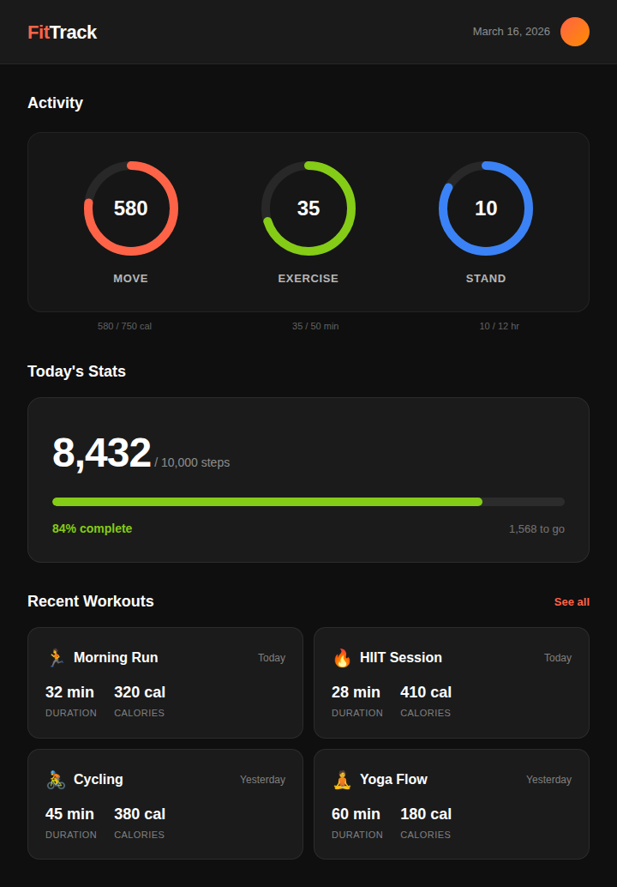
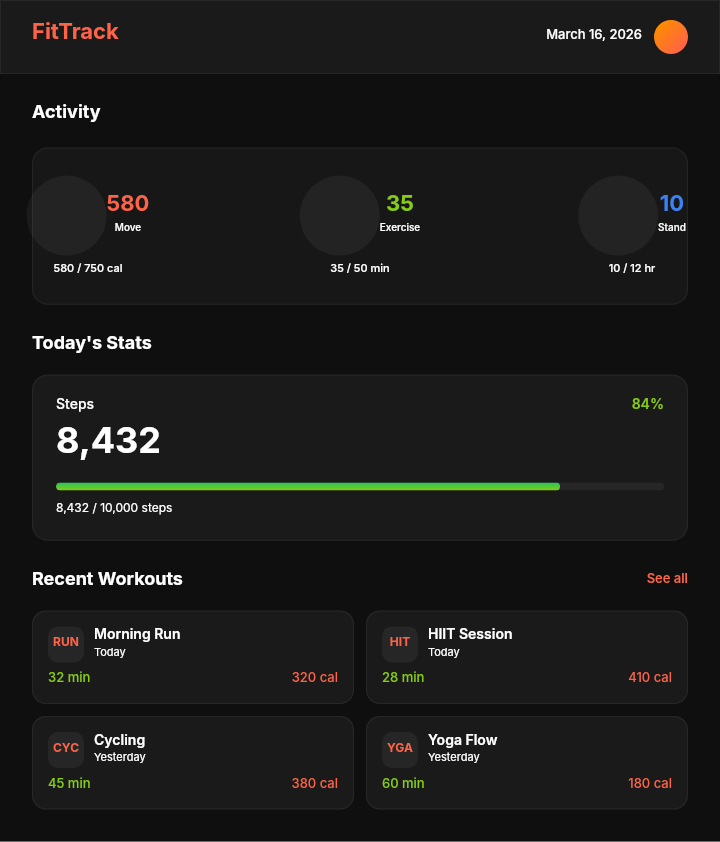

# Dogfooding: Fitness Tracker
> Date: 2026-03-16 | Iteration: 13

## Theme
**Fitness Tracker** — Activity rings, workout cards, step counter
DSL features stressed: dark theme (#0f0f0f), 8-digit hex alpha fills, ellipse rings, gradient accents, SPACE_BETWEEN stats, nested two-column grid, clipContent progress bar, large bold numbers

## Components created
- `ActivityRing` — Circular activity metric with value and label
- `WorkoutCard` — Workout session card with type, duration, and calories
- `StepCounter` — Step progress bar with percentage

## Renders

### Browser (React)

### DSL Pipeline

## Comparison

| Area | Match? | Issue | Type | Fixed? |
|---|---|---|---|---|
| Dark theme background | YES | — | — | — |
| Activity rings section | YES | — | — | — |
| Step counter bar | YES | — | — | — |
| Workout grid layout | YES | — | — | — |
| 8-digit hex alpha | YES | — | — | — |
| Gradient avatar | YES | — | — | — |
| SPACE_BETWEEN headers | YES | — | — | — |

## Pipeline fixes
None needed — all features rendered correctly.

## Figma Plugin JSON
Ready-to-import file: [figma-plugin/2026-03-16-fitness-tracker-plugin.json](figma-plugin/2026-03-16-fitness-tracker-plugin.json)
