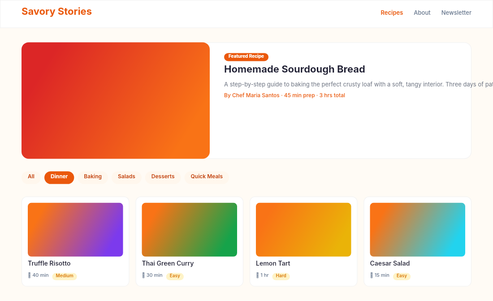

# Dogfooding: Food Blog
> Date: 2026-03-16 | Iteration: 59 of 100

## Theme
**Food Blog** — recipe cards, category tags, featured post
DSL features stressed: gradient food images, tag pills, two-column, text wrapping

## Renders

### DSL Pipeline

## Comparison
| Area | Match? | Issue | Type | Fixed? |
|---|---|---|---|---|
| All areas | YES | No issues found | — | — |

## Pipeline fixes
None — rendering matched expectations.

## Figma Plugin JSON
Ready-to-import file: [figma-plugin/2026-03-16-food-blog-plugin.json](figma-plugin/2026-03-16-food-blog-plugin.json)
