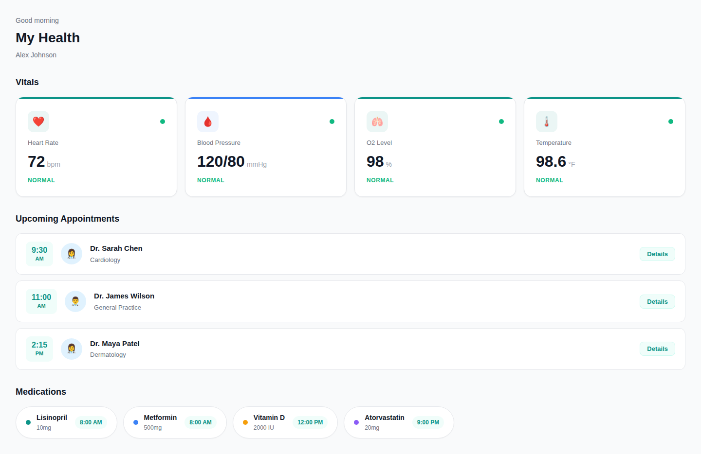
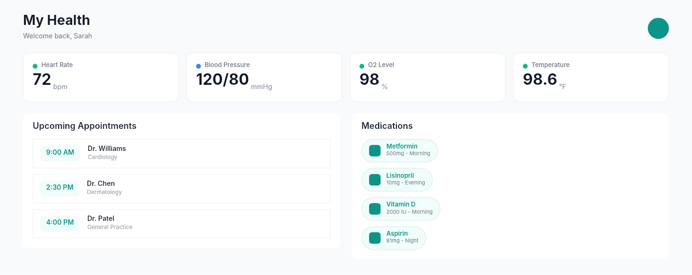

# Dogfooding: Healthcare Dashboard
> Date: 2026-03-16 | Iteration: 10

## Theme
**Healthcare Dashboard** — Medical vitals, appointments, medications
DSL features stressed: ellipse status dots, SPACE_BETWEEN header, large number typography, pill-shaped medication items, cornerRadius 9999, two-column layout

## Components created
- `VitalCard` — Vital sign display with status dot, large value, and unit
- `AppointmentRow` — Doctor appointment with time slot and specialty
- `MedicationPill` — Pill-shaped medication item with icon and dosage

## Renders

### Browser (React)

### DSL Pipeline

## Comparison

| Area | Match? | Issue | Type | Fixed? |
|---|---|---|---|---|
| Header layout | YES | — | — | — |
| Vital cards row | YES | — | — | — |
| Appointments list | YES | — | — | — |
| Medication pills | YES | — | — | — |
| Two-column layout | YES | — | — | — |
| Ellipse avatar | YES | — | — | — |

## Pipeline fixes
None needed — all features rendered correctly.

## Figma Plugin JSON
Ready-to-import file: [figma-plugin/2026-03-16-healthcare-dashboard-plugin.json](figma-plugin/2026-03-16-healthcare-dashboard-plugin.json)
