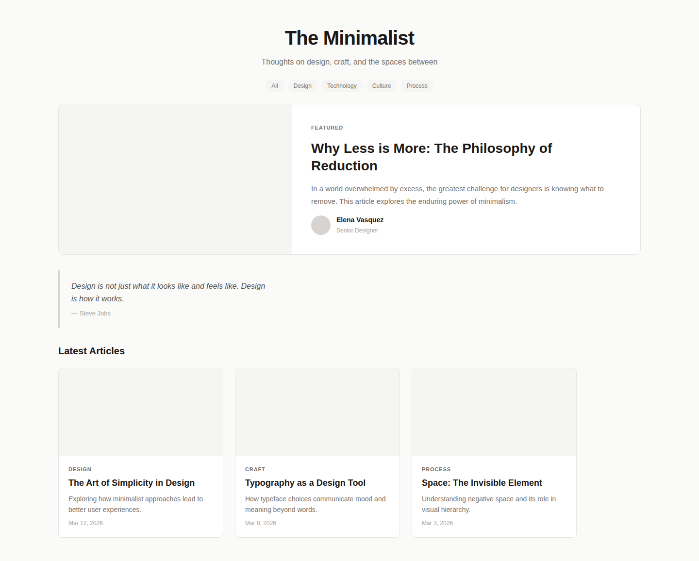
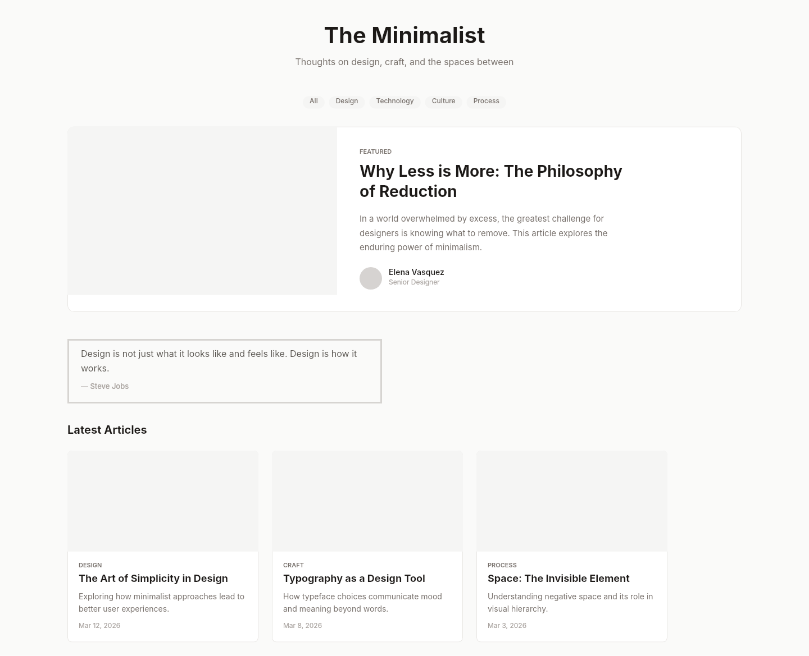

# Dogfooding: Minimal Blog
> Date: 2026-03-16 | Iteration: 3 of 100

## Theme
**Minimal Blog** — Clean typography-focused blog with light theme, featured article, blockquote, and article grid.
DSL features stressed: typography variety (11-40px), text alignment (CENTER), lineHeight, letterSpacing, textAutoResize:HEIGHT, minimal fills/strokes

## Components created
- `ArticleCard` — Card with image placeholder, tag, title, excerpt, date
- `TagPill` — Rounded pill tag chip
- `AuthorByline` — Author avatar with name and role
- `Blockquote` — Left-bordered quote with attribution

## Renders

### Browser (React)

### DSL Pipeline

## Comparison

| Area | Match? | Issue | Type | Fixed? |
|---|---|---|---|---|
| Centered header | YES | text alignment CENTER works | — | — |
| Tag pills | YES | Pill shape, centered layout both work | — | — |
| Featured article | YES | Horizontal layout, text wrapping, avatar all correct | — | — |
| Blockquote | PARTIAL | DSL renders all-side border vs CSS border-left only | DSL limitation | N/A |
| Article cards | YES | clipContent, text wrapping, letter spacing all correct | — | — |
| Typography | YES | All font sizes, weights, lineHeight, letterSpacing render correctly | — | — |

## Pipeline fixes
- None needed

## Known pipeline gaps (not fixed)
- **Per-side strokes**: DSL strokes apply to all sides; CSS `border-left` can't be replicated. This is a Figma limitation (Figma also uses full-border strokes by default). Not a pipeline bug.

## Figma Plugin JSON
Ready-to-import file: [figma-plugin/2026-03-16-minimal-blog-plugin.json](figma-plugin/2026-03-16-minimal-blog-plugin.json)

## Commits
- (see git log)
